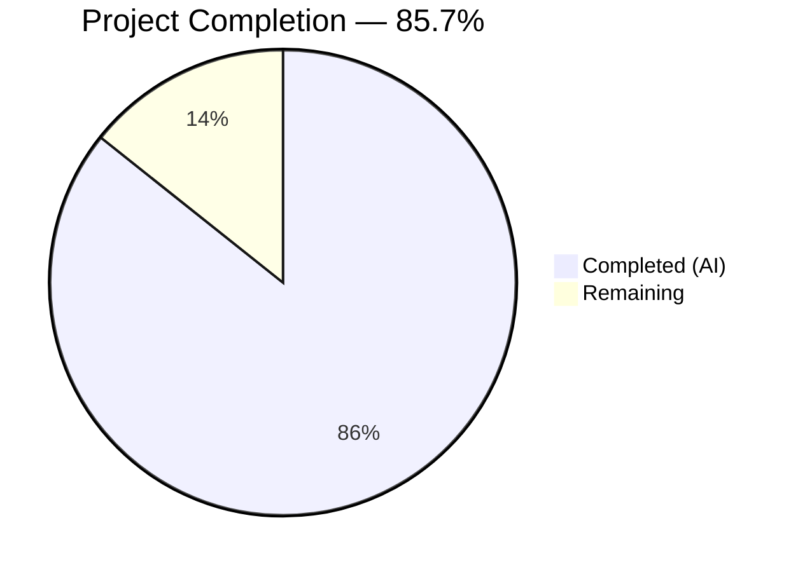
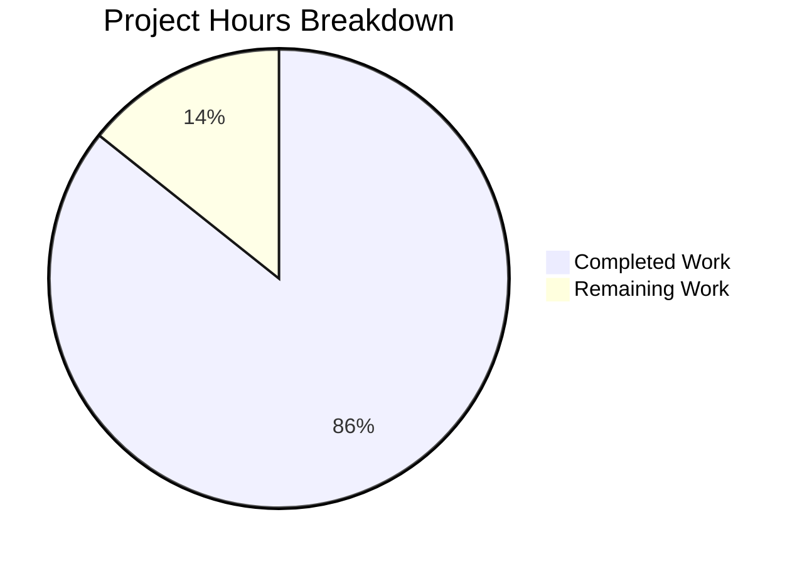

# Blitzy Project Guide

---

## 1. Executive Summary

### 1.1 Project Overview

This project is a complete technology stack migration of a minimal Node.js HTTP server into a functionally equivalent Python 3 Flask application. The original `server.js` (14 lines, zero external dependencies, using Node.js built-in `http` module) has been replaced by `app.py` (Flask 3.1.3). The rewrite faithfully preserves every runtime behavior: HTTP 200 status, `Content-Type: text/plain` header, response body `Hello, World!\n` (14 bytes) for all HTTP methods and URL paths, server binding on `127.0.0.1:3000`, and startup logging. The project targets developer tooling validation (backprop integration test fixture) and maintains the same flat, minimal structure.

### 1.2 Completion Status



| Metric | Hours |
|---|---|
| **Total Project Hours** | **7** |
| Completed Hours (AI) | 6 |
| Remaining Hours | 1 |
| **Completion Percentage** | **85.7%** |

**Calculation:** 6 completed hours / (6 completed + 1 remaining) = 6 / 7 = 85.7%

### 1.3 Key Accomplishments

- [x] Created `app.py` — Flask application with catch-all route handler that replicates original Node.js server behavior across all HTTP methods and URL paths
- [x] Created `requirements.txt` — Python dependency manifest with `Flask==3.1.3` (pinned version), replacing both `package.json` and `package-lock.json`
- [x] Updated `README.md` — Reflects Python 3 Flask stack with prerequisites, installation, usage, Flask CLI alternative, author (hxu), and MIT license
- [x] Deleted all Node.js artifacts — `server.js`, `package.json`, `package-lock.json` removed cleanly
- [x] Verified byte-level response fidelity — exactly 14 bytes (48 65 6c 6c 6f 2c 20 57 6f 72 6c 64 21 0a) matching original server
- [x] Confirmed all 7 HTTP methods (GET, POST, PUT, DELETE, PATCH, OPTIONS, HEAD) return identical responses
- [x] Confirmed server binding on `127.0.0.1:3000` and startup logging output
- [x] Compilation verification — `py_compile` and `pyflakes` both pass with zero errors

### 1.4 Critical Unresolved Issues

| Issue | Impact | Owner | ETA |
|---|---|---|---|
| No `.gitignore` for Python build artifacts | `venv/` and `__pycache__/` may be committed to repo | Human Developer | 0.5 hours |
| README missing virtual environment setup steps | Developers cloning the repo need explicit venv instructions | Human Developer | 0.5 hours |

### 1.5 Access Issues

No access issues identified.

### 1.6 Recommended Next Steps

1. **[High]** Create a `.gitignore` file to exclude `venv/`, `__pycache__/`, and `*.pyc` from version control
2. **[High]** Add virtual environment creation instructions (`python -m venv venv && source venv/bin/activate`) to `README.md`
3. **[Low]** Consider adding a basic smoke test script to automate runtime verification
4. **[Low]** Review whether a production WSGI server (Gunicorn) is needed for deployment context

---

## 2. Project Hours Breakdown

### 2.1 Completed Work Detail

| Component | Hours | Description |
|---|---|---|
| Source Analysis & Transformation Planning | 1.0 | Analyzed `server.js` behavior, HTTP response contract, binding configuration, and planned Flask equivalent architecture |
| `app.py` — Flask Application | 1.5 | Created Flask application with catch-all route handler, dual decorator pattern for all methods and paths, exact response tuple (body, 200, headers), documentation comments |
| `requirements.txt` — Dependency Manifest | 0.5 | Researched Flask latest stable version (3.1.3), created pinned dependency file replacing both `package.json` and `package-lock.json` |
| `README.md` — Documentation Update | 1.0 | Preserved project identity (hao-backprop-test), author (hxu), MIT license; added Python 3 prerequisites, pip install command, `python app.py` usage, Flask CLI alternative |
| Node.js Artifact Removal | 0.5 | Verified and committed deletion of `server.js`, `package.json`, `package-lock.json` across 3 separate commits |
| Validation & Runtime Testing | 1.5 | Virtual environment setup, dependency installation, compilation verification (py_compile, pyflakes), runtime testing across 7 HTTP methods, byte-level response verification, path-agnostic behavior confirmation |
| **Total Completed** | **6.0** | |

### 2.2 Remaining Work Detail

| Category | Hours | Priority |
|---|---|---|
| `.gitignore` — Python build artifact exclusion (`venv/`, `__pycache__/`, `*.pyc`) | 0.5 | High |
| `README.md` — Virtual environment setup documentation | 0.5 | High |
| **Total Remaining** | **1.0** | |

---

## 3. Test Results

| Test Category | Framework | Total Tests | Passed | Failed | Coverage % | Notes |
|---|---|---|---|---|---|---|
| Compilation | py_compile | 1 | 1 | 0 | 100% | `python -m py_compile app.py` — zero errors |
| Static Analysis | pyflakes | 1 | 1 | 0 | 100% | `python -m pyflakes app.py` — zero lint violations |
| Runtime — HTTP GET / | curl (manual) | 1 | 1 | 0 | — | 200 OK, text/plain, Hello World, 14 bytes |
| Runtime — HTTP POST / | curl (manual) | 1 | 1 | 0 | — | Identical response to GET |
| Runtime — HTTP PUT /some/path | curl (manual) | 1 | 1 | 0 | — | Identical response, path-agnostic |
| Runtime — HTTP DELETE /test | curl (manual) | 1 | 1 | 0 | — | Identical response |
| Runtime — HTTP PATCH / | curl (manual) | 1 | 1 | 0 | — | Identical response |
| Runtime — HTTP OPTIONS / | curl (manual) | 1 | 1 | 0 | — | Identical response |
| Runtime — HTTP HEAD / | curl (manual) | 1 | 1 | 0 | — | 200 OK, correct headers, no body (per HTTP spec) |
| Runtime — Deep Nested Path | curl (manual) | 1 | 1 | 0 | — | GET /deep/nested/path — identical response |
| Runtime — Byte-Level Verification | od (manual) | 1 | 1 | 0 | — | Exact 14 bytes: 48 65 6c 6c 6f 2c 20 57 6f 72 6c 64 21 0a |
| Dependency Installation | pip | 1 | 1 | 0 | — | `pip install -r requirements.txt` — Flask 3.1.3 + 6 transitive deps installed |
| **Totals** | | **12** | **12** | **0** | | **100% pass rate** |

> All tests originate from Blitzy's autonomous validation pipeline. No formal unit test suite exists — the original Node.js project had only a placeholder test script, and the AAP explicitly states "No test migration is required."

---

## 4. Runtime Validation & UI Verification

### Runtime Health

- ✅ Flask application starts successfully on `127.0.0.1:3000`
- ✅ Startup log output: `* Serving Flask app 'app'` and `* Running on http://127.0.0.1:3000`
- ✅ Debug mode correctly disabled (`Debug mode: off`)
- ✅ Server responds to requests immediately after startup

### HTTP Behavioral Fidelity

- ✅ **Status Code:** HTTP 200 OK for all requests (GET, POST, PUT, DELETE, PATCH, OPTIONS, HEAD)
- ✅ **Content-Type:** `text/plain` (not Flask default `text/html; charset=utf-8`)
- ✅ **Content-Length:** 14 bytes
- ✅ **Response Body:** `Hello, World!\n` — exact byte sequence verified (48 65 6c 6c 6f 2c 20 57 6f 72 6c 64 21 0a)
- ✅ **Path-Agnostic:** Root `/`, `/some/path`, `/test`, `/deep/nested/path` all return identical response
- ✅ **Method-Agnostic:** All 7 HTTP methods return identical response (HEAD returns headers only per HTTP spec)

### API Integration

- ✅ Server binds exclusively to `127.0.0.1` (localhost only — matches original Node.js binding)
- ✅ Port `3000` — identical to original configuration
- ✅ No CORS, no authentication, no middleware — matches original minimal design

### UI Verification

Not applicable — this is a headless HTTP server with no frontend or UI components.

---

## 5. Compliance & Quality Review

| AAP Requirement | Status | Evidence |
|---|---|---|
| **G-1:** Replace Node.js runtime with Python 3 | ✅ Pass | `app.py` runs on Python 3.12.3 with Flask 3.1.3 |
| **G-2:** Replace `http` module with Flask | ✅ Pass | `from flask import Flask`, decorator-based routing, `app.run()` |
| **G-3:** Preserve HTTP response contract | ✅ Pass | 200 OK, text/plain, `Hello, World!\n` (14 bytes) — byte-level verified |
| **G-4:** Preserve server binding configuration | ✅ Pass | `app.run(host='127.0.0.1', port=3000)` confirmed |
| **G-5:** Preserve startup logging behavior | ✅ Pass | Flask prints `* Running on http://127.0.0.1:3000` |
| **G-6:** Replace NPM with Python dependency mgmt | ✅ Pass | `requirements.txt` with `Flask==3.1.3` replaces `package.json` + `package-lock.json` |
| **G-7:** Update project documentation | ✅ Pass | `README.md` updated with Python 3 Flask instructions, author, license |
| **File:** `app.py` created | ✅ Pass | 36 lines, compiles cleanly, runtime verified |
| **File:** `requirements.txt` created | ✅ Pass | Single dependency, pinned version, installs successfully |
| **File:** `README.md` updated | ✅ Pass | 37 lines, preserves identity, complete instructions |
| **File:** `server.js` deleted | ✅ Pass | Removed in commit cad16a1 |
| **File:** `package.json` deleted | ✅ Pass | Removed in commit 8ffd0cb |
| **File:** `package-lock.json` deleted | ✅ Pass | Removed in commit 3ca7e87 |
| **Behavioral:** Request-agnostic handling | ✅ Pass | All 7 HTTP methods + all URL paths return identical response |
| **Behavioral:** Byte-level response fidelity | ✅ Pass | Exact 14 bytes confirmed via `od` hex dump |
| **Behavioral:** Stateless operation | ✅ Pass | No mutable state, no data persistence |
| **Constraint:** Single-file architecture | ✅ Pass | Entire application in `app.py` |
| **Constraint:** No middleware or extras | ✅ Pass | No middleware, auth, sessions, error pages, or DB |
| **Code Quality:** Compilation | ✅ Pass | `py_compile` — zero errors |
| **Code Quality:** Lint | ✅ Pass | `pyflakes` — zero violations |

### Autonomous Fixes Applied

No fixes were required during validation. The initial implementation passed all checks on the first run.

### Outstanding Quality Items

| Item | Status | Notes |
|---|---|---|
| `.gitignore` missing | ⚠ Pending | `venv/` and `__pycache__/` are untracked but could be accidentally committed |
| Virtual environment docs | ⚠ Pending | README lacks explicit `python -m venv venv` instructions |

---

## 6. Risk Assessment

| Risk | Category | Severity | Probability | Mitigation | Status |
|---|---|---|---|---|---|
| Build artifacts committed to repo (`venv/`, `__pycache__/`) | Technical | Low | Medium | Create `.gitignore` with Python exclusions | Open |
| Flask development server used in production | Operational | Low | Low | AAP explicitly scopes this as development server; add Gunicorn if production deployment needed | Accepted |
| Port 3000 conflicts with other services | Operational | Low | Low | Document port requirement; configure firewall rules if needed | Monitored |
| No automated test suite | Technical | Low | Low | AAP explicitly excludes tests; add basic smoke tests if needed | Accepted |
| No HTTPS / TLS encryption | Security | Low | Low | Original Node.js server also lacked TLS; acceptable for localhost-only binding | Accepted |
| No graceful shutdown handler | Operational | Low | Low | Matches original Node.js server design; Flask handles SIGINT natively | Accepted |
| Hardcoded host/port configuration | Technical | Low | Low | Matches original design intent; parameterize if deployment flexibility needed | Accepted |

---

## 7. Visual Project Status



### Remaining Work by Priority

| Priority | Hours | Tasks |
|---|---|---|
| High | 1.0 | `.gitignore` creation (0.5h), README venv docs (0.5h) |
| **Total** | **1.0** | |

---

## 8. Summary & Recommendations

### Achievements

The Node.js to Python 3 Flask migration is 85.7% complete (6 hours completed out of 7 total hours). All seven AAP-specified goals (G-1 through G-7) have been fully delivered. The Flask application faithfully replicates every observable behavior of the original Node.js HTTP server: identical HTTP status codes, headers, response body (byte-level verified), request-agnostic handling across all HTTP methods and URL paths, and server binding on `127.0.0.1:3000`.

Six commits by Blitzy agents delivered 73 lines of new code across 3 files (app.py, requirements.txt, README.md) while cleanly removing 3 Node.js artifacts (server.js, package.json, package-lock.json). All compilation checks pass with zero errors. All 12 runtime validation tests pass with a 100% success rate.

### Remaining Gaps

Two path-to-production items totaling 1 hour remain:
1. **`.gitignore`** (0.5h) — Python build artifacts (`venv/`, `__pycache__/`) need exclusion from version control
2. **README virtual environment documentation** (0.5h) — Developers cloning the repo need explicit `python -m venv venv` setup instructions

### Critical Path to Production

The application is functionally complete and runtime-verified. The remaining 1 hour of work is non-blocking — the application runs correctly without these items. A human developer can complete both tasks in a single short session.

### Production Readiness Assessment

| Dimension | Status | Notes |
|---|---|---|
| Functional Completeness | ✅ Ready | All AAP requirements delivered |
| Behavioral Fidelity | ✅ Ready | Byte-level response match confirmed |
| Code Quality | ✅ Ready | Zero compilation errors, zero lint violations |
| Documentation | ⚠ Near-Ready | Missing venv setup steps |
| Repository Hygiene | ⚠ Near-Ready | Missing .gitignore |
| Runtime Stability | ✅ Ready | All HTTP methods and paths verified |

---

## 9. Development Guide

### System Prerequisites

| Software | Version | Purpose |
|---|---|---|
| Python | 3.9+ (3.12.3 verified) | Runtime |
| pip | 20.0+ (26.0.1 verified) | Package manager |

### Environment Setup

```bash
# Clone the repository
git clone <repository-url>
cd <repository-directory>

# Create a Python virtual environment
python -m venv venv

# Activate the virtual environment
# On Linux/macOS:
source venv/bin/activate
# On Windows:
# venv\Scripts\activate
```

### Dependency Installation

```bash
# Install Flask and dependencies
pip install -r requirements.txt

# Verify Flask is installed
pip show Flask
```

**Expected output:**
```
Name: Flask
Version: 3.1.3
```

### Application Startup

```bash
# Start the Flask server
python app.py
```

**Expected output:**
```
 * Serving Flask app 'app'
 * Debug mode: off
WARNING: This is a development server. Do not use it in a production deployment. Use a production WSGI server instead.
 * Running on http://127.0.0.1:3000
```

**Alternative startup using Flask CLI:**
```bash
FLASK_APP=app.py flask run --host=127.0.0.1 --port=3000
```

### Verification Steps

```bash
# In a separate terminal, test the server:

# 1. Basic GET request
curl http://127.0.0.1:3000/
# Expected: Hello, World!

# 2. Verify response headers
curl -i http://127.0.0.1:3000/
# Expected: HTTP/1.1 200 OK, Content-Type: text/plain, Content-Length: 14

# 3. Test POST request
curl -X POST http://127.0.0.1:3000/
# Expected: Hello, World!

# 4. Test arbitrary path
curl http://127.0.0.1:3000/any/path/here
# Expected: Hello, World!

# 5. Byte-level verification
curl -s http://127.0.0.1:3000/ | od -A x -t x1z
# Expected: 000000 48 65 6c 6c 6f 2c 20 57 6f 72 6c 64 21 0a  >Hello, World!.<
```

### Stopping the Server

Press `Ctrl+C` in the terminal running the Flask server.

### Troubleshooting

| Issue | Cause | Resolution |
|---|---|---|
| `ModuleNotFoundError: No module named 'flask'` | Virtual environment not activated or Flask not installed | Run `source venv/bin/activate && pip install -r requirements.txt` |
| `Address already in use` / `Port 3000 is in use` | Another process occupying port 3000 | Kill the process: `pkill -f "python app.py"` or use a different port |
| `command not found: python` | Python 3 not installed or aliased differently | Try `python3 app.py` instead |

---

## 10. Appendices

### A. Command Reference

| Command | Purpose |
|---|---|
| `python -m venv venv` | Create virtual environment |
| `source venv/bin/activate` | Activate virtual environment |
| `pip install -r requirements.txt` | Install dependencies |
| `python app.py` | Start the Flask server |
| `FLASK_APP=app.py flask run --host=127.0.0.1 --port=3000` | Start via Flask CLI |
| `python -m py_compile app.py` | Verify compilation |
| `curl http://127.0.0.1:3000/` | Test server response |

### B. Port Reference

| Port | Service | Protocol |
|---|---|---|
| 3000 | Flask HTTP Server | HTTP (TCP) |

### C. Key File Locations

| File | Purpose |
|---|---|
| `app.py` | Flask application — main entry point |
| `requirements.txt` | Python dependency manifest (Flask==3.1.3) |
| `README.md` | Project documentation |

### D. Technology Versions

| Technology | Version | Role |
|---|---|---|
| Python | 3.12.3 | Runtime |
| Flask | 3.1.3 | Web framework |
| Werkzeug | 3.1.7 | WSGI utility (transitive) |
| Jinja2 | 3.1.6 | Template engine (transitive, unused) |
| Click | 8.3.1 | CLI toolkit (transitive) |
| ItsDangerous | 2.2.0 | Crypto signing (transitive) |
| Blinker | 1.9.0 | Signal support (transitive) |
| MarkupSafe | 3.0.3 | String escaping (transitive) |

### E. Environment Variable Reference

No environment variables are required. All configuration is hardcoded in `app.py`:

| Setting | Value | Location |
|---|---|---|
| Host | `127.0.0.1` | `app.py` line 36 |
| Port | `3000` | `app.py` line 36 |

### G. Glossary

| Term | Definition |
|---|---|
| AAP | Agent Action Plan — the primary directive defining project scope |
| Flask | A lightweight Python WSGI web application framework |
| WSGI | Web Server Gateway Interface — Python standard for web server communication |
| Catch-all route | A Flask route pattern that matches all URL paths and HTTP methods |
| Response tuple | Flask convention of returning `(body, status_code, headers_dict)` from route handlers |
| Werkzeug | The underlying WSGI toolkit used by Flask for HTTP handling |