# Technical Specification

# 1. Introduction

## 1.1 Executive Summary

### 1.1.1 Project Overview

The `hao-backprop-test` repository is a deliberately minimal Node.js test fixture whose stated purpose is documented in its `README.md` as a "test project for backprop integration," accompanied by the directive "Do not touch!" The repository is published under the npm package identifier `hello_world` at version `1.0.0`, authored by `hxu`, and released under the MIT license. Its functional core consists of a single Node.js HTTP server (`server.js`, 14 lines) that returns the canonical "Hello, World!" response on the local loopback interface at `127.0.0.1:3000`.

This document specifies a system whose scope is intentionally narrow. The repository is not a business application, not a multi-tier architecture, and not an enterprise service. It is a flat, single-directory collection of 22 root-level files that combines one functional artifact (the Node.js HTTP server) with non-functional stubs, static data files, binary documents, and empty placeholders. This Technical Specification documents the system *as it exists*, without extrapolating capabilities, business objectives, or stakeholder concerns that are not evidenced by the source.

### 1.1.2 Core Business Problem

The repository does not articulate a business problem in any of its files. The `README.md` contains exactly two lines of content — the project title and the single descriptive sentence quoted above. There are no requirements documents, user stories, design specifications, or stakeholder analyses in the codebase.

The only inferable "problem" the repository addresses is operational: it provides a known-good, dependency-free Node.js artifact suitable as an integration target for the externally referenced "backprop" system. The minimal surface area — a single endpoint, a single response, no external dependencies, no network exposure beyond localhost — makes the repository deterministic and reproducible as a test target.

### 1.1.3 Key Stakeholders and Users

| Stakeholder | Role | Source of Identification |
|-------------|------|--------------------------|
| `hxu` | Declared package author | `author` field in `package.json` |
| `Sandeep02Kumar02 <sandeepblitzyqa@gmail.com>` | Sole git committer | Single commit `232d20c` dated `Mar 5, 2026` |
| "Backprop" integration system | Implied consumer of this test fixture | `README.md` self-description |
| Local developers / automated test harnesses | HTTP clients targeting `127.0.0.1:3000` | Server binding configuration in `server.js` |

No end-user demographics, customer segments, or user personas are defined anywhere in the repository.

### 1.1.4 Expected Business Impact and Value Proposition

The repository makes no claims of business impact, revenue contribution, market share, or strategic value. The value proposition is limited to what is observable in the artifact itself:

- **Deterministic test target:** A single HTTP endpoint with a fixed, predictable response.
- **Zero-dependency profile:** No external npm packages, no databases, no third-party services — eliminating supply-chain variance during integration tests.
- **Minimal operational footprint:** Loopback-only binding ensures the server cannot inadvertently affect external systems.

These properties define the system's utility as a test fixture; they are not articulated as business KPIs anywhere in the source.

---

## 1.2 System Overview

### 1.2.1 Project Context

#### Business Context and Market Positioning

The repository contains no business context documentation. There is no market positioning statement, no competitive analysis, no customer segmentation, and no go-to-market consideration in any file. The `README.md` self-classifies the project as a "test project," which positions it outside any commercial-product context.

#### Current System Limitations

This repository is not described as replacing or upgrading any prior system. The git history consists of a single commit (`232d20c Add files via upload` by `Sandeep02Kumar02` on `Thu Mar 5 18:20:29 2026 +0530`), and there are no migration notes, deprecation markers, or references to predecessor systems.

Operational limitations inherent to the implementation include:

| Limitation | Evidence |
|------------|----------|
| Loopback-only network reachability | Hostname constant `'127.0.0.1'` in `server.js` |
| Hard-coded port | Literal `3000` in `server.js` (no environment variable support) |
| Single response regardless of request | Handler in `server.js` ignores method, path, headers, and body |
| Declared main entry point absent | `package.json` declares `main: index.js`, but no `index.js` exists |
| Non-compiling Java artifact | `LoginTest.java` contains the bare identifier `Web` as its method body |

#### Integration with Existing Enterprise Landscape

The only integration relationship referenced in the repository is with the "backprop" system, named in `README.md` without further specification. No integration contracts, API specifications, message schemas, or interface definitions are present. The Node.js server exposes a single HTTP endpoint with no routing logic; any integration must operate against that endpoint's invariant response.

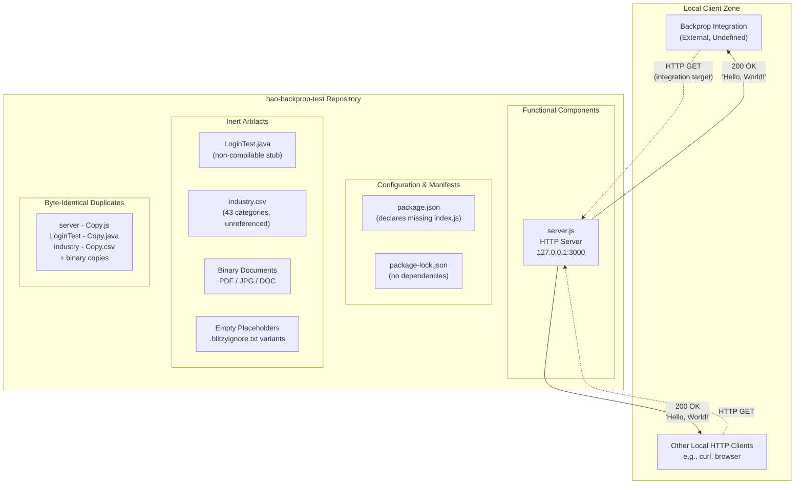

### 1.2.2 High-Level Description

#### Primary System Capabilities

The repository's verifiable capabilities are exhaustively enumerated in the following table:

| Capability | Implementing File | Notes |
|------------|-------------------|-------|
| Serve a static HTTP "Hello, World!" response | `server.js` | Status 200, `Content-Type: text/plain`, body `Hello, World!\n` |
| Bind to a fixed localhost address | `server.js` | `127.0.0.1:3000`, no configurability |
| Log server startup URL | `server.js` | Uses `console.log` with a template literal |

The repository does **not** provide: routing, request parsing, authentication, authorization, persistence, logging frameworks, error handling, content negotiation, TLS, compression, caching, or any other behavior beyond the fixed response.

#### Major System Components

| Component Category | Files | Functional Status |
|--------------------|-------|-------------------|
| HTTP Server | `server.js`, `server - Copy.js` | Functional; copy is a byte-identical duplicate |
| Java Stub | `LoginTest.java`, `LoginTest - Copy.java` | Non-compilable; contains invalid identifier `Web` |
| Static Data | `industry.csv`, `industry - Copy.csv` | 43-entry industry vocabulary; no source code references it |
| npm Manifests | `package.json`, `package-lock.json` | Lockfile v3, zero dependencies declared |
| Documentation | `README.md` | 2-line description |
| Binary Documents | `100Pages.pdf`, `demo.jpg`, `sample.doc` (and copies) | Present in git history; purpose undocumented |
| Empty Placeholders | `.blitzyignore.txt`, `test.blitzyignore.txt`, `test1.blitzyignore.txt`, `test.py.txt`, `test.py - Copy.txt` | All 0 bytes |

#### Core Technical Approach

The implementation approach observable in `server.js` exhibits the following characteristics:

- **Runtime:** Node.js, using the CommonJS module system (`require('http')`).
- **Dependencies:** Exclusively Node.js built-in modules; the `http` module is the only import.
- **Concurrency model:** Standard Node.js single-threaded event loop with the built-in HTTP server.
- **Configuration:** Hard-coded literals (`'127.0.0.1'`, `3000`) — no environment variables, no config files, no command-line argument parsing.
- **State:** Fully stateless; no in-memory data structures, no file I/O, no persistence.
- **Lifecycle:** Self-executing script with no exported interface; `server.listen()` is invoked unconditionally at module load.

### 1.2.3 Success Criteria

#### Measurable Objectives

The repository defines no measurable objectives. There are no acceptance criteria, no requirements traceability matrix, no test plans, and no observable metrics in the source. The npm `test` script is the default placeholder string `"echo \"Error: no test specified\" && exit 1"`, confirming that no automated test suite exists.

For the purposes of this specification, the only objectively verifiable success condition derivable from the code is:

| Objective | Verification Method |
|-----------|--------------------|
| HTTP GET to `http://127.0.0.1:3000` returns status `200` with body `Hello, World!\n` | Manual HTTP request against running `server.js` |
| Server process binds successfully to port 3000 on the loopback interface | Process startup without exception; `console.log` startup message printed |

#### Critical Success Factors

No critical success factors are articulated in the repository. The factors that govern correct operation of the implemented artifact are entirely environmental:

- Availability of a Node.js runtime capable of executing CommonJS modules and the built-in `http` module.
- Availability of TCP port 3000 on the loopback interface.

#### Key Performance Indicators (KPIs)

**No KPIs, SLAs, performance targets, throughput requirements, latency budgets, or availability objectives are defined in the repository.** Any such metrics would need to be established externally and are out of scope for this specification.

---

## 1.3 Scope

### 1.3.1 In-Scope Elements

#### Core Features and Functionalities

The following capabilities are present in the repository and therefore in-scope for this specification:

| In-Scope Feature | Implementation Artifact |
|------------------|-------------------------|
| Single-endpoint HTTP server returning "Hello, World!" | `server.js` |
| Loopback-only network binding on `127.0.0.1:3000` | `server.js` |
| npm package metadata declaration | `package.json` |
| Dependency lockfile (declaring zero dependencies) | `package-lock.json` |
| Static industry vocabulary CSV (43 categories) | `industry.csv` |
| Repository identification and purpose statement | `README.md` |

#### Primary User Workflows

The single observable workflow is:

1. A local HTTP client issues a request to `http://127.0.0.1:3000` (any method, any path).
2. The server responds with HTTP `200`, header `Content-Type: text/plain`, body `Hello, World!\n`.
3. The connection is closed.

No multi-step workflows, sessions, authentication flows, or state transitions exist.

#### Essential Integrations

The only declared integration relationship is with the externally referenced "backprop" system, named in `README.md`. The integration surface is the HTTP endpoint described above. No other integrations (databases, message queues, external APIs, identity providers, etc.) are present or referenced.

#### Key Technical Requirements

| Requirement | Source |
|-------------|--------|
| Node.js runtime supporting CommonJS and the built-in `http` module | `server.js` `require('http')` |
| TCP port 3000 available on the loopback interface | `server.listen(port, hostname)` in `server.js` |
| MIT license compliance | `license: "MIT"` in `package.json` |

#### Implementation Boundaries

| Boundary Dimension | In-Scope Definition |
|---------------------|---------------------|
| System boundary | A single Node.js process running `server.js` on the local machine |
| User groups covered | Local developers and automated clients (including the "backprop" integration) capable of reaching the loopback interface |
| Geographic/market coverage | None — the server is unreachable outside the host machine due to its `127.0.0.1` binding |
| Data domains included | Static industry-category vocabulary (43 entries) present in `industry.csv` — included as a data artifact, though not consumed by any code in the repository |

### 1.3.2 Out-of-Scope Elements

#### Explicitly Excluded Features and Capabilities

The following capabilities are **out of scope** because they are absent from the repository. This enumeration is intended to prevent reader inference of capabilities that the codebase does not implement:

| Excluded Capability | Evidence of Absence |
|--------------------|---------------------|
| HTTP routing or multiple endpoints | `server.js` handler ignores request URL and method |
| Request body parsing | No body-handling code present |
| Authentication / authorization | No identity, session, or access-control logic |
| Database persistence | No database driver, ORM, schema, or migration |
| External HTTP service consumption | No outbound HTTP client code |
| Logging framework | Only one `console.log` call at startup |
| Error handling / exception management | No try/catch blocks or error response paths in request handling |
| Configuration management | All values are hard-coded literals |
| Environment variable support | No `process.env` references |
| TLS / HTTPS | Plain HTTP via the `http` module only |
| Unit, integration, or end-to-end tests | npm `test` script is the default placeholder; no test files exist |
| Build tooling | No webpack, babel, tsconfig, Makefile, Maven, or Gradle configuration |
| Containerization | No Dockerfile, no docker-compose, no Kubernetes manifests |
| CI/CD configuration | No `.github/`, no `.gitlab-ci.yml`, no Jenkins or similar configuration |
| Frontend / UI / static asset serving | No HTML, CSS, JavaScript client code, or asset directories |
| API documentation | No OpenAPI/Swagger spec; no API reference document |
| Java compilation/execution | `LoginTest.java` is non-compilable (contains the bare identifier `Web` as method body); no Maven or Gradle build descriptor |
| `.gitignore` rules | Only empty `.blitzyignore.txt` variants exist; no `.gitignore` file is present |
| Internationalization / localization | Single hard-coded English string `Hello, World!\n` |

#### Future Phase Considerations

The repository contains no roadmap, no `TODO` comments referencing future work, no issue tracker references, and no `CHANGELOG`. Any future-phase considerations would need to be defined externally; none are documented within the source.

#### Integration Points Not Covered

| Integration Category | Status |
|----------------------|--------|
| Identity providers (OAuth, SAML, OIDC) | Not present, not referenced |
| Message brokers (Kafka, RabbitMQ, SQS) | Not present, not referenced |
| Databases (relational, NoSQL, cache) | Not present, not referenced |
| External REST/GraphQL APIs | Not present, not referenced |
| Cloud platform services (AWS, Azure, GCP) | Not present, not referenced |
| Monitoring / observability platforms | Not present, not referenced |

#### Unsupported Use Cases

The following use cases are **not supported** by the current implementation:

- **Remote access:** The server's `127.0.0.1` binding prevents any non-local client from connecting.
- **Conditional responses:** The handler returns the identical response for every request, regardless of method, path, headers, query parameters, or body.
- **Concurrent multi-tenant operation:** No tenant isolation, namespacing, or session boundaries exist.
- **Stateful interactions:** The server retains no state across requests.
- **Production deployment:** The README explicitly classifies the repository as a "test project" with the directive "Do not touch!"; the implementation contains no production-readiness affordances (no health checks, no graceful shutdown, no error recovery).
- **Java-based functionality:** Despite the presence of `LoginTest.java`, the file does not compile and cannot contribute runtime behavior.
- **Data ingestion from `industry.csv`:** Although the CSV file is present, no source code reads or processes it, so workflows that depend on its content are not supported by this codebase.

---

## 1.4 References

### 1.4.1 Files Examined

- `README.md` — Two-line repository description identifying the project as a "test project for backprop integration"; sole source of self-described purpose.
- `package.json` — npm manifest declaring package name `hello_world`, version `1.0.0`, license MIT, author `hxu`, main entry `index.js` (file absent), and default placeholder test script.
- `package-lock.json` — Lockfile version 3, confirming zero declared dependencies.
- `server.js` — 14-line functional Node.js HTTP server using the built-in `http` module, binding to `127.0.0.1:3000`, returning fixed "Hello, World!" response.
- `server - Copy.js` — Byte-identical duplicate of `server.js`.
- `LoginTest.java` — 12-line Java class in package `com.blitzyTest` containing a non-compilable method body (the bare identifier `Web`).
- `LoginTest - Copy.java` — Byte-identical duplicate of `LoginTest.java`.
- `industry.csv` — Single-column CSV with header `Industry` and 43 alphabetically-ordered category entries; not referenced by any code.
- `industry - Copy.csv` — Byte-identical duplicate of `industry.csv`.
- `.blitzyignore.txt` — Empty (0 bytes); verified to contain no exclusion rules.
- `test.py.txt` and other empty placeholder files — Confirmed 0-byte placeholders.
- Binary files surfaced via `git log --stat`: `100Pages.pdf`, `demo.jpg`, `sample.doc`, and their `- Copy` duplicates — present in repository history; purpose undocumented and unreferenced by any source code.

### 1.4.2 Repository-Wide Observations

- **Repository structure:** Flat, single-directory layout. All 22 files reside at the repository root; no subdirectories exist.
- **Version control history:** Single commit `232d20c Add files via upload` authored by `Sandeep02Kumar02 <sandeepblitzyqa@gmail.com>` on `Thu Mar 5 18:20:29 2026 +0530`.
- **Duplication pattern:** Pervasive byte-identical duplication; nearly every functional or data file has a corresponding ` - Copy` twin.

# 2. Product Requirements

## 2.1 FEATURE CATALOG

This section enumerates the discrete, verifiable features present in the `hao-backprop-test` repository. As established in Section 1.2.3 (Success Criteria), the repository defines no formal requirements documents, user stories, or acceptance criteria; the feature catalog below is therefore derived directly from observable source artifacts and is constrained to capabilities evidenced in the code. Each feature is assigned a stable identifier following the format `F-XXX` for use in cross-references and traceability throughout this specification.

A meta-observation governs the entire catalog: this repository is, per its own `README.md`, a "test project for backprop integration" carrying the directive "Do not touch!" — a constraint that materially limits the appropriate scope of any future requirement amendments. See Section 1.1.1 (Project Overview) for the contextual framing.

### 2.1.1 Feature F-001: Static HTTP "Hello, World!" Response Endpoint

#### Feature Metadata

| Attribute | Value |
|-----------|-------|
| Unique ID | F-001 |
| Feature Name | Static HTTP "Hello, World!" Response Endpoint |
| Feature Category | Functional / Network Service |
| Priority Level | Critical |
| Status | Completed |

This feature is classified as Critical because it is the **sole functional artifact** in the repository, as established in Section 1.2.2 (High-Level Description). All other in-scope items are configuration, metadata, documentation, or static data that exist solely in support of (or independent of) this single capability.

#### Description

- **Overview:** A single-process Node.js HTTP server, implemented in `server.js` (14 lines), that accepts any HTTP request on the loopback interface at `127.0.0.1:3000` and unconditionally returns HTTP status `200` with `Content-Type: text/plain` and the body `Hello, World!\n`. The handler ignores all request details — method, URL path, headers, query parameters, and body.
- **Business Value:** As enumerated in Section 1.1.4 (Expected Business Impact and Value Proposition), the feature delivers a deterministic, zero-dependency test target. The invariance of its response makes it a stable, reproducible integration anchor for the externally referenced "backprop" system.
- **User Benefits:** The implied consumers (local developers, automated test harnesses, and the "backprop" integration) gain a predictable HTTP endpoint that requires no provisioning, no credentials, and no setup beyond starting the Node.js process.
- **Technical Context:** Implemented using the Node.js built-in `http` module via CommonJS (`require('http')`). The server is constructed using the canonical `http.createServer((req, res) => ...)` pattern with `server.listen(port, hostname, callback)` invoked unconditionally at module load. Startup is announced via a single `console.log` call using a template literal. The implementation contains no exported interface.

#### Dependencies

| Dependency Type | Item |
|-----------------|------|
| Prerequisite Features | None |
| System Dependencies | Node.js runtime capable of executing CommonJS modules and the built-in `http` module |
| External Dependencies | None (zero npm packages, per `package-lock.json`) |
| Integration Requirements | TCP port 3000 must be available on the loopback interface (`127.0.0.1`); HTTP clients must be able to reach the host loopback |

### 2.1.2 Feature F-002: npm Package Identity & Metadata Declaration

#### Feature Metadata

| Attribute | Value |
|-----------|-------|
| Unique ID | F-002 |
| Feature Name | npm Package Identity & Metadata Declaration |
| Feature Category | Configuration / Package Manifest |
| Priority Level | High |
| Status | Completed (with documented anomaly) |

#### Description

- **Overview:** A standards-compliant npm manifest (`package.json`) declaring the package name `hello_world`, version `1.0.0`, description `"Hello world in Node.js"`, license `MIT`, and author `hxu`. It also declares a `main` entry point of `index.js` and a default placeholder `test` script.
- **Business Value:** Provides the package identity required for the repository to be recognized as a valid npm project. Establishes the MIT license terms identified as an in-scope technical requirement in Section 1.3.1 (In-Scope Elements).
- **User Benefits:** Allows tooling (npm CLI, package introspection utilities, software composition analysis) to read the package's identity, version, and license.
- **Technical Context:** The manifest is consumed by npm-compatible tooling. It contains an inherent anomaly: the declared `main: index.js` references a file that does not exist in the repository, as noted in Section 1.2.1 (Current System Limitations). The `test` script is the default `"echo \"Error: no test specified\" && exit 1"`, which intentionally exits with code 1 if invoked.

#### Dependencies

| Dependency Type | Item |
|-----------------|------|
| Prerequisite Features | None |
| System Dependencies | npm-compatible tooling for inspection (manifest is self-contained as a data file) |
| External Dependencies | None — `dependencies` and `devDependencies` blocks are absent |
| Integration Requirements | None |

### 2.1.3 Feature F-003: Zero-Dependency Lockfile

#### Feature Metadata

| Attribute | Value |
|-----------|-------|
| Unique ID | F-003 |
| Feature Name | Zero-Dependency Lockfile |
| Feature Category | Configuration / Reproducible Build Assurance |
| Priority Level | Medium |
| Status | Completed |

#### Description

- **Overview:** A `package-lock.json` file using lockfile version `3` that mirrors the package identity declared in `package.json` (`name: hello_world`, `version: 1.0.0`, `license: MIT`) and asserts that no external npm dependencies exist.
- **Business Value:** Cryptographically anchors the assertion that the project has zero npm supply-chain exposure. Reinforces the "zero-dependency profile" value proposition identified in Section 1.1.4.
- **User Benefits:** Provides reproducible install behavior — `npm ci` or `npm install` against this lockfile will install no third-party packages, guaranteeing environmental determinism for integration tests.
- **Technical Context:** Standard npm v7+ lockfile format. Contains only the root package entry with no `dependencies` or transitive entries.

#### Dependencies

| Dependency Type | Item |
|-----------------|------|
| Prerequisite Features | F-002 (npm Package Identity & Metadata Declaration) — the lockfile mirrors manifest identity |
| System Dependencies | npm v7+ (lockfile v3 format) for read/regeneration |
| External Dependencies | None |
| Integration Requirements | None |

### 2.1.4 Feature F-004: Repository Self-Documentation

#### Feature Metadata

| Attribute | Value |
|-----------|-------|
| Unique ID | F-004 |
| Feature Name | Repository Self-Documentation |
| Feature Category | Documentation |
| Priority Level | Medium |
| Status | Completed |

#### Description

- **Overview:** A two-line `README.md` containing the repository title (`hao-backprop-test`) and a single descriptive sentence stating the project's purpose ("test project for backprop integration") and a change-management directive ("Do not touch!").
- **Business Value:** Establishes the sole documented purpose statement for the repository and constitutes the only authoritative source for the integration relationship referenced in Section 1.2.1 (Integration with Existing Enterprise Landscape).
- **User Benefits:** Allows readers (including this specification) to identify the project's intended role and a governing change-control directive without inspecting source code.
- **Technical Context:** Plain Markdown. No images, no badges, no installation instructions, no usage examples, no contribution guidelines, no license notice (license is conveyed via `package.json` instead).

#### Dependencies

| Dependency Type | Item |
|-----------------|------|
| Prerequisite Features | None |
| System Dependencies | Markdown-capable renderer (optional) |
| External Dependencies | None |
| Integration Requirements | None |

### 2.1.5 Feature F-005: Static Industry Vocabulary Reference Data

#### Feature Metadata

| Attribute | Value |
|-----------|-------|
| Unique ID | F-005 |
| Feature Name | Static Industry Vocabulary Reference Data |
| Feature Category | Static Data / Reference Vocabulary |
| Priority Level | Low |
| Status | Completed (present but unconsumed) |

#### Description

- **Overview:** A single-column CSV file (`industry.csv`) with header `Industry` and 43 alphabetically ordered industry category entries spanning sectors such as Accounting/Finance, Aerospace/Aviation, Healthcare, Manufacturing/Operations, Technology, Telecommunications, and a terminal `Other` entry.
- **Business Value:** Provides a controlled vocabulary of industry classifications available within the repository's data domain, as noted in the Data Domains row of Section 1.3.1 (Implementation Boundaries).
- **User Benefits:** None directly delivered through the running system. As explicitly noted in Section 1.3.2 (Unsupported Use Cases), no source code in the repository reads or processes this file, so any user workflow depending on this data is unsupported by the codebase.
- **Technical Context:** Plain CSV with a single header row and 43 data rows. Encoding and delimiter are standard. The file is an inert data artifact relative to `server.js`; its purpose is documented only by its presence and naming, not by any consuming logic.

#### Dependencies

| Dependency Type | Item |
|-----------------|------|
| Prerequisite Features | None |
| System Dependencies | None |
| External Dependencies | None |
| Integration Requirements | None — no consumer exists within the repository |

### 2.1.6 Features Explicitly Out of Scope

To prevent inference of capabilities that the codebase does not implement, the following items are documented in Section 1.3.2 (Out-of-Scope Elements) as absent. They are **not features** of this system and carry no requirement identifiers:

| Out-of-Scope Capability | Reason for Exclusion |
|--------------------------|----------------------|
| HTTP routing / multiple endpoints | Handler in `server.js` ignores request method and URL |
| Authentication / authorization | No identity, session, or access-control logic exists |
| Database persistence | No driver, ORM, schema, or migration is present |
| TLS / HTTPS | Plain HTTP only via the `http` module |
| Configuration management | All values are hard-coded literals; no `process.env` references |
| Automated tests | npm `test` is the default failing placeholder; no test files exist |
| Build / CI / CD tooling | No webpack, babel, Dockerfile, `.github/`, or pipeline config |
| Java functionality (`LoginTest.java`) | File is non-compilable (method body contains bare identifier `Web`) |
| `.gitignore` exclusion rules | Only empty `.blitzyignore.txt` variants exist (0 bytes each) |
| Internationalization | Single hard-coded English string `Hello, World!\n` |

---

## 2.2 FUNCTIONAL REQUIREMENTS TABLES

Each requirement below uses the format `F-XXX-RQ-YYY` and is testable against the verifiable success conditions documented in Section 1.2.3 (Success Criteria). Because no formal requirements were authored, each row below is reverse-engineered from observable code behavior; priorities use the MoSCoW scale (Must-Have / Should-Have / Could-Have).

### 2.2.1 F-001 Requirements — Static HTTP "Hello, World!" Response Endpoint

#### Requirement Details

| Req ID | Description | Priority | Complexity |
|--------|-------------|----------|------------|
| F-001-RQ-001 | Server SHALL bind a TCP listener on the loopback hostname `127.0.0.1` at port `3000` | Must-Have | Low |
| F-001-RQ-002 | Server SHALL respond to every received HTTP request with status code `200` | Must-Have | Low |
| F-001-RQ-003 | Server SHALL set the response header `Content-Type` to `text/plain` for every response | Must-Have | Low |
| F-001-RQ-004 | Server SHALL emit the response body `Hello, World!\n` (with trailing newline) for every response | Must-Have | Low |
| F-001-RQ-005 | Server SHALL log a startup message of the form `Server running at http://127.0.0.1:3000/` to stdout once the listener is bound | Should-Have | Low |
| F-001-RQ-006 | Server SHALL handle the request invariantly with respect to HTTP method, path, headers, query parameters, and body | Must-Have | Low |

#### Acceptance Criteria for F-001 Requirements

| Req ID | Acceptance Criterion |
|--------|----------------------|
| F-001-RQ-001 | A TCP connection to `127.0.0.1:3000` succeeds after process startup; a connection to any non-loopback address fails |
| F-001-RQ-002 | Any HTTP request to the endpoint returns status `200` |
| F-001-RQ-003 | The `Content-Type` response header equals exactly `text/plain` |
| F-001-RQ-004 | The response body equals exactly the 14-byte sequence `Hello, World!\n` |
| F-001-RQ-005 | A line matching the expected URL template appears on stdout after `server.listen` callback fires |
| F-001-RQ-006 | Requests issued with method `GET`, `POST`, `PUT`, `DELETE`, `PATCH`, `OPTIONS`, `HEAD` against paths `/`, `/anything`, `/x/y/z` all return identical status, headers, and body |

#### Technical Specifications

| Aspect | Specification |
|--------|---------------|
| Input Parameters | None — handler ignores all request inputs |
| Output / Response | HTTP/1.1 `200 OK`, header `Content-Type: text/plain`, body `Hello, World!\n` |
| Performance Criteria | None defined; Section 1.2.3 explicitly states no KPIs, SLAs, latency budgets, or throughput targets exist |
| Data Requirements | None — fully stateless; no persistence, no I/O beyond network sockets and stdout |

#### Validation Rules

| Rule Type | Rule |
|-----------|------|
| Business Rules | Response invariance — no request attribute may alter the response |
| Data Validation | Not applicable; no input is parsed or interpreted |
| Security Requirements | Network reachability restricted to loopback interface by binding to `127.0.0.1` |
| Compliance Requirements | MIT license terms (declared in `package.json`) govern use and redistribution |

### 2.2.2 F-002 Requirements — npm Package Identity & Metadata Declaration

#### Requirement Details

| Req ID | Description | Priority | Complexity |
|--------|-------------|----------|------------|
| F-002-RQ-001 | `package.json` SHALL declare the package `name` field as `hello_world` | Must-Have | Low |
| F-002-RQ-002 | `package.json` SHALL declare the package `version` as a valid semver string (`1.0.0`) | Must-Have | Low |
| F-002-RQ-003 | `package.json` SHALL declare the `license` field as `MIT` | Must-Have | Low |
| F-002-RQ-004 | `package.json` SHALL declare an `author` field (`hxu`) | Should-Have | Low |
| F-002-RQ-005 | `package.json` SHALL declare a `scripts.test` entry that exits non-zero by default | Could-Have | Low |
| F-002-RQ-006 | `package.json` SHALL declare a `main` entry point (currently `index.js`) | Must-Have | Low |

#### Acceptance Criteria for F-002 Requirements

| Req ID | Acceptance Criterion |
|--------|----------------------|
| F-002-RQ-001 | `npm pkg get name` returns `"hello_world"` |
| F-002-RQ-002 | `npm pkg get version` returns a valid semver string |
| F-002-RQ-003 | `npm pkg get license` returns `"MIT"` |
| F-002-RQ-004 | `npm pkg get author` returns the declared author value |
| F-002-RQ-005 | Running `npm test` exits with a non-zero code and emits the placeholder error string |
| F-002-RQ-006 | `npm pkg get main` returns the declared main filename (anomaly noted: file is absent — see Section 2.6) |

#### Technical Specifications

| Aspect | Specification |
|--------|---------------|
| Input Parameters | None — static configuration file |
| Output / Response | JSON document conforming to the npm package manifest schema |
| Performance Criteria | None applicable |
| Data Requirements | Persistent on disk; UTF-8 encoded JSON |

#### Validation Rules

| Rule Type | Rule |
|-----------|------|
| Business Rules | Identity values (`name`, `version`) must remain stable to preserve package identity |
| Data Validation | Document must parse as valid JSON; fields must match npm manifest schema types |
| Security Requirements | No secrets shall be stored in `package.json` (none currently present) |
| Compliance Requirements | MIT license declaration must be preserved to honor licensing obligations |

### 2.2.3 F-003 Requirements — Zero-Dependency Lockfile

#### Requirement Details

| Req ID | Description | Priority | Complexity |
|--------|-------------|----------|------------|
| F-003-RQ-001 | `package-lock.json` SHALL use `lockfileVersion: 3` | Must-Have | Low |
| F-003-RQ-002 | `package-lock.json` SHALL mirror the `name`, `version`, and `license` fields from `package.json` | Must-Have | Low |
| F-003-RQ-003 | `package-lock.json` SHALL declare zero external runtime dependencies | Must-Have | Low |
| F-003-RQ-004 | `package-lock.json` SHALL declare zero development dependencies | Must-Have | Low |

#### Acceptance Criteria for F-003 Requirements

| Req ID | Acceptance Criterion |
|--------|----------------------|
| F-003-RQ-001 | `lockfileVersion` JSON property equals `3` |
| F-003-RQ-002 | Root package entry in `packages[""]` matches `package.json` identity fields |
| F-003-RQ-003 | No keys exist under `packages` other than the root entry |
| F-003-RQ-004 | `npm install` against the lockfile produces an empty `node_modules` (or none at all) |

#### Technical Specifications

| Aspect | Specification |
|--------|---------------|
| Input Parameters | None — static configuration file |
| Output / Response | JSON document conforming to npm lockfile v3 schema |
| Performance Criteria | None applicable |
| Data Requirements | Persistent on disk; UTF-8 encoded JSON |

#### Validation Rules

| Rule Type | Rule |
|-----------|------|
| Business Rules | Zero-dependency invariant — adding any dependency violates the value proposition in Section 1.1.4 |
| Data Validation | Document must parse as valid JSON and conform to lockfile v3 schema |
| Security Requirements | Lockfile pinning serves as a supply-chain integrity assertion |
| Compliance Requirements | Inherited MIT license terms apply |

### 2.2.4 F-004 Requirements — Repository Self-Documentation

#### Requirement Details

| Req ID | Description | Priority | Complexity |
|--------|-------------|----------|------------|
| F-004-RQ-001 | `README.md` SHALL state the repository name and stated purpose | Must-Have | Low |
| F-004-RQ-002 | `README.md` SHALL communicate the change-management directive "Do not touch!" | Should-Have | Low |

#### Acceptance Criteria for F-004 Requirements

| Req ID | Acceptance Criterion |
|--------|----------------------|
| F-004-RQ-001 | The file contains the project title and a descriptive sentence identifying it as a backprop integration test project |
| F-004-RQ-002 | The text `Do not touch!` appears in the README |

#### Technical Specifications

| Aspect | Specification |
|--------|---------------|
| Input Parameters | None |
| Output / Response | Plain Markdown text |
| Performance Criteria | None applicable |
| Data Requirements | Persistent on disk; UTF-8 encoded text |

#### Validation Rules

| Rule Type | Rule |
|-----------|------|
| Business Rules | Documented purpose must not be silently revised; the "Do not touch!" directive governs change posture |
| Data Validation | File must be valid Markdown |
| Security Requirements | No secrets, credentials, or sensitive operational details shall be embedded |
| Compliance Requirements | None applicable |

### 2.2.5 F-005 Requirements — Static Industry Vocabulary Reference Data

#### Requirement Details

| Req ID | Description | Priority | Complexity |
|--------|-------------|----------|------------|
| F-005-RQ-001 | `industry.csv` SHALL contain a single header row with the column name `Industry` | Must-Have | Low |
| F-005-RQ-002 | `industry.csv` SHALL contain 43 distinct industry category entries | Must-Have | Low |
| F-005-RQ-003 | Industry category entries SHALL be ordered alphabetically | Should-Have | Low |
| F-005-RQ-004 | The vocabulary SHALL include a terminal `Other` entry as a fallback category | Could-Have | Low |

#### Acceptance Criteria for F-005 Requirements

| Req ID | Acceptance Criterion |
|--------|----------------------|
| F-005-RQ-001 | The first line of the file equals `Industry` |
| F-005-RQ-002 | The file contains exactly 44 lines (1 header + 43 data rows) |
| F-005-RQ-003 | Data rows are in case-insensitive ascending order, with the `Other` row positioned as a documented exception |
| F-005-RQ-004 | The literal value `Other` appears as a row in the file |

#### Technical Specifications

| Aspect | Specification |
|--------|---------------|
| Input Parameters | None — inert data file |
| Output / Response | CSV text |
| Performance Criteria | None applicable |
| Data Requirements | Persistent on disk; UTF-8 encoded CSV |

#### Validation Rules

| Rule Type | Rule |
|-----------|------|
| Business Rules | Vocabulary stability — entries should not be silently reordered or removed without versioning |
| Data Validation | File must parse as valid CSV with a single column |
| Security Requirements | No personally identifiable information shall be present (none currently is) |
| Compliance Requirements | None applicable |

---

## 2.3 FEATURE RELATIONSHIPS

The repository's flat, single-directory layout (documented in Section 1.4.2) gives rise to an intentionally minimal relationship graph. The only relationships documented below are those evidenced directly in source code or configuration; no relationships are inferred.

### 2.3.1 Feature Dependencies Map

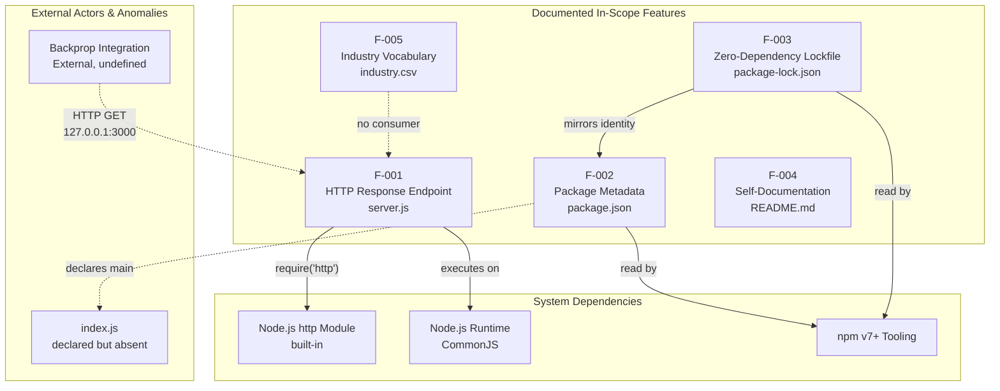

### 2.3.2 Integration Points

| Integration Point | Source Feature | Target | Protocol |
|-------------------|----------------|--------|----------|
| HTTP loopback endpoint | F-001 | Backprop integration (external) | HTTP/1.1 over TCP on `127.0.0.1:3000` |
| npm manifest read | F-002 | npm CLI / package tooling | File system read of `package.json` |
| npm lockfile read | F-003 | npm CLI / `npm ci` / `npm install` | File system read of `package-lock.json` |
| Built-in module import | F-001 | Node.js `http` module | CommonJS `require` resolution |

### 2.3.3 Shared Components and Common Services

**There are no shared components between features.** Each feature is implemented by a distinct file (or pair, including its byte-identical `- Copy` duplicate), and no feature consumes another feature's runtime output. The only cross-feature linkage is the identity mirroring between `package.json` (F-002) and `package-lock.json` (F-003), which is a tooling-managed invariant rather than a shared runtime component.

The `server.js` artifact (F-001) is fully self-contained: it does not read `package.json`, does not consume `industry.csv`, and does not reference `README.md`. As stated in Section 1.2.2 (Core Technical Approach), the implementation contains no in-memory data structures, no file I/O, and no persistence, foreclosing any opportunity for shared services.

### 2.3.4 Process Flow Cross-References

The single observable workflow — described in Section 1.3.1 (Primary User Workflows) — is the request/response cycle of F-001. No additional process flows exist; multi-step orchestrations, sessions, and state transitions are absent, as documented in Section 1.3.2 (Unsupported Use Cases).

---

## 2.4 IMPLEMENTATION CONSIDERATIONS

### 2.4.1 Technical Constraints

| Feature | Technical Constraint |
|---------|----------------------|
| F-001 | Bound to Node.js built-in `http` API; no abstraction layer; loopback-only binding hard-coded |
| F-001 | Hard-coded port `3000` literal — no environment variable, configuration file, or CLI argument support |
| F-002 | Declares `main: index.js`, but no `index.js` file exists in the repository (anomaly carried forward from Section 1.2.1) |
| F-003 | Must conform to npm lockfile v3 schema; any divergence breaks reproducible installs |
| F-004 | Constrained by the explicit "Do not touch!" directive that limits permissible change scope |
| F-005 | File is present but unconsumed; any code wishing to use it must be added — currently out of scope |

### 2.4.2 Performance Requirements

As stated unambiguously in Section 1.2.3 (Key Performance Indicators), **no KPIs, SLAs, performance targets, throughput requirements, latency budgets, or availability objectives are defined in the repository.** Any performance expectations must therefore be established by the consuming "backprop" integration. The implementation inherits the performance envelope of the Node.js HTTP server with no tuning, no clustering, no worker threads, and no custom socket configuration.

### 2.4.3 Scalability Considerations

| Aspect | Consideration |
|--------|---------------|
| Concurrency model | Single-threaded Node.js event loop (per Section 1.2.2); no clustering, no worker threads |
| Horizontal scalability | Not applicable — loopback-only binding prevents multi-host deployment |
| Vertical scalability | Inherits Node.js HTTP server limits; no tuning hooks exposed |
| State management | Fully stateless — no shared state to coordinate across instances |
| Resource consumption | Minimal — no persistent storage, no caching, no background tasks |

The architectural decisions in F-001 (loopback binding, hard-coded port, stateless handler) effectively bound the system to single-process, single-host operation. This is consistent with the "test fixture" classification asserted throughout Chapter 1.

### 2.4.4 Security Implications

| Concern | Implementation Disposition |
|---------|----------------------------|
| Network exposure | Mitigated by `127.0.0.1` loopback binding — non-local clients cannot connect (Section 1.2.1) |
| Authentication | Not present; no authentication framework, identity provider, or credential handling |
| Authorization | Not present; handler does not differentiate between callers |
| Input validation | Not applicable — handler ignores all request inputs (no parsing surface to attack) |
| Transport security | Plain HTTP; no TLS — acceptable only because of loopback binding |
| Secret management | No secrets stored; no credentials in `package.json` or any other file |
| Supply chain | Zero external dependencies (F-003) eliminates third-party package risk |
| Logging exposure | Single `console.log` startup line; no sensitive data emitted |

The system's security posture is principally derived from the *absence* of attack surface rather than the *presence* of defensive controls. Any change that broadens reachability (e.g., binding to `0.0.0.0`) would invalidate the implicit security model.

### 2.4.5 Maintenance Requirements

| Aspect | Consideration |
|--------|---------------|
| Change governance | README directive "Do not touch!" (F-004) governs allowable modifications |
| Version control | Single commit `232d20c` in repository history (Section 1.4.2); no branching strategy, no PR workflow evidenced |
| Duplication pattern | Pervasive byte-identical `- Copy` duplicates exist for nearly every functional/data file (Section 1.4.2) — any maintenance update must consider whether duplicates require synchronization or removal |
| Dependency upgrades | None required — zero external dependencies (F-003) |
| Test coverage | Absent — no automated test suite (per Section 1.3.2); validation requires manual HTTP probing |
| Documentation drift | Minimal risk — README is 2 lines; high information density |
| Anomaly resolution | The missing `index.js` declared by `main` in `package.json` (F-002) is a long-standing latent inconsistency |

---

## 2.5 REQUIREMENTS TRACEABILITY MATRIX

The matrix below maps each functional requirement to its implementing artifact and the verifiable success condition under which it can be tested. Per Section 1.2.3, the only objectively verifiable success conditions defined by the codebase are the HTTP response invariants and the successful port binding for F-001; tracing for F-002 through F-005 leverages static file inspection.

### 2.5.1 Traceability — Requirement to Implementation

| Requirement ID | Implementing Artifact | Verification Approach |
|----------------|----------------------|------------------------|
| F-001-RQ-001 | `server.js` (lines invoking `server.listen`) | TCP probe / startup log inspection |
| F-001-RQ-002 | `server.js` (statement setting `res.statusCode = 200`) | HTTP status assertion |
| F-001-RQ-003 | `server.js` (statement setting `Content-Type: text/plain`) | HTTP header assertion |
| F-001-RQ-004 | `server.js` (statement `res.end('Hello, World!\n')`) | Response body byte-equality check |
| F-001-RQ-005 | `server.js` (`console.log` template literal) | stdout capture assertion |
| F-001-RQ-006 | `server.js` (handler ignoring `req` properties) | Multi-method/multi-path probe matrix |
| F-002-RQ-001..006 | `package.json` | JSON field inspection via `npm pkg get` |
| F-003-RQ-001..004 | `package-lock.json` | JSON field inspection; empty `node_modules` after `npm ci` |
| F-004-RQ-001..002 | `README.md` | Substring presence check |
| F-005-RQ-001..004 | `industry.csv` | CSV parse + row count + ordering check |

### 2.5.2 Traceability — Feature to Chapter 1 Source

| Feature | Primary Chapter 1 References |
|---------|------------------------------|
| F-001 | Sections 1.1.1, 1.2.1, 1.2.2, 1.2.3, 1.3.1 |
| F-002 | Sections 1.1.1, 1.2.1, 1.2.2, 1.3.1 |
| F-003 | Sections 1.1.4, 1.2.2, 1.3.1 |
| F-004 | Sections 1.1.1, 1.1.2, 1.2.1, 1.3.1 |
| F-005 | Sections 1.2.2, 1.3.1, 1.3.2 |

---

## 2.6 ASSUMPTIONS, CONSTRAINTS, AND DOCUMENTED ANOMALIES

### 2.6.1 Assumptions

| ID | Assumption |
|----|------------|
| A-001 | A Node.js runtime supporting CommonJS and the built-in `http` module is installed on the host (per Section 1.3.1) |
| A-002 | TCP port `3000` is unbound on the loopback interface at the time `server.js` is invoked |
| A-003 | The externally referenced "backprop" integration consumes the HTTP endpoint by issuing requests to `http://127.0.0.1:3000` |
| A-004 | npm-compatible tooling is available for any consumer that needs to inspect `package.json` or `package-lock.json` |
| A-005 | The two-line `README.md` content — including the "Do not touch!" directive — is the authoritative governance statement |

### 2.6.2 Constraints

| ID | Constraint |
|----|------------|
| C-001 | Network reachability is restricted to loopback; the server cannot serve non-local clients |
| C-002 | The port and hostname are hard-coded; modifying them requires source code change |
| C-003 | The response is invariant; any conditional response logic would require new code outside the current scope |
| C-004 | No automated test suite exists; verification depends on manual HTTP probing |
| C-005 | The MIT license declared in `package.json` (F-002) governs use and redistribution |
| C-006 | The repository contains no formal requirements documents; this Chapter 2 is reverse-engineered from observable source |

### 2.6.3 Documented Anomalies

The following anomalies are present in the repository and are documented here for traceability. They are not defects in this specification; they are observed facts about the artifact under specification.

| Anomaly | Source | Notes |
|---------|--------|-------|
| `package.json` declares `main: index.js` but no `index.js` file exists | Section 1.2.1 | F-002 requirement F-002-RQ-006 is satisfied by the declaration despite the absent target |
| `LoginTest.java` is non-compilable (method body contains bare identifier `Web`) | Sections 1.2.1, 1.3.2 | Not a feature; explicitly out of scope |
| Pervasive byte-identical `- Copy` duplicate files | Section 1.4.2 | Includes `server - Copy.js`, `LoginTest - Copy.java`, `industry - Copy.csv` |
| Empty `.blitzyignore.txt`, `test.blitzyignore.txt`, `test1.blitzyignore.txt`, `test.py.txt`, `test.py - Copy.txt` files | Sections 1.2.2, 1.3.2 | All 0 bytes; contribute no operational behavior |
| `industry.csv` is present but unreferenced by any source code | Sections 1.2.2, 1.3.2 | F-005 is included as a data artifact only |
| npm `test` script is the default failing placeholder | Sections 1.2.3, 1.3.2 | F-002-RQ-005 captures this as Could-Have |

### 2.6.4 Requirement Version Tracking

| Document Aspect | Value |
|-----------------|-------|
| Requirement set version | 1.0.0 (mirrors `package.json` version field) |
| Source commit | `232d20c Add files via upload` (per Section 1.4.2) |
| Source commit date | Thu Mar 5 18:20:29 2026 +0530 |
| Repository state | Single commit; no branches or tags evidenced |

---

#### References

#### Files Examined

- `server.js` — Sole functional artifact; source of all F-001 requirements (HTTP server behavior, loopback binding, response invariants)
- `server - Copy.js` — Byte-identical duplicate of `server.js`; noted in anomalies
- `package.json` — Source of all F-002 requirements (package identity, license, author, scripts, main entry)
- `package-lock.json` — Source of all F-003 requirements (lockfile v3, zero-dependency assertion, identity mirroring)
- `README.md` — Source of all F-004 requirements (project purpose, "Do not touch!" directive)
- `industry.csv` — Source of all F-005 requirements (industry vocabulary; 43 entries plus header)
- `industry - Copy.csv` — Byte-identical duplicate of `industry.csv`; noted in anomalies
- `LoginTest.java` — Non-compilable Java stub; documented as out-of-scope artifact
- `LoginTest - Copy.java` — Byte-identical duplicate; noted in anomalies
- `.blitzyignore.txt`, `test.blitzyignore.txt`, `test1.blitzyignore.txt`, `test.py.txt`, `test.py - Copy.txt` — Empty (0 bytes) placeholders; documented as out-of-scope

#### Folders Explored

- Repository root (depth 0) — Flat single-directory layout; no subdirectories exist (per Section 1.4.2)

#### Technical Specification Sections Referenced

- Section 1.1 (Executive Summary) — Project overview, business problem framing, stakeholder identification, value proposition
- Section 1.2 (System Overview) — Project context, system capabilities, technical approach, success criteria, KPI absence statement
- Section 1.3 (Scope) — In-scope feature enumeration, out-of-scope capability list, integration boundaries, unsupported use cases
- Section 1.4 (References) — Repository file inventory, version control history, duplication pattern documentation

# 3. Technology Stack

## 3.1 STACK OVERVIEW AND GUIDING PRINCIPLES

### 3.1.1 Intentional Minimalism as an Architectural Principle

The technology stack documented in this section is **deliberately and intentionally minimal**. As established in Section 1.1.4 (Expected Business Impact and Value Proposition), the repository's value proposition is principally defined by what it *omits*: zero external dependencies, no databases, no third-party services, no frameworks, no build pipeline, and no transport security. These omissions are not gaps — they are the system's defining characteristics, ensuring deterministic, reproducible behavior as a test fixture for the externally referenced "backprop" integration named in `README.md`.

This Technology Stack section accordingly documents the **complete and exhaustive** set of technologies present in the repository. Where conventional enterprise stacks (cloud providers, container runtimes, identity platforms, observability suites, ORM frameworks) might be expected, this section explicitly affirms their absence with reference to the evidence in `server.js`, `package.json`, `package-lock.json`, and the repository's flat single-directory layout (per Section 1.4.2).

### 3.1.2 Stack Inventory at a Glance

| Stack Layer | Technology | Version | Source of Evidence |
|-------------|------------|---------|--------------------|
| Runtime | Node.js | Unspecified (no `engines` field) | Implied by `require('http')` in `server.js` |
| Language | JavaScript (ECMAScript) | Unspecified | `server.js` |
| Module System | CommonJS | n/a | `require('http')` syntax in `server.js` |
| Standard Library | Node.js built-in `http` module | Bundled with Node.js | `server.js` |
| Package Manager | npm | v7+ (lockfile v3 requirement) | `lockfileVersion: 3` in `package-lock.json` |
| Package Registry | Default npm registry | n/a | Implied by npm tooling; no `.npmrc` override |
| License | MIT | n/a | `package.json` `license` field |
| Version Control | Git | Unspecified | `.git/` directory in repository |
| External Dependencies | **None** | **n/a** | Absence of `dependencies` and `devDependencies` blocks in `package.json` |
| Application Framework | **None** | **n/a** | No framework imports in `server.js` |
| Database / ORM | **None** | **n/a** | Per Section 1.3.2 |
| Container Runtime | **None** | **n/a** | No `Dockerfile` present |
| CI/CD Platform | **None** | **n/a** | No `.github/`, `.gitlab-ci.yml`, etc. |
| Infrastructure as Code | **None** | **n/a** | No `*.tf`, no CloudFormation, no Pulumi |

### 3.1.3 Stack Architecture Diagram

The following diagram depicts the complete vertical slice of the in-scope technology stack, distinguishing the functional path (left) from the manifest/metadata path (right):

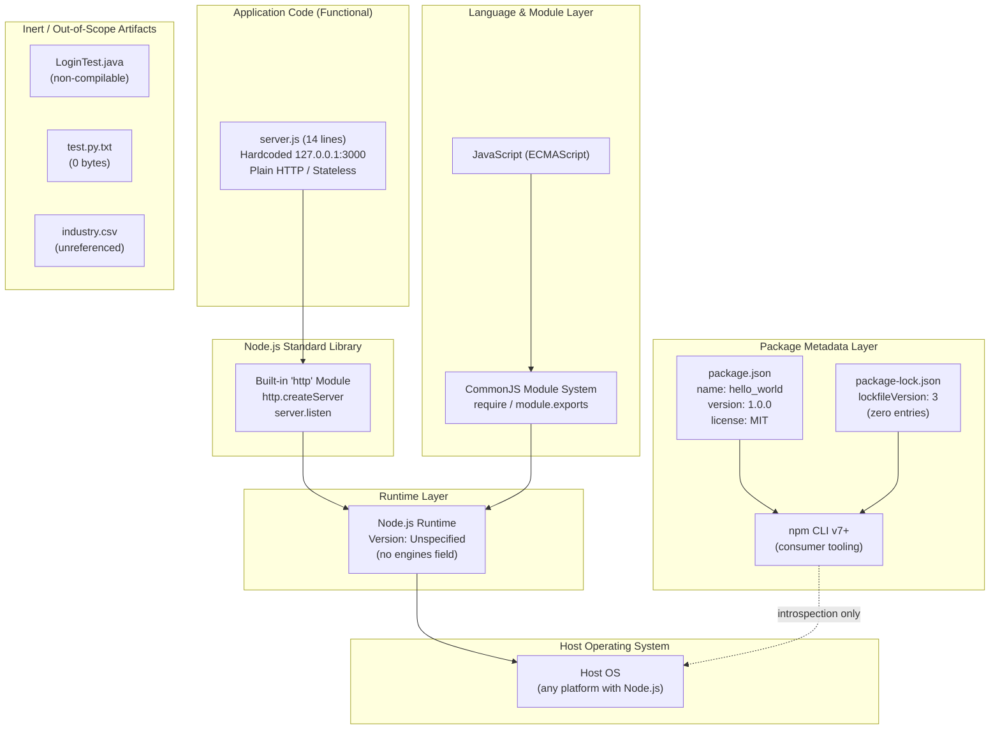

---

## 3.2 PROGRAMMING LANGUAGES

### 3.2.1 Primary Language — JavaScript (Node.js, CommonJS)

#### Language Selection

The sole functional language in the repository is **JavaScript**, executed on the Node.js runtime using the **CommonJS** module system. This is evidenced by the use of `require('http')` syntax in `server.js`, which is the canonical CommonJS import pattern (in contrast to ES module `import` syntax). The implementation is contained in a single 14-line file (`server.js`), with a byte-identical duplicate present as `server - Copy.js`.

#### Selection Justification

JavaScript on Node.js was selected for the following architecturally consistent reasons, derivable from the implementation and from Section 2.4 (Implementation Considerations):

| Selection Criterion | How JavaScript/Node.js Satisfies It |
|---------------------|-------------------------------------|
| **Zero-dependency feasibility** | The Node.js standard library includes a fully functional HTTP server (`http` module), enabling a complete HTTP service to be implemented without any third-party package — consistent with the zero-dependency value proposition (Section 1.1.4) and the F-003 (Zero-Dependency Lockfile) feature. |
| **Determinism and reproducibility** | A single-file Node.js script with no external dependencies produces the same runtime behavior on any compatible Node.js installation, supporting the "deterministic test target" value proposition (Section 1.1.4). |
| **Minimal operational footprint** | Node.js executes the script directly without compilation, transpilation, or build steps, consistent with the absence of any build configuration (Section 1.3.2). |
| **Standard tooling availability** | npm-compatible tooling (assumed in A-004 of Section 2.6.1) is the de facto standard for JavaScript packaging, enabling `package.json`/`package-lock.json` introspection. |

#### Language Version and Runtime Compatibility

**No specific Node.js version is declared** anywhere in the repository:

- `package.json` contains **no `engines` field** specifying minimum Node.js compatibility.
- The repository contains **no `.nvmrc` file** (Node Version Manager configuration).
- The repository contains **no `.node-version` file** (asdf/nodenv configuration).

The implementation in `server.js` uses only long-stable Node.js APIs (`require('http')`, `http.createServer`, `server.listen`, `console.log`, template literals) that have been part of the runtime since the project's earliest stable releases. Consequently, the practical compatibility envelope is any modern Node.js LTS release supporting CommonJS and the built-in `http` module. This is consistent with assumption A-001 in Section 2.6.1, which states only that "A Node.js runtime supporting CommonJS and the built-in `http` module is installed on the host."

#### Module System Constraint

The CommonJS module system is a fixed architectural decision. The single `require('http')` statement in `server.js` would not function under an ES-module-only configuration (such as one introduced by adding `"type": "module"` to `package.json`). The current absence of a `type` field in `package.json` correctly preserves the default CommonJS behavior. Any future change to ESM would constitute a breaking modification to the F-001 feature and would conflict with the F-004 "Do not touch!" directive (Section 2.6.2 constraint C-001's spirit).

### 3.2.2 Non-Functional Source Files (Out-of-Scope Languages)

The repository contains source files in languages other than JavaScript, but **none contribute runtime capability**. They are catalogued here for completeness; per Section 1.3.2 and Section 2.6.3, they are explicitly out of scope as functional components.

#### Java (Non-Compilable Stub)

- **Files Present:** `LoginTest.java` and `LoginTest - Copy.java` (both 128 bytes, byte-identical).
- **Package declaration:** `com.blitzyTest`
- **Status:** Non-compilable. The `main` method body contains the bare identifier `Web` as its entire content, which is not a valid Java statement.
- **Build Tooling:** Absent. No `pom.xml` (Maven), no `build.gradle` (Gradle), no `build.xml` (Ant) is present in the repository.
- **Disposition:** Documented as an anomaly in Section 2.6.3. Java is **not** part of the active technology stack; the files are inert artifacts.

#### Python (Empty Placeholders)

- **Files Present:** `test.py.txt` and `test.py - Copy.txt` (both 0 bytes).
- **Status:** Empty placeholder files; the `.txt` extension on `test.py.txt` indicates these are not even recognized by Python tooling as source files.
- **Build/Runtime Tooling:** Absent. No `requirements.txt`, no `Pipfile`, no `pyproject.toml`, no `setup.py`.
- **Disposition:** Documented as out-of-scope in Section 2.6.3. Python is **not** part of the active technology stack.

### 3.2.3 Languages Explicitly Not Present

For traceability against the default technology stack referenced in the project context, the following languages are **not present** in the repository and are therefore **not part of this Technology Stack section**:

| Language | Presence | Notes |
|----------|----------|-------|
| TypeScript | Absent | No `*.ts` files, no `tsconfig.json` |
| Python (functional) | Absent | Only empty placeholder `.txt` files (see 3.2.2) |
| Swift | Absent | No iOS source files or Xcode project |
| Kotlin | Absent | No Android source files or Gradle build |
| Objective-C | Absent | No macOS source files |
| HTML/CSS/Client-side JavaScript | Absent | No frontend assets — server returns `text/plain` |

---

## 3.3 FRAMEWORKS & LIBRARIES

### 3.3.1 Application Framework Selection: None

The application **does not use any web framework**. The implementation in `server.js` is built directly against the Node.js built-in `http` module using its native API. This is a deliberate architectural decision consistent with the zero-dependency invariant established by F-003 (Section 2.1.3) and the zero-dependency value proposition (Section 1.1.4).

#### Justification for Framework Absence

| Decision Criterion | Rationale |
|---|---|
| Supply-chain risk elimination | Per Section 2.4.4, "Zero external dependencies (F-003) eliminates third-party package risk." Adding a framework would introduce transitive dependencies and break the cryptographically anchored zero-dependency assertion in `package-lock.json`. |
| Scope sufficiency | The required behavior (return invariant `Hello, World!\n` on any request) is fully expressible with the built-in `http.createServer` API; a framework would add no functional value. |
| Reproducibility | Built-in modules ship with the Node.js runtime and exhibit no version drift independent of the runtime itself, supporting the deterministic-test-target value proposition (Section 1.1.4). |
| Loopback-only operation | Per C-001 (Section 2.6.2), the system is restricted to loopback; frameworks targeting routing, middleware, or production hardening would be substantially over-specified for this scope. |

### 3.3.2 Node.js Built-in Module Usage

The implementation uses exactly **one** built-in Node.js module:

| Module | Import Statement | Usage Pattern | API Surface Used |
|--------|------------------|---------------|------------------|
| `http` | `const http = require('http');` | `http.createServer((req, res) => { ... })` and `server.listen(port, hostname, callback)` | `http.createServer`, the `IncomingMessage`/`ServerResponse` API (specifically `res.statusCode`, `res.setHeader`, `res.end`), and `Server.prototype.listen` |

No other Node.js built-in modules (`fs`, `path`, `os`, `events`, `stream`, `crypto`, `process`, etc.) are imported in `server.js`. Notably:

- **`process`** is not referenced — there is no `process.env` lookup, consistent with the "no environment variables" finding in Section 1.3.2 and the all-hard-coded-literals approach in Section 1.2.2.
- **`fs`** is not referenced — there is no file I/O. This is consistent with `industry.csv` being present but unconsumed (F-005, Section 2.1.5).

### 3.3.3 Frameworks and Libraries Explicitly Not Present

To preempt incorrect assumptions about technologies the system might use, the following are explicitly **not present**:

| Category | Examples Absent | Verification |
|---|---|---|
| Web framework | Express, Koa, Fastify, NestJS, Hapi, Restify | No imports; no entries in `package.json` |
| HTTP client library | axios, node-fetch, got, request | No outbound HTTP calls in `server.js` |
| Templating engine | EJS, Handlebars, Pug, Nunjucks | No HTML/template output; response is `text/plain` |
| ORM / Query builder | Sequelize, TypeORM, Prisma, Mongoose, Knex | No database connectivity |
| Validation library | Joi, Yup, Zod, ajv | No input parsing or validation logic |
| Logging library | Winston, Bunyan, Pino, Log4js | Only a single `console.log` startup line in `server.js` |
| Testing framework | Jest, Mocha, Jasmine, Vitest, Tape, AVA | npm `test` script is the default failing placeholder (per F-002 description, Section 2.1.2) |
| Authentication / authorization | Passport, Auth0 SDK, jsonwebtoken | No identity logic (per Section 2.4.4) |
| Process manager | PM2, Forever, Nodemon | No process management configuration |
| AI / ML framework | Langchain, OpenAI SDK | None — system has no AI functionality |
| Frontend framework | React, Vue, Angular, Svelte | Server has no client-facing UI |
| CSS framework | TailwindCSS, Bootstrap | No frontend assets |

### 3.3.4 Compatibility Requirements

Because only the built-in `http` module is used:

- **No version compatibility matrices** apply — the API surface used by `server.js` is part of Node.js core and evolves with the runtime as a whole.
- **No transitive dependency upgrades** are ever required (per Section 2.4.5 "Maintenance Requirements": "None required — zero external dependencies (F-003)").
- **No peer-dependency conflicts** can arise.

---

## 3.4 OPEN SOURCE DEPENDENCIES

### 3.4.1 External Dependency Count: Zero

The repository declares and resolves **zero external open-source dependencies**. This is verified by three independent observations:

1. **`package.json`** contains neither a `dependencies` block nor a `devDependencies` block. The full manifest includes only the `name`, `version`, `description`, `main`, `scripts`, `author`, and `license` fields.
2. **`package-lock.json`** uses `lockfileVersion: 3` and contains only the root package entry under `packages[""]` with no transitive entries.
3. **`server.js`** imports only the Node.js built-in `http` module via `require('http')`.

This is documented as Feature F-003 (Zero-Dependency Lockfile, Section 2.1.3) and is identified as the principal supply-chain security control in Section 2.4.4 ("Zero external dependencies (F-003) eliminates third-party package risk").

### 3.4.2 Package Manager and Registry

| Aspect | Value | Source |
|--------|-------|--------|
| Package Manager | npm | Implied by presence of `package.json` and `package-lock.json` |
| Required npm Version | **v7 or later** | `lockfileVersion: 3` in `package-lock.json` requires npm v7+ (lockfile v3 was introduced with npm v7) — assumption A-004 in Section 2.6.1 |
| Package Registry | Default npm registry (`https://registry.npmjs.org`) | No `.npmrc` override exists in the repository |
| Alternative Package Managers Used | **None** | No `yarn.lock`, no `pnpm-lock.yaml`, no `bun.lockb` |

The choice of npm (rather than Yarn, pnpm, or Bun) is implicit in the lockfile format and aligns with feature F-003's specification of the npm v7+ lockfile v3 schema (per F-003's "System Dependencies" in Section 2.1.3).

### 3.4.3 Package Identity and Licensing

The `package.json` declares the following identity attributes, which constitute the totality of the package metadata:

| Field | Value | Notes |
|-------|-------|-------|
| `name` | `hello_world` | npm package identifier (does **not** match the repository name `hao-backprop-test`) |
| `version` | `1.0.0` | Semantic version; mirrored in `package-lock.json` |
| `description` | `Hello world in Node.js` | Single-line description |
| `main` | `index.js` | **Anomaly:** Declared entry point file does not exist in the repository (per F-002 description, Section 2.1.2, and Section 2.6.3) |
| `scripts.test` | `echo "Error: no test specified" && exit 1` | Default placeholder; no test framework integrated |
| `author` | `hxu` | Sole declared author (per Section 1.1.3) |
| `license` | `MIT` | Constraint C-005 in Section 2.6.2 |

### 3.4.4 Supply-Chain Security Posture

The zero-dependency profile is the foundational supply-chain security control:

| Concern | Mitigation |
|---------|------------|
| Transitive dependency vulnerabilities | **Eliminated** — no transitive packages exist (`package-lock.json` has no nested entries) |
| Typosquatting / dependency confusion | **Eliminated** — no `require` of any non-builtin module |
| Lockfile drift | **Mitigated** — `package-lock.json` is authoritative; F-003 mandates conformance to lockfile v3 schema (Section 2.4.1) |
| Compromised registry packages | **Eliminated** — `npm ci`/`npm install` against this lockfile installs zero packages |

This posture is consistent with the security finding in Section 2.4.4: "The system's security posture is principally derived from the *absence* of attack surface rather than the *presence* of defensive controls."

---

## 3.5 THIRD-PARTY SERVICES

### 3.5.1 External Service Integrations: None

The repository **contains no integrations with third-party services**. This is comprehensively enumerated in Section 1.3.2 (Integration Points Not Covered), which lists every major category as "Not present, not referenced":

| Service Category | Status in Repository | Verification |
|------------------|----------------------|--------------|
| Identity providers (OAuth2, SAML, OIDC, Auth0) | Not present, not referenced | No identity-handling code in `server.js`; no client libraries in `package.json` |
| Cloud platform services (AWS, Azure, GCP) | Not present, not referenced | No cloud SDKs declared; no Terraform, CloudFormation, or Pulumi configs |
| External REST/GraphQL APIs | Not present, not referenced | No outbound HTTP client in `server.js` |
| Message brokers (Kafka, RabbitMQ, SQS, SNS) | Not present, not referenced | No broker client libraries |
| Email / SMS / notification services | Not present, not referenced | No notification client code |
| Monitoring / observability platforms (Datadog, New Relic, Sentry) | Not present, not referenced | No APM agents or telemetry exporters |
| Payment / billing services | Not present, not referenced | No relevant client libraries |
| Object storage (S3, GCS, Azure Blob) | Not present, not referenced | No storage SDKs |

### 3.5.2 The "Backprop" Integration Reference

The **only** external system referenced anywhere in the repository is the "backprop" integration, named exclusively in the two-line `README.md` (per F-004 in Section 2.1.4 and assumption A-003 in Section 2.6.1):

| Attribute | Value |
|-----------|-------|
| Reference Location | `README.md` (single descriptive sentence) |
| Integration Protocol | HTTP/1.1 over TCP (consumer-side perspective) |
| Endpoint Target | `http://127.0.0.1:3000` |
| Authentication | None — endpoint is unauthenticated |
| Schema / Contract | **None** — no OpenAPI spec, no API reference, no interface definition |
| Message Format | Plain text (`Content-Type: text/plain`) |
| Integration Direction | Inbound only (backprop → server.js); no outbound calls from this repository |

The repository is the **server side** of this integration; the "backprop" system is the **external consumer**, the implementation and operation of which are entirely outside the scope of this repository. No client SDK, contract test, or shared schema artifact is present.

### 3.5.3 Authentication Services: None

Per Section 2.4.4, the repository contains **no authentication framework, identity provider integration, or credential handling**. There are:

- No OAuth2 / OIDC / SAML client libraries.
- No Auth0, Okta, or AWS Cognito SDKs.
- No JWT signing or verification code (no `jsonwebtoken`, `jose`, etc.).
- No session management.
- No API key validation logic.
- No secrets stored anywhere in the codebase (per Section 2.4.4 "Secret management" row).

### 3.5.4 Monitoring and Observability: None

The system's observability surface consists of a **single `console.log` statement** at server startup, emitting `Server running at http://127.0.0.1:3000/` upon successful binding. There are:

- No metrics emitters (no Prometheus, StatsD, OpenTelemetry).
- No structured logging library (no Winston, Bunyan, Pino).
- No distributed tracing (no OpenTelemetry, Jaeger, Zipkin).
- No application performance monitoring agents (no Datadog, New Relic, AppDynamics, Dynatrace).
- No error tracking (no Sentry, Rollbar, Bugsnag).
- No health-check endpoint (per Section 1.3.2 "Production deployment" row).

Per Section 2.4.4, the single `console.log` "emits no sensitive data," making the minimal observability surface compatible with the system's loopback-only security model.

---

## 3.6 DATABASES & STORAGE

### 3.6.1 Database Technology: None

The repository **contains no database technology of any kind**. This is enumerated in Section 1.3.2 (Out-of-Scope Elements) and is a direct consequence of the stateless application design described in Section 1.2.2 ("State: Fully stateless; no in-memory data structures, no file I/O, no persistence").

| Database Category | Status | Verification |
|-------------------|--------|--------------|
| Relational (PostgreSQL, MySQL, SQLite, MS SQL Server) | **Absent** | No driver in `package.json`; no connection code |
| Document (MongoDB, Couchbase, DynamoDB) | **Absent** | No client SDK; no ORM/ODM |
| Key-value (Redis, Memcached, etcd) | **Absent** | No cache client |
| Search (Elasticsearch, Solr, OpenSearch) | **Absent** | No search SDK |
| Graph (Neo4j, Neptune, ArangoDB) | **Absent** | No graph driver |
| Time-series (InfluxDB, TimescaleDB) | **Absent** | No time-series client |

No ORM, query builder, migration tool, or schema definition exists. There are no connection strings, environment variables, or credential management routines (consistent with Section 2.4.4 "Secret management": "No secrets stored").

### 3.6.2 Data Persistence Strategy: Stateless In-Memory Only

The application is **fully stateless** (per Section 1.2.2 "Core Technical Approach" and Section 2.4.3 "State management"). Specifically:

- No in-memory state structures persist across requests (the handler is a pure function of its constant response).
- No file system writes are performed by the application.
- No session state, no rate-limit counters, no request logs are retained.

This stateless model is reinforced by the scalability table in Section 2.4.3, which characterizes resource consumption as "Minimal — no persistent storage, no caching, no background tasks."

### 3.6.3 Caching Solutions: None

No caching layer exists at any tier:

| Cache Tier | Status |
|------------|--------|
| Application-level cache (in-memory `Map`, LRU cache) | Absent |
| Distributed cache (Redis, Memcached) | Absent |
| HTTP response cache headers | Absent (handler sets only `statusCode` and `Content-Type`) |
| CDN integration | Absent (server is loopback-only per C-001) |

### 3.6.4 Static Data Files (Inert Filesystem Artifacts)

Although the repository contains static data files, they are **not consumed by any source code**. Per F-005 (Section 2.1.5) and Section 2.6.3:

| File | Size | Purpose | Consumer |
|------|------|---------|----------|
| `industry.csv` | 749 bytes | Single-column CSV with header `Industry` and 43 alphabetically ordered industry categories | **None** — no source code reads this file |
| `industry - Copy.csv` | 749 bytes | Byte-identical duplicate of `industry.csv` | **None** |
| `100Pages.pdf`, `100Pages - Copy.pdf` | 9,456,545 bytes each | Binary documents | **None** — purpose undocumented |
| `demo.jpg`, `demo - Copy.jpg` | 2,123,398 bytes each | Binary image documents | **None** — purpose undocumented |
| `sample.doc`, `sample - Copy.doc` | 98,304 bytes each | Binary document files | **None** — purpose undocumented |

These files exist in the working tree and git history but are **inert** relative to the runtime; the application does not depend on any storage subsystem to operate.

### 3.6.5 Cloud Storage Services: None

No cloud object storage integration exists. No SDK for AWS S3, Google Cloud Storage, Azure Blob Storage, or any equivalent service is declared in `package.json` or imported in `server.js`.

---

## 3.7 DEVELOPMENT & DEPLOYMENT

### 3.7.1 Version Control

| Aspect | Value | Source |
|--------|-------|--------|
| VCS System | Git | Presence of `.git/` directory |
| Repository History | Single commit `232d20c Add files via upload` | Section 1.4.2; Section 2.6.4 |
| Committer | `Sandeep02Kumar02 <sandeepblitzyqa@gmail.com>` | Section 1.1.3 |
| Commit Date | Thu Mar 5 18:20:29 2026 +0530 | Section 2.6.4 |
| Branching Strategy | Not evidenced | Section 2.4.5 "Maintenance Requirements" |
| `.gitignore` | **Absent** — only empty `.blitzyignore.txt` variants exist | Section 1.3.2 |
| Tagging | Not evidenced | Section 2.6.4 |

### 3.7.2 Build System: None

The repository **has no build system**. The Node.js script `server.js` executes directly via `node server.js` without compilation, transpilation, bundling, or minification.

| Build Tool Category | Status |
|---------------------|--------|
| JavaScript bundlers (webpack, rollup, esbuild, Parcel, Vite) | **Absent** — no configuration files exist |
| Transpilers (Babel, SWC, TypeScript compiler) | **Absent** — no `.babelrc`, no `tsconfig.json` |
| Task runners (Gulp, Grunt) | **Absent** — no `gulpfile.js`, no `Gruntfile.js` |
| `npm scripts` for build | **Absent** — `scripts` block contains only the default placeholder `test` script |
| Makefile / Bazel / Nx | **Absent** — no `Makefile`, no `BUILD` files, no `nx.json` |

The `package.json` `scripts` block is reproduced here in full:

| Script Name | Command | Functional Status |
|-------------|---------|-------------------|
| `test` | `echo "Error: no test specified" && exit 1` | **Default placeholder** — exits with code 1 if invoked (per F-002, Section 2.1.2) |

No `start`, `build`, `lint`, `format`, or `dev` scripts are defined. The runtime entry point is conventionally `node server.js` (even though `package.json` declares `main: index.js`, which is an anomaly — the referenced file does not exist, per Section 2.6.3).

### 3.7.3 Containerization: None

The repository **contains no containerization artifacts**:

| Artifact | Status |
|----------|--------|
| `Dockerfile` | Absent |
| `docker-compose.yml` / `compose.yaml` | Absent |
| `.dockerignore` | Absent |
| Kubernetes manifests (`*.yaml` for Deployments, Services, etc.) | Absent |
| Helm charts (`Chart.yaml`, `values.yaml`) | Absent |
| Container registry references | Absent |

This absence is explicit in Section 1.3.2 (Out-of-Scope Elements: "Containerization | No Dockerfile, no docker-compose, no Kubernetes manifests").

### 3.7.4 CI/CD: None

The repository **has no continuous integration or continuous deployment configuration**:

| CI/CD Platform | Configuration Present? |
|----------------|------------------------|
| GitHub Actions (`.github/workflows/`) | **No** — `.github/` directory does not exist |
| GitLab CI (`.gitlab-ci.yml`) | **No** |
| Jenkins (`Jenkinsfile`) | **No** |
| CircleCI (`.circleci/config.yml`) | **No** |
| Travis CI (`.travis.yml`) | **No** |
| Azure Pipelines (`azure-pipelines.yml`) | **No** |
| Bitbucket Pipelines (`bitbucket-pipelines.yml`) | **No** |

No automated test runs, builds, security scans, or deployments occur. Validation depends on manual HTTP probing of the running `server.js` process (per Section 2.4.5: "Test coverage | Absent — no automated test suite (per Section 1.3.2); validation requires manual HTTP probing").

### 3.7.5 Infrastructure as Code: None

The repository **contains no Infrastructure-as-Code artifacts**:

| IaC Tool | Status |
|----------|--------|
| Terraform (`*.tf`, `*.tfvars`) | Absent |
| AWS CloudFormation (YAML/JSON templates) | Absent |
| Pulumi (`Pulumi.yaml`, language-specific stacks) | Absent |
| Ansible (`playbook.yml`, `inventory`) | Absent |
| AWS CDK / CDK for Terraform | Absent |
| Chef / Puppet / SaltStack | Absent |

This is consistent with the absence of any cloud platform integration (per Section 3.5.1 and Section 1.3.2).

### 3.7.6 Configuration Management: None

All configuration values are **hard-coded as literals** in `server.js` (per Section 1.2.2 "Configuration"):

| Configuration Parameter | Value | Location |
|-------------------------|-------|----------|
| Hostname | `'127.0.0.1'` | `server.js` constant `hostname` |
| Port | `3000` | `server.js` constant `port` |
| Response status code | `200` | `server.js` handler |
| Response content type | `'text/plain'` | `server.js` handler |
| Response body | `'Hello, World!\n'` | `server.js` handler |

There is:

- **No `process.env` reference** anywhere in `server.js` (Section 1.3.2 confirms "Environment variable support | No `process.env` references").
- **No `.env` file or `dotenv` loader.**
- **No `config.json`, `config.yaml`, or `appsettings.json`** file.
- **No command-line argument parsing.**

This hard-coding is explicitly noted as a constraint (C-002, Section 2.6.2: "The port and hostname are hard-coded; modifying them requires source code change") and as a technical constraint on F-001 (Section 2.4.1).

### 3.7.7 Development Tooling: None Declared

The repository **declares no development-tooling configuration**:

| Tool Category | Status |
|---------------|--------|
| Linter (ESLint, JSHint, StandardJS) | No `.eslintrc.*`, no `eslint.config.js` |
| Formatter (Prettier) | No `.prettierrc.*`, no `prettier.config.js` |
| Editor configuration | No `.editorconfig` |
| Type checker | No `tsconfig.json`, no `jsconfig.json` |
| Pre-commit hooks (Husky, lefthook) | No `.husky/`, no `lefthook.yml` |
| Commit linting (commitlint) | No `commitlint.config.js` |
| API documentation (JSDoc, TypeDoc) | No configuration; no doc comments in `server.js` |

### 3.7.8 Runtime Deployment Model

The deployment model is implicit and minimal:

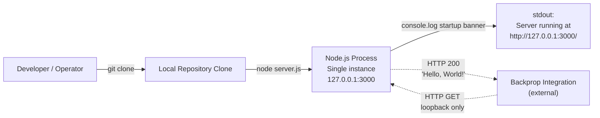

| Deployment Aspect | Implementation |
|-------------------|----------------|
| Installation | `git clone` followed by no further steps (no `npm install` required since dependencies are zero, though running `npm install` is benign) |
| Startup | Invoke `node server.js` directly from a shell (the `main` field's reference to `index.js` is anomalous and ignored in practice) |
| Health verification | Manual HTTP request to `http://127.0.0.1:3000/`; expected response `200 OK` with body `Hello, World!\n` |
| Shutdown | Process termination via `SIGINT`/`SIGTERM` (no graceful-shutdown handler is registered) |
| Process management | None — no PM2, systemd unit, or Windows service definition included |
| Restart policy | None — relies on operator action |

---

## 3.8 RUNTIME ARCHITECTURE OBSERVATIONS

### 3.8.1 Network and Transport Layer

| Aspect | Value | Source |
|--------|-------|--------|
| Application protocol | HTTP/1.1 | Built-in `http` module default |
| Transport security | **None** — plain HTTP only | Section 2.4.4 ("Plain HTTP; no TLS — acceptable only because of loopback binding") |
| Bind address | `127.0.0.1` (loopback) | `server.js` constant |
| Bind port | `3000` | `server.js` constant |
| External reachability | None — loopback-only (per constraint C-001) | Section 2.6.2 |
| Socket configuration | Defaults inherited from Node.js `http.Server` | Section 2.4.3 ("no custom socket configuration") |

### 3.8.2 Concurrency Model

| Aspect | Value | Source |
|--------|-------|--------|
| Concurrency primitive | Node.js single-threaded event loop | Section 2.4.3 |
| Clustering | None — no `cluster` module usage | Section 2.4.3 |
| Worker threads | None — no `worker_threads` module usage | Section 2.4.3 |
| Process manager | None | Section 3.7.7 (above) |
| Horizontal scalability | Not applicable — loopback binding prevents multi-host deployment | Section 2.4.3 |

### 3.8.3 Security Stack

Per Section 2.4.4, the security posture is derived **principally from the absence of attack surface**, not from defensive controls:

| Layer | Control Present? | Notes |
|-------|------------------|-------|
| Network reachability | **Mitigated by design** | `127.0.0.1` binding prevents non-local access |
| Authentication | **None** | No identity, session, or credential code |
| Authorization | **None** | Handler does not differentiate callers |
| Input validation | **Not applicable** | Handler ignores all request inputs |
| Transport security | **None** | Plain HTTP only — justified by loopback binding |
| Secret management | **Not required** | No secrets stored or referenced |
| Supply-chain hardening | **Achieved structurally** | Zero external dependencies (F-003) |
| Output security | **Constant response** | No sensitive data emitted |

### 3.8.4 Logging and Observability Stack

| Aspect | Implementation |
|--------|----------------|
| Logging mechanism | Single `console.log` call at server startup |
| Log destination | `stdout` (default) |
| Log structure | Plain text template literal: `` `Server running at http://${hostname}:${port}/` `` |
| Logging library | **None** |
| Metrics | **None** |
| Tracing | **None** |
| APM | **None** |
| Error reporting | **None** — no try/catch blocks or error response paths (per Section 1.3.2) |

---

## 3.9 TECHNOLOGY STACK INTEGRATION SUMMARY

### 3.9.1 Component Integration Map

The diagram below shows how the few components of this technology stack actually integrate at runtime. The simplicity of this map is itself a defining property of the system.

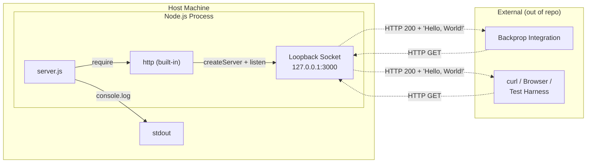

### 3.9.2 Compatibility and Integration Requirements

Because the stack is composed exclusively of (a) the Node.js runtime, (b) its built-in `http` module, and (c) `server.js` itself, integration requirements collapse to a single dimension:

| Requirement | Source |
|-------------|--------|
| A Node.js runtime capable of executing CommonJS and the built-in `http` module | F-001 dependency (Section 2.1.1); assumption A-001 (Section 2.6.1) |
| TCP port 3000 available on the loopback interface | F-001 dependency; assumption A-002 (Section 2.6.1) |
| npm v7+ tooling available for any consumer needing to inspect `package.json`/`package-lock.json` | F-003 dependency (Section 2.1.3); assumption A-004 (Section 2.6.1) |
| MIT license compliance for any downstream use | Constraint C-005 (Section 2.6.2) |

### 3.9.3 Default Technology Stack Reconciliation Note

For traceability against the default technology stack profile referenced in the project's authoring context (AWS, Docker, Terraform, GitHub Actions, Python/Flask, Auth0, MongoDB, Langchain, React with TypeScript, TailwindCSS, React-Native, Swift, Kotlin, Objective-C, ElectronJS), this section explicitly affirms that **none of these technologies are present in this repository**. As enumerated in Section 1.3.2 (Out-of-Scope Elements) and validated across Sections 3.2–3.7 above, the actual stack is constrained to:

- **JavaScript** (CommonJS) on the **Node.js** runtime
- The Node.js built-in `http` module
- **npm v7+** for package metadata management
- **Git** for version control
- **MIT** license

This reconciliation is documented to prevent inference of capabilities or technologies the codebase does not possess, consistent with the design principle articulated in Section 1.1.1: "This Technical Specification documents the system *as it exists*, without extrapolating capabilities, business objectives, or stakeholder concerns that are not evidenced by the source."

---

#### References

#### Files Examined

- `server.js` — Sole functional source file (14 lines); evidence for JavaScript/CommonJS selection, `http` module usage, hard-coded `127.0.0.1:3000` binding, plain HTTP transport, stateless handler, and single `console.log` observability surface
- `server - Copy.js` — Byte-identical duplicate of `server.js`; evidence for the pervasive duplication pattern noted in Section 2.6.3
- `package.json` — Full npm manifest; source for package identity (`hello_world` v1.0.0), MIT license, author `hxu`, declared (but missing) `main: index.js`, default `test` script, and the absence of `dependencies`/`devDependencies` blocks
- `package-lock.json` — Lockfile v3; evidence for npm v7+ tooling requirement and zero-dependency assertion
- `README.md` — Two-line documentation containing the sole "backprop integration" reference and the "Do not touch!" directive
- `LoginTest.java` and `LoginTest - Copy.java` — Non-compilable Java stubs (128 bytes each); documented as out-of-scope inert artifacts
- `test.py.txt` and `test.py - Copy.txt` — Empty (0-byte) placeholder files; documented as out-of-scope inert artifacts
- `industry.csv` and `industry - Copy.csv` — Static CSV data files (749 bytes each); F-005 inert data artifact, unreferenced by any source code
- `100Pages.pdf`, `100Pages - Copy.pdf`, `demo.jpg`, `demo - Copy.jpg`, `sample.doc`, `sample - Copy.doc` — Binary document files; documented as unreferenced artifacts in Section 3.6.4
- `.blitzyignore.txt`, `test.blitzyignore.txt`, `test1.blitzyignore.txt` — Empty (0-byte) placeholder files; evidence for the absence of `.gitignore` rules

#### Folders Explored

- Repository root (depth 0) — Flat single-directory layout containing 22 files; verified the absence of `.github/`, `node_modules/`, `src/`, `dist/`, `build/`, `.circleci/`, `.husky/`, and all build/CI/CD/IaC subdirectories (per Section 1.4.2)

#### Technical Specification Sections Referenced

- Section 1.1 (Executive Summary) — Project overview, value proposition (zero-dependency profile), stakeholder identification
- Section 1.2 (System Overview) — Core technical approach, runtime characteristics, stateless model, hard-coded configuration
- Section 1.3 (Scope) — Authoritative enumeration of in-scope features and out-of-scope capabilities (databases, frameworks, auth, TLS, CI/CD, containers, IaC)
- Section 1.4 (References) — Repository file inventory, version control history, duplication pattern
- Section 2.1 (Feature Catalog) — F-001 (HTTP server), F-002 (package manifest), F-003 (zero-dependency lockfile), F-004 (README), F-005 (industry.csv data artifact)
- Section 2.4 (Implementation Considerations) — Technical constraints, performance envelope, scalability bounds, security disposition derived from absence of attack surface
- Section 2.6 (Assumptions, Constraints, and Documented Anomalies) — Runtime assumptions (A-001 through A-005), constraints (C-001 through C-006), and documented anomalies including the missing `index.js` and non-compilable `LoginTest.java`

# 4. Process Flowchart

## 4.1 SCOPE AND DOCUMENTATION APPROACH

### 4.1.1 The Single Observable Workflow

The `hao-backprop-test` repository implements exactly one runtime workflow: a stateless HTTP request/response cycle handled by `server.js`. Per Section 1.3.1 (Primary User Workflows), the single observable workflow is:

> 1. A local HTTP client issues a request to `http://127.0.0.1:3000` (any method, any path).
> 2. The server responds with HTTP `200`, header `Content-Type: text/plain`, body `Hello, World!\n`.
> 3. The connection is closed.

No multi-step workflows, sessions, authentication flows, or state transitions exist in the codebase. This section documents that workflow faithfully and explicitly enumerates the workflow categories requested by the documentation template that are **not present** in the source, citing the controlling sections of this specification for each absence.

### 4.1.2 Documentation Methodology for an Intentionally Minimal System

Section 3.1.1 establishes intentional minimalism as the architectural principle governing this repository. Consequently, several elements typically present in a Process Flowchart section — decision diamonds, error recovery paths, retry mechanisms, validation rules, compliance checkpoints, batch sequences, and state machines — are largely or wholly absent. Documenting absence is itself a contractual statement: any future implementation that introduces such elements would constitute a scope expansion subject to Section 1.3.2 (Out-of-Scope Elements) and the README directive "Do not touch!" (Section 2.2.4, F-004-RQ-002).

Diagrams in this section are intentionally simple to reflect the system's characteristic minimalism. Each diagram is rendered using Mermaid.js and references the controlling functional requirement (F-001 through F-005 per Section 2.1) where applicable.

---

## 4.2 SYSTEM WORKFLOWS

### 4.2.1 High-Level System Workflow Overview

The high-level workflow encompasses two phases: a one-time **startup phase** initiated by an operator, and a recurring **request-handling phase** triggered by an external HTTP client (typically the Backprop integration system referenced in `README.md`). The phases are connected by Node.js's event loop, which remains idle between connections.

The diagram below uses swim lanes to demarcate the four actors involved: the human operator, the Node.js runtime, the application code (`server.js`), and the external HTTP client. Per Section 1.3.1 (Implementation Boundaries), all four actors execute on the same physical host because the listener is bound to `127.0.0.1` (loopback only).

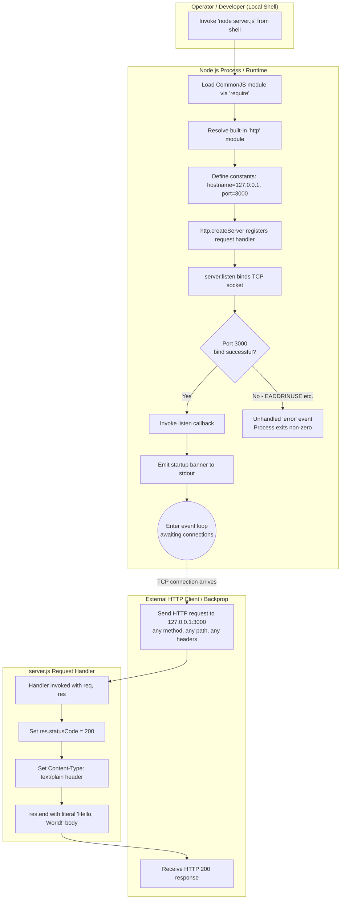

The single decision diamond (`Port 3000 bind successful?`) represents the only meaningful branch point in the entire system, and notably it is **not handled by application code** — the "No" path leads to process termination because `server.js` registers no listener for the `'error'` event on the server instance (see Section 4.5).

### 4.2.2 Core Business Process: HTTP Request/Response Cycle (F-001)

The HTTP request/response cycle is the sole business process implemented by the system, corresponding to feature F-001 in Section 2.1 (Feature Catalog). Per the acceptance criterion F-001-RQ-006 in Section 2.2.1:

> "Requests issued with method `GET`, `POST`, `PUT`, `DELETE`, `PATCH`, `OPTIONS`, `HEAD` against paths `/`, `/anything`, `/x/y/z` all return identical status, headers, and body."

This invariance — formalized by F-001-RQ-002 through F-001-RQ-004 — means the detailed process flow contains zero branching logic at the application layer:

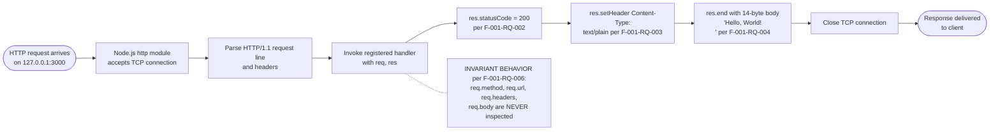

#### Process Step Reference

| Step | Action | Authoritative Source |
|------|--------|----------------------|
| 1 | Client opens TCP connection to `127.0.0.1:3000` | F-001-RQ-001 (Section 2.2.1) |
| 2 | Node.js `http` module parses HTTP/1.1 request | Built-in `http` module behavior (Section 3.3.2) |
| 3 | Handler function invoked with `(req, res)` | `server.js` lines 6–10 |
| 4 | `res.statusCode = 200` set unconditionally | F-001-RQ-002 |
| 5 | `Content-Type: text/plain` header set unconditionally | F-001-RQ-003 |
| 6 | `res.end('Hello, World!\n')` writes body and ends response | F-001-RQ-004 |
| 7 | TCP connection closes (implicit per `res.end()`) | Node.js `http` semantics |

### 4.2.3 Server Startup and Lifecycle Workflow

The startup workflow is executed exactly once per process invocation. It is implemented entirely by the top-level statements in `server.js` (CommonJS module initialization); there is no exported interface and no deferred initialization. The startup workflow is documented by F-001-RQ-001 (port binding) and F-001-RQ-005 (startup banner emission) in Section 2.2.1.

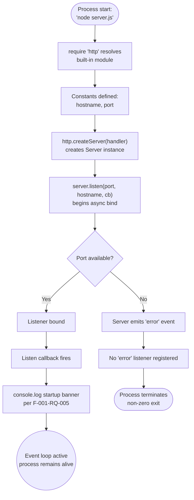

#### Notable Lifecycle Absences

Per Section 3.7.8 (Runtime Deployment Model) and Section 3.8.4 (Logging and Observability Stack), the following lifecycle facilities are **not implemented**:

| Facility | Status | Reference |
|----------|--------|-----------|
| Graceful shutdown handler (`SIGINT`/`SIGTERM`) | Not registered | Section 1.3.2 (Unsupported Use Cases — "Production deployment") |
| Process supervisor (PM2, systemd, etc.) | Not configured | Section 3.7.7 / 3.8.2 |
| Restart policy | None | Section 3.7.8 |
| Health-check endpoint | None | Section 1.3.2 |
| Startup retries on bind failure | None | Section 3.8.4 |

### 4.2.4 System Boundaries and Actor Inventory

The Section 1.3.1 Implementation Boundaries definition states: "A single Node.js process running `server.js` on the local machine" constitutes the system boundary. The following actors participate in workflows traversing or terminating at this boundary:

| Swim Lane / Actor | Boundary Position | Role |
|-------------------|-------------------|------|
| Operator / Developer | External to process | Initiates startup via shell |
| External HTTP Client (Backprop, curl, browser) | External to process, internal to host | Sends inbound HTTP request |
| Node.js Process | The system boundary itself | Hosts execution |
| `server.js` application code | Internal to process | Defines handler and listener |
| Node.js built-in `http` module | Internal to process | Implements HTTP/1.1 wire protocol |
| Loopback network interface (127.0.0.1) | OS-mediated edge | Carries TCP traffic |
| `stdout` console stream | OS-mediated edge | Receives startup banner |

The Backprop integration is the only externally named actor (per `README.md`), and its interaction is exclusively inbound — there are no outbound calls from the repository (Section 3.5.1).

---

## 4.3 INTEGRATION WORKFLOWS

### 4.3.1 Backprop Integration Sequence

The Backprop integration is described in Section 3.5.2 as the sole declared third-party touchpoint. The integration is unidirectional (Backprop → `server.js`), unauthenticated, schema-less, and stateless. The following sequence diagram depicts a single end-to-end interaction:

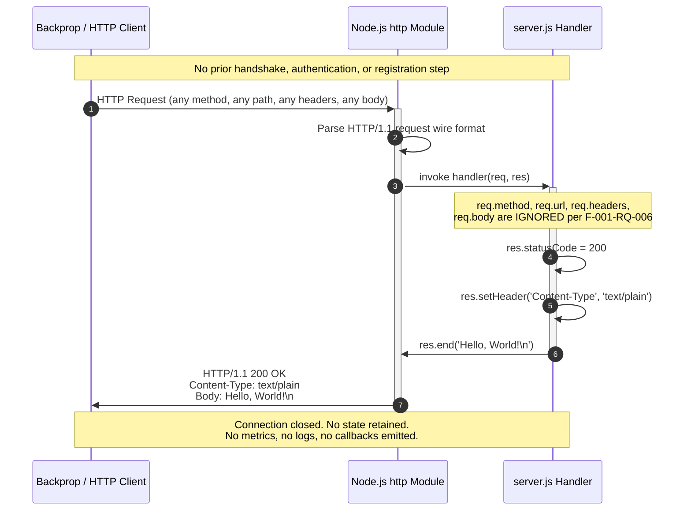

#### Integration Contract Summary

| Attribute | Value | Source |
|-----------|-------|--------|
| Protocol | HTTP/1.1 over TCP | Section 3.8.1 |
| Direction | Inbound only | Section 3.5.1 |
| Endpoint | `http://127.0.0.1:3000` | F-001-RQ-001 |
| Authentication | None | Section 3.8.3 |
| Authorization | None | Section 3.8.3 |
| Schema / Contract | None (no OpenAPI, no IDL) | Section 3.5.2 |
| Message Format | `text/plain` body, no structured payload | F-001-RQ-003 |
| Idempotency | Trivially idempotent (invariant response) | F-001-RQ-006 |
| Backpressure / Flow Control | Node.js `http` defaults only | Section 3.8.1 |

### 4.3.2 Data Flow Between Systems

Data flows only inbound at the TCP layer (request bytes) and outbound at the TCP layer (response bytes and a single startup banner to `stdout`). There are no persistent stores, no caches, no queues, and no downstream services involved.

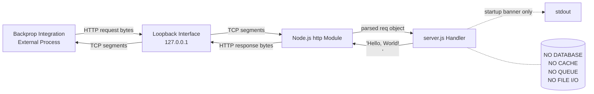

### 4.3.3 Absent Integration Patterns

The Section 4 template requests documentation of "Event processing flows" and "Batch processing sequences." Per Section 3.5.1, none of the following integration patterns are implemented:

| Integration Pattern | Status | Authoritative Reference |
|--------------------|--------|-------------------------|
| Outbound HTTP / REST calls | Not present | Section 3.5.1 |
| Message broker producers/consumers (Kafka, RabbitMQ, SQS) | Not present | Section 1.3.2 (Integration Points Not Covered) |
| Webhooks (inbound or outbound) | Not present | Section 3.5.1 |
| Event-driven / pub-sub flows | Not present | Section 1.3.2 |
| Scheduled / cron / batch jobs | Not present | Section 1.3.2 (Unsupported Use Cases) |
| File ingestion / ETL | Not present (note: `industry.csv` exists but is unreferenced — Section 2.6.3) | Section 2.6.3 |
| Database transactions / outbox patterns | Not present | Section 3.6 |
| Identity provider federation (OAuth/SAML/OIDC) | Not present | Section 1.3.2 |

Because none of these patterns exist, no corresponding diagrams are produced; doing so would violate Section 1.1.1's directive that "This Technical Specification documents the system *as it exists*, without extrapolating capabilities."

---

## 4.4 DECISION POINTS AND VALIDATION RULES

### 4.4.1 Decision Point Inventory

The Section 4 template requests documentation of decision diamonds. The complete inventory of decision points discoverable in the codebase is:

| Decision Point | Location | Handled by App Code? |
|---------------|----------|---------------------|
| Was the TCP port bind successful? | Implicit in `server.listen()` outcome (`server.js` line 12) | **No** — no `.on('error', …)` handler registered |
| Was the Node.js runtime available? | OS-level decision prior to script load | **No** — script does not load if runtime absent |

No decision points exist within the request-handling path itself. The handler in `server.js` lines 6–10 contains zero `if`, `switch`, `try`, or ternary expressions. Per F-001-RQ-006 (Section 2.2.1), this invariance is a documented requirement: the response must be identical for all input variations.

### 4.4.2 Validation Rules Assessment

Section 2.2.1 (F-001 Validation Rules) defines the rules governing the sole runtime feature. Mapped to the template's validation taxonomy:

| Validation Category Requested | Rule Present in System | Source |
|------------------------------|------------------------|--------|
| Business rules at each step | **Response invariance** — no request attribute may alter the response | Section 2.2.1 (Business Rules) |
| Data validation requirements | **Not applicable** — "no input is parsed or interpreted" | Section 2.2.1 (Data Validation) |
| Authorization checkpoints | **None** — "Handler does not differentiate callers" | Section 3.8.3 |
| Regulatory compliance checks | **None** beyond MIT license declaration in `package.json` | Section 2.2.1 (Compliance Requirements) |
| Input sanitization | **None / Not applicable** | Section 2.4.4 ("Input validation: Not applicable — handler ignores all request inputs") |
| Schema validation | **None** — no schema defined | Section 3.5.2 |

The only "validation" performed implicitly is at the network layer: a TCP packet must successfully reach `127.0.0.1:3000` for the handler to be invoked. This is enforced by the operating system's network stack, not by application code.

### 4.4.3 Authorization Checkpoints

Per Section 3.8.3 (Security Stack), authorization is intentionally absent:

> "Authorization | **None** | Handler does not differentiate callers"
>
> "Network reachability | **Mitigated by design** | `127.0.0.1` binding prevents non-local access"

The Section 4 template requirement for "authorization checkpoints" therefore maps to a single implicit checkpoint: **loopback reachability**. Any caller able to open a TCP connection to `127.0.0.1:3000` from the local machine is implicitly authorized. There are no application-layer authorization decisions.

### 4.4.4 Regulatory Compliance Checks

No regulatory compliance flows (PCI-DSS, HIPAA, GDPR, SOX, etc.) are implemented. Per Section 2.2.1, the only compliance requirement applicable to F-001 is "MIT license terms (declared in `package.json`) govern use and redistribution." This is a documentation-level obligation, not a runtime check; consequently, no compliance flowchart can be produced.

---

## 4.5 ERROR HANDLING AND RECOVERY

### 4.5.1 Application-Level Error Paths

Per Section 3.8.4 (Logging and Observability Stack):

> "Error reporting | **None** — no try/catch blocks or error response paths (per Section 1.3.2)"

Per Section 1.3.2 (Explicitly Excluded Features):

> "Error handling / exception management | No try/catch blocks or error response paths in request handling"

There are no application-level error paths. The handler in `server.js` lines 6–10 cannot, by construction, emit a 4xx or 5xx response. Any throw inside the handler would propagate up to Node.js's default exception behavior because no `try`/`catch` is present and no `'uncaughtException'` listener is registered.

### 4.5.2 System-Level Failure Modes and Recovery Flowchart

While application-level error handling is absent, several system-level failure modes still merit documentation. The diagram below depicts the failure modes truthfully, including the explicit absence of application-level recovery:

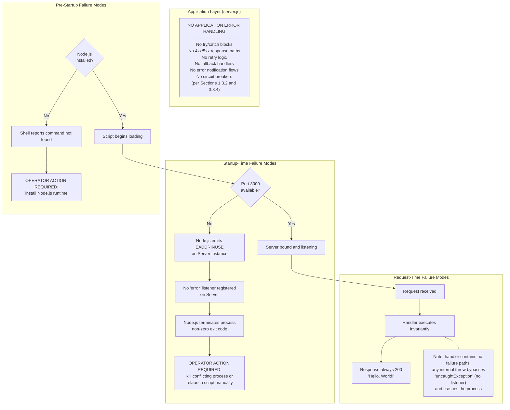

### 4.5.3 Retry, Fallback, and Notification Mechanisms

The Section 4 template requests documentation of retry mechanisms, fallback processes, error notification flows, and recovery procedures. The complete inventory:

| Mechanism Requested | Status in Repository | Reference |
|--------------------|----------------------|-----------|
| Retry mechanism | **Not present** | Section 1.3.2 |
| Fallback process | **Not present** | Section 1.3.2 |
| Error notification flow (email/Slack/PagerDuty) | **Not present** | Section 3.8.4 |
| Recovery procedure (automated) | **Not present** — manual operator restart required | Section 3.7.8 |
| Dead-letter queue | **Not present** | Section 3.5.1 |
| Circuit breaker | **Not present** | Section 3.8.3 |
| Exponential backoff | **Not present** | N/A |

The only "recovery procedure" available to operators is manual: kill any conflicting process bound to port 3000 (or terminate the stale `server.js` instance), then re-invoke `node server.js`. No automated supervision is provided (Section 3.8.2 confirms no process manager is configured).

---

## 4.6 STATE MANAGEMENT

### 4.6.1 Process Lifecycle State Transitions

Although application-level state is absent (Section 4.6.2), the Node.js process itself transitions through well-defined lifecycle states. These are the only state transitions present in the system:

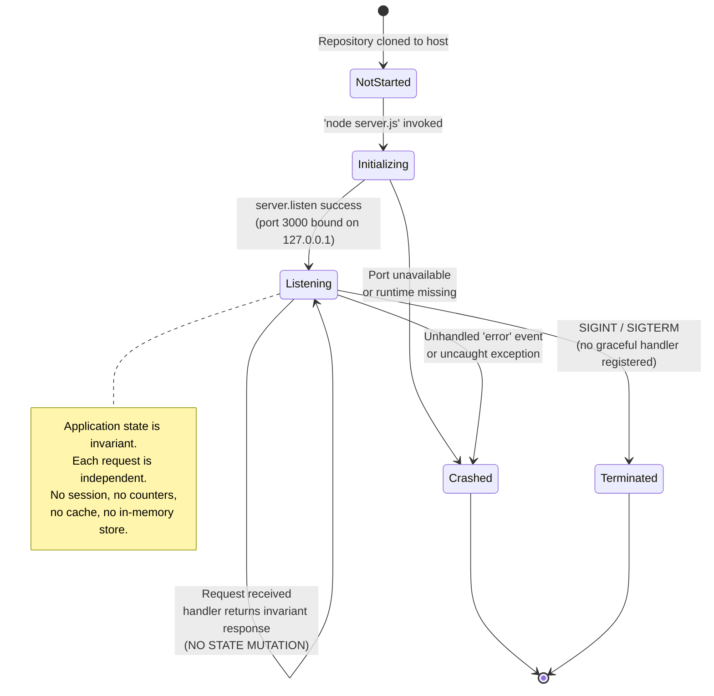

The self-transition on the `Listening` state during request handling is the critical observation: per F-001-RQ-006 (Section 2.2.1), serving a request **does not change the application's state**. The process simply remains in `Listening`.

### 4.6.2 Application-Level State Assessment

Per Section 1.2.2 (Core Technical Approach):

> "State: Fully stateless; no in-memory data structures, no file I/O, no persistence."

Per Section 1.3.2 (Unsupported Use Cases):

> "Stateful interactions: The server retains no state across requests."

There is no request-level state machine, no session state, no per-connection state beyond what the Node.js `http` module manages internally, no counters, no rate-limit accumulators, and no caches.

### 4.6.3 Data Persistence Points and Transaction Boundaries

| State Management Concern | Status | Reference |
|-------------------------|--------|-----------|
| In-memory data structures (Maps, Arrays, Sets used as state) | **None** | Section 3.6.2 |
| File system I/O (`fs` module) | **Not used** | Section 1.2.2 |
| Database persistence | **None** | Section 3.6 |
| Database transactions | **Not applicable** | Section 3.6 |
| Distributed transactions / two-phase commit | **Not applicable** | Section 3.5.1 |
| Session storage | **None** | Section 1.3.2 |
| Cookies / client-side state | **Not emitted** | F-001-RQ-003 (only `Content-Type` header set) |

The system has zero data persistence points. The only data that persists across process restarts is the source code itself on the local filesystem; no runtime-produced artifacts are written to disk.

### 4.6.4 Caching Requirements and Behavior

Per Section 3.6.2, no caching is implemented at any layer:

| Cache Layer | Status |
|-------------|--------|
| Application-level cache (e.g., Map-based LRU) | None |
| Distributed cache (Redis, Memcached) | None |
| HTTP response cache headers (`Cache-Control`, `ETag`) | Not set — only `Content-Type` header is emitted (F-001-RQ-003) |
| Reverse-proxy cache | Not present (no proxy in deployment topology per Section 3.7.8) |
| Module cache | Implicit Node.js `require` cache only — out of application control |

The absence of HTTP cache directives means any intermediary cache (browser, proxy) will apply its own default heuristics; this is a downstream concern, not a workflow defined by this codebase.

---

## 4.7 TIMING AND SLA CONSIDERATIONS

### 4.7.1 Defined SLAs, KPIs, and Performance Targets

Per Section 1.2.3 (Success Criteria) and Section 2.4.2 (Scalability):

> "No KPIs, SLAs, performance targets, throughput requirements, latency budgets, or availability objectives are defined in the repository. Any such metrics would need to be established externally and are out of scope for this specification."

Consequently, this section does **not** specify request latency targets, throughput floors, error-rate budgets, or availability percentages. Any such figures appearing in this specification would constitute fabrication contrary to Section 1.1.1's evidentiary principle.

### 4.7.2 Inherited Runtime Timing Defaults

The system inherits all timing behavior from Node.js defaults. Per Section 3.8.1:

> "Socket configuration | Defaults inherited from Node.js `http.Server`"

The following timing characteristics are **defaults**, not specifications of this system:

| Timing Aspect | Source of Default Value |
|---------------|-------------------------|
| Socket idle timeout | Node.js `http.Server.timeout` default |
| Keep-alive timeout | Node.js `http.Server.keepAliveTimeout` default |
| Headers timeout | Node.js `http.Server.headersTimeout` default |
| Request timeout | Node.js `http.Server.requestTimeout` default |
| Startup callback invocation | Fires when `listen()` succeeds; no timeout enforced |

These defaults vary by Node.js version and are not pinned by the repository. Operators relying on specific timing behavior must consult the Node.js documentation for the runtime version in use.

---

## 4.8 CROSS-REFERENCE SUMMARY

### 4.8.1 Workflow-to-Requirement Traceability

| Workflow Element | Controlling Requirement(s) | Section |
|------------------|----------------------------|---------|
| TCP listener bind | F-001-RQ-001 | 2.2.1 |
| HTTP 200 response | F-001-RQ-002 | 2.2.1 |
| `Content-Type: text/plain` header | F-001-RQ-003 | 2.2.1 |
| `Hello, World!\n` response body | F-001-RQ-004 | 2.2.1 |
| Startup banner to stdout | F-001-RQ-005 | 2.2.1 |
| Request-invariant handling | F-001-RQ-006 | 2.2.1 |
| Loopback reachability constraint | C-001 | 2.6 |
| Stateless operation | Section 1.2.2 Core Technical Approach | 1.2 |

### 4.8.2 Absent-Workflow-to-Source Traceability

The following items requested by the Section 4 template are documented as absent, with each absence traceable to the controlling specification section:

| Absent Workflow Element | Controlling Section |
|-------------------------|---------------------|
| Multiple endpoints / routing decisions | 1.3.2 |
| Request body parsing | 1.3.2 |
| Authentication flow | 1.3.2, 3.8.3 |
| Authorization checkpoints | 3.8.3 |
| Input validation rules | 2.2.1, 3.8.3 |
| Error handling paths | 1.3.2, 3.8.4 |
| Retry mechanisms | 1.3.2, 3.8.4 |
| Fallback processes | 1.3.2 |
| Error notification flows | 3.8.4 |
| Recovery procedures (automated) | 3.7.8, 3.8.2 |
| State transitions (application-level) | 1.2.2, 1.3.2 |
| Data persistence | 1.2.2, 3.6 |
| Caching | 3.6.2 |
| Transaction boundaries | 3.6 |
| Event processing flows | 1.3.2, 3.5.1 |
| Batch processing sequences | 1.3.2, 3.5.1 |
| SLA / timing constraints | 1.2.3, 2.4.2 |
| Regulatory compliance checks | 2.2.1 |
| Graceful shutdown | 3.7.8 |
| Health-check endpoint | 1.3.2 |

---

## 4.9 REFERENCES

### 4.9.1 Files Examined

- `server.js` — The 14-line sole functional artifact; provided the request/response workflow, the startup workflow, the constant definitions, and the empirical evidence that no error handling, validation, or state mutation logic exists.
- `package.json` — Confirmed package metadata, default `test` script, and `main: index.js` declaration (anomaly: file absent per Section 2.6.3); referenced for F-002 traceability.
- `package-lock.json` — Verified `lockfileVersion: 3` and zero-dependency invariant (F-003); confirms no third-party module workflows can exist.
- `README.md` — Provided the sole reference to "backprop integration" used in the Section 4.3 integration sequence, plus the "Do not touch!" change-management directive.
- `server - Copy.js` — Byte-identical duplicate; relevant only because executing both would produce a port-bind conflict (the failure mode depicted in Section 4.5.2).
- `industry.csv` — 44-line static vocabulary; confirmed not consumed by any code, hence no data ingestion workflow is documented.
- `LoginTest.java` — Non-compilable Java stub; confirmed not part of any runtime workflow.
- `.blitzyignore.txt` (and variants) — Empty placeholders; no workflow impact.

### 4.9.2 Repository Folder Examined

- Repository root `/` — Flat single-directory layout containing all 14 files; absence of `src/`, `node_modules/`, `dist/`, `build/`, `.github/`, `.husky/`, or any subdirectories was used as direct evidence that no build, test, or deployment workflows exist beyond the documented startup invocation.

### 4.9.3 Technical Specification Sections Cross-Referenced

- **Section 1.1 Executive Summary** — Evidentiary documentation principle (1.1.1) governing the absent-workflow methodology.
- **Section 1.2 System Overview** — Core technical approach (stateless, single-threaded); explicit absence of SLAs/KPIs.
- **Section 1.3 Scope** — Primary User Workflows (1.3.1) defining the single observable workflow; comprehensive Out-of-Scope enumeration (1.3.2) supporting absence documentation.
- **Section 2.1 FEATURE CATALOG** — Feature F-001 definition as the sole runtime feature.
- **Section 2.2 FUNCTIONAL REQUIREMENTS TABLES** — F-001-RQ-001 through F-001-RQ-006 with acceptance criteria and validation rules; basis for workflow-to-requirement traceability.
- **Section 2.3 FEATURE RELATIONSHIPS** — Confirmation that no shared workflow components exist between features.
- **Section 2.4 IMPLEMENTATION CONSIDERATIONS** — Security disposition (2.4.4) supporting the authorization-checkpoint absence rationale.
- **Section 2.6 ASSUMPTIONS, CONSTRAINTS, AND DOCUMENTED ANOMALIES** — Constraint C-001 (loopback binding) and anomalies affecting workflow assumptions.
- **Section 3.1 STACK OVERVIEW AND GUIDING PRINCIPLES** — Intentional minimalism (3.1.1) as the architectural principle justifying the section's minimal workflow inventory.
- **Section 3.3 FRAMEWORKS & LIBRARIES** — Confirmation that only the built-in `http` module participates in workflows.
- **Section 3.5 THIRD-PARTY SERVICES** — Backprop integration reference (3.5.2) and exhaustive enumeration of absent integrations (3.5.1).
- **Section 3.6 DATABASES & STORAGE** — Confirmation of zero persistence, caching, or transactional boundaries.
- **Section 3.7 DEVELOPMENT & DEPLOYMENT** — Runtime Deployment Model (3.7.8) basis for the startup-phase swim lane.
- **Section 3.8 RUNTIME ARCHITECTURE OBSERVATIONS** — Network/transport layer (3.8.1) timing defaults; concurrency model (3.8.2) confirming single-process execution; security stack (3.8.3) confirming authorization absence; logging and observability stack (3.8.4) confirming error-reporting absence.
- **Section 3.9 TECHNOLOGY STACK INTEGRATION SUMMARY** — Component Integration Map informing the swim lane actor inventory.

# 5. System Architecture

## 5.1 HIGH-LEVEL ARCHITECTURE

### 5.1.1 System Overview

#### Architectural Style and Rationale

The `hao-backprop-test` repository implements a **single-process, single-script monolithic HTTP server** built directly on the Node.js standard library. The architectural style is most accurately characterized as **"intentional minimalism"** — the system avoids frameworks, abstraction layers, build pipelines, and external dependencies as a deliberate design choice rather than an oversight. This is consistent with the project's self-described role as a "test project for backprop integration" (per `README.md`) and with the zero-dependency invariant established by feature F-003 (Section 2.1).

The rationale for this style, drawn from Sections 3.1.1 and 3.3.1, rests on four pillars:

- **Scope sufficiency**: The required behavior — return an invariant `Hello, World!\n` response on any request — is fully expressible with the built-in `http.createServer` API. A framework would add no functional value.
- **Determinism and reproducibility**: The handler is a pure function of a constant response, eliminating configuration drift and runtime variability.
- **Supply-chain neutrality**: With zero external npm packages, the attack surface and dependency-update burden are eliminated structurally. The lockfile v3 (`package-lock.json`) cryptographically anchors this property.
- **Loopback-only operation** (Constraint C-001): Network reachability is intentionally constrained to `127.0.0.1`, making the entire system a localhost test fixture.

#### Key Architectural Principles and Patterns

The system exhibits the following design properties:

- **Stateless handler**: Per F-001-RQ-006, the request handler ignores every request property (`method`, `url`, `headers`, `body`) and returns the same response unconditionally.
- **Synchronous request/response pattern**: A single HTTP/1.1 request maps to a single response; there is no asynchronous fan-out, no event publication, and no callback chaining beyond Node.js's intrinsic event-loop semantics.
- **Self-executing script lifecycle**: `server.js` has no exported interface and no deferred initialization. `server.listen()` is invoked unconditionally at module load, making the file simultaneously the entry point and the only functional module.
- **Hard-coded configuration**: The hostname, port, status code, content type, and response body are literal values in the source file. There is no configuration loader, no environment-variable parsing, and no command-line argument handling.
- **Defense by absence**: Security posture derives from the *absence* of attack surface (no inputs parsed, no secrets stored, no network exposure beyond loopback) rather than from defensive controls.

#### System Boundaries and Major Interfaces

The system boundary is a **single Node.js process** running `server.js` on a local host. Per Section 4.2.4, the actors that participate in workflows traversing or terminating at this boundary are:

| Actor / Surface | Boundary Position | Role |
|---|---|---|
| Operator / Developer | External to process | Initiates startup via shell |
| Backprop integration (and other local HTTP clients) | External to process, internal to host | Sends inbound HTTP requests |
| Node.js process | The system boundary itself | Hosts execution |
| Loopback network interface (127.0.0.1:3000) | OS-mediated edge | Carries TCP traffic |
| `stdout` console stream | OS-mediated edge | Receives startup banner |

The only externally named consumer is **Backprop** (referenced in `README.md`), and its interaction is **exclusively inbound** — there are no outbound calls from the repository (Section 3.5.1).

### 5.1.2 Core Components

The system consists of one functional source file and several manifests/inert artifacts. The table below enumerates the participating components with their primary responsibility, dependencies, and integration points.

| Component | Primary Responsibility | Key Dependencies |
|---|---|---|
| `server.js` (14 lines) | HTTP listener and request handler implementing F-001 | Node.js `http` built-in module |
| Node.js `http` module | HTTP/1.1 wire-protocol parsing, `createServer`/`listen` semantics | Node.js runtime |
| `package.json` | Package identity (`hello_world` v1.0.0, MIT, author `hxu`); declares — but does not use — `main: index.js` | npm v7+ tooling |
| `package-lock.json` | Lockfile v3 asserting zero transitive dependencies | npm v7+ tooling |
| `README.md` | Two-line project description, including the sole "backprop integration" reference and the "Do not touch!" directive | None |
| `industry.csv` (F-005) | 43-row inert industry vocabulary; **not referenced by any source code** | None |

Critical considerations for each component:

- **`server.js`** is the sole functional artifact. It both creates the server and immediately begins listening, with no exported interface and no idle initialization phase.
- **The `http` module** is the only import; the API surface used is restricted to `http.createServer`, the `IncomingMessage`/`ServerResponse` properties `res.statusCode` and `res.setHeader`, and the methods `res.end()` and `server.listen()`.
- **`package.json`** carries a documented anomaly: `main: index.js` references a file that does not exist in the repository (Section 2.6.3). Because `server.js` is invoked directly (not via `require('hello_world')`), this anomaly has no runtime effect.
- **`package-lock.json`** under lockfile schema version 3 implies an npm v7+ tooling requirement (Section 3.9.2) for consumers that wish to inspect or reproduce the install state.
- **`industry.csv`** is present as a static data file (F-005) but no code reads it; it is included for completeness only.

### 5.1.3 Data Flow Description

Data movement in the system is exhaustively described by three flows, all anchored at the loopback interface:

**Inbound request flow.** A TCP connection arrives on `127.0.0.1:3000`. The Node.js `http` module parses the HTTP/1.1 wire format into an `IncomingMessage` and a corresponding `ServerResponse`. The handler registered by `http.createServer` is invoked with these two objects. Per F-001-RQ-006, no properties of `IncomingMessage` are inspected — the handler proceeds directly to constructing the response.

**Outbound response flow.** The handler sets `res.statusCode = 200`, calls `res.setHeader('Content-Type', 'text/plain')`, and invokes `res.end('Hello, World!\n')`. The `http` module serializes these into HTTP/1.1 response bytes, which are written to the open TCP connection and delivered back to the client. The TCP connection is closed (implicit per `res.end()`).

**Startup banner flow.** Exactly once per process lifetime — after `server.listen()` succeeds — the listen callback emits a single `console.log` line (`Server running at http://127.0.0.1:3000/`) to `stdout`. No further log lines are ever produced by the application code.

**Integration patterns and protocols.** The only integration pattern present is **synchronous request/response over HTTP/1.1**. There are no asynchronous messaging patterns, no streaming, no chunked transfer initiated by the application, no WebSocket upgrades, and no Server-Sent Events.

**Data transformation points.** None at the application layer. The handler does not transform request data because it does not inspect request data. The only "transformation" is the serialization performed by Node.js's `http` module to format the canned status, header, and body into HTTP/1.1 wire format.

**Key data stores and caches.** **None.** As documented in Sections 3.6.2 and 4.6.3, the repository contains no databases, no caches, no message queues, no file I/O at runtime, and no in-memory state structures that persist across requests. The data-flow diagram in Section 4.3.2 explicitly annotates this absence.

### 5.1.4 External Integration Points

The system has exactly one named external integration target. All other integration categories are explicitly absent.

| System Name | Integration Type | Protocol / Format | SLA Requirements |
|---|---|---|---|
| Backprop integration | Inbound HTTP/1.1 (unauthenticated, schema-less, stateless) | HTTP/1.1 over TCP; `text/plain` body | **None defined** in the repository |
| Local HTTP clients (curl, browser, test harness) | Inbound HTTP/1.1 | HTTP/1.1 over TCP; `text/plain` body | **None defined** |
| `stdout` console stream | Outbound text emission (startup banner only) | Plain-text line via `console.log` | **None defined** |

Per Section 4.3.3, the following integration categories are **explicitly not implemented**, and no contracts or workflows for them exist anywhere in the repository:

- Outbound HTTP / REST API calls
- Message broker producers/consumers (Kafka, RabbitMQ, SQS)
- Webhooks (inbound or outbound)
- Event-driven / pub-sub flows
- Scheduled / cron / batch jobs
- File ingestion / ETL pipelines
- Database transactions / outbox patterns
- Identity provider federation (OAuth / SAML / OIDC)

The Backprop integration's contract is summarized in Section 4.3.1; key properties include trivial idempotency (because the response is invariant), no authentication, no schema validation, and no rate limiting.

---

## 5.2 COMPONENT DETAILS

### 5.2.1 The HTTP Server Component (`server.js`)

#### Purpose and Responsibilities

`server.js` is the sole functional component of the system. It satisfies feature F-001 (Section 2.1.1) by:

1. Binding a TCP listener on `127.0.0.1:3000` (F-001-RQ-001).
2. Registering a handler that returns HTTP `200 OK` with `Content-Type: text/plain` and body `Hello, World!\n` for every inbound request (F-001-RQ-002 through F-001-RQ-004).
3. Emitting a single startup banner line to `stdout` upon successful bind (F-001-RQ-005).
4. Guaranteeing request-invariance: the handler does not inspect `req.method`, `req.url`, `req.headers`, or `req.body` (F-001-RQ-006).

#### Technologies and Frameworks Used

| Aspect | Implementation |
|---|---|
| Language | JavaScript (ECMAScript) executed on Node.js |
| Module system | CommonJS (`require('http')`) |
| Imports | Built-in `http` module only — zero external packages |
| Framework | **None** — direct use of the Node.js standard library |
| Concurrency primitive | Standard Node.js single-threaded event loop |

The deliberate absence of a web framework (Express, Koa, Fastify, NestJS, Hapi, Restify, etc.) is documented in Section 3.3.3 and is consistent with the zero-dependency invariant of F-003.

#### Key Interfaces and APIs

The component exposes a single HTTP endpoint and consumes the following Node.js API surface:

| API Element | Use in `server.js` |
|---|---|
| `http.createServer(handler)` | Constructs a `Server` instance with the inline arrow-function handler |
| `server.listen(port, hostname, callback)` | Begins asynchronous TCP bind on the loopback interface |
| `res.statusCode` | Set to `200` unconditionally |
| `res.setHeader(name, value)` | Sets `Content-Type: text/plain` unconditionally |
| `res.end(body)` | Writes the 14-byte body and closes the response |
| `console.log(message)` | Emits the startup banner via the listen callback |

No internal HTTP routes, no exported functions, and no command-line interface are defined.

#### Data Persistence Requirements

**None.** As stated in Section 1.2.2 ("Core Technical Approach") and Section 4.6.2, the component is fully stateless: no in-memory data structures persist across requests, no file I/O occurs at runtime, and no database or cache is consulted or maintained.

#### Scaling Considerations

The scalability profile is deliberately bounded:

| Aspect | Consideration |
|---|---|
| Horizontal scalability | Not applicable — `127.0.0.1` binding prevents multi-host deployment |
| Vertical scalability | Inherits Node.js HTTP server defaults; no tuning hooks exposed |
| Clustering / worker threads | Not used (no `cluster` or `worker_threads` modules) |
| State coordination | Not required — fully stateless handler |
| Resource consumption | Minimal — no persistent storage, no caching, no background tasks |

These properties are evidence that the system is bound by design to **single-process, single-host operation**, consistent with its classification as a test fixture.

### 5.2.2 Node.js Built-in `http` Module (Runtime Dependency)

The `http` module is not application code, but it is a critical architectural participant. It provides:

- HTTP/1.1 wire-protocol parsing (request line, headers, body framing).
- TCP socket lifecycle management (accept, write, close).
- Default socket timeouts, keep-alive handling, and headers/request timeouts.
- The `IncomingMessage` and `ServerResponse` object model that `server.js` consumes.

Because no socket or timeout configuration is performed in application code (Section 3.8.1), all transport-layer behavior is inherited from the Node.js version installed on the host. The repository does not pin a Node.js version (no `engines` field in `package.json`), so timeout values vary with the runtime version.

### 5.2.3 Component Interaction Diagram

The diagram below shows runtime interactions among `server.js`, the Node.js `http` module, the loopback socket, the external Backprop integration, and `stdout`. Adapted from Section 3.9.1.

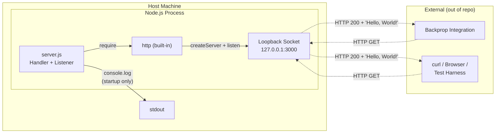

### 5.2.4 Process Lifecycle State Diagram

While application-level state is absent (Section 4.6.2), the Node.js process traverses well-defined lifecycle states. The self-transition on `Listening` is the critical observation: serving a request does **not** mutate application state.


### 5.2.5 Request/Response Sequence Diagram

The sequence below depicts a single end-to-end interaction between an HTTP client (Backprop or any local client) and the running server. Adapted from Section 4.3.1.


### 5.2.6 Startup Sequence Diagram

The startup sequence executes exactly once per process invocation. Adapted from Section 4.2.3.

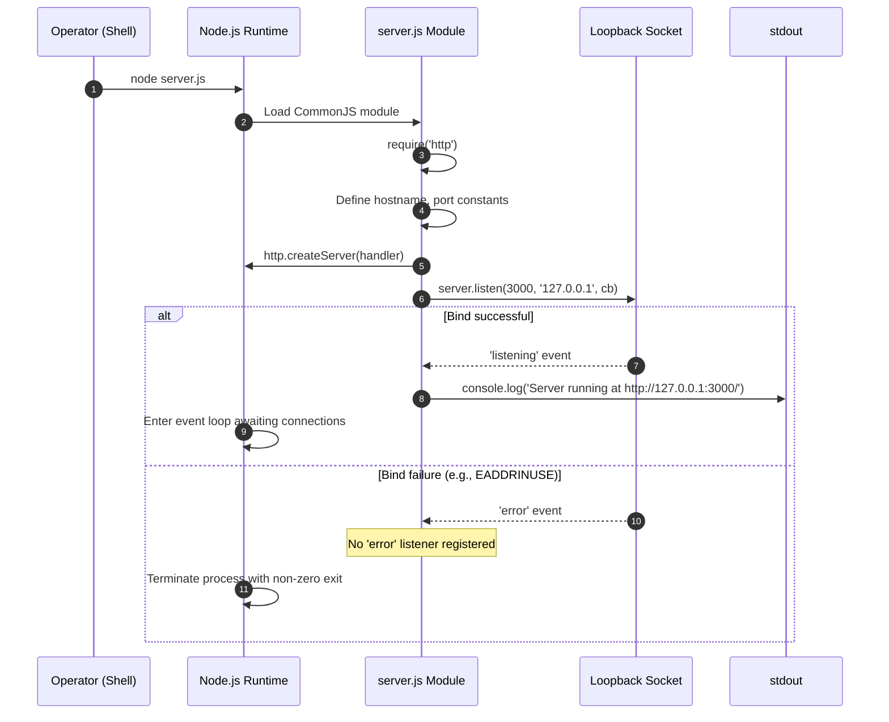

---

## 5.3 TECHNICAL DECISIONS

### 5.3.1 Architecture Style Decision

**Decision**: Use a single-process, single-file, monolithic Node.js script using only the built-in `http` module — no microservices, no layered framework architecture, no SOA, no serverless.

**Rationale** (per Section 3.3.1):

- **Scope sufficiency**: The required behavior is fully expressible with `http.createServer`; a framework would add no functional value.
- **Reproducibility**: A single file with no dependencies eliminates configuration drift and dependency-version variability.
- **Test-fixture role**: The repository is explicitly a test project for backprop integration (per `README.md`); production-grade architecture is therefore not warranted.

**Tradeoffs**:

| Benefit | Tradeoff |
|---|---|
| Trivial cognitive load (14-line file) | No routing, no separation of concerns |
| Zero supply-chain risk | No middleware ecosystem; any feature must be hand-coded |
| Instant startup | No graceful shutdown, no health checks |
| No build step | No transpilation, no static analysis, no minification |

### 5.3.2 Communication Pattern Choice

**Decision**: Synchronous HTTP request/response over HTTP/1.1 on a TCP loopback socket. No asynchronous messaging, no streaming beyond the implicit body write, no bidirectional channels.

**Rationale**:

- The contract with Backprop (per `README.md` and Section 3.5.2) is inbound HTTP only; no other channels are required.
- HTTP/1.1 is the default of Node.js's built-in `http` module and requires no additional code.
- Loopback transport eliminates network latency concerns that might otherwise motivate alternative patterns.

**Explicitly rejected alternatives** (per Section 4.3.3): outbound REST calls, webhooks, Kafka/RabbitMQ/SQS message brokers, pub-sub event flows, scheduled jobs, ETL pipelines.

### 5.3.3 Data Storage Solution Rationale

**Decision**: No data storage of any kind — no database, no in-memory cache, no file persistence, no session store.

**Rationale** (per Section 3.6.2):

- The handler is a pure function of a constant response; there is nothing to store.
- Statelessness eliminates the need for transaction management, connection pooling, schema migrations, and backup procedures.
- The absence of storage matches the test-fixture role of the repository.

The `industry.csv` file (F-005) exists in the repository as static data but is not consumed by any source code; its presence is documented as an inert artifact (Section 2.6.3), not as evidence of a data layer.

### 5.3.4 Caching Strategy Justification

**Decision**: No caching at any tier — no application-level cache, no distributed cache (Redis, Memcached), no HTTP response cache headers, no CDN integration, no reverse-proxy cache.

**Rationale** (per Section 4.6.4):

- The response body is a 14-byte literal; computing it costs less than a cache lookup.
- No backend computation, no database query, and no upstream API call is performed — there is no expensive operation to cache.
- HTTP cache headers (`Cache-Control`, `ETag`) are deliberately not set; the only response header is `Content-Type` (F-001-RQ-003).

The Node.js `require` module cache is implicitly used for the `http` module import, but this is a runtime-managed concern outside application control.

### 5.3.5 Security Mechanism Selection

**Decision**: Rely on **defense by absence** rather than active security controls. The system implements no authentication, no authorization, no input validation, no transport security (TLS), and no secret management.

**Rationale** (per Sections 2.4.4 and 3.8.3):

| Layer | Control Status | Justification |
|---|---|---|
| Network reachability | Mitigated by design | `127.0.0.1` binding prevents non-local access |
| Authentication | Not present | No identity / session / credential code is required for a loopback test fixture |
| Authorization | Not present | Handler does not differentiate callers; invariant response is safe for all |
| Input validation | Not applicable | Handler ignores all request inputs — there is no parsing surface to attack |
| Transport security | Not present | Plain HTTP is acceptable only because of loopback binding |
| Secret management | Not required | No secrets are stored or referenced |
| Supply-chain hardening | Achieved structurally | Zero external dependencies (F-003) |
| Output security | Constant response | No sensitive data is ever emitted |

Any change that broadens reachability (e.g., binding to `0.0.0.0` or exposing the port externally) would **invalidate this implicit security model** and require a comprehensive security review.

### 5.3.6 Decision Tree

The following decision tree summarizes the architectural decisions made during system design, including the deliberate decisions to **not** include various standard components.

```mermaid
flowchart TD
    Start([Architectural Decision Required])
    Start --> Q1{Is this a<br/>test fixture for<br/>backprop integration?}
    Q1 -->|Yes| Q2{Required behavior<br/>expressible with<br/>Node.js built-in http?}
    Q2 -->|Yes| D1[Use built-in http module<br/>No framework]
    D1 --> Q3{External clients<br/>need access?}
    Q3 -->|No - loopback only| D2[Bind to 127.0.0.1<br/>Hard-code port 3000]
    D2 --> Q4{Need to differentiate<br/>requests?}
    Q4 -->|No - invariant response| D3[Ignore all req properties<br/>Return constant response]
    D3 --> Q5{Need persistent state?}
    Q5 -->|No| D4[No DB, no cache,<br/>no file I/O]
    D4 --> Q6{Need authentication?}
    Q6 -->|No - loopback only| D5[No auth, no TLS,<br/>defense by absence]
    D5 --> Q7{Need observability?}
    Q7 -->|Minimal| D6[Single console.log<br/>at startup only]
    D6 --> Q8{Need automated<br/>error recovery?}
    Q8 -->|No - manual restart OK| D7[No try/catch,<br/>no supervisor,<br/>no retry logic]
    D7 --> End([Single-file 14-line<br/>zero-dependency script])
```

### 5.3.7 Architecture Decision Records (ADRs)

The following ADR-style records capture the most consequential decisions in a structured format.

#### ADR-001: Use Node.js Built-in `http` Module Instead of a Web Framework

| Field | Value |
|---|---|
| Status | Accepted |
| Context | A trivial invariant-response HTTP endpoint is required as a test fixture |
| Decision | Use `http.createServer` directly; do not adopt Express, Koa, Fastify, or any other framework |
| Consequences | Zero external dependencies; no middleware ecosystem; no routing abstraction; cognitive overhead is near-zero |

#### ADR-002: Hard-Code Network Configuration

| Field | Value |
|---|---|
| Status | Accepted (Constraint C-002) |
| Context | The fixture must always be reachable at a predictable address |
| Decision | Hard-code `'127.0.0.1'` and `3000` as literal values in `server.js` |
| Consequences | No environment variables, no config files, no CLI argument parsing; trivial reproducibility but no deployment flexibility |

#### ADR-003: Bind to Loopback Interface Only

| Field | Value |
|---|---|
| Status | Accepted (Constraint C-001) |
| Context | The fixture must not be reachable from off-host actors |
| Decision | Bind the listener to `127.0.0.1` exclusively |
| Consequences | Acts as the de facto security perimeter; eliminates the need for TLS, authentication, or authorization; precludes horizontal scaling |

#### ADR-004: Stateless Invariant-Response Handler

| Field | Value |
|---|---|
| Status | Accepted (F-001-RQ-006) |
| Context | The handler must serve the same response for every request shape |
| Decision | Ignore all `req` properties; respond with constant `200 OK / Hello, World!\n` |
| Consequences | Trivial idempotency; no input-validation surface; no routing; no data persistence |

#### ADR-005: No Application-Level Error Handling

| Field | Value |
|---|---|
| Status | Accepted |
| Context | The handler is a pure function with no externally-induced failure modes |
| Decision | Omit `try/catch` blocks, `'error'` listeners, `'uncaughtException'` handlers, retry logic, and circuit breakers |
| Consequences | Any unexpected exception crashes the process; recovery is entirely operator-driven |

#### ADR-006: Zero External Dependencies

| Field | Value |
|---|---|
| Status | Accepted (F-003) |
| Context | Supply-chain risk and dependency-update burden are non-trivial; the required behavior does not need third-party code |
| Decision | Declare no `dependencies` and no `devDependencies` in `package.json`; cryptographically anchor this with `package-lock.json` v3 |
| Consequences | No supply-chain attack surface; no transitive vulnerabilities; no upgrade treadmill; consumers need npm v7+ for lockfile compatibility |

---

## 5.4 CROSS-CUTTING CONCERNS

### 5.4.1 Monitoring and Observability Approach

The monitoring and observability footprint is **deliberately minimal**, consistent with the test-fixture role of the system. Per Section 3.8.4:

| Concern | Implementation | Notes |
|---|---|---|
| Application logging | Single `console.log` at startup | Plain-text template literal to `stdout` |
| Structured logging | **None** | No Winston, Bunyan, or Pino |
| Metrics | **None** | No Prometheus, StatsD, or OpenTelemetry metrics |
| Distributed tracing | **None** | No OpenTelemetry, Jaeger, or Zipkin |
| APM | **None** | No Datadog, New Relic, AppDynamics, Dynatrace |
| Error tracking | **None** | No Sentry, Rollbar, Bugsnag |
| Health-check endpoint | **None** | The server has only one implicit "endpoint" — the invariant response |

The observable signal available to operators is restricted to:

1. The single startup banner line (`Server running at http://127.0.0.1:3000/`).
2. Process existence (visible via `ps`, `top`, or platform-equivalent).
3. The HTTP response itself (used for liveness verification by clients).

### 5.4.2 Logging and Tracing Strategy

The strategy is summarized as **"emit nothing during steady state"**. The only log statement in the entire application is the startup banner. There is:

- No request-level logging (no access log, no audit log).
- No error logging (no try/catch blocks exist to log from).
- No periodic heartbeat or status emission.
- No correlation IDs, trace IDs, or span IDs.
- No log rotation, log shipping, or log aggregation configuration.

Operators wishing to observe traffic must use external tools (`tcpdump`, `Wireshark`, `curl -v`) outside the scope of this repository. Any future enhancement that adds logging must consider that doing so introduces a new dependency surface (whether on a library or on `stdout` buffering behavior) and a new failure mode (log-write failures).

### 5.4.3 Error Handling Patterns

The error-handling profile is the most striking architectural omission. Per Section 4.5:

- **No `try` / `catch` blocks** exist in `server.js`.
- **No 4xx or 5xx response paths** are implemented; the handler cannot, by construction, emit any status other than 200.
- **No retry logic, no fallback handlers, no circuit breakers, no error notification flows.**
- **No `'uncaughtException'` listener** is registered on the process.
- **No `'error'` listener** is registered on the `Server` instance returned by `http.createServer`.

Consequently, the failure modes that *do* exist propagate directly to process termination:

| Failure Class | Trigger | System Response |
|---|---|---|
| Pre-startup | Node.js runtime missing | Shell reports "command not found"; operator must install Node.js |
| Startup | Port 3000 unavailable (EADDRINUSE) | Server emits `'error'`; no listener; process terminates non-zero |
| Request-time | Any internal throw in the handler | No `'uncaughtException'` listener; process crashes |
| Shutdown | SIGINT / SIGTERM | No graceful handler; process terminates immediately |

The error-handling flow below depicts these modes and the deliberate absence of application-layer recovery. Adapted from Section 4.5.2.

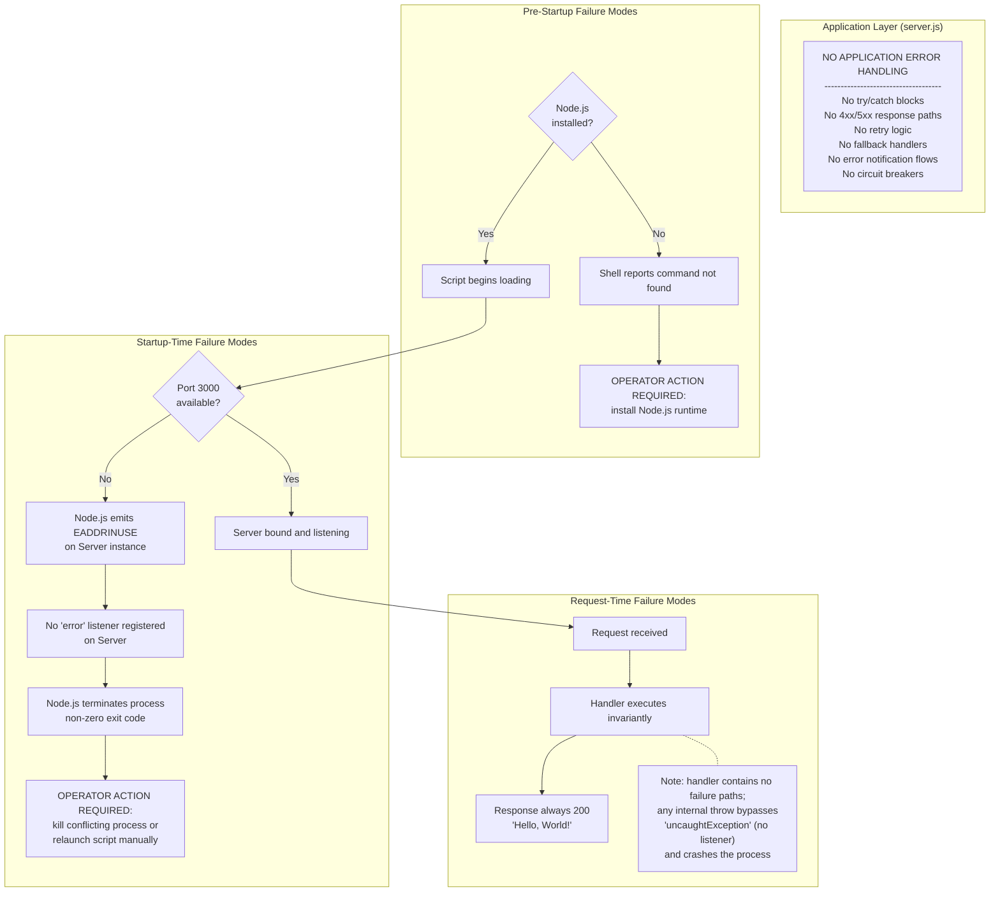

### 5.4.4 Authentication and Authorization Framework

**No authentication or authorization framework is present.** Per Sections 3.5.3, 3.8.3, and 4.4.3:

- No OAuth2, OIDC, or SAML client libraries.
- No Auth0, Okta, or AWS Cognito SDKs.
- No JWT signing or verification.
- No session management (no cookies, no server-side session store).
- No API key validation.
- No role-based or attribute-based access control.

The only implicit "authorization checkpoint" is loopback reachability, which is enforced by the operating system's network stack rather than by application code. Any caller able to reach `127.0.0.1:3000` is unconditionally served the same response. This posture is acceptable **only** in the context of the test-fixture role and the loopback-only binding (Constraint C-001).

### 5.4.5 Performance Requirements and SLAs

Per Sections 1.2.3, 2.4.2, and 4.7.1: **No KPIs, SLAs, performance targets, throughput requirements, latency budgets, or availability objectives are defined in the repository.** Any such metrics would need to be established externally by the consuming "backprop" integration and are out of scope for this specification.

The system inherits the following defaults from Node.js (uncodified by the repository because no Node.js version is pinned in `package.json`):

| Timeout / Limit | Source | Repository Configuration |
|---|---|---|
| Socket idle timeout | `http.Server.timeout` default | Not overridden |
| Keep-alive timeout | `http.Server.keepAliveTimeout` default | Not overridden |
| Headers timeout | `http.Server.headersTimeout` default | Not overridden |
| Request timeout | `http.Server.requestTimeout` default | Not overridden |
| Maximum concurrent connections | Node.js / OS defaults | Not overridden |

Operators requiring deterministic performance characteristics must pin a Node.js version externally and validate timeouts independently.

### 5.4.6 Disaster Recovery Procedures

**No automated recovery procedures exist.** Per Sections 4.5.3 and 3.7.8, recovery is entirely manual:

| Scenario | Recovery Procedure |
|---|---|
| Port 3000 already in use | Operator must identify and terminate the conflicting process, then re-invoke `node server.js` |
| Stale `server.js` instance | Operator must terminate the existing process, then re-invoke `node server.js` |
| Process crash from uncaught exception | Operator must re-invoke `node server.js` |
| Host machine reboot | Operator must re-invoke `node server.js` after boot |

There is no process supervisor (no PM2, no systemd unit file, no Docker restart policy, no Kubernetes pod definition), no automatic restart policy, and no backup/restore procedure (no state exists to back up). The "Do not touch!" directive in `README.md` further implies that the operational expectation is a single, manually-managed instance rather than a resilient deployment.

### 5.4.7 Architectural Assumptions

For completeness, the architectural assumptions that underpin Section 5 are restated here from Section 2.6.1:

- **A-001**: A compatible Node.js runtime is available on the host.
- **A-002**: TCP port 3000 is available on the loopback interface at startup.
- **A-003**: The operating environment allows binding to `127.0.0.1`.
- **A-004**: npm v7+ tooling is available for consumers that need to inspect the lockfile.
- **A-005**: The consumer (Backprop) is responsible for any quality attributes (performance, observability, security) beyond what is implemented.

And the constraints from Section 2.6.2:

- **C-001**: Network reachability restricted to loopback.
- **C-002**: Port and hostname are hard-coded.
- **C-003**: Response is invariant for all request shapes.
- **C-004**: No automated test suite exists.
- **C-005**: MIT license governs use.
- **C-006**: No formal requirements documents; specification is reverse-engineered from source.

---

## 5.5 References

#### Files Examined

- `server.js` — Sole functional source file (14 lines); evidence for the entire HTTP server component (Section 5.2.1), the request/response flow (Section 5.1.3), the startup workflow (Section 5.2.6), and the absence of application-level error handling (Section 5.4.3)
- `package.json` — npm manifest providing package identity, declared (but absent) `main: index.js`, default failing `test` script, and verified absence of `dependencies`/`devDependencies` blocks (supports Sections 5.1.2 and ADR-006)
- `package-lock.json` — Lockfile v3 confirming the zero-dependency invariant cryptographically (supports ADR-006 and Section 5.1.2)
- `README.md` — Two-line documentation; sole source of the "backprop integration" reference and the "Do not touch!" directive (supports Sections 5.1.1, 5.1.4, and 5.4.6)
- `industry.csv` — Inert 43-row CSV data file referenced as F-005; included to document its non-consumption (Section 5.1.2)
- Repository root (depth 0) — Verified the flat single-directory layout and the absence of `src/`, `dist/`, `build/`, `.github/`, and all CI/CD/IaC subdirectories (supports Section 5.3.1)

#### Technical Specification Sections Referenced

- **Section 1.2 (System Overview)** — Project context, system context diagram, core technical approach, and statement that no KPIs/SLAs are defined
- **Section 1.3 (Scope)** — Authoritative implementation boundaries and out-of-scope enumeration
- **Section 2.1 (Feature Catalog)** — F-001 through F-005 feature definitions
- **Section 2.2 (Functional Requirements Tables)** — F-001-RQ-001 through F-001-RQ-006 acceptance criteria
- **Section 2.4 (Implementation Considerations)** — Technical constraints, performance envelope, scalability bounds, security implications
- **Section 2.6 (Assumptions, Constraints, and Documented Anomalies)** — A-001 through A-005, C-001 through C-006
- **Section 3.1 (Stack Overview and Guiding Principles)** — Intentional minimalism rationale
- **Section 3.3 (Frameworks & Libraries)** — Framework absence justification and `http` module usage
- **Section 3.5 (Third-Party Services)** — Backprop integration reference and absence of all other third-party categories
- **Section 3.6 (Databases & Storage)** — Absence of databases, caches, and persistent storage
- **Section 3.7 (Development & Deployment)** — Deployment model, absence of supervisors, manual recovery
- **Section 3.8 (Runtime Architecture Observations)** — Network/transport, concurrency, security stack, observability stack
- **Section 3.9 (Technology Stack Integration Summary)** — Component integration map (basis for Section 5.2.3 diagram)
- **Section 4.2 (System Workflows)** — Swim-lane workflow, request/response cycle, startup flowchart, actor inventory
- **Section 4.3 (Integration Workflows)** — Backprop sequence diagram, data flow diagram, absent integration patterns
- **Section 4.5 (Error Handling and Recovery)** — System-level failure modes, absence of application-level recovery (basis for Section 5.4.3 diagram)
- **Section 4.6 (State Management)** — Process lifecycle state diagram (basis for Section 5.2.4 diagram), application state absence, persistence absence, caching absence
- **Section 4.7 (Timing and SLA Considerations)** — Explicit absence of SLAs and inherited Node.js defaults

# 6. SYSTEM COMPONENTS DESIGN

## 6.1 Core Services Architecture

### 6.1.1 Applicability Assessment

**Core Services Architecture is not applicable for this system.**

The `hao-backprop-test` repository implements a deliberately minimal, single-process, single-file monolithic Node.js HTTP server consisting of 14 lines of code in `server.js`. The repository does not employ — and by deliberate architectural decision does not require — microservices, distributed services, service-oriented architecture (SOA), serverless functions, or any form of inter-service decomposition. Every category of concern enumerated in the Core Services Architecture template (service boundaries, inter-service communication, service discovery, load balancing, circuit breakers, retry/fallback, auto-scaling, resource allocation, fault tolerance, disaster recovery, data redundancy, failover, and service degradation) is **explicitly absent** from the codebase.

This absence is not an oversight; it is a codified architectural decision documented in Architecture Decision Record ADR-001 (Section 5.3.7), which states the explicit design choice to "Use a single-process, single-file, monolithic Node.js script using only the built-in `http` module — no microservices, no layered framework architecture, no SOA, no serverless." The decision is consistent with the test-fixture role of the repository declared in `README.md` ("test project for backprop integration").

#### 6.1.1.1 Summary of Inapplicability

| Architectural Concern Category | Status in This System | Authoritative Source |
|---|---|---|
| Microservices / SOA / distributed services | Not present (by design) | ADR-001, Section 5.3.1 |
| Service boundaries and distinct service components | Not present (one component only: `server.js`) | Section 5.2.1 |
| Inter-service communication patterns | Not present (no second service exists) | Section 5.3.2 |
| Service discovery / registry | Not present (hard-coded loopback) | ADR-002, Section 5.3.7 |
| Load balancing | Not present (single instance, loopback only) | Section 5.2.1 |
| Circuit breakers, retry, fallback | Not present (no error handling at all) | Section 4.5.3 |
| Horizontal scaling / auto-scaling | Not applicable (loopback binding precludes multi-host) | Section 2.4.3 |
| Disaster recovery / failover | Not present (manual operator restart only) | Section 5.4.6 |
| Data redundancy | Not applicable (fully stateless, no data) | Section 5.3.3 |
| Service degradation policies | Not present (invariant response only) | Section 5.4.3 |

#### 6.1.1.2 Definitional Test: Why "Service" Decomposition Does Not Apply

A "service" in the architectural sense implies an independently deployable unit with a defined external interface, its own lifecycle, and the capability to interact with peer services across a network or message bus. Per Section 5.2.1, the system contains exactly **one functional artifact**, `server.js`, which is "the sole functional component of the system." There is no second component with which `server.js` could form a service-to-service relationship. The Node.js `http` built-in module is a runtime dependency, not a service. The remaining repository artifacts — `package.json`, `package-lock.json`, `README.md`, and `industry.csv` — are manifests, documentation, or inert data files that do not execute, expose endpoints, or participate in runtime communication.

---

### 6.1.2 Architectural Rationale for Inapplicability

This subsection explains the specific architectural decisions and constraints that make the Core Services Architecture template inapplicable. Each rationale is grounded in evidence from the repository and existing Technical Specification sections.

#### 6.1.2.1 Monolithic Single-Process Design (ADR-001)

Per Section 5.1.1, the architectural style is most accurately characterized as **"intentional minimalism"** — the system avoids frameworks, abstraction layers, build pipelines, and external dependencies as a deliberate design choice rather than an oversight. The rationale rests on four pillars (Section 5.1.1):

| Pillar | Implication for Service Decomposition |
|---|---|
| Scope sufficiency | The required behavior is fully expressible with `http.createServer`; a framework — let alone a service mesh — would add no functional value |
| Determinism and reproducibility | A single file with no dependencies eliminates configuration drift; multi-service deployment would reintroduce drift |
| Supply-chain neutrality | Zero external npm packages; a service mesh, message broker, or service registry would shatter this invariant |
| Loopback-only operation | Network reachability intentionally constrained to `127.0.0.1`; precludes the multi-host topology that services would require |

#### 6.1.2.2 Zero-Dependency Constraint (ADR-006, F-003)

Per ADR-006 (Section 5.3.7), the repository declares no `dependencies` and no `devDependencies` in `package.json`; `package-lock.json` v3 cryptographically anchors this property. The consequence is that the project deliberately excludes every category of library that would be required to construct a services architecture, including but not limited to:

- Service-discovery clients (Consul, etcd, Eureka, ZooKeeper SDKs)
- HTTP frameworks supporting middleware composition (Express, Koa, Fastify, NestJS, Hapi, Restify)
- Reverse-proxy or load-balancer integrations (NGINX configs, HAProxy, Envoy)
- Circuit-breaker libraries (`opossum`, `hystrix-js`)
- Message-broker clients (Kafka, RabbitMQ, NATS, SQS, Redis Pub/Sub)
- Retry/backoff libraries (`async-retry`, `p-retry`)
- Distributed tracing SDKs (OpenTelemetry, Jaeger, Zipkin)
- Container/orchestration manifests (Docker, Kubernetes, Helm)

Adding any of these would violate F-003 and ADR-006. As a result, the *toolchain* required to implement Core Services Architecture is structurally absent from the repository.

#### 6.1.2.3 Loopback-Only Network Topology (ADR-003, C-001)

Per Constraint C-001 (Section 2.6.2) and ADR-003 (Section 5.3.7), the listener is bound exclusively to `127.0.0.1`. Per Section 2.4.3, this binding **"prevents multi-host deployment"** and renders horizontal scalability "not applicable." A multi-service or multi-instance deployment is, by definition, a multi-host or multi-process arrangement requiring inter-process or inter-host networking. The loopback constraint short-circuits this entire category of designs.

#### 6.1.2.4 Stateless Invariant-Response Handler (ADR-004, F-001-RQ-006)

Per ADR-004 (Section 5.3.7), the handler ignores `req.method`, `req.url`, `req.headers`, and `req.body` and returns the constant response `200 OK / Hello, World!\n` for every inbound request. Service decomposition is typically motivated by separation of concerns — distinct services own distinct domains, datasets, or workflows. A handler whose behavior is a single invariant response has no domain to decompose, no dataset to partition, and no workflow to orchestrate. The motivation for services is therefore absent in addition to the mechanism being precluded.

#### 6.1.2.5 Test-Fixture Role

Per `README.md`, the repository is "test project for backprop integration. Do not touch!" Per Section 5.3.1, the test-fixture role explicitly rules out production-grade architecture: "production-grade architecture is therefore not warranted." This contextual factor is decisive: even if all the technical preconditions for service decomposition were satisfied, the project's purpose does not justify the operational complexity that core services architecture entails.

---

### 6.1.3 Service Components — Detailed Inapplicability Inventory

This subsection addresses each item under the SERVICE COMPONENTS heading of the template, documenting its absence with traceable evidence.

#### 6.1.3.1 Service Boundaries and Responsibilities

There is exactly one runtime component in the system. Per Section 5.2.1, `server.js` is "the sole functional component of the system." It has no exported interface (no `module.exports`), no internal sub-modules, and no second process. The component inventory from Section 5.1.2 enumerates the entire artifact set:

| Component | Role | Distinct Service? |
|---|---|---|
| `server.js` (14 lines) | HTTP listener and request handler | No — the only runtime component |
| Node.js `http` built-in module | Runtime dependency for wire-protocol parsing | No — runtime library |
| `package.json` | Package manifest | No — manifest file |
| `package-lock.json` | Lockfile (v3, asserts zero dependencies) | No — manifest file |
| `README.md` | Two-line documentation | No — documentation |
| `industry.csv` | Static CSV data; **unreferenced by any source code** | No — inert artifact (F-005) |

No further decomposition is possible because no further functional components exist.

#### 6.1.3.2 Inter-Service Communication Patterns

Per Section 5.3.2, the only communication pattern present is **synchronous HTTP request/response over HTTP/1.1 on a TCP loopback socket** — and this is between an external client and the single server, not between two services internal to the system. Per Section 5.1.4 and Section 4.3.3, the following inter-service communication categories are explicitly not implemented and have no contracts or workflows anywhere in the repository:

| Communication Category | Status |
|---|---|
| Outbound HTTP / REST API calls | Not implemented |
| Message broker producers/consumers (Kafka, RabbitMQ, SQS) | Not implemented |
| Webhooks (inbound or outbound) | Not implemented |
| Event-driven / pub-sub flows | Not implemented |
| Scheduled / cron / batch jobs | Not implemented |
| File ingestion / ETL pipelines | Not implemented |
| Database transactions / outbox patterns | Not implemented |
| gRPC, GraphQL, WebSocket, Server-Sent Events | Not implemented |

#### 6.1.3.3 Service Discovery Mechanisms

Per ADR-002 (Section 5.3.7), `'127.0.0.1'` and `3000` are hard-coded as literal values in `server.js`. There is no DNS-based discovery, no service registry, no Consul/etcd/Eureka client, and no Kubernetes service objects (no manifests exist per Section 3.7). The fixture's address is reachable only through prior knowledge of the loopback host and port.

#### 6.1.3.4 Load Balancing Strategy

Per Section 2.4.3, horizontal scalability is "not applicable — loopback-only binding prevents multi-host deployment." A load balancer requires multiple backend instances; the system supports exactly one. No reverse proxy (NGINX, HAProxy, Envoy), no cloud load balancer (AWS ELB/ALB/NLB, GCP LB, Azure LB), and no client-side balancer is present. The Node.js process is not run under a `cluster` module configuration (Section 5.2.1), so even intra-host worker-balancing is absent.

#### 6.1.3.5 Circuit Breaker Patterns

Per Section 4.5.3, circuit breaker = **"Not present"** (referenced to Section 3.8.3). Per ADR-005 (Section 5.3.7), the system deliberately omits `try/catch` blocks, `'error'` listeners, `'uncaughtException'` handlers, retry logic, and circuit breakers. No library (`opossum`, `hystrix-js`, `cockatiel`) is declared in `package.json` because no dependencies are declared at all.

#### 6.1.3.6 Retry and Fallback Mechanisms

Per Section 4.5.3, the complete inventory:

| Mechanism Requested by Template | Status in Repository |
|---|---|
| Retry mechanism | Not present |
| Fallback process | Not present |
| Error notification flow (email / Slack / PagerDuty) | Not present |
| Recovery procedure (automated) | Not present — manual operator restart required |
| Dead-letter queue | Not present |
| Circuit breaker | Not present |
| Exponential backoff | Not present |

Per Section 5.4.3, the handler "cannot, by construction, emit any status other than 200" — there is no error path that retry or fallback logic could attach to.

---

### 6.1.4 Scalability Design — Detailed Inapplicability Inventory

#### 6.1.4.1 Horizontal/Vertical Scaling Approach

Per Section 2.4.3, the scalability profile is as follows:

| Aspect | Status |
|---|---|
| Concurrency model | Single-threaded Node.js event loop |
| Horizontal scalability | Not applicable — loopback-only binding prevents multi-host deployment |
| Vertical scalability | Inherits Node.js HTTP server limits; no tuning hooks exposed |
| State coordination | Fully stateless — no shared state to coordinate across instances |

The system architecture is "bound by design to single-process, single-host operation" (Section 5.2.1), which forecloses both horizontal (additional hosts/instances) and meaningful vertical (tuned single-host) scaling strategies.

#### 6.1.4.2 Auto-Scaling Triggers and Rules

Auto-scaling presupposes (a) a cloud platform integration to issue scaling decisions and (b) a load balancer to route traffic to scaled instances. Both preconditions are unmet:

| Auto-Scaling Prerequisite | Status |
|---|---|
| Cloud platform SDK (AWS/Azure/GCP) | Not declared in `package.json` (zero dependencies) |
| Kubernetes Horizontal Pod Autoscaler manifest | Not present (no manifests exist per Section 3.7) |
| Container image / Dockerfile | Not present (Section 3.7) |
| Load balancer for traffic distribution | Not configured (Section 6.1.3.4) |
| Metrics endpoint for scaling decisions | Not present (no metrics emitted per Section 5.4.1) |

No CPU/memory thresholds, request-rate triggers, or queue-depth signals exist to drive scaling decisions. The deployment model is "single, manually-managed instance" (Section 5.4.6).

#### 6.1.4.3 Resource Allocation Strategy

Per ADR-002 (Section 5.3.7) and Section 3.7.6 references in Section 2.4, all configuration values are hard-coded literals in `server.js`; there is no `process.env` parsing, no `.env` file, no `config.json`, and no command-line argument handling. CPU and memory limits are not defined by the application; the process inherits the operating system's default resource envelope. There is no container manifest or systemd unit that would otherwise impose a resource quota.

#### 6.1.4.4 Performance Optimization Techniques

Per Section 5.4.5, **no KPIs, SLAs, performance targets, throughput requirements, latency budgets, or availability objectives are defined in the repository.** Per Section 2.4.2, the implementation "inherits the performance envelope of the Node.js HTTP server with no tuning, no clustering, no worker threads, and no custom socket configuration." Specifically:

| Optimization Technique | Status |
|---|---|
| Caching (application / HTTP / CDN) | Not present (Section 5.3.4) |
| Connection pooling | Not present (no outbound calls) |
| Lazy initialization | Not applicable (no initialization beyond `listen`) |
| Response compression | Not present (Section 1.3.2) |
| HTTP keep-alive tuning | Defaults inherited from Node.js |
| Worker threads / cluster module | Not used (Section 5.2.1) |

#### 6.1.4.5 Capacity Planning Guidelines

Per Section 1.2.3 (referenced via Section 2.4.2 and Section 5.4.5), no capacity targets are stated. Per Section 5.4.5, "any such metrics would need to be established externally by the consuming 'backprop' integration and are out of scope for this specification." There is no synthetic-load harness, no benchmark suite, and no documented baseline throughput. Capacity planning therefore reduces to the qualitative observation that a single loopback Node.js process can handle the de minimis traffic of a local test fixture.

---

### 6.1.5 Resilience Patterns — Detailed Inapplicability Inventory

#### 6.1.5.1 Fault Tolerance Mechanisms

Per Section 5.4.3 and Section 4.5.3, the error-handling profile is the most striking architectural omission. The complete inventory:

| Fault-Tolerance Element | Status |
|---|---|
| `try` / `catch` blocks in `server.js` | None — verified by inspection of the 14-line source |
| `'error'` listener on the `Server` instance | Not registered |
| `'uncaughtException'` listener on the process | Not registered |
| 4xx / 5xx response paths | Not implemented — handler cannot, by construction, emit a non-200 status |
| Bulkhead isolation | Not applicable — only one logical "compartment" exists |
| Timeout overrides | Not configured — Node.js defaults inherited |

Per ADR-005 (Section 5.3.7), "Any unexpected exception crashes the process; recovery is entirely operator-driven."

#### 6.1.5.2 Disaster Recovery Procedures

Per Section 5.4.6, **"No automated recovery procedures exist."** Recovery is entirely manual:

| Failure Scenario | Recovery Procedure (Manual) |
|---|---|
| Port 3000 already in use (EADDRINUSE) | Operator identifies and terminates the conflicting process, then re-invokes `node server.js` |
| Stale `server.js` instance | Operator terminates the existing process, then re-invokes `node server.js` |
| Process crash from uncaught exception | Operator re-invokes `node server.js` |
| Host machine reboot | Operator re-invokes `node server.js` after boot |

Per Section 5.4.6, there is no process supervisor (no PM2, no systemd unit, no Docker restart policy, no Kubernetes pod definition), no automatic restart policy, and no backup/restore procedure (no state exists to back up).

#### 6.1.5.3 Data Redundancy Approach

Per Section 5.3.3, the repository implements "no data storage of any kind — no database, no in-memory cache, no file persistence, no session store." Per Section 5.2.1, the component is "fully stateless: no in-memory data structures persist across requests, no file I/O occurs at runtime, and no database or cache is consulted or maintained." With no data, the concept of data redundancy (replication, sharding, mirroring, backups, RAID, multi-region replicas) is not applicable. The `industry.csv` file is present but, per Section 5.3.3, "is not consumed by any source code"; it is an inert artifact, not a data store requiring redundancy.

#### 6.1.5.4 Failover Configurations

Failover requires at minimum a primary instance and a standby instance with detection and switchover machinery (heartbeat, leader election, virtual IP, DNS swing, etc.). The system is a single process on a single host bound to the loopback interface; no standby, no replica, no leader election, no HA pair, and no virtual IP exist. Per Section 5.4.6, "the operational expectation is a single, manually-managed instance rather than a resilient deployment."

#### 6.1.5.5 Service Degradation Policies

Per Section 5.4.3, the handler "cannot, by construction, emit any status other than 200." Per F-001-RQ-006 (Section 5.2.1), the handler returns the identical response regardless of system state, request shape, or load conditions. Consequently:

| Degradation Pattern | Status |
|---|---|
| Feature flags | Not present |
| Graceful degradation (reduced functionality under load) | Not applicable — only one functional path exists |
| Load-shedding (rejecting requests above a threshold) | Not implemented |
| Rate-limiting accumulator | Not present (Section 4.6 — "no rate-limit accumulators") |
| Read-only / maintenance mode | Not applicable — no write paths exist |

---

### 6.1.6 Required Diagrams: Visualizing the Absence of Services Architecture

The diagrams below document the actual runtime topology, the bounded scalability envelope, and the (manual) resilience posture. Each is annotated to make explicit the omissions that justify the "not applicable" determination.

#### 6.1.6.1 Service Interaction Diagram (Single-Process Reality)

This diagram shows that no service-to-service interactions exist. The entire runtime is a single Node.js process; external HTTP clients (Backprop and developer tooling) communicate inbound only, with no outbound calls of any kind.

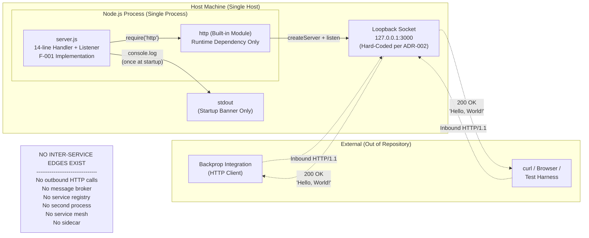

**Interpretation.** The diagram contains exactly one process node (`server.js`) and one runtime dependency (`http` module). No second service exists with which to form a service-to-service relationship; therefore, no inter-service patterns (synchronous calls, async messaging, event publication, service-mesh data-plane, sidecar) can be present.

#### 6.1.6.2 Scalability Architecture Diagram (Bounded by Design)

This diagram visualizes the explicit scaling envelope. The single process on a single host can serve any number of inbound requests up to the Node.js / OS default limits, but cannot be scaled horizontally because the `127.0.0.1` binding prevents off-host reachability.

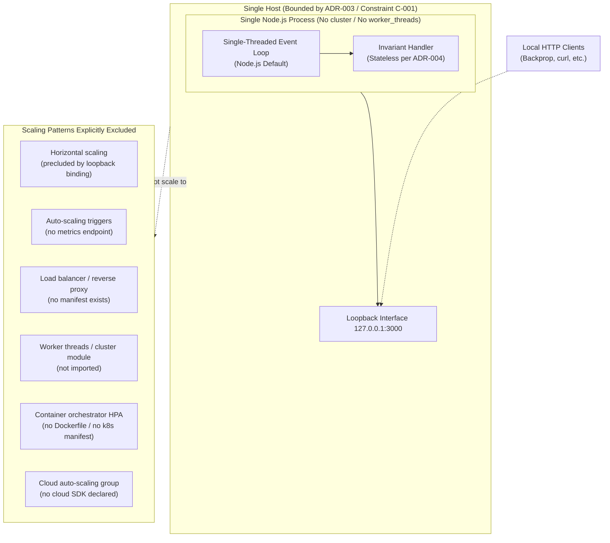

**Interpretation.** Vertical scaling is bounded by Node.js / OS defaults (Section 5.4.5) with no tuning hooks exposed. Horizontal scaling is structurally excluded by the loopback binding. The right-hand grouping enumerates the scaling patterns that are deliberately not adopted.

#### 6.1.6.3 Resilience Pattern Implementation Diagram (Manual Recovery)

This diagram depicts the resilience posture: failure modes propagate to process termination, and recovery is exclusively operator-driven. The diagram is adapted from Sections 4.5.2 and 5.4.3 to focus on resilience semantics.

```mermaid
flowchart TD
    Start([Operator: node server.js])
    Start --> NodeCheck{Node.js<br/>Runtime Present?}
    NodeCheck -->|No| ManualInstall[Operator installs Node.js<br/>MANUAL ACTION]
    ManualInstall --> Start
    NodeCheck -->|Yes| PortCheck{Port 3000<br/>Available on 127.0.0.1?}
    PortCheck -->|No| EADDR[EADDRINUSE Emitted on Server]
    EADDR --> NoListener[No 'error' Listener Registered<br/>per ADR-005]
    NoListener --> Crash1[Process Terminates<br/>Non-Zero Exit Code]
    Crash1 --> ManualRestart[Operator Kills Conflict + Restarts<br/>MANUAL ACTION]
    ManualRestart --> Start
    PortCheck -->|Yes| Listening[Listening on 127.0.0.1:3000]
    Listening --> Request[Inbound HTTP Request]
    Request --> Handler[Invariant Handler Executes<br/>Returns 200 OK / 'Hello, World!']
    Handler --> Listening
    Listening --> UnexpectedThrow{Internal Throw<br/>in Handler?}
    UnexpectedThrow -->|Yes| NoUncaught[No 'uncaughtException' Listener<br/>per ADR-005]
    NoUncaught --> Crash2[Process Crashes]
    Crash2 --> ManualRestart2[Operator Re-Invokes node server.js<br/>MANUAL ACTION — No Supervisor]
    ManualRestart2 --> Start
    Listening --> Signal{SIGINT /<br/>SIGTERM?}
    Signal -->|Yes| NoGraceful[No Graceful Shutdown Handler]
    NoGraceful --> Terminated[Process Terminates Immediately]
    Terminated --> ManualRestart3[Operator Re-Invokes node server.js<br/>MANUAL ACTION]
    ManualRestart3 --> Start

    AbsenceNote["EXPLICIT ABSENCES (per Section 5.4.3):<br/>------------------------------------------<br/>No try/catch in handler<br/>No retry logic / exponential backoff<br/>No circuit breaker<br/>No fallback handler<br/>No dead-letter queue<br/>No process supervisor (PM2 / systemd / Docker restart)<br/>No failover / standby / HA pair<br/>No backup-restore (no state exists)<br/>No error notification flow (email / Slack / PagerDuty)"]
```

**Interpretation.** Every recovery edge in the diagram terminates at "MANUAL ACTION." There are no automated edges from failure states back to the running state. This is a deliberate design property anchored by ADR-005 and confirmed by Section 5.4.6.

---

### 6.1.7 Conditions Under Which Reassessment Would Be Warranted

This subsection documents the architectural triggers that would require revisiting the "not applicable" determination. Each trigger maps to a specific ADR or constraint whose relaxation would alter the analysis.

| Trigger | Affected ADR / Constraint | Resulting Requirement |
|---|---|---|
| Binding broadened beyond `127.0.0.1` (e.g., `0.0.0.0`) | ADR-003 / C-001 | Service discovery, TLS, authentication, and authorization become required (Section 5.3.5) |
| Introduction of a second functional component (e.g., a background worker, a second route, an outbound integration) | ADR-001 | Service boundaries, inter-service communication, and possibly a service registry become required |
| Introduction of persistent state (database, cache, file persistence) | ADR-004 / Section 5.3.3 | Data redundancy, backup/restore, and possibly replication become required |
| Introduction of multiple instances behind a load balancer | ADR-003 + ADR-001 | Load balancing, health checks, session affinity (if stateful), and capacity planning become required |
| Introduction of an error response path or async work | ADR-005 | Circuit breakers, retry/backoff, and dead-letter handling become candidates |
| Introduction of SLA / availability commitments | Section 5.4.5 / Section 1.2.3 | Auto-scaling, failover, and disaster-recovery planning become required |
| Adoption of a process supervisor or orchestrator | Section 5.4.6 | Restart policies, liveness/readiness probes, and graceful shutdown become candidates |

Until such triggers occur, Sections 6.1.3 through 6.1.5 remain definitively "not applicable" for this system.

---

### 6.1.8 Cross-References

| Concern Documented in This Section | Authoritative Section in This Specification |
|---|---|
| Single-process monolithic style and intentional minimalism | Section 5.1.1 |
| Component inventory (sole functional component = `server.js`) | Section 5.1.2, Section 5.2.1 |
| Architecture Decision Records ADR-001 through ADR-006 | Section 5.3.7 |
| Explicit absence of retry, fallback, circuit breakers, DLQs | Section 4.5.3 |
| Manual disaster-recovery procedures | Section 5.4.6 |
| No KPIs / SLAs / performance targets | Section 5.4.5, Section 1.2.3 |
| Zero-dependency / no third-party services posture | Section 3.5.1, Section 3.4 (via F-003) |
| No containerization / CI/CD / IaC / process manager | Section 3.7 |
| Constraints C-001 through C-006 | Section 2.6.2 |
| Loopback-only binding rationale | Section 5.3.5 (security model) |
| Process lifecycle (states observed at runtime) | Section 5.2.4 |
| Component interaction (single-process topology) | Section 5.2.3 |
| Statelessness and absence of caching | Section 5.3.3, Section 5.3.4, Section 4.6 |

---

### 6.1.9 References

#### 6.1.9.1 Files Examined

- `server.js` — The sole functional artifact (14 lines); confirms hard-coded loopback binding, stateless invariant handler, absence of error handling, and absence of clustering primitives
- `package.json` — Confirms zero `dependencies` and zero `devDependencies`; declares MIT license; declares non-existent `main: index.js` (Section 2.6.3 anomaly)
- `package-lock.json` — Lockfile v3; cryptographically anchors the zero-dependency invariant (F-003)
- `README.md` — Two-line file documenting the test-fixture role and the "Do not touch!" governance directive

#### 6.1.9.2 Folders Explored

- Repository root (depth 0) — Flat single-directory layout containing all source, manifest, documentation, and inert-data files; no subdirectories exist, confirming the absence of multi-module or multi-service organization

#### 6.1.9.3 Technical Specification Sections Referenced

- Section 1.2 (System Overview) — Establishes single-process, stateless, loopback-only characterization; absence of KPIs/SLAs
- Section 1.3 (Scope) — Out-of-scope inventory confirms absence of routing, auth, DB, TLS, tests, CI/CD, containerization, monitoring
- Section 2.4 (Implementation Considerations) — Scalability table documenting "Not applicable" for horizontal scaling; absence of performance requirements
- Section 2.6 (Assumptions, Constraints, and Documented Anomalies) — Constraints C-001 through C-006 codifying the absence of distributed-system attributes
- Section 3.5 (Third-Party Services) — Enumerates "None" across all integration categories
- Section 3.6 (Databases & Storage) — Confirms absence of any database or storage technology
- Section 3.7 (Development & Deployment) — Confirms absence of containerization, CI/CD, IaC, and process managers
- Section 4.5 (Error Handling and Recovery) — Comprehensive inventory of absent retry/fallback/circuit-breaker/DLQ mechanisms
- Section 4.6 (State Management) — Documents the absence of application-level state and caching
- Section 4.7 (Timing and SLA Considerations) — Confirms no SLAs/KPIs are defined; all timeouts inherited from Node.js defaults
- Section 5.1 (High-Level Architecture) — Establishes "intentional minimalism" architectural style; identifies single-process boundary
- Section 5.2 (Component Details) — Confirms `server.js` is "the sole functional component"; documents bounded scalability
- Section 5.3 (Technical Decisions) — Source of ADR-001 through ADR-006 codifying every architectural decision relied upon in this section
- Section 5.4 (Cross-Cutting Concerns) — Source of "No automated recovery procedures exist"; documents manual recovery procedures

## 6.2 Database Design

### 6.2.1 Applicability Assessment

**Database Design is not applicable to this system.**

The `hao-backprop-test` repository implements a 14-line, single-file, single-process Node.js HTTP server (`server.js`) whose handler is a pure function returning the invariant response `200 OK / Hello, World!\n` for every request, regardless of method, path, headers, or body. The repository contains **no database technology of any kind** — no relational database, no document store, no key-value store, no search engine, no graph database, no time-series database, no in-memory cache, no file-system persistence, no session store, and no message queue. This absence is not an oversight; it is a codified architectural decision documented in ADR-004 (Stateless Invariant-Response Handler), ADR-006 (Zero External Dependencies), Section 3.6.1 (Database Technology: None), Section 3.6.2 (Data Persistence Strategy: Stateless In-Memory Only), Section 5.3.3 (Data Storage Solution Rationale), and Section 5.3.4 (Caching Strategy Justification).

Every category of concern enumerated in the Database Design template — schema design, entity relationships, indexing strategy, partitioning, replication, backup, migration, archival, retention, audit, query optimization, connection pooling, read/write splitting, and batch processing — is **explicitly absent** from the codebase by deliberate design.

#### 6.2.1.1 Summary of Inapplicability

The table below maps each major Database Design concern to its status and authoritative source within this Technical Specification.

| Database Design Concern | Status in This System | Authoritative Source |
|---|---|---|
| Relational / document / key-value / search / graph / time-series databases | Not present | Section 3.6.1 |
| Application-level / distributed / HTTP / CDN caching | Not present | Section 3.6.3, Section 5.3.4 |
| File-system persistence (`fs` module use) | Not present | Section 1.2.2, Section 4.6.3 |
| Cloud object storage (S3, GCS, Azure Blob) | Not present | Section 3.6.5 |
| Session storage / cookies / client-side state | Not present | Section 4.6.3 |
| ORM / query builder / migration tool | Not present | Section 3.6.1 |
| Connection strings / DB credentials / secret management | Not present | Section 3.6.1, Section 5.3.5 |
| Replication / sharding / multi-region replicas | Not applicable | Section 5.3.3, Section 6.1.5.3 |
| Backup / restore procedures | Not applicable | Section 5.4.6 |
| Schema migrations / data versioning | Not applicable | Section 5.3.3 |

#### 6.2.1.2 Definitional Test: Why Database Design Does Not Apply

Database Design as a discipline presupposes (a) the existence of a persistent data store, (b) one or more entities or aggregates whose representation must be modeled, and (c) at least one read or write path through which the application interacts with the store. None of these preconditions is met:

- **Precondition (a) — Persistent store**: Section 3.6.1 confirms the repository "contains no database technology of any kind." There is no driver in `package.json` and no connection code in `server.js`. The lockfile `package-lock.json` (v3) cryptographically anchors the zero-dependency property (per ADR-006), precluding the presence of database client libraries.
- **Precondition (b) — Entities to model**: The handler emits a constant 14-byte literal (`'Hello, World!\n'`). There is no domain object, no row, no document, no key-value pair, no graph node, no time-series point, and no search index to model.
- **Precondition (c) — Read or write path**: Section 4.6.3 (State Management) documents zero data persistence points; no read or write paths through any store exist. The handler is a pure function of a constant, not of any datum retrieved from storage.

Because all three definitional preconditions are absent by design, the Database Design template cannot be meaningfully populated; it can only be enumerated for the record. This section therefore documents the absence — comprehensively, traceably, and with each sub-topic from the template treated explicitly — rather than attempting to invent a schema that does not exist.

---

### 6.2.2 Architectural Rationale for Inapplicability

This subsection explains the specific architectural decisions and constraints that make the Database Design template inapplicable. Each rationale is grounded in evidence from the repository and existing Technical Specification sections.

#### 6.2.2.1 Pure-Function Invariant-Response Handler (ADR-004 / F-001-RQ-006)

Per ADR-004 (Section 5.3.7), the handler "ignores all `req` properties" and responds with constant `200 OK / Hello, World!\n` for every inbound request. Per Section 5.3.3, "The handler is a pure function of a constant response; there is nothing to store." Database Design is typically motivated by the need to persist or retrieve domain data; a handler that returns a hard-coded literal has no domain, no data, and no retrieval need. The motivation for database design is therefore absent in addition to the mechanism being precluded.

#### 6.2.2.2 Zero-Dependency Constraint (ADR-006 / F-003)

Per ADR-006 (Section 5.3.7), the repository declares no `dependencies` and no `devDependencies` in `package.json`, and `package-lock.json` v3 cryptographically anchors this property. The consequence is that the project deliberately excludes every category of library that would be required to construct a database layer, including but not limited to:

- Relational database drivers (`pg`, `mysql2`, `sqlite3`, `mssql`, `oracledb`)
- ORMs and query builders (Sequelize, Prisma, TypeORM, Knex, Objection)
- Document database clients (`mongodb`, `mongoose`, `couchbase`)
- Key-value / cache clients (`redis`, `ioredis`, `memcached`)
- Search clients (`@elastic/elasticsearch`, `solr-client`)
- Graph database drivers (`neo4j-driver`, `gremlin`)
- Time-series clients (`influx`, `@influxdata/influxdb-client`)
- Migration tools (`db-migrate`, `node-pg-migrate`, `umzug`, Prisma Migrate)
- Object-storage SDKs (`aws-sdk`, `@aws-sdk/client-s3`, `@google-cloud/storage`)
- Connection pool libraries (`generic-pool`, `pg-pool`)

Adding any of these would violate F-003 and ADR-006. As a result, the *toolchain* required to implement Database Design is structurally absent from the repository.

#### 6.2.2.3 Statelessness Invariant (Section 1.2.2 / Section 4.6)

Per Section 1.2.2 (Core Technical Approach): "State: Fully stateless; no in-memory data structures, no file I/O, no persistence." Per Section 4.6.3, the system has "zero data persistence points. The only data that persists across process restarts is the source code itself on the local filesystem; no runtime-produced artifacts are written to disk." Database Design presupposes a data lifecycle (create, read, update, delete, retain, archive, purge); statelessness eliminates every step of that lifecycle.

#### 6.2.2.4 Test-Fixture Role

Per `README.md`, the repository is "test project for backprop integration. Do not touch!" Per Section 5.3.1, the test-fixture role explicitly rules out production-grade architecture: "production-grade architecture is therefore not warranted." Per Section 5.3.3, "The absence of storage matches the test-fixture role of the repository." Even if the technical preconditions for database use were satisfied, the project's purpose does not justify the operational complexity that a database layer entails (schema migrations, connection pooling, backup procedures, replication topology, audit logging, retention policy).

#### 6.2.2.5 Inert Artifacts Are Not a Data Store

The repository contains static data files — most notably `industry.csv` (749 bytes; single column `Industry`; 43 alphabetized industry categories plus the literal `Other`) and its byte-identical duplicate `industry - Copy.csv`. Per Section 3.6.4 and Section 5.3.3, these files are **inert filesystem artifacts**, not a data store:

| Attribute | Value |
|---|---|
| Read by any source code at runtime? | No |
| Imported, required, or opened by `server.js`? | No (`server.js` imports only `http`) |
| Schema, index, or constraint defined over? | None |
| Backup, replication, or migration plan for? | None |

Per Section 2.6.3, the unreferenced state of `industry.csv` is a documented anomaly, not evidence of a data layer. The file's presence does not transform the repository into a data-bearing system. Binary placeholders (`100Pages.pdf`, `demo.jpg`, `sample.doc` and their copies) and empty text placeholders (`.blitzyignore.txt` variants, `test.py.txt`) are similarly inert per Section 3.6.4.

---

### 6.2.3 Schema Design — Detailed Inapplicability Inventory

This subsection addresses each item under the SCHEMA DESIGN heading of the template. Each item is documented as absent with traceable evidence.

#### 6.2.3.1 Entity Relationships

There are no entities. The handler emits a single 14-byte literal string; there is no object model, no aggregate, no row, no document, and consequently no relationship to model. The conventional ERD (Entity-Relationship Diagram) artifact is rendered below as an empty-set diagram to document this fact concretely:

```mermaid
erDiagram
    NO_ENTITY {
        string note "This system defines no entities."
        string source "Section 3.6.1 / ADR-004"
    }
```

The single placeholder above is illustrative only; no entity, attribute, primary key, foreign key, cardinality, or relationship exists in the actual system. Per Section 5.3.3, "The handler is a pure function of a constant response; there is nothing to store."

#### 6.2.3.2 Data Models and Structures

No conceptual, logical, or physical data model exists. The following table enumerates each conventional data-model artifact and its status:

| Data-Model Artifact | Status | Evidence |
|---|---|---|
| Conceptual model (entities + relationships) | Not defined | Section 3.6.1 — no DB technology |
| Logical model (normalized tables / collections) | Not defined | Section 3.6.1 — no schema definition |
| Physical model (columns, types, constraints) | Not defined | Section 3.6.1 — no DDL anywhere in repo |
| Document/JSON schema | Not defined | No schema validation library in `package.json` |
| In-memory data structures (Map, Set, Array as state) | Not used | Section 4.6.3 — "None" |

#### 6.2.3.3 Indexing Strategy

No indexes exist because no data store exists. The conventional categories of indexes — primary indexes, secondary indexes, composite indexes, partial indexes, full-text indexes, spatial indexes, hash indexes, B-tree indexes — are uniformly absent. There is no index advisor output, no `EXPLAIN ANALYZE` log, and no performance-tuning artifact in the repository.

#### 6.2.3.4 Partitioning Approach

No partitioning exists because no dataset exists. Range partitioning, list partitioning, hash partitioning, composite partitioning, and sharding strategies are uniformly not applicable. Per Section 6.1.5.3, "the concept of data redundancy (replication, sharding, mirroring, backups, RAID, multi-region replicas) is not applicable." Per Section 6.1.4.1, "horizontal scalability [is] not applicable — loopback-only binding prevents multi-host deployment," which further forecloses any partition-by-host strategy.

#### 6.2.3.5 Replication Configuration

No replication configuration exists. There is no primary store from which to replicate, no replica to receive replicated data, no replication topology (single-leader, multi-leader, leaderless), no replication lag to monitor, and no replication conflict to resolve. Per Section 6.1.5.4, "Failover requires at minimum a primary instance and a standby instance ... The system is a single process on a single host bound to the loopback interface; no standby, no replica, no leader election, no HA pair, and no virtual IP exist."

#### 6.2.3.6 Backup Architecture

No backup architecture exists. Per Section 5.4.6, there is "no backup/restore procedure (no state exists to back up)." The complete inventory:

| Backup Concern | Status |
|---|---|
| Full backups (logical or physical) | Not applicable — no data |
| Incremental / differential backups | Not applicable — no data |
| Point-in-time recovery (PITR) | Not applicable — no WAL or oplog |
| Backup retention policy | Not applicable — no backup tier |
| Backup encryption / verification | Not applicable — no backup tier |
| Off-site / cross-region backup copies | Not applicable — no backup tier |
| Restore drill cadence / RTO / RPO | Not defined — no SLAs (Section 5.4.5) |

The only "data" that persists across process restarts is the source code on the host filesystem, which is governed by the host's normal source-control and filesystem-backup practices and is outside the scope of this specification.

---

### 6.2.4 Data Management — Detailed Inapplicability Inventory

This subsection addresses each item under the DATA MANAGEMENT heading of the template.

#### 6.2.4.1 Migration Procedures

No migration procedures exist. There is no schema to migrate. The complete inventory of migration tooling and artifacts:

| Migration Concern | Status |
|---|---|
| Schema migration tool (Sequelize, Knex, Prisma Migrate, db-migrate, Flyway) | Not declared in `package.json` |
| Migration directory (`migrations/`, `db/migrate/`) | Not present in repository root |
| Forward / rollback migration scripts | None exist |
| Seed data scripts | None exist |
| npm scripts for migrate / seed / rollback | Only `test` script declared (Section 1.2.3) |

Per Section 5.3.3, "Statelessness eliminates the need for transaction management, connection pooling, schema migrations, and backup procedures."

#### 6.2.4.2 Versioning Strategy

No data versioning strategy exists because no data exists. The `package.json` declares `"version": "1.0.0"`, but this is the **package version** (F-002), not a data-schema version. There is no `schema_version` table, no migration history table, no event-sourcing version stream, no CDC offset, and no API schema-evolution policy. The lockfile `package-lock.json` is at lockfile v3, but this versions the npm dependency graph (which is empty), not application data.

#### 6.2.4.3 Archival Policies

No archival policy exists because no data is produced or retained. Per Section 3.6.2, "No session state, no rate-limit counters, no request logs are retained." There is no hot/warm/cold tiering, no archive-to-object-storage workflow, no time-based partition rotation, and no aged-data purge job.

#### 6.2.4.4 Data Storage and Retrieval Mechanisms

No data storage or retrieval mechanism exists. The handler does not consult any data source to construct its response; the response body is a literal string in source code. The following table makes the inventory of *absent* mechanisms explicit:

| Mechanism Class | Status |
|---|---|
| SQL `SELECT` / `INSERT` / `UPDATE` / `DELETE` execution | Not performed |
| NoSQL `find` / `insert` / `update` / `remove` operations | Not performed |
| Cache `GET` / `SET` / `DEL` operations | Not performed |
| File `readFile` / `writeFile` / `createReadStream` operations | Not performed (`fs` not imported) |
| HTTP outbound calls for data retrieval | Not performed (no outbound calls — Section 6.1.3.2) |
| Object-storage GET / PUT operations | Not performed (no SDK declared — Section 3.6.5) |

#### 6.2.4.5 Caching Policies

Per Section 5.3.4, the decision is: **"No caching at any tier — no application-level cache, no distributed cache (Redis, Memcached), no HTTP response cache headers, no CDN integration, no reverse-proxy cache."**

The rationale (per Section 5.3.4) is decisive: "The response body is a 14-byte literal; computing it costs less than a cache lookup. No backend computation, no database query, and no upstream API call is performed — there is no expensive operation to cache." HTTP cache directives (`Cache-Control`, `ETag`, `Last-Modified`) are deliberately not emitted; only the `Content-Type: text/plain` header is set per F-001-RQ-003.

The complete inventory mirrors Section 4.6.4:

| Cache Layer | Status |
|---|---|
| Application-level cache (Map-based / LRU) | None |
| Distributed cache (Redis, Memcached, Hazelcast) | None |
| HTTP response cache headers (`Cache-Control`, `ETag`) | Not set |
| Reverse-proxy cache (Varnish, NGINX cache) | Not present |
| CDN integration (CloudFront, Akamai, Fastly) | Not present |
| Module cache (Node.js `require` cache) | Implicit only; out of application control |

---

### 6.2.5 Compliance Considerations — Detailed Inapplicability Inventory

This subsection addresses each item under the COMPLIANCE CONSIDERATIONS heading. Each item is treated as a deliberate absence whose compliance posture is established by the system's statelessness and loopback-only binding rather than by active controls.

#### 6.2.5.1 Data Retention Rules

There is no data retention rule because no data is retained. Per Section 3.6.2: "No in-memory state structures persist across requests ... No file system writes are performed by the application ... No session state, no rate-limit counters, no request logs are retained." The retention horizon is therefore the duration of a single request — measured in microseconds — after which no trace of the request remains in the system.

| Retention Concern | Status |
|---|---|
| PII / PHI / PCI retention windows | Not applicable — no such data is collected |
| Log retention policy | Not applicable — only one startup `console.log` ever emitted (Section 5.4.2) |
| Backup retention window | Not applicable — no backup tier (Section 6.2.3.6) |
| Right-to-be-forgotten / GDPR Article 17 procedure | Not applicable — no personal data to erase |
| Legal-hold mechanism | Not applicable — no data to hold |

#### 6.2.5.2 Backup and Fault Tolerance Policies

Per Section 5.4.6, **"No automated recovery procedures exist."** Per Section 6.1.5.2, all recovery is operator-driven (manual `node server.js` re-invocation). The fault-tolerance posture is comprehensively documented in Section 6.1.5.1 and summarized here from a data-persistence perspective:

| Fault-Tolerance Element | Status |
|---|---|
| Database failover / standby promotion | Not applicable — no DB exists |
| Transaction rollback / two-phase commit | Not applicable — no transactions occur |
| Idempotency keys for retry-safe writes | Not applicable — no writes occur |
| Write-ahead log (WAL) shipping | Not applicable — no WAL exists |
| Distributed-system consensus (Raft, Paxos) | Not applicable — single process |

#### 6.2.5.3 Privacy Controls

Per Section 5.3.5, "No sensitive data is ever emitted" — the output is the constant string `Hello, World!\n` for every request. Because the system collects, stores, processes, and emits **no personal data of any kind**, traditional privacy controls (consent capture, purpose limitation, pseudonymization, encryption-at-rest, encryption-in-transit beyond loopback, data-subject-access requests, cross-border-transfer governance) have no surface on which to operate.

| Privacy Control | Status |
|---|---|
| PII inventory / data classification | Not applicable — no PII collected |
| Encryption-at-rest | Not applicable — no data stored |
| Encryption-in-transit (TLS) | Not present — plain HTTP only (Section 5.3.5) |
| Pseudonymization / anonymization | Not applicable — no records exist |
| Data-subject-access (DSAR) workflow | Not applicable — no subject data exists |
| Cross-border data-transfer controls | Not applicable — loopback-only (C-001) |

Per Section 5.3.5, "Any change that broadens reachability (e.g., binding to `0.0.0.0` or exposing the port externally) would invalidate this implicit security model and require a comprehensive security review."

#### 6.2.5.4 Audit Mechanisms

Per Section 5.4.2, the strategy is **"emit nothing during steady state."** The only log statement in the entire application is the startup banner. Per Section 5.4.2 specifically: "No request-level logging (no access log, no audit log) ... No error logging ... No periodic heartbeat ... No correlation IDs, trace IDs, or span IDs ... No log rotation, log shipping, or log aggregation configuration."

| Audit Concern | Status |
|---|---|
| Database audit log (DDL / DML capture) | Not applicable — no DB exists |
| Application audit trail (who-did-what-when) | Not present — Section 5.4.2 |
| Tamper-evident logging (signed / append-only) | Not present |
| SIEM integration (Splunk, ELK, Datadog) | Not present — Section 5.4.1 |
| Compliance-attestation log feed | Not present |

#### 6.2.5.5 Access Controls

Per Section 5.4.4, "**No authentication or authorization framework is present.**" Per the same section, "The only implicit authorization checkpoint is loopback reachability, which is enforced by the operating system's network stack rather than by application code." Database-level access controls (GRANT/REVOKE, role-based privileges, row-level security, column-level masking) are uniformly inapplicable because no database exists.

| Access-Control Mechanism | Status |
|---|---|
| Database user accounts / roles | Not applicable — no DB |
| GRANT / REVOKE statements / role membership | Not applicable — no DB |
| Row-level / column-level security policies | Not applicable — no DB |
| Application-layer auth (OAuth2, OIDC, JWT) | Not present — Section 5.4.4 |
| Network-layer access control (firewall, ACL) | Implicit via loopback binding (C-001) only |

The loopback-only binding (Constraint C-001) is the de facto access boundary; any caller able to reach `127.0.0.1:3000` is unconditionally served the same response. There is no further differentiation by caller identity, role, or scope.

---

### 6.2.6 Performance Optimization — Detailed Inapplicability Inventory

This subsection addresses each item under the PERFORMANCE OPTIMIZATION heading. Per Section 5.4.5, "No KPIs, SLAs, performance targets, throughput requirements, latency budgets, or availability objectives are defined in the repository," so optimization techniques have no quantitative target to satisfy in the first place. Each technique is nonetheless inventoried for completeness.

#### 6.2.6.1 Query Optimization Patterns

No query optimization is performed because no queries are executed. The conventional query-optimization toolchain — `EXPLAIN` / `EXPLAIN ANALYZE` output, query plan caching, parameterized statement prepared-statement cache, slow-query log, query rewrite rules, covering indexes, materialized views, denormalization for read paths — is uniformly absent because the underlying query workload is absent.

#### 6.2.6.2 Caching Strategy

Per Section 5.3.4 (restated here for emphasis): **"No caching at any tier."** The system implements no application-level cache, no distributed cache, no HTTP response cache headers, no CDN, and no reverse-proxy cache. See Section 6.2.4.5 for the complete inventory.

#### 6.2.6.3 Connection Pooling

Per Section 6.1.4.4, connection pooling is **"Not present (no outbound calls)."** The Node.js process makes no outbound TCP/HTTP/database connections at all, so there is no resource for which a pool could be maintained. Libraries commonly used for pool management (`generic-pool`, `tarn`, vendor-specific pool implementations in `pg`, `mysql2`, `mongodb`) are not declared in `package.json` and are not imported in `server.js`.

| Pool Concern | Status |
|---|---|
| Database connection pool | Not applicable — no DB driver |
| HTTP keep-alive agent pool | Not configured — Node.js defaults inherited |
| Worker / thread pool | Not used (no `worker_threads` / `cluster` import) |
| Pool sizing (min/max, idle timeout) | Not parameterized — no pool exists |
| Pool exhaustion handling | Not applicable — no pool exists |

#### 6.2.6.4 Read/Write Splitting

No read/write splitting is performed because no reads or writes are performed against any store. Read/write splitting presupposes (a) a primary that accepts writes and (b) one or more replicas that serve reads; per Section 6.2.3.5, neither exists. Routing logic for read versus write traffic, replica-lag awareness, sticky-read affinity, and consistency-level negotiation are uniformly inapplicable.

#### 6.2.6.5 Batch Processing Approach

No batch processing is performed. Per Section 6.1.3.2, the inter-service communication inventory documents that "Scheduled / cron / batch jobs" are "Not implemented" and "File ingestion / ETL pipelines" are "Not implemented." The repository contains no cron expression, no scheduler library (`node-cron`, `agenda`, `bull`, `bullmq`), no batch-orchestration framework (Airflow, Step Functions, Argo Workflows), and no nightly/hourly job. The handler's per-request synchronous execution is the entire workload model.

---

### 6.2.7 Required Diagrams: Visualizing the Absence of a Database Layer

The diagrams below document the actual runtime data flow (an HTTP request that touches no store), the explicit set of persistence categories that are absent, and the replication topology that is structurally precluded by the single-process loopback design. Each diagram is annotated to make the absence explicit; collectively, they substitute for the ERD, data-flow, and replication-architecture diagrams that the template prescribes.

#### 6.2.7.1 Data Flow Diagram — No Persistence Touched

This diagram traces a complete request → response cycle and demonstrates that no persistence boundary is crossed at any point. Adapted from Section 5.2.3 and Section 6.1.6.1, with annotations focused on data flow.

```mermaid
flowchart LR
    subgraph ExternalClients["External HTTP Clients"]
        Backprop["Backprop Integration<br/>(HTTP Client)"]
        DevClient["curl / Browser /<br/>Test Harness"]
    end

    subgraph NodeProcess["Single Node.js Process — Stateless per ADR-004"]
        Listener["http.Server<br/>127.0.0.1:3000"]
        Handler["server.js Handler<br/>Pure Function:<br/>(req, res) -> 'Hello, World!\\n'"]
        Listener --> Handler
        Handler --> Listener
    end

    subgraph AbsentPersistence["Persistence Layer (DOES NOT EXIST)"]
        NoStoreNode["No Database<br/>No Cache<br/>No File I/O<br/>No Session Store<br/>No Queue<br/>(per Section 3.6 and Section 4.6.3)"]
    end

    Backprop -->|"Inbound HTTP/1.1 Request<br/>(method/url/headers IGNORED per ADR-004)"| Listener
    DevClient -->|"Inbound HTTP/1.1 Request"| Listener
    Listener -->|"200 OK<br/>Content-Type: text/plain<br/>Body: 'Hello, World!\\n'"| Backprop
    Listener -->|"200 OK<br/>Body: 'Hello, World!\\n'"| DevClient

    Handler -.->|"NEVER QUERIES<br/>NEVER WRITES<br/>NEVER CACHES"| NoStoreNode
```

**Interpretation.** The dotted edge from `Handler` to `NoStoreNode` carries no traffic at runtime; it is included only to make the absence of persistence interactions visually explicit. Per Section 4.6.3, "The system has zero data persistence points."

#### 6.2.7.2 Data Persistence Surface Diagram — Explicit Categorical Absences

This diagram enumerates the persistence categories that a conventional system might be expected to use and documents that **each is explicitly absent**. The pattern follows Section 6.1.6.1's `NoServices` annotation convention.

```mermaid
flowchart TB
    Server["server.js<br/>(14 lines, fully stateless)<br/>Imports only the http built-in module"]

    subgraph AbsentCategories["Persistence Categories Explicitly Absent (Section 3.6)"]
        Cat1["Relational DBs<br/>PostgreSQL / MySQL /<br/>SQLite / MS SQL Server<br/>(Section 3.6.1: Absent)"]
        Cat2["Document DBs<br/>MongoDB / Couchbase /<br/>DynamoDB<br/>(Section 3.6.1: Absent)"]
        Cat3["Key-Value Stores<br/>Redis / Memcached / etcd<br/>(Section 3.6.1: Absent)"]
        Cat4["Search Engines<br/>Elasticsearch / Solr /<br/>OpenSearch<br/>(Section 3.6.1: Absent)"]
        Cat5["Graph DBs<br/>Neo4j / Neptune /<br/>ArangoDB<br/>(Section 3.6.1: Absent)"]
        Cat6["Time-Series DBs<br/>InfluxDB / TimescaleDB<br/>(Section 3.6.1: Absent)"]
        Cat7["File System I/O<br/>Node.js fs module<br/>(Section 1.2.2: Not used)"]
        Cat8["Object Storage<br/>AWS S3 / GCS / Azure Blob<br/>(Section 3.6.5: Absent)"]
        Cat9["Session Stores<br/>Cookies / JWT /<br/>Server Sessions<br/>(Section 4.6.3: None)"]
        Cat10["Message Queues<br/>Kafka / RabbitMQ /<br/>SQS / NATS<br/>(Section 6.1.3.2: Not implemented)"]
    end

    subgraph InertArtifacts["Inert Filesystem Artifacts (NOT a data store, per Section 3.6.4)"]
        CSV["industry.csv (749 B)<br/>43 entries + 'Other'<br/>UNREFERENCED by source code"]
        BinDocs["100Pages.pdf / demo.jpg /<br/>sample.doc and byte-identical copies<br/>UNREFERENCED by source code"]
    end

    Server -.->|"No driver / no client"| Cat1
    Server -.->|"No SDK / no ODM"| Cat2
    Server -.->|"No cache client"| Cat3
    Server -.->|"No search SDK"| Cat4
    Server -.->|"No graph driver"| Cat5
    Server -.->|"No time-series client"| Cat6
    Server -.->|"No fs import"| Cat7
    Server -.->|"No cloud SDK"| Cat8
    Server -.->|"No cookie / no session"| Cat9
    Server -.->|"No broker client"| Cat10
    Server -.->|"Files present but never opened"| InertArtifacts
```

**Interpretation.** The diagram inverts the conventional ERD: instead of depicting entities and relationships that *do* exist, it inventories the persistence categories whose absence is verified by Section 3.6 (Databases & Storage) and Section 4.6 (State Management). The `InertArtifacts` cluster acknowledges static files present in the working tree while making clear they are not consumed by the runtime and therefore are not a data store.

#### 6.2.7.3 Replication Architecture Diagram — Structural Inapplicability

This diagram documents the actual deployment topology (single Node.js process on a single host, bound to the loopback interface) and enumerates the replication patterns that are precluded by Constraints C-001 and C-002 and by the absence of any primary data store.

```mermaid
flowchart TB
    subgraph LocalHost["Single Host (Bounded by ADR-003 / Constraint C-001)"]
        subgraph SingleProc["Single Node.js Process — Stateless per ADR-004"]
            Handler["server.js<br/>Pure Stateless Handler<br/>(No state to replicate)"]
        end
        Loopback["Loopback Interface<br/>127.0.0.1:3000<br/>(Hard-Coded per ADR-002)"]
        Handler --> Loopback
    end

    LocalClients["Local HTTP Clients<br/>(Backprop, curl, browser)"]
    LocalClients -.-> Loopback

    subgraph ExcludedReplication["Replication & Redundancy Patterns Structurally Excluded"]
        X1["Primary-Replica Streaming Replication<br/>(no primary store exists)"]
        X2["Multi-Master / Active-Active Replication<br/>(no data to synchronize)"]
        X3["Read Replicas<br/>(no reads against any store)"]
        X4["Sharding / Horizontal Partitioning<br/>(no dataset to partition)"]
        X5["Multi-Region Replication<br/>(loopback binding precludes multi-host)"]
        X6["Standby Failover / HA Pair<br/>(no state to failover)"]
        X7["Backup Tier<br/>(no state to back up — Section 5.4.6)"]
        X8["CDC / Stream Replication<br/>(no source of truth exists)"]
    end

    LocalHost -.->|"Cannot implement<br/>(per Section 6.1.5)"| ExcludedReplication
```

**Interpretation.** Replication architecture diagrams conventionally depict a primary store, one or more replicas, the replication channel (synchronous WAL / asynchronous log shipping / logical replication), and the failover mechanism (heartbeat, leader election, virtual IP). None of these elements exists in the system; the diagram therefore depicts the single deployable unit and explicitly enumerates the eight categorical patterns that are structurally precluded. Per Section 6.1.5.3, "With no data, the concept of data redundancy (replication, sharding, mirroring, backups, RAID, multi-region replicas) is not applicable."

---

### 6.2.8 Conditions Under Which Reassessment Would Be Warranted

This subsection documents the architectural triggers that would require revisiting the "not applicable" determination. Each trigger maps to a specific ADR, constraint, or feature whose relaxation would alter the analysis. The structure mirrors Section 6.1.7.

| Trigger | Affected ADR / Constraint | Resulting Database-Design Requirement |
|---|---|---|
| Introduction of any persistent state (DB, cache, file persistence, session store) | ADR-004 / Section 5.3.3 | Full schema design, indexing strategy, replication, backup, and migration plan become required |
| Introduction of a database driver or ORM into `package.json` | ADR-006 / F-003 | Connection-string handling, secret management (Section 5.3.5), and connection pooling become required |
| Introduction of conditional response logic dependent on stored data | ADR-004 / C-003 | Read path, query optimization, and cache-coherency strategy become required |
| Adoption of a session model, rate-limit accumulator, or per-user state | Section 4.6 | Session store selection, session-replication strategy, and TTL policy become required |
| Introduction of audit / access logging that must be retained | Section 5.4.2 | Log-store schema, retention policy, and log-aggregation pipeline become required |
| Consumption of `industry.csv` (or similar static data) at runtime | Section 3.6.4 | Reference-data loading, in-memory caching, and refresh strategy become candidates |
| Broadening the listener binding beyond `127.0.0.1` | ADR-003 / C-001 | Network-layer access controls, TLS, and DB encryption-in-transit become required |
| Adoption of multiple instances behind a load balancer | ADR-001 / ADR-003 | Shared session state, distributed cache, and replicated DB topology become required |
| Adoption of SLA / RTO / RPO commitments | Section 5.4.5 / Section 1.2.3 | Backup architecture, replication topology, and DR runbook become required |

Until one of the above triggers occurs, Sections 6.2.3 through 6.2.6 remain definitively "not applicable" for this system.

---

### 6.2.9 Cross-References

The following table maps each concern documented in this section to the authoritative source elsewhere in this specification.

| Concern Documented in This Section | Authoritative Section |
|---|---|
| Database technology absence (all categories) | Section 3.6.1 |
| Stateless data-persistence strategy | Section 3.6.2, Section 1.2.2, Section 4.6.2 |
| Caching absence at all tiers | Section 3.6.3, Section 4.6.4, Section 5.3.4 |
| Inert filesystem artifacts (`industry.csv`, binaries) | Section 3.6.4, Section 2.6.3 |
| Cloud storage / object storage absence | Section 3.6.5, Section 3.5 |
| Zero-dependency invariant precluding DB drivers | Section 3.4, Section 5.3.7 (ADR-006), F-003 |
| Statelessness of handler | Section 1.2.2, Section 4.6.2, ADR-004 |
| Data persistence points (none) | Section 4.6.3 |
| Data redundancy not applicable | Section 6.1.5.3 |
| Backup / DR (none) | Section 5.4.6, Section 6.1.5.2 |
| Audit / logging (none beyond startup) | Section 5.4.2 |
| Authentication / authorization (none) | Section 5.4.4 |
| Loopback-only binding | Section 2.6.2 (C-001), Section 5.3.5, ADR-003 |
| Invariant-response handler | Section 2.6.2 (C-003), F-001-RQ-006, ADR-004 |
| Constraints and anomalies (C-001 through C-006; `industry.csv` unreferenced) | Section 2.6 |
| Test-fixture role and "Do not touch!" governance | Section 5.3.1, `README.md` (F-004) |

---

### 6.2.10 References

#### 6.2.10.1 Files Examined

- `server.js` — Sole functional artifact (14 lines); confirms `require('http')` is the only import, no `fs` import, no DB-client import, no in-memory state structures, and stateless invariant handler
- `server - Copy.js` — Byte-identical duplicate of `server.js`; confirms duplication anomaly (Section 2.6.3) and that no alternate persistence-using variant exists
- `package.json` — Confirms zero `dependencies` and zero `devDependencies` blocks; no DB driver, ORM, migration tool, or cache client declared; only `test` script present (default placeholder)
- `package-lock.json` — Lockfile v3 with only the root package entry; cryptographically anchors the zero-dependency invariant precluding any database client library (ADR-006)
- `README.md` — Two-line file documenting test-fixture role and "Do not touch!" directive; contains no database references
- `industry.csv` — 749-byte single-column CSV (header `Industry`, 43 alphabetized entries plus `Other`); present in working tree but unreferenced by any source code (Section 3.6.4 / Section 2.6.3)
- `industry - Copy.csv` — Byte-identical duplicate; same unreferenced status

#### 6.2.10.2 Folders Explored

- Repository root (depth 0) — Flat single-directory layout containing all source, manifest, documentation, and inert-data files; no subdirectories exist; in particular no `migrations/`, `db/`, `models/`, `schemas/`, `seeds/`, or similar database-related directories are present

#### 6.2.10.3 Technical Specification Sections Referenced

- Section 1.2 (System Overview) — Source of "Fully stateless; no in-memory data structures, no file I/O, no persistence" characterization and capability inventory
- Section 1.3 (Scope) — Out-of-scope inventory confirming database persistence is not supported
- Section 2.1 (Feature Catalog) — Confirms only F-001 through F-005 exist; F-005 (`industry.csv`) is marked "present but unconsumed"
- Section 2.6 (Assumptions, Constraints, Anomalies) — Source of Constraints C-001 through C-006 and the documented anomaly that `industry.csv` is unreferenced
- Section 3.4 (Open Source Dependencies) — Confirms zero external dependencies via three independent observations (package.json, package-lock.json, server.js imports)
- Section 3.5 (Third-Party Services) — Confirms absence of object-storage SDKs and third-party data services
- Section 3.6 (Databases & Storage) — Primary authoritative source enumerating absence of all database categories, caching solutions, and cloud-storage integrations; characterizes `industry.csv` as inert
- Section 4.6 (State Management) — Comprehensive inventory of absent state, persistence, and caching mechanisms with the explicit "zero data persistence points" determination
- Section 5.1 (High-Level Architecture) — Source of "Key data stores and caches: None" statement and the "intentional minimalism" architectural style
- Section 5.2 (Component Details) — Source of "Data Persistence Requirements: None" for the `server.js` component
- Section 5.3 (Technical Decisions) — Source of ADR-001 through ADR-006 (notably ADR-004 stateless handler and ADR-006 zero dependencies); Sections 5.3.3 (Data Storage Rationale) and 5.3.4 (Caching Justification) are decisive for this section
- Section 5.4 (Cross-Cutting Concerns) — Source of "No automated recovery procedures exist," absence of audit/access logging, and absence of authentication/authorization
- Section 6.1 (Core Services Architecture) — Provides the template for the "not applicable" determination; Sections 6.1.5.3 (data redundancy not applicable) and 6.1.5.4 (failover not applicable) directly support this section's replication-inapplicability claims

## 6.3 Integration Architecture

### 6.3.1 Applicability Assessment

**Integration Architecture is materially not applicable for this system, with one narrow exception.** The `hao-backprop-test` repository implements a 14-line, single-process, single-file Node.js HTTP server (`server.js`) that exposes exactly one inbound HTTP/1.1 endpoint on the loopback interface. The repository contains **no** outbound integrations, **no** message processing infrastructure, **no** third-party service consumers, **no** API gateway, **no** legacy system interfaces, and **no** formalized API design surface (no OpenAPI specification, no authentication, no authorization, no rate limiting, and no versioning).

The single applicable integration element is the **inbound HTTP target consumed by the externally-named "Backprop" system**, referenced exclusively in the two-line `README.md` ("test project for backprop integration. Do not touch!"). The repository represents the server side of this relationship; the Backprop consumer's implementation and operation are outside the repository's scope. No client SDK, contract test, or shared schema artifact accompanies the integration.

This section follows the structural precedent established in Section 6.1 (Core Services Architecture) by documenting the comprehensive inapplicability of each template element with traceable evidence, while fully describing the one applicable element in §6.3.3.

#### 6.3.1.1 Summary of Applicability by Template Element

| Template Element | Status in This System | Authoritative Source |
|---|---|---|
| Inbound HTTP integration with Backprop | **Applicable** — documented in §6.3.3 | Section 3.5.2, Section 4.3.1, Section 5.1.4 |
| API design (OpenAPI / Swagger / IDL) | Not applicable — no contract surface exists | Section 3.5.2 |
| Authentication methods | Not applicable — none implemented | Section 5.4.4, Section 3.8.3 |
| Authorization framework | Not applicable — none implemented | Section 5.4.4 |
| Rate limiting strategy | Not applicable — none implemented | Section 4.6, Section 5.4.3 |
| API versioning | Not applicable — no `/v1`, `/v2`, headers, or media-type versioning | Section 5.1.3 |
| API documentation standards | Not applicable — only a 2-line `README.md` exists | F-004 / Section 2.1.4 |
| Event processing patterns | Not applicable — no event bus, no emitters | Section 4.3.3 |
| Message queue architecture | Not applicable — no broker clients | Section 1.3.2, Section 3.5.1 |
| Stream processing design | Not applicable — no stream processors | Section 6.1.3.2 |
| Batch processing flows | Not applicable — no scheduled or batch jobs | Section 1.3.2 |
| Messaging error handling | Not applicable — no messaging exists | ADR-005 / Section 5.3.7 |
| Third-party integration patterns | Not applicable — zero third-party services | Section 3.5.1 |
| Legacy system interfaces | Not applicable — no legacy adapters | Section 3.5.1 |
| API gateway configuration | Not applicable — no proxy or gateway | Section 6.1.3.4 |
| External service contracts | Not applicable — no Pact, no schemas | Section 3.5.2 |

#### 6.3.1.2 Definitional Test: Why Most Integration Concerns Do Not Apply

A meaningful "integration architecture" presupposes (a) at least one outbound dependency on an external system, (b) at least one structured contract (schema, IDL, or protocol definition) governing data exchange, or (c) at least one asynchronous messaging substrate (broker, stream, scheduled job). The system satisfies **none** of these preconditions:

- **No outbound dependencies.** Per Section 3.5.1, every category of third-party service is "Not present, not referenced" — including identity providers, cloud SDKs, REST/GraphQL APIs, message brokers, notification services, monitoring platforms, payment services, and object storage.
- **No structured contract.** Per Section 3.5.2, the Backprop integration has "no OpenAPI spec, no API reference, no interface definition." The wire-level contract is implicit and reduces to: an HTTP/1.1 request will receive a constant 200 OK response with `Content-Type: text/plain` and the body `Hello, World!\n`.
- **No messaging substrate.** Per Section 4.3.3, all asynchronous, event-driven, scheduled, and batch patterns are explicitly absent.

The applicable element — the inbound HTTP listener — is itself a *minimal* integration surface: a single endpoint, a single response, no inputs parsed, no caller differentiation. It is documented in §6.3.3 for completeness, with all other template elements documented as inapplicable in §6.3.4 through §6.3.6.

---

### 6.3.2 Architectural Rationale for Inapplicability

Each rationale below is anchored to a specific Architecture Decision Record (ADR) from Section 5.3.7 or to a constraint from Section 2.6.2. The combined effect of these decisions is to foreclose the introduction of integration patterns at the architectural level.

#### 6.3.2.1 Test-Fixture Role (F-004, README.md Directive)

Per `README.md`, the repository is "test project for backprop integration. Do not touch!" Per Section 5.3.1, the test-fixture role means "production-grade architecture is therefore not warranted." A full integration architecture — with API gateways, message brokers, identity provider federation, and contract-testing infrastructure — would be inconsistent with the system's documented purpose as a minimal loopback test target.

#### 6.3.2.2 Zero-Dependency Posture (ADR-006, F-003)

Per ADR-006 (Section 5.3.7), `package.json` declares **no `dependencies` and no `devDependencies`**, and `package-lock.json` v3 cryptographically anchors this property. The single import statement in `server.js` is `require('http')`, which resolves to a Node.js built-in module. The consequence for integration architecture is that the *toolchain* required to implement standard integration patterns is structurally absent from the repository, including but not limited to:

- HTTP frameworks with middleware composition (Express, Koa, Fastify, NestJS, Hapi, Restify)
- API specification toolchains (`swagger-jsdoc`, `@apidevtools/swagger-parser`, `openapi-types`)
- Authentication libraries (`passport`, `jsonwebtoken`, `jose`, `oauth2-server`)
- Rate-limit libraries (`express-rate-limit`, `rate-limiter-flexible`)
- Message broker clients (`kafkajs`, `amqplib`, `@aws-sdk/client-sqs`, `nats`)
- Reverse-proxy or gateway configurations (NGINX, HAProxy, Envoy, Kong manifests)
- Contract testing tools (`@pact-foundation/pact`, `dredd`)
- HTTP client libraries for outbound calls (`axios`, `node-fetch`, `got`)

Adopting any of these libraries would violate F-003 and ADR-006. The zero-dependency invariant is therefore the structural mechanism by which the absence of integration architecture is enforced.

#### 6.3.2.3 Loopback-Only Network Topology (ADR-003, C-001)

Per Constraint C-001 (Section 2.6.2) and ADR-003 (Section 5.3.7), the listener binds exclusively to `127.0.0.1`. Per Section 5.3.5, this binding is the **de facto security perimeter** and is what justifies the absence of TLS, authentication, and authorization. Per Section 2.4.3, the loopback binding also "prevents multi-host deployment," foreclosing any topology in which an API gateway, reverse proxy, or load balancer would sit between external clients and the listener.

#### 6.3.2.4 Stateless Invariant-Response Handler (ADR-004, F-001-RQ-006)

Per ADR-004 (Section 5.3.7), the handler ignores `req.method`, `req.url`, `req.headers`, and `req.body` and returns the constant response `200 OK / Hello, World!\n` for every inbound request. Per Section 5.4.3, the handler "cannot, by construction, emit any status other than 200." The architectural consequences for integration design are decisive:

| Integration Architecture Concern | Consequence of Invariant Response |
|---|---|
| Versioning | Not meaningful — no behavior to version |
| Rate limiting | Not meaningful — no error path to reach `429 Too Many Requests` |
| Authentication / authorization | Not meaningful — no caller differentiation |
| Schema validation | Not meaningful — no inputs inspected |
| Error contract | Not meaningful — no error responses possible |
| Idempotency keys | Not needed — trivially idempotent already |

#### 6.3.2.5 No Application-Level Error Handling (ADR-005)

Per ADR-005 (Section 5.3.7), the system omits `try/catch` blocks, `'error'` listeners, `'uncaughtException'` handlers, retry logic, and circuit breakers. This decision precludes the error-handling primitives on which messaging integration patterns (dead-letter queues, retry/backoff, poison-message handling) typically rely.

---

### 6.3.3 The Single Inbound Integration: Backprop → server.js

This subsection fully documents the one applicable integration element. The integration is **unidirectional, unauthenticated, schema-less, and stateless**.

#### 6.3.3.1 Integration Contract Summary

Per Section 4.3.1 (Backprop Integration Sequence), the integration contract is as follows. The Backprop system acts as the HTTP client; `server.js` is the HTTP server.

| Attribute | Value | Authoritative Source |
|---|---|---|
| Protocol | HTTP/1.1 over TCP | Section 3.8.1 |
| Direction | Inbound only (no outbound calls from this repository) | Section 3.5.1 |
| Endpoint | `http://127.0.0.1:3000` | F-001-RQ-001 |
| Transport security | None (plain HTTP) | Section 2.4.4, Section 5.3.5 |
| Authentication | None | Section 3.8.3, Section 5.4.4 |
| Authorization | None | Section 5.4.4 |
| Schema / contract artifact | None (no OpenAPI, no IDL, no Pact) | Section 3.5.2 |
| Request method handling | All HTTP methods accepted; method ignored | F-001-RQ-006 |
| Request path handling | All paths accepted; path ignored | F-001-RQ-006 |
| Request headers handling | All headers accepted; headers ignored | F-001-RQ-006 |
| Request body handling | Body accepted; body ignored | F-001-RQ-006 |
| Response status | Constant `200 OK` | F-001-RQ-002 |
| Response `Content-Type` | `text/plain` | F-001-RQ-003 |
| Response body | `Hello, World!\n` (14 bytes) | F-001-RQ-004 |
| Idempotency | Trivially idempotent (response invariant under all inputs) | F-001-RQ-006 |
| Backpressure / flow control | Node.js `http` module defaults only | Section 3.8.1 |
| Rate limiting | None | Section 5.4.3, Section 4.6 |
| Versioning | None | Section 5.1.3 |
| Connection lifecycle | Closed implicitly by `res.end()` after each request | Section 5.1.3 |
| Observability emitted by integration | None (no request logging, no metrics) | Section 5.4.1 |

#### 6.3.3.2 Wire-Level Behavioral Specification

The wire-level contract derives entirely from the 14-line `server.js` source. The handler executes the following deterministic operations for every inbound request:

| Operation | Effect |
|---|---|
| `res.statusCode = 200` | Sets HTTP status line to `200 OK` |
| `res.setHeader('Content-Type', 'text/plain')` | Adds `Content-Type: text/plain` to response headers |
| `res.end('Hello, World!\n')` | Writes the 14-byte body and closes the response stream |

No other headers (such as `Cache-Control`, `ETag`, `Server`, custom application headers) are set by the application; any headers present in the response beyond `Content-Type` are emitted by the Node.js `http` module's defaults (e.g., `Date`, `Connection`, `Transfer-Encoding` or `Content-Length`).

#### 6.3.3.3 Integration Sequence Diagram

The following sequence diagram, drawn from Section 4.3.1, depicts a single end-to-end interaction from a Backprop (or other local HTTP client) to the request handler and back. Note the explicit absence of handshake, authentication, schema negotiation, and post-response state retention.

```mermaid
sequenceDiagram
    autonumber
    participant B as Backprop / HTTP Client
    participant N as Node.js http Module
    participant H as server.js Handler

    Note over B,H: No prior handshake, authentication, or registration step
    B->>+N: HTTP Request (any method, any path, any headers, any body)
    N->>N: Parse HTTP/1.1 request wire format
    N->>+H: invoke handler(req, res)
    Note over H: req.method, req.url, req.headers,<br/>req.body are IGNORED per F-001-RQ-006
    H->>H: res.statusCode = 200
    H->>H: res.setHeader('Content-Type', 'text/plain')
    H->>-N: res.end('Hello, World!\n')
    N->>-B: HTTP/1.1 200 OK<br/>Content-Type: text/plain<br/>Body: Hello, World!\n
    Note over B,H: Connection closed. No state retained.<br/>No metrics, no logs, no callbacks emitted.
```

#### 6.3.3.4 Integration Data Flow Diagram

The following flow diagram, drawn from Section 4.3.2, depicts all data movement at the wire and process layers. Request bytes traverse the loopback interface, are parsed by Node.js, and are passed as an `IncomingMessage` to the handler; response bytes traverse the reverse path. The startup banner to `stdout` is the only emission outside the request/response path.

```mermaid
flowchart LR
    Backprop[Backprop Integration<br/>External Process]
    Loopback[Loopback Interface<br/>127.0.0.1]
    HTTPMod[Node.js http Module]
    Handler[server.js Handler]
    Stdout[stdout]

    Backprop -- HTTP request bytes --> Loopback
    Loopback -- TCP segments --> HTTPMod
    HTTPMod -- parsed req object --> Handler
    Handler -- "'Hello, World!\n'" --> HTTPMod
    HTTPMod -- HTTP response bytes --> Loopback
    Loopback -- TCP segments --> Backprop
    Handler -. startup banner only .-> Stdout

    NoStore[(NO DATABASE<br/>NO CACHE<br/>NO QUEUE<br/>NO FILE I/O)]
    Handler -.- NoStore
```

#### 6.3.3.5 Integration Topology Map

The following topology diagram depicts the complete integration surface of the system. The single Node.js process hosts both `server.js` and the built-in `http` module; the loopback socket on `127.0.0.1:3000` is the sole ingress; external clients (Backprop and developer tooling such as `curl` and browsers) are the sole sources of inbound traffic. **No outbound integration edges exist.**

```mermaid
flowchart LR
    subgraph Host["Host Machine"]
        subgraph NodeProc["Node.js Process"]
            direction TB
            ServerJS["server.js"]
            HTTPMod["http (built-in)"]
            ServerJS -->|"require"| HTTPMod
            HTTPMod -->|"createServer + listen"| Loopback["Loopback Socket<br/>127.0.0.1:3000"]
        end
        Stdout["stdout"]
        ServerJS -->|"console.log"| Stdout
    end

    subgraph External["External (out of repo)"]
        Backprop["Backprop Integration"]
        DevClient["curl / Browser /<br/>Test Harness"]
    end

    Backprop -.->|"HTTP GET"| Loopback
    DevClient -.->|"HTTP GET"| Loopback
    Loopback -.->|"HTTP 200 + 'Hello, World!'"| Backprop
    Loopback -.->|"HTTP 200 + 'Hello, World!'"| DevClient
```

#### 6.3.3.6 Out-of-Scope Considerations for the Backprop Integration

Per Assumption A-005 (Section 2.6.1), the consumer (Backprop) is responsible for any quality attributes (performance, observability, security) beyond what is implemented. Specifically, the following concerns are explicitly the consumer's responsibility, not this repository's:

| Concern | Repository Position | Consumer Responsibility |
|---|---|---|
| Latency budgets / SLAs | Not defined | Must be established by Backprop if required |
| Throughput requirements | Not defined | Must be established by Backprop if required |
| Availability objectives | Not defined | Must be established by Backprop if required |
| Request-level observability | Not emitted | Must be captured client-side if required |
| Retry strategy on connection failure | Not implemented (no recovery primitives exist server-side) | Client must implement retry/backoff |
| Circuit breaking on server crash | Not implemented (process simply terminates) | Client must implement circuit breaker |
| Schema-on-read validation | No schema published | Client must hard-code expected response shape |

---

### 6.3.4 API Design — Detailed Inapplicability Inventory

This subsection addresses each item under the API DESIGN heading of the template. The Backprop integration's wire contract (documented in §6.3.3) constitutes the entirety of the system's "API"; the formal API-design constructs enumerated below are deliberately absent.

#### 6.3.4.1 Protocol Specifications

Per Section 3.8.1, the only application protocol supported is HTTP/1.1, inherited from Node.js's built-in `http` module defaults. No alternative protocols are implemented.

| Protocol Aspect | Value | Status |
|---|---|---|
| Application protocol | HTTP/1.1 | Implemented via Node.js defaults |
| HTTP/2 | Not implemented | No `http2` import in `server.js` |
| HTTP/3 (QUIC) | Not implemented | No QUIC library declared |
| Transport security (TLS) | Not implemented | Plain HTTP; justified only by loopback binding (Section 5.3.5) |
| WebSocket | Not implemented | No `ws` library; no upgrade handler |
| gRPC | Not implemented | No `@grpc/grpc-js` library |
| GraphQL | Not implemented | No `graphql` or `apollo-server` library |
| Server-Sent Events | Not implemented | No SSE emission code |
| Chunked transfer (application-initiated) | Not used | Single `res.end()` writes full body |

Per Section 5.3.2, the communication pattern is fixed to "synchronous HTTP request/response over HTTP/1.1 on a TCP loopback socket. No asynchronous messaging, no streaming beyond the implicit body write, no bidirectional channels."

#### 6.3.4.2 Authentication Methods

**No authentication method is implemented.** Per Section 5.4.4 and Section 3.5.3, the comprehensive absence inventory:

| Authentication Mechanism | Status |
|---|---|
| OAuth2 / OIDC client libraries | Not present (no `passport`, `openid-client`, `oauth2-server`) |
| SAML libraries | Not present |
| JWT signing / verification | Not present (no `jsonwebtoken`, `jose`) |
| Auth0 / Okta / Cognito SDKs | Not present |
| Session management | Not present (no cookies, no server-side session store) |
| API key validation | Not implemented |
| HTTP Basic / Digest authentication | Not implemented |
| mTLS / client certificate verification | Not implemented |
| Secrets stored in repository | None — verified by inspection per Section 2.4.4 |

Per Section 5.3.5, the handler "does not differentiate callers; invariant response is safe for all." Authentication is therefore not merely unimplemented but architecturally redundant given the invariant-response design (ADR-004).

#### 6.3.4.3 Authorization Framework

**No authorization framework is implemented.** Per Section 5.4.4:

| Authorization Mechanism | Status |
|---|---|
| Role-based access control (RBAC) | Not implemented |
| Attribute-based access control (ABAC) | Not implemented |
| Policy engines (OPA, Casbin) | Not present |
| Permission claims / scopes | Not implemented |
| Resource-level access policies | Not applicable (no resources to authorize) |

The only implicit "authorization checkpoint" is loopback reachability, which is enforced by the operating system's network stack rather than application code. Per Section 5.4.4, "any caller able to reach `127.0.0.1:3000` is unconditionally served the same response."

#### 6.3.4.4 Rate Limiting Strategy

**No rate limiting is implemented.** Per Section 5.4.3 and Section 4.6:

| Rate-Limiting Element | Status |
|---|---|
| Token-bucket / leaky-bucket accumulator | Not present (Section 4.6 — "no rate-limit accumulators") |
| Sliding-window counter | Not implemented |
| Per-IP / per-client throttling | Not implemented |
| Per-route throttling | Not applicable (no routing; single response) |
| Concurrent-connection limits | Inherits Node.js / OS defaults only |
| `429 Too Many Requests` response path | Not present — handler "cannot, by construction, emit any status other than 200" (Section 5.4.3) |
| `Retry-After` header emission | Not implemented |
| Rate-limit response headers (`X-RateLimit-*`) | Not emitted |

The absence of a `429` response path is structural: ADR-004 fixes the response status to `200`, and no mechanism exists to alter this at runtime.

#### 6.3.4.5 Versioning Approach

**No API versioning is implemented.** Per Section 5.1.3, no versioning convention is applied:

| Versioning Convention | Status |
|---|---|
| URI path versioning (`/v1`, `/v2`) | Not implemented — handler ignores `req.url` (F-001-RQ-006) |
| Query parameter versioning (`?version=`) | Not implemented — handler ignores query strings |
| Custom header versioning (`Accept-Version`, `API-Version`) | Not implemented — handler ignores headers |
| Media-type versioning (`Accept: application/vnd.example.v2+json`) | Not implemented — `Content-Type` fixed to `text/plain` |
| Deprecation headers (`Sunset`, `Deprecation`) | Not emitted |

The `package.json` field `"version": "1.0.0"` denotes the npm package version of `hello_world` and is **not** surfaced through the HTTP interface. There is therefore no externally observable API version.

#### 6.3.4.6 Documentation Standards

**No API documentation standard is followed.** Per F-004 (Section 2.1.4) and Section 3.5.2:

| Documentation Artifact | Status |
|---|---|
| OpenAPI / Swagger specification | Not present (no `openapi.yaml`, `swagger.json`, JSDoc annotations) |
| API reference document | Not present |
| Interface definition language (IDL) | Not present (no `.proto`, `.thrift`, `.avdl`) |
| GraphQL schema (`.graphql`) | Not present |
| Postman collection / HAR file | Not present |
| Generated client SDKs | Not present |
| Developer portal | Not present |
| API examples / cookbook | Not present |

The repository's complete documentation is the two-line `README.md`: a single title (`hao-backprop-test`) and a single descriptive sentence ("test project for backprop integration. Do not touch!"). The wire-level contract is reverse-engineered from `server.js` as described in §6.3.3.

#### 6.3.4.7 API Design Inapplicability Diagram

The following diagram visualizes the formal API design surface alongside the absent constructs that would typically constitute it.

```mermaid
flowchart TB
    subgraph PresentSurface["Present API Surface"]
        Endpoint["Single HTTP/1.1 Endpoint<br/>http://127.0.0.1:3000<br/>(All methods, all paths)"]
        InvariantResponse["Invariant Response<br/>200 OK<br/>Content-Type: text/plain<br/>Body: 'Hello, World!\n'"]
        Endpoint --> InvariantResponse
    end

    subgraph AbsentDesignElements["API Design Constructs — Explicitly Absent"]
        NoSpec["No OpenAPI / Swagger / IDL"]
        NoAuth["No Authentication<br/>(OAuth2, JWT, API keys, mTLS)"]
        NoAuthz["No Authorization<br/>(RBAC, ABAC, OPA)"]
        NoRateLimit["No Rate Limiting<br/>(no 429 path possible)"]
        NoVersioning["No Versioning<br/>(URI, header, media-type)"]
        NoTLS["No TLS<br/>(plain HTTP only)"]
        NoDocs["No API Documentation<br/>(no portal, no SDK)"]
        NoOtherProtocols["No gRPC / GraphQL /<br/>WebSocket / SSE"]
    end

    PresentSurface -.->|"is the entirety of"| ClientView["Backprop Consumer View"]
    AbsentDesignElements -.->|"deliberately omitted per<br/>ADR-001 through ADR-006"| PresentSurface
```

---

### 6.3.5 Message Processing — Detailed Inapplicability Inventory

This subsection addresses each item under the MESSAGE PROCESSING heading of the template. Per Section 4.3.3 and Section 6.1.3.2, **no message processing of any kind is implemented**. The system's only communication pattern is synchronous HTTP request/response on the loopback socket, which is documented in §6.3.3.

#### 6.3.5.1 Event Processing Patterns

**No application-level event processing is implemented.** The only events that flow through the system are those intrinsic to the Node.js HTTP server's internal operation:

| Event Pattern | Status |
|---|---|
| Application-level event emitters (e.g., `EventEmitter` subclasses) | Not present in `server.js` |
| Internal event bus (`mitt`, `eventemitter3`, `node:events`-based bus) | Not present |
| Pub/sub event flows | Not implemented |
| Domain events | Not modeled — no domain exists |
| Event sourcing | Not implemented — no event store exists |
| CQRS | Not implemented — no read/write separation exists |
| Event-driven request handling beyond Node.js intrinsics | Not present |

Per Section 5.4.1, the only signal emitted by application code is a single `console.log` to `stdout` at server startup. No subsequent application-level events are emitted during the process lifetime.

#### 6.3.5.2 Message Queue Architecture

**No message queue is integrated.** Per Section 3.5.1 and Section 1.3.2:

| Message Broker / Queue Service | Status |
|---|---|
| Apache Kafka (`kafkajs`, `node-rdkafka`) | Not declared in `package.json` |
| RabbitMQ / AMQP (`amqplib`) | Not declared in `package.json` |
| AWS SQS / SNS (`@aws-sdk/client-sqs`, `@aws-sdk/client-sns`) | Not declared in `package.json` |
| Google Pub/Sub (`@google-cloud/pubsub`) | Not declared in `package.json` |
| Azure Service Bus (`@azure/service-bus`) | Not declared in `package.json` |
| Redis Pub/Sub (`ioredis`, `redis`) | Not declared in `package.json` |
| NATS (`nats`) | Not declared in `package.json` |
| In-memory queues (`bull`, `bee-queue`, `agenda`) | Not declared in `package.json` |
| Dead-letter queues / poison message handling | Not present (Section 4.5.3) |

The zero-dependency invariant (ADR-006) makes the integration of any broker client structurally impossible without altering `package.json` and `package-lock.json` v3.

#### 6.3.5.3 Stream Processing Design

**No stream processing is implemented.** Per Section 6.1.3.2:

| Stream Processing Element | Status |
|---|---|
| Stream processors (Kafka Streams, Flink, Spark Streaming) | Not present |
| Node.js stream pipelines for inbound data | Not used — `req` body is never consumed |
| Node.js stream pipelines for outbound data | Not used — `res.end()` writes full body in one call |
| Server-Sent Events | Not implemented |
| HTTP/2 server push | Not implemented |
| WebSocket streams | Not implemented |
| Chunked transfer initiated by application | Not used |

#### 6.3.5.4 Batch Processing Flows

**No batch processing is implemented.** Per Section 1.3.2 (Unsupported Use Cases):

| Batch Processing Element | Status |
|---|---|
| Scheduled / cron jobs (`node-cron`, `node-schedule`, `agenda`) | Not present |
| ETL pipelines | Not present |
| File ingestion workflows | Not present (note: `industry.csv` exists but is unreferenced — Section 2.6.3) |
| Bulk-import endpoints | Not implemented |
| Periodic data synchronization | Not implemented |
| Workflow orchestrators (Airflow, Temporal, Step Functions) | Not present |

The unreferenced `industry.csv` file is explicitly **not** a batch ingestion input; per Section 5.3.3, "the `industry.csv` file (F-005) exists in the repository as static data but is not consumed by any source code; its presence is documented as an inert artifact (Section 2.6.3), not as evidence of a data layer."

#### 6.3.5.5 Error Handling Strategy for Messaging

**Not applicable — no messaging exists.** Even if messaging were present, the foundational error-handling primitives are deliberately absent per ADR-005 (Section 5.3.7), which omits `try/catch` blocks, `'error'` listeners, `'uncaughtException'` handlers, retry logic, and circuit breakers. The complete inventory:

| Messaging Error-Handling Pattern | Status |
|---|---|
| Retry with exponential backoff | Not present (no `async-retry`, `p-retry` declared) |
| Dead-letter queue (DLQ) routing | Not present (Section 4.5.3) |
| Poison-message detection | Not present |
| Circuit breaker on broker failures | Not present (no `opossum`, `cockatiel` declared) |
| Idempotency keys / consumer deduplication | Not implemented (handler is trivially idempotent for HTTP) |
| At-least-once / at-most-once / exactly-once semantics | Not applicable — no messaging |
| Saga / compensating transaction patterns | Not implemented |

#### 6.3.5.6 Comprehensive Absent-Pattern Reference Table

The complete inventory of absent message-processing patterns, drawn from Section 4.3.3:

| Integration Pattern | Status | Authoritative Reference |
|---|---|---|
| Outbound HTTP / REST calls | Not present | Section 3.5.1 |
| Message broker producers/consumers (Kafka, RabbitMQ, SQS) | Not present | Section 1.3.2 |
| Webhooks (inbound or outbound) | Not present | Section 3.5.1 |
| Event-driven / pub-sub flows | Not present | Section 1.3.2 |
| Scheduled / cron / batch jobs | Not present | Section 1.3.2 |
| File ingestion / ETL pipelines | Not present | Section 2.6.3 |
| Database transactions / outbox patterns | Not present | Section 3.6 |
| Identity provider federation (OAuth/SAML/OIDC) | Not present | Section 1.3.2 |

Per Section 4.3.3, no diagrams are produced for these patterns because doing so "would violate Section 1.1.1's directive that 'This Technical Specification documents the system as it exists, without extrapolating capabilities.'"

#### 6.3.5.7 Message Flow Diagram (Visualizing the Absence)

The diagram below makes the deliberate absence explicit by depicting the request/response path as the *only* message flow and annotating the categories of asynchronous, event-driven, and batch messaging that are excluded.

```mermaid
flowchart LR
    subgraph PresentFlow["The Only Message Flow Present"]
        Client["External HTTP Client<br/>(Backprop / curl / Browser)"]
        Loopback["Loopback 127.0.0.1:3000"]
        Handler["server.js Handler<br/>(Invariant Response)"]
        Client -- "HTTP Request" --> Loopback
        Loopback -- "TCP" --> Handler
        Handler -- "200 OK<br/>'Hello, World!'" --> Loopback
        Loopback -- "TCP" --> Client
    end

    subgraph AbsentFlows["Message-Processing Categories Explicitly Absent"]
        NoBroker["No Message Broker<br/>(Kafka, RabbitMQ, SQS, NATS)"]
        NoEventBus["No Internal Event Bus<br/>(no domain events, no CQRS)"]
        NoStream["No Stream Processor<br/>(no Kafka Streams, Flink)"]
        NoBatch["No Scheduled / Batch Jobs<br/>(no cron, no ETL, no Airflow)"]
        NoWebhook["No Webhooks<br/>(inbound or outbound)"]
        NoDLQ["No Dead-Letter Queue<br/>(no poison-message handling)"]
        NoOutbox["No Transactional Outbox<br/>(no DB → broker pattern)"]
    end

    PresentFlow -.->|"is the totality of<br/>message-flow surface"| Boundary["System Integration Boundary"]
    AbsentFlows -.->|"deliberately excluded per<br/>ADR-001 / ADR-006"| Boundary
```

---

### 6.3.6 External Systems — Detailed Inapplicability Inventory

This subsection addresses each item under the EXTERNAL SYSTEMS heading of the template. Per Section 3.5.1, the repository contains no integrations with third-party services across every major service category. The single externally-named system, Backprop, is the inbound HTTP *consumer* documented in §6.3.3, not an outbound dependency.

#### 6.3.6.1 Third-Party Integration Patterns

**No third-party integration patterns are implemented.** Per Section 3.5.1, every major service category is "Not present, not referenced":

| Third-Party Service Category | Status |
|---|---|
| Identity providers (OAuth2, SAML, OIDC, Auth0) | Not present, not referenced |
| Cloud platform services (AWS, Azure, GCP) | Not present, not referenced |
| External REST / GraphQL APIs | Not present, not referenced |
| Message brokers (Kafka, RabbitMQ, SQS, SNS) | Not present, not referenced |
| Email / SMS / notification services | Not present, not referenced |
| Monitoring / observability platforms (Datadog, New Relic, Sentry) | Not present, not referenced |
| Payment / billing services | Not present, not referenced |
| Object storage (S3, GCS, Azure Blob) | Not present, not referenced |
| Search / analytics services (Elasticsearch, Algolia) | Not present, not referenced |
| AI / ML inference services | Not present, not referenced |

Per Section 3.5.4, the observability surface consists of a single `console.log` statement at server startup with no Prometheus, StatsD, OpenTelemetry, Winston, Bunyan, Pino, Datadog, New Relic, AppDynamics, Dynatrace, Sentry, Rollbar, or Bugsnag integration.

#### 6.3.6.2 Legacy System Interfaces

**No legacy system interfaces are implemented.**

| Legacy Integration Pattern | Status |
|---|---|
| SOAP / WSDL endpoints | Not implemented |
| Mainframe integration (CICS, MQ Series, FTP transfer) | Not present |
| EDI / EDIFACT / X12 messages | Not present |
| Fixed-width / COBOL copybook file formats | Not present |
| JCL / batch job control | Not present |
| Legacy database protocols (DB2, IMS, IDMS) | Not present |
| File-based legacy interfaces (SFTP drops, NFS share watching) | Not present |
| ESB / EAI adapters (TIBCO, MuleSoft, IBM Integration Bus) | Not present |

The `LoginTest.java` file noted in Section 2.6.3 is a non-compilable Java stub (containing a bare `Web` identifier) and is explicitly **not** evidence of a Java or legacy integration. It is documented as an inert artifact outside the system's runtime scope.

#### 6.3.6.3 API Gateway Configuration

**No API gateway is configured.** Per Section 6.1.3.4:

| API Gateway / Proxy Element | Status |
|---|---|
| Self-managed reverse proxies (NGINX, HAProxy, Envoy, Traefik) | No configuration files exist |
| API gateway products (Kong, Tyk, KrakenD, Zuul) | Not present |
| Cloud API gateways (AWS API Gateway, Azure API Management, GCP Apigee) | Not configured (no cloud SDKs declared) |
| Service mesh data-plane (Istio, Linkerd, Consul Connect) | Not present (no sidecar manifests) |
| Ingress controllers (Kubernetes Ingress, Nginx Ingress, Traefik Ingress) | Not present (no Kubernetes manifests exist per Section 3.7) |
| TLS termination layer | Not present |
| Web Application Firewall (WAF) | Not present |
| Request transformation / aggregation layer | Not present |

The HTTP listener is directly exposed at `127.0.0.1:3000` by the Node.js process; no intermediate hop is configured. Per Section 5.3.5, the loopback binding itself is the security perimeter; no gateway-level controls (authentication, throttling, request transformation) are applied.

#### 6.3.6.4 External Service Contracts

**No external service contracts are defined or consumed.**

| Service Contract Artifact | Status |
|---|---|
| Pact contracts (consumer-driven contract testing) | Not present (no `pact/` directory; no `@pact-foundation/pact` library) |
| Shared schemas (Avro, Protobuf, JSON Schema) | Not present |
| WSDL / XSD definitions | Not present |
| OpenAPI specifications | Not present |
| AsyncAPI specifications | Not present |
| Postman collections / API blueprints | Not present |
| Service Level Agreements (SLAs) with consumers | Not defined in repository (Section 5.4.5) |
| Data contracts | Not present |

Per Section 3.5.2, the Backprop integration's contract is "summarized in Section 4.3.1" exclusively, with "no client SDK, contract test, or shared schema artifact." The implicit contract reduces to the wire-level behavior documented in §6.3.3.2.

#### 6.3.6.5 External Systems Boundary Diagram

The following diagram depicts the complete external systems boundary of the repository. The repository sits as the server side of exactly one inbound HTTP relationship; the perimeter contains no outbound edges.

```mermaid
flowchart LR
    subgraph RepoBoundary["Repository System Boundary"]
        direction TB
        ServerJS["server.js<br/>(14 lines)"]
        HTTPMod["Node.js http (built-in)"]
        ServerJS --> HTTPMod
    end

    subgraph InboundConsumers["Inbound Consumers (Out of Repository)"]
        Backprop["Backprop Integration<br/>(sole named consumer<br/>per README.md)"]
        LocalTools["Local Development Tools<br/>(curl, Browser, Test Harness)"]
    end

    subgraph AbsentExternalSystems["External Systems — Explicitly Absent"]
        NoIdP["No Identity Providers<br/>(OAuth2 / SAML / OIDC)"]
        NoCloud["No Cloud Services<br/>(AWS / Azure / GCP)"]
        NoRestAPI["No External REST / GraphQL"]
        NoBroker["No Message Brokers<br/>(Kafka / RabbitMQ / SQS)"]
        NoNotify["No Email / SMS / Notification"]
        NoMonitor["No APM / Monitoring<br/>(Datadog / New Relic / Sentry)"]
        NoPayment["No Payment / Billing"]
        NoStorage["No Object Storage<br/>(S3 / GCS / Azure Blob)"]
        NoGateway["No API Gateway / Proxy<br/>(NGINX / Kong / Apigee)"]
        NoLegacy["No Legacy Interfaces<br/>(SOAP / EDI / Mainframe)"]
    end

    Backprop -.->|"Inbound HTTP/1.1"| RepoBoundary
    LocalTools -.->|"Inbound HTTP/1.1"| RepoBoundary
    RepoBoundary -.->|"NO OUTBOUND EDGES"| AbsentExternalSystems
```

---

### 6.3.7 Conditions Under Which Reassessment Would Be Warranted

This subsection documents the architectural triggers that would require revisiting the inapplicability determinations in §6.3.4 through §6.3.6. Each trigger maps to a specific ADR or constraint whose relaxation would alter the analysis. This is consistent with the reassessment-trigger model established in Section 6.1.7.

| Trigger | Affected ADR / Constraint | Resulting Integration Requirement |
|---|---|---|
| Binding broadened beyond `127.0.0.1` (e.g., `0.0.0.0`) | ADR-003 / C-001 | Formal API design becomes mandatory: TLS, authentication, authorization, rate limiting, request validation |
| Introduction of any outbound HTTP / REST call | ADR-001 / ADR-006 | Outbound integration patterns required: timeout configuration, retry/backoff, circuit breaker, observability |
| Introduction of any message-broker client (Kafka, RabbitMQ, SQS, etc.) | ADR-006 | Full message-queue architecture required: producer/consumer contracts, DLQ design, idempotency keys |
| Introduction of any external third-party service (identity provider, cloud SDK, monitoring) | ADR-006 / Section 3.5.1 | Third-party integration patterns required: SDK pinning, credential management, vendor SLA tracking |
| Introduction of API versioning | ADR-004 | Versioning convention selection (URI, header, media-type) and deprecation policy required |
| Introduction of rate limiting | ADR-004 / ADR-005 | Throttling primitive selection, `429` response path, `Retry-After` semantics required |
| Introduction of an API specification (OpenAPI, AsyncAPI, IDL) | F-004 | Documentation standard selection and generation pipeline required |
| Introduction of an API gateway or reverse proxy | ADR-003 | Gateway configuration (NGINX, Kong, AWS API Gateway) and TLS termination strategy required |
| Introduction of contract testing (Pact, Dredd) | Section 3.5.2 | Consumer-driven contract framework and shared schema registry required |
| Introduction of error response paths (4xx / 5xx) | ADR-004 / ADR-005 | Error contract definition, exception handling, structured error payloads required |

Until such triggers occur, §6.3.4 through §6.3.6 remain definitively inapplicable for this system, and §6.3.3 constitutes the entirety of the integration architecture documentation.

---

### 6.3.8 Cross-References

| Concern Documented in This Section | Authoritative Section in This Specification |
|---|---|
| Backprop integration contract (the single applicable integration) | Section 4.3.1, Section 5.1.4 |
| Data flow between Backprop and `server.js` | Section 4.3.2 |
| Comprehensive absent-integration-pattern inventory | Section 4.3.3 |
| Third-party services enumeration ("None" across all categories) | Section 3.5.1 |
| Backprop reference (sole named external system) | Section 3.5.2 |
| Authentication / authorization absence | Section 3.5.3, Section 5.4.4 |
| Monitoring / observability absence | Section 3.5.4, Section 5.4.1 |
| Network and transport layer (HTTP/1.1, no TLS) | Section 3.8.1 |
| Security stack (defense by absence) | Section 3.8.3, Section 5.3.5 |
| Logging and observability stack (single `console.log`) | Section 3.8.4, Section 5.4.2 |
| Error handling absence (no retry, DLQ, circuit breaker) | Section 4.5.3, Section 5.4.3 |
| Rate-limit accumulator absence | Section 4.6 |
| External integration points (Backprop, local clients, stdout) | Section 5.1.4 |
| Communication pattern choice (synchronous HTTP/1.1 only) | Section 5.3.2 |
| Architecture Decision Records ADR-001 through ADR-006 | Section 5.3.7 |
| Performance / SLA absence (no KPIs defined) | Section 5.4.5 |
| Disaster recovery (manual operator restart only) | Section 5.4.6 |
| Architectural assumptions A-001 through A-005 | Section 2.6.1 |
| Architectural constraints C-001 through C-006 | Section 2.6.2 |
| Inapplicability template precedent (Core Services Architecture) | Section 6.1 |

---

### 6.3.9 References

#### 6.3.9.1 Files Examined

- `server.js` (14 lines) — The sole functional artifact; defines the inbound HTTP/1.1 listener, hard-coded loopback binding (`127.0.0.1:3000`), stateless invariant handler returning `200 OK / Content-Type: text/plain / Hello, World!\n`. Establishes the entirety of the wire-level contract documented in §6.3.3.
- `package.json` — Package manifest; confirms zero `dependencies` and zero `devDependencies` blocks, MIT license, author `hxu`, package version `1.0.0` (not surfaced via API); declares non-existent `main: index.js` (anomaly per Section 2.6.3).
- `package-lock.json` — Lockfile version 3 cryptographically anchoring the zero-dependency invariant (F-003) and enforcing the structural absence of integration libraries.
- `README.md` (2 lines) — The sole documentation; contains the project title (`hao-backprop-test`) and the single descriptive sentence naming the Backprop integration ("test project for backprop integration. Do not touch!"). This is the only repository reference to the externally-named Backprop system.
- `server - Copy.js` — Byte-identical duplicate of `server.js`; not an additional integration component.
- `LoginTest.java` — Non-compilable Java stub; documented in Section 2.6.3 as out of scope and explicitly **not** evidence of a Java or legacy integration.
- `industry.csv` — 43-row inert vocabulary file; documented in Section 2.6.3 as unreferenced by any source code; explicitly **not** a batch ingestion or ETL input.

#### 6.3.9.2 Folders Explored

- Repository root (depth 0) — Flat single-directory layout with no subdirectories; confirms the absence of `src/`, `dist/`, `build/`, `node_modules/`, `.github/`, `docs/`, `api/`, `contracts/`, `proto/`, or any module/service decomposition that an integration architecture would typically imply.

#### 6.3.9.3 Technical Specification Sections Referenced

- Section 1.1 (Executive Summary) — Establishes the system's role as a minimal test fixture and the "documents the system as it exists" mandate.
- Section 1.2 (System Overview) — Confirms the Backprop integration is named exclusively in `README.md` and that no integration contracts or schemas are present.
- Section 1.3 (Scope) — Comprehensive in-scope vs. out-of-scope inventory; identifies integration points not covered.
- Section 2.1 (Feature Catalog) — Features F-001 through F-005; F-001 defines the HTTP endpoint, F-004 governs the "Do not touch!" directive.
- Section 2.3 (Feature Relationships) — Integration points table documenting the single inbound HTTP loopback endpoint (F-001 → Backprop).
- Section 2.4 (Implementation Considerations) — Performance, security, and scalability postures all derived from the absence of attack surface and integration surface.
- Section 2.6 (Assumptions, Constraints, and Documented Anomalies) — Constraints C-001 (loopback-only) and C-002 (hard-coded config) directly constrain integration architecture; assumption A-005 assigns external quality-attribute responsibility to the consumer.
- Section 3.4 (Open Source Dependencies) — Confirms zero external dependencies, foreclosing the toolchain that integration patterns would require.
- Section 3.5 (Third-Party Services) — Comprehensive enumeration of absent third-party services; designates Backprop as the sole integration reference.
- Section 3.7 (Development & Deployment) — Confirms absence of containerization, CI/CD, IaC, and process managers that would surround an integration deployment.
- Section 3.8 (Runtime Architecture Observations) — HTTP/1.1 protocol, no TLS, no authentication, no metrics, no tracing.
- Section 3.9 (Technology Stack Integration Summary) — Topology map showing loopback-only integration surface.
- Section 4.3 (Integration Workflows) — Primary source for the Backprop integration sequence diagram, data flow diagram, and absent integration patterns table.
- Section 4.5 (Error Handling and Recovery) — Confirms absence of retry, fallback, circuit breakers, and DLQ patterns that would surround messaging integration.
- Section 4.6 (State Management) — Confirms absence of rate-limit accumulators and any stateful integration primitive.
- Section 5.1 (High-Level Architecture) — Establishes intentional minimalism; identifies single integration point (Backprop, inbound only).
- Section 5.3 (Technical Decisions) — Source of Architecture Decision Records ADR-001 through ADR-006 underpinning every integration-relevant choice.
- Section 5.4 (Cross-Cutting Concerns) — Confirms absence of authentication framework, observability platform, and automated recovery.
- Section 6.1 (Core Services Architecture) — Provides the inapplicability-documentation precedent followed by this section.

## 6.4 Security Architecture

### 6.4.1 Applicability Assessment

**Detailed Security Architecture is not applicable for this system.** The `hao-backprop-test` repository implements a 14-line, single-file, single-process Node.js HTTP server (`server.js`) bound exclusively to the loopback interface (`127.0.0.1:3000`) whose handler is a pure function returning the invariant response `200 OK / Hello, World!\n` for every inbound request. The system is the codified expression of a deliberate architectural choice — documented as Architecture Decision Record ADR-003 (Section 5.3.7) and reinforced by ADR-001, ADR-004, and ADR-006 — to **"rely on defense by absence rather than active security controls"** (Section 5.3.5).

Consequently, the system implements **no active security controls** in any of the categories ordinarily required by an enterprise security architecture: no authentication, no authorization, no input validation, no transport security (TLS), no secret management, no rate limiting, no audit logging, and no encryption at rest. Each absence is anchored either to (a) the test-fixture role declared in `README.md` ("test project for backprop integration. Do not touch!"), (b) the zero-dependency invariant that structurally precludes the requisite toolchain, (c) the loopback-only binding that constitutes the de facto security perimeter, or (d) the stateless invariant-response handler that has no caller-differentiation, input-parsing, or data-emission surface to defend.

This section follows the structural precedent established in Sections 6.1, 6.2, and 6.3 by documenting the comprehensive inapplicability of each template element with traceable evidence and by enumerating the **standard security practices that are followed** (Section 6.4.6). The system's security posture is principally derived from the *absence* of attack surface rather than the *presence* of defensive controls.

#### 6.4.1.1 Summary of Inapplicability and Applicable Standard Practices

The table below maps each major Security Architecture concern to its status and authoritative source within this Technical Specification.

| Security Architecture Concern | Status in This System | Authoritative Source |
|---|---|---|
| Identity management / authentication framework | Not present | Section 5.4.4 |
| Multi-factor authentication | Not applicable — no identity to authenticate | Section 5.4.4 |
| Session management | Not present (no cookies, no session store) | Section 5.4.4 |
| Token handling (JWT / OAuth2) | Not present | Section 3.5.3, Section 5.4.4 |
| Password policies | Not applicable — no user accounts, no credentials | Section 2.4.4 |
| Role-based access control (RBAC) | Not implemented | Section 5.4.4 |
| Permission management | Not present | Section 5.4.4 |
| Resource authorization | Not applicable — single invariant response | ADR-004, Section 5.4.4 |
| Policy enforcement points | None at application layer | Section 5.4.4 |
| Audit logging | None beyond single startup `console.log` | Section 5.4.2 |
| Encryption standards | Not present — plain HTTP | Section 5.3.5, Section 3.8.1 |
| Key management | Not required — no secrets stored or referenced | Section 2.4.4, Section 5.3.5 |
| Data masking rules | Not applicable — no sensitive data emitted | Section 5.3.5 |
| Secure communication (TLS) | Not present — justified only by loopback binding | Section 3.8.1, Section 5.3.5 |
| Compliance controls | Not implemented | Section 6.2.5 |
| **Loopback-only network binding** | **Implemented** (de facto security perimeter) | ADR-003, C-001, Section 5.3.5 |
| **Zero-dependency supply-chain hardening** | **Implemented** (eliminates third-party package risk) | ADR-006, F-003, Section 2.4.4 |
| **Attack-surface minimization (input-ignoring handler)** | **Implemented** (no parsing surface to attack) | ADR-004, Section 5.3.5 |
| **Output minimization (constant response)** | **Implemented** (no sensitive data leakage) | F-001-RQ-006, Section 5.3.5 |

#### 6.4.1.2 Definitional Test: Why Detailed Security Architecture Does Not Apply

A meaningful Security Architecture presupposes (a) identifiable assets that require protection (user accounts, sensitive data, computation results, business state), (b) at least one non-trivial trust boundary that the application itself enforces, and (c) one or more threats that the architecture must mitigate at the application layer. None of these preconditions is met:

- **No assets requiring application-layer protection.** Per Section 5.3.3 and Section 4.6.3, the system has zero data persistence points and emits a 14-byte invariant string. No user identities, no PII, no credentials, no business records, and no derived computation exist within the application's purview.
- **No application-enforced trust boundary.** Per Section 5.3.5 and Section 5.4.4, the only trust boundary present is the loopback interface itself, which is enforced by the operating system's network stack rather than by application code. The handler does not differentiate callers; the application asserts no claims about the caller's identity, role, or privileges.
- **No exploitable application-layer threat surface.** Per ADR-004 (Section 5.3.7), the handler ignores `req.method`, `req.url`, `req.headers`, and `req.body`. There is no input parser to fuzz, no SQL string to inject, no command interpreter to abuse, no template renderer to confuse, no deserialization path to attack, and no business-logic decision tree to manipulate. Per Section 5.3.5, "Input validation: Not applicable — Handler ignores all request inputs; there is no parsing surface to attack."

Because all three definitional preconditions are absent by design, the Security Architecture template cannot be meaningfully populated with active controls; it can only be enumerated for the record. This section therefore documents the absence comprehensively while specifying the **passive structural practices** that substitute for active controls.

---

### 6.4.2 Architectural Rationale for Inapplicability

This subsection explains the specific architectural decisions and constraints that make the Detailed Security Architecture template inapplicable. Each rationale is grounded in evidence from the repository and existing Technical Specification sections.

#### 6.4.2.1 The "Defense by Absence" Doctrine (ADR-003, Section 5.3.5)

The decisive architectural decision is captured verbatim in Section 5.3.5: **"Rely on defense by absence rather than active security controls. The system implements no authentication, no authorization, no input validation, no transport security (TLS), and no secret management."**

The doctrine rests on the recognition that the most reliable security control is the elimination of attack surface. Per Section 5.3.5, the eight-layer control matrix is:

| Layer | Control Status | Justification |
|---|---|---|
| Network reachability | Mitigated by design | `127.0.0.1` binding prevents non-local access |
| Authentication | Not present | No identity / session / credential code required for a loopback test fixture |
| Authorization | Not present | Handler does not differentiate callers; invariant response is safe for all |
| Input validation | Not applicable | Handler ignores all request inputs — no parsing surface to attack |
| Transport security | Not present | Plain HTTP is acceptable only because of loopback binding |
| Secret management | Not required | No secrets are stored or referenced |
| Supply-chain hardening | Achieved structurally | Zero external dependencies (F-003) |
| Output security | Constant response | No sensitive data is ever emitted |

The doctrine is not a renunciation of security but a deliberate transposition: protection derives from architectural constraints (loopback binding, zero dependencies, statelessness, invariant response) rather than from runtime defenses (authentication checks, authorization rules, input validators, encryption libraries).

#### 6.4.2.2 Loopback-Only Network Topology (ADR-003, C-001)

Per Constraint C-001 (Section 2.6.2) and ADR-003 (Section 5.3.7), the listener binds exclusively to `127.0.0.1`. This binding is the **de facto security perimeter** (Section 5.3.5). The operating system's network stack enforces the perimeter by refusing to forward off-host TCP traffic to the loopback interface; no application-layer code is involved in this enforcement.

The consequences for Security Architecture are decisive:

| Security Concern | Consequence of Loopback Binding |
|---|---|
| External network attack surface | Eliminated — non-local clients cannot connect |
| Need for TLS / transport security | Eliminated — loopback traffic does not traverse untrusted networks |
| Need for authentication | Eliminated — physical/logical access to the host is the implicit identity check |
| Need for IP-based ACLs | Eliminated — the only reachable IP is `127.0.0.1` |
| Need for WAF / DDoS protection | Eliminated — no public ingress exists |
| Cross-border data-transfer controls | Eliminated — traffic never leaves the host (Section 6.2.5.3) |

#### 6.4.2.3 Zero-Dependency Supply-Chain Posture (ADR-006, F-003)

Per ADR-006 (Section 5.3.7), `package.json` declares **no `dependencies` and no `devDependencies`**, and `package-lock.json` v3 cryptographically anchors this property. The single import statement in `server.js` is `require('http')`, which resolves to a Node.js built-in module. Per Section 2.4.4: "Zero external dependencies (F-003) eliminates third-party package risk."

The consequence for Security Architecture is that the *toolchain* required to implement standard security controls is structurally absent from the repository, and so are the *attack vectors* introduced by third-party packages:

| Library Category | Status (Required for / Prevents) |
|---|---|
| Authentication libraries (`passport`, `jsonwebtoken`, `jose`, `oauth2-server`, `openid-client`) | Not present — auth implementation impossible without bypassing ADR-006 |
| Authorization engines (`casbin`, `accesscontrol`, OPA SDK) | Not present — same |
| Cryptography libraries (`bcrypt`, `argon2`, `tweetnacl`) | Not present — relies on Node.js built-in `crypto` only (and that is not imported) |
| Input validators (`joi`, `ajv`, `yup`, `zod`) | Not present — handler ignores all inputs anyway |
| Rate limiters (`express-rate-limit`, `rate-limiter-flexible`) | Not present |
| Helmet / security middleware (`helmet`, `cors`, `csurf`) | Not present — no framework on which to mount |
| Secret managers (`dotenv`, `@aws-sdk/client-secrets-manager`) | Not present — no secrets exist |
| Transitive vulnerability exposure | Zero — empty dependency tree |
| Supply-chain attack surface (typosquatting, dependency confusion) | Zero — no packages to substitute |

#### 6.4.2.4 Stateless Invariant-Response Handler (ADR-004, F-001-RQ-006)

Per ADR-004 (Section 5.3.7), the handler ignores `req.method`, `req.url`, `req.headers`, and `req.body` and returns the constant response `200 OK / Hello, World!\n` for every inbound request. The security consequences are:

| Security Concern | Consequence of Invariant Response |
|---|---|
| Injection attacks (SQLi, XSS, command injection, template injection) | Not exploitable — no input is ever parsed or echoed |
| Deserialization vulnerabilities | Not exploitable — no body is parsed |
| Path traversal / directory traversal | Not exploitable — `req.url` is ignored |
| HTTP header smuggling | Not exploitable — headers are ignored |
| Mass-assignment vulnerabilities | Not exploitable — no model exists |
| Server-Side Request Forgery (SSRF) | Not exploitable — no outbound HTTP calls (Section 3.5.1) |
| Insecure direct object reference (IDOR) | Not exploitable — no resources, no IDs |
| Information disclosure via error messages | Not exploitable — handler "cannot, by construction, emit any status other than 200" (Section 5.4.3) |

#### 6.4.2.5 Test-Fixture Role and Governance Directive (F-004)

Per `README.md`, the repository is "test project for backprop integration. Do not touch!" Per Section 5.3.1, the test-fixture role explicitly rules out production-grade architecture: "production-grade architecture is therefore not warranted." Even if all technical preconditions for active security controls were satisfied, the project's documented purpose — a minimal loopback test target consumed by the Backprop integration — does not justify the operational complexity that an active security architecture entails.

Per Assumption A-005 (Section 2.6.1), "The consumer (Backprop) is responsible for any quality attributes (performance, observability, security) beyond what is implemented." Security responsibilities that exceed the loopback-bounded, invariant-response surface are therefore explicitly transferred to the consuming integration.

---

### 6.4.3 Authentication Framework — Detailed Inapplicability Inventory

This subsection addresses each item under the AUTHENTICATION FRAMEWORK heading of the template. Each item is documented as absent with traceable evidence.

#### 6.4.3.1 Identity Management

**No identity management is present.** Per Section 5.4.4: "No authentication or authorization framework is present." The system has no concept of a user, a principal, a service account, a group, an organization, or a tenant. The handler does not consult any identity store, identity provider, or identity broker. There is no identity propagation (headers, tokens, mTLS subject) and no identity assertion.

| Identity Management Element | Status |
|---|---|
| User accounts / user store (local database, LDAP, Active Directory) | Not present — no datastore exists (Section 3.6.1) |
| Identity provider integration (Auth0, Okta, AWS Cognito, Azure AD) | Not present (Section 3.5.3) |
| OAuth2 / OIDC client libraries (`passport`, `openid-client`) | Not declared in `package.json` |
| SAML libraries / federation | Not declared in `package.json` |
| Identity propagation (forwarded headers, identity tokens) | Not implemented — handler ignores all headers |
| Service accounts / machine identities | Not modeled |

#### 6.4.3.2 Multi-Factor Authentication

**Multi-factor authentication is not applicable.** MFA presupposes the existence of a primary authentication factor (something the user knows, has, or is); the system implements no primary authentication factor, so secondary factors have nothing to augment. The following table enumerates the absence inventory:

| MFA Element | Status |
|---|---|
| TOTP / HOTP generation or verification | Not implemented |
| WebAuthn / FIDO2 support | Not implemented |
| SMS / email one-time passwords | Not implemented (no email/SMS service per Section 3.5.4) |
| Push-notification approvals | Not implemented |
| Hardware token support (YubiKey, smart card) | Not implemented |
| Step-up authentication on sensitive operations | Not applicable — no sensitive operations exist |

#### 6.4.3.3 Session Management

**No session management is implemented.** Per Section 5.4.4, "No session management (no cookies, no server-side session store)." The handler is stateless per ADR-004; there is no notion of a "session" that could begin, persist, or expire.

| Session Management Element | Status |
|---|---|
| Cookie issuance (`Set-Cookie` header) | Not emitted — handler sets only `Content-Type: text/plain` |
| Cookie parsing (`Cookie` header) | Not performed — handler ignores all headers |
| Server-side session store (in-memory, Redis, database) | Not present (Section 4.6.3 — "zero data persistence points") |
| Session ID rotation / fixation prevention | Not applicable — no session IDs exist |
| Session timeout / idle expiration | Not applicable — no session lifecycle |
| `SameSite` / `HttpOnly` / `Secure` cookie attributes | Not applicable — no cookies emitted |
| CSRF tokens (`X-CSRF-Token` header / form field) | Not implemented — handler ignores headers/body |

#### 6.4.3.4 Token Handling

**No token handling is implemented.** Per Section 5.4.4 and Section 3.5.3, no token issuance, validation, or storage occurs anywhere in the codebase.

| Token Handling Element | Status |
|---|---|
| JWT signing (`jsonwebtoken`, `jose`) | Not declared in `package.json` |
| JWT verification | Not implemented — no `Authorization` header parsing |
| Access-token / refresh-token lifecycle | Not implemented |
| Token revocation list / introspection endpoint | Not implemented |
| API key issuance / validation | Not implemented |
| Bearer-token parsing (`Authorization: Bearer ...`) | Not implemented — handler ignores headers |
| HMAC-signed request tokens | Not implemented |
| OAuth2 token endpoint (`/token`) | Not implemented — handler ignores `req.url` |

#### 6.4.3.5 Password Policies

**Password policies are not applicable.** Per Section 2.4.4: "No secrets stored; no credentials in `package.json` or any other file." The system has no user accounts and consequently no passwords, password hashes, or password reset flows. The following table enumerates the absence inventory:

| Password Policy Element | Status |
|---|---|
| Password complexity rules (length, character classes) | Not applicable — no passwords exist |
| Password hashing algorithm (bcrypt, argon2, scrypt) | Not declared in `package.json` |
| Password reset / recovery workflow | Not implemented |
| Password rotation policy | Not applicable |
| Credential storage / vault | Not present (no secret manager per Section 6.4.2.3) |
| Compromised-credential detection (HIBP integration) | Not implemented |
| Password-less authentication (magic links, WebAuthn) | Not implemented |

#### 6.4.3.6 Authentication Flow Diagram (Visualizing the Absence)

The following diagram traces a complete request-handling cycle and demonstrates that **no authentication checkpoint is traversed at any point**. The diagram includes a parallel "conventional authentication flow" annotation that highlights, by contrast, the constructs that are deliberately absent.

```mermaid
sequenceDiagram
    autonumber
    participant C as HTTP Client<br/>(Backprop / curl / Browser)
    participant L as Loopback 127.0.0.1:3000<br/>(OS Network Stack)
    participant H as server.js Handler<br/>(Stateless per ADR-004)

    Note over C,H: NO AUTHENTICATION CHECKPOINT EXISTS IN THIS FLOW

    C->>L: HTTP Request<br/>(any method, any path, any headers, any body)
    Note over L: OS enforces loopback binding (C-001):<br/>only 127.0.0.1 callers reach this point.<br/>This is the ONLY implicit identity check.

    L->>H: invoke handler(req, res)
    Note over H: Handler IGNORES per ADR-004:<br/>- req.headers['Authorization']<br/>- req.headers['Cookie']<br/>- req.headers['X-API-Key']<br/>- All credentials and tokens

    Note over H: NOT PERFORMED:<br/>- JWT verification<br/>- Session lookup<br/>- API key validation<br/>- mTLS subject check<br/>- OAuth2 introspection<br/>- MFA challenge<br/>- Password verification

    H->>H: res.statusCode = 200<br/>res.setHeader('Content-Type', 'text/plain')
    H->>L: res.end('Hello, World!\n')
    L->>C: HTTP/1.1 200 OK<br/>Body: 'Hello, World!\n'

    Note over C,H: No authentication artifact emitted in response.<br/>No Set-Cookie, no token, no WWW-Authenticate.
```

**Interpretation.** The only "authentication" performed is the operating system's enforcement of the loopback binding (Constraint C-001), which gates network reachability rather than asserting any claim about the caller's identity. From the application's perspective, every reachable caller is unconditionally trusted to receive the invariant response.

---

### 6.4.4 Authorization System — Detailed Inapplicability Inventory

This subsection addresses each item under the AUTHORIZATION SYSTEM heading of the template. Authorization presupposes the prior establishment of an identity (Section 6.4.3) and the existence of resources or operations whose access can be granted or denied; both preconditions are absent.

#### 6.4.4.1 Role-Based Access Control (RBAC)

**No RBAC implementation is present.** Per Section 5.4.4: "No role-based or attribute-based access control." There are no roles defined, no role assignments, no role-to-permission mappings, and no role hierarchies. The handler executes the identical code path for every reachable caller.

| RBAC Element | Status |
|---|---|
| Role definitions (admin, user, viewer, etc.) | Not modeled |
| Role assignment storage (database, IdP claims) | Not present |
| Role-to-permission mapping | Not defined |
| Role hierarchy / role inheritance | Not modeled |
| Role evaluation at request time | Not performed — handler executes invariant path |
| Role-aware response shaping | Not performed — response is constant |

#### 6.4.4.2 Permission Management

**No permission management is present.** The system models no resources, no operations on resources, and no permission grants. Per Section 5.4.4, the handler "does not differentiate between callers" — the entire concept of differential permissions has no surface.

| Permission Management Element | Status |
|---|---|
| Permission catalog / capability list | Not defined |
| Permission grant / revoke workflow | Not implemented |
| Permission inheritance through groups | Not modeled |
| Fine-grained per-resource permissions | Not applicable — no resources |
| Permission caching / evaluation cache | Not applicable |
| Permission audit trail | Not applicable |

#### 6.4.4.3 Resource Authorization

**Resource authorization is not applicable.** Per ADR-004 (Section 5.3.7), the handler returns a single invariant response for every request regardless of `req.method`, `req.url`, `req.headers`, or `req.body`. There are no resources to authorize because there is no resource model: no path-mapped entities, no IDs, no ownership relationships, and no resource state.

| Resource Authorization Element | Status |
|---|---|
| Resource model / object catalog | Not defined |
| Resource ownership tracking | Not modeled |
| Per-resource ACLs | Not present |
| Attribute-Based Access Control (ABAC) policies | Not implemented |
| Resource-scoped tokens (OAuth2 scopes) | Not implemented |
| Resource-level audit | Not applicable |

#### 6.4.4.4 Policy Enforcement Points

**No application-layer policy enforcement points exist.** Per Section 5.4.4, "The only implicit 'authorization checkpoint' is loopback reachability, which is enforced by the operating system's network stack rather than by application code."

| Policy Enforcement Point | Status |
|---|---|
| Application-layer PEP (middleware, decorator, interceptor) | Not present — no framework on which to mount |
| API gateway PEP (Kong, Apigee, AWS API Gateway authorizer) | Not present (Section 6.3.6.3) |
| Service mesh PEP (Istio AuthorizationPolicy, Linkerd) | Not present — no sidecar |
| External policy decision point (OPA, Casbin) | Not integrated |
| Database-level row/column security | Not applicable — no DB (Section 6.2.5.5) |
| OS-level network enforcement (loopback binding) | **Present** — enforced by the kernel TCP/IP stack |

The single PEP that *is* operative — the kernel-level loopback enforcement — is not configured by the application; it is a property of the bind address `127.0.0.1` and is governed by the operating system.

#### 6.4.4.5 Audit Logging

**No application-layer audit logging is present.** Per Section 5.4.2, the strategy is **"emit nothing during steady state"** — the only log statement is the single startup banner emitted to `stdout`. Specifically:

| Audit Logging Element | Status |
|---|---|
| Request-level audit log (who, when, what) | Not emitted (Section 5.4.2) |
| Authorization-decision log (allow/deny with reason) | Not emitted — no decisions are made |
| Authentication-event log (login success/failure) | Not emitted — no authentication occurs |
| Tamper-evident / append-only log | Not present (Section 6.2.5.4) |
| SIEM forwarding (Splunk, ELK, Datadog) | Not configured (Section 5.4.1) |
| Log retention policy | Not defined — only ephemeral `stdout` |
| Correlation IDs / trace IDs / span IDs | Not generated (Section 5.4.2) |

The only auditable signal available to operators is the single startup banner, process existence (visible via `ps`, `top`), and the HTTP response itself.

#### 6.4.4.6 Authorization Flow Diagram (Visualizing the Absence)

The following diagram traces the authorization decision path and demonstrates that **no application-layer authorization gate is evaluated**. Compare to the conventional flow annotation, which enumerates the gates that would ordinarily appear.

```mermaid
flowchart TD
    Start([Inbound HTTP Request Arrives at 127.0.0.1:3000])
    Start --> OS{OS Loopback Check<br/>Origin = 127.0.0.1?}
    OS -->|No| Reject1[Connection refused by OS<br/>kernel never delivers to Node.js]
    OS -->|Yes| Deliver[Request delivered to Node.js http module]
    Deliver --> Handler[server.js handler invoked]

    Handler --> NoAuthN{Authentication<br/>Required?}
    NoAuthN -->|"NO — none implemented<br/>(Section 5.4.4)"| NoAuthZ

    NoAuthZ{Authorization<br/>Decision?}
    NoAuthZ -->|"NO — handler does not<br/>differentiate callers"| Invariant

    Invariant[res.statusCode = 200<br/>res.setHeader 'Content-Type', 'text/plain'<br/>res.end 'Hello, World!\n']
    Invariant --> Respond[200 OK returned to caller]

    AbsentGates["AUTHORIZATION GATES EXPLICITLY ABSENT:<br/>--------------------------------------------<br/>No RBAC role check<br/>No ABAC policy evaluation<br/>No OAuth2 scope check<br/>No resource ownership check<br/>No per-method allowlist<br/>No per-path allowlist<br/>No rate-limit decision<br/>No tenant isolation check<br/>No OPA / Casbin policy call<br/>No audit log emission"]
    Handler -.- AbsentGates
```

**Interpretation.** The only decision point in the flow is the OS-level loopback check (gating *reachability*, not *authorization*). Once a request reaches the handler, no further differentiation occurs; the response is invariant per ADR-004 and F-001-RQ-006.

---

### 6.4.5 Data Protection — Detailed Inapplicability Inventory

This subsection addresses each item under the DATA PROTECTION heading of the template. Data protection presupposes the existence of data assets that require protection; per Sections 5.3.3 and 4.6.3, the system has zero data persistence points and the response body is a 14-byte literal in source code. Each control category is nonetheless inventoried for completeness.

#### 6.4.5.1 Encryption Standards

**No encryption is performed by the application.** Per Section 3.8.1 and Section 5.3.5, the transport is plain HTTP with no TLS, and no application-layer cryptography is performed.

| Encryption Concern | Status |
|---|---|
| Encryption-in-transit (TLS 1.2 / TLS 1.3) | Not present — plain HTTP only |
| Cipher suite selection / negotiation | Not applicable — no TLS handshake |
| Encryption-at-rest (AES-256, ChaCha20-Poly1305) | Not applicable — no data stored (Section 6.2.5.3) |
| Field-level / column-level encryption | Not applicable — no records |
| Envelope encryption / KMS integration | Not applicable — no keys |
| Hash algorithms (SHA-256, SHA-3) | Not used — no integrity-checked artifacts |
| Digital signatures (RSA, Ed25519, ECDSA) | Not used — no signed artifacts |
| Node.js `crypto` module imported | Not imported (only `http` is imported in `server.js`) |

Per Section 5.3.5, "Plain HTTP is acceptable only because of loopback binding." Loopback traffic does not traverse a network medium that an attacker could intercept without already having compromised the host — at which point cryptography would not provide additional protection.

#### 6.4.5.2 Key Management

**No key management is implemented.** Per Section 2.4.4: "No secrets stored; no credentials in `package.json` or any other file." Because no encryption, signing, or HMAC operations are performed, no keys exist in any form.

| Key Management Element | Status |
|---|---|
| Key generation (kept / rotated / destroyed) | Not performed |
| Key storage (HSM, KMS, file, env var) | No keys stored |
| Key rotation policy / cadence | Not defined |
| Key escrow / recovery | Not applicable |
| Hardware Security Module (HSM) integration | Not present |
| Cloud KMS integration (AWS KMS, Azure Key Vault, GCP KMS) | Not declared in `package.json` |
| Secrets manager integration (Vault, AWS Secrets Manager) | Not declared |
| `.env` file or environment-variable-based secret loading | Not used (no env-var parsing per ADR-002) |

#### 6.4.5.3 Data Masking Rules

**Data masking is not applicable.** The complete response payload is the static literal `Hello, World!\n` (14 bytes), which contains no sensitive data of any kind. Per Section 5.3.5: "No sensitive data is ever emitted."

| Data Masking Element | Status |
|---|---|
| PII redaction in responses | Not applicable — no PII in response |
| Log redaction (e.g., credit card / SSN masking) | Not applicable — only startup banner logged |
| Pseudonymization of identifiers | Not applicable — no identifiers exist |
| Dynamic data masking by role | Not applicable — no roles, no per-role outputs |
| Tokenization of sensitive fields | Not applicable — no sensitive fields |
| Output sanitization for XSS | Not needed — `Content-Type: text/plain` (browsers do not render scripts) |

#### 6.4.5.4 Secure Communication

**No secure-communication primitives are implemented at the application layer.** Per Section 3.8.1, the transport is plain HTTP/1.1 with no TLS. The justification is the loopback binding (Section 5.3.5).

| Secure Communication Element | Status |
|---|---|
| TLS termination (in application, reverse proxy, or load balancer) | Not present |
| Certificate provisioning (Let's Encrypt, internal CA) | Not present |
| Certificate rotation / renewal | Not applicable |
| Mutual TLS (client certificate verification) | Not present |
| HSTS header (`Strict-Transport-Security`) | Not emitted |
| Certificate pinning | Not applicable |
| Perfect Forward Secrecy (PFS) cipher selection | Not applicable — no TLS |
| Secure WebSocket (WSS) | Not applicable — no WebSocket (Section 6.3.4.1) |

#### 6.4.5.5 Compliance Controls

**No compliance controls are implemented.** Per Section 6.2.5, the absence of stored data, the absence of caller-identifying inputs, and the loopback-only binding collectively eliminate the surface on which most compliance regimes operate.

| Compliance Regime | Applicability and Status |
|---|---|
| GDPR (Article 17 erasure, Article 32 security of processing) | Not applicable — no personal data collected (Section 6.2.5.3) |
| HIPAA (PHI safeguards) | Not applicable — no health information processed |
| PCI DSS (cardholder data) | Not applicable — no payment processing |
| SOC 2 (security, availability, confidentiality) | Not in scope — no audit attestation, no SLA (Section 5.4.5) |
| ISO 27001 (ISMS controls) | Not in scope — not a managed information system |
| Cross-border data-transfer governance | Not applicable — loopback-only (C-001), no egress |
| Data classification / inventory | Not applicable — no data store (Section 6.2.5.3) |
| Right-to-be-forgotten (DSAR workflow) | Not applicable — no subject data exists |
| Legal-hold mechanism | Not applicable — no data to hold |
| Breach-notification procedure | Not defined — no PII to breach |

#### 6.4.5.6 Data Protection Control Matrix

The complete data-protection control matrix, consolidated for reference:

| Control Category | Required by Template | Implementation in This System |
|---|---|---|
| Encryption-in-transit | TLS 1.2+ for sensitive traffic | None — plain HTTP; loopback substitutes |
| Encryption-at-rest | AES-256 or equivalent for stored data | Not applicable — no data stored |
| Key management | KMS / HSM with rotation policy | Not applicable — no keys |
| Data masking | Per-role / per-field masking | Not applicable — no sensitive data emitted |
| Secure communication | TLS, mTLS, certificate management | Not present — loopback substitutes |
| Compliance controls | GDPR / HIPAA / PCI / SOC 2 evidence | Not applicable — no data subject, no PHI, no PCI |

---

### 6.4.6 Standard Security Practices Followed (Defense by Absence)

While Detailed Security Architecture is not applicable, the system **does** observe a small but consequential set of **passive, structural security practices** that collectively constitute the "defense by absence" posture documented in Section 5.3.5. This subsection enumerates each practice with its authoritative source and the threat class it neutralizes.

#### 6.4.6.1 Network Reachability Minimization (Loopback-Only Binding)

| Attribute | Value |
|---|---|
| Practice | Bind HTTP listener exclusively to `127.0.0.1` |
| Implementation site | `server.js`, hostname constant `'127.0.0.1'` |
| Anchoring decision | ADR-003 (Section 5.3.7), Constraint C-001 (Section 2.6.2) |
| Threat classes neutralized | External network attack, off-host reconnaissance, internet-exposed brute force, public DDoS |
| Enforced by | Operating system kernel network stack |
| Failure mode if relaxed | "Any change that broadens reachability (e.g., binding to `0.0.0.0` or exposing the port externally) would invalidate this implicit security model and require a comprehensive security review" (Section 5.3.5) |

#### 6.4.6.2 Supply-Chain Hardening via Zero Dependencies

| Attribute | Value |
|---|---|
| Practice | Declare zero `dependencies` and zero `devDependencies`; anchor with `package-lock.json` v3 |
| Implementation site | `package.json`, `package-lock.json` |
| Anchoring decision | ADR-006 (Section 5.3.7), Feature F-003 |
| Threat classes neutralized | Typosquatting, dependency confusion, malicious-package injection, transitive CVE exposure, dependency upgrade fatigue |
| Verified by | Three independent observations: (a) absence of `dependencies` / `devDependencies` in `package.json`; (b) lockfile v3 with only the root package entry; (c) only `require('http')` (a built-in) in `server.js` (Section 3.4.4) |

#### 6.4.6.3 Attack-Surface Minimization via Input-Ignoring Handler

| Attribute | Value |
|---|---|
| Practice | Handler ignores `req.method`, `req.url`, `req.headers`, `req.body` |
| Implementation site | `server.js` handler callback |
| Anchoring decision | ADR-004 (Section 5.3.7), Requirement F-001-RQ-006 |
| Threat classes neutralized | Injection attacks (SQLi, command injection, XSS, template injection), deserialization vulnerabilities, path traversal, header smuggling, IDOR |
| Verified by | Direct source inspection — the handler body sets a status code, a content-type header, and writes a constant string; no `req` property is read |

#### 6.4.6.4 Output Minimization via Invariant Response

| Attribute | Value |
|---|---|
| Practice | Constant 14-byte response with no caller-influenced content |
| Implementation site | `server.js`, `res.end('Hello, World!\n')` |
| Anchoring decision | ADR-004, Requirement F-001-RQ-004 |
| Threat classes neutralized | Information disclosure, reflected XSS, sensitive-data leakage, side-channel via response content |
| Verified by | Response body is a string literal in source; no variable, no input echo |

#### 6.4.6.5 Statelessness (No Data to Protect)

| Attribute | Value |
|---|---|
| Practice | No in-memory state, no file I/O, no DB, no cache, no session |
| Implementation site | `server.js` (no `fs` import, no DB driver, no session middleware) |
| Anchoring decision | ADR-004, Section 5.3.3 |
| Threat classes neutralized | Data exfiltration, encryption-at-rest violation, retention/RTO/RPO obligations, GDPR DSAR exposure |
| Verified by | Section 4.6.3 ("zero data persistence points") |

#### 6.4.6.6 Secret-Free Repository

| Attribute | Value |
|---|---|
| Practice | No credentials, API keys, certificates, or other secrets anywhere in the repository |
| Implementation site | Verified by inspection of all files (`server.js`, `package.json`, `package-lock.json`, `README.md`) |
| Anchoring decision | Section 2.4.4, Section 5.3.5 |
| Threat classes neutralized | Credential leakage via VCS, secret sprawl, accidental publication |
| Verified by | Direct source inspection; no `.env` file, no secrets manager integration |

#### 6.4.6.7 Process Isolation

| Attribute | Value |
|---|---|
| Practice | Single Node.js process, no privilege escalation, no `setuid` / `setgid` |
| Implementation site | Standard Node.js process startup |
| Anchoring decision | Section 5.2.1 (single-process architecture) |
| Threat classes neutralized | Privilege escalation within process, inter-process attack within container |
| Failure mode | Process crash terminates the only attack surface (no supervisor to restart per Section 5.4.6) |

#### 6.4.6.8 License Compliance (MIT)

| Attribute | Value |
|---|---|
| Practice | MIT license declared in `package.json` |
| Implementation site | `package.json` `"license": "MIT"` field |
| Anchoring decision | Constraint C-005 (Section 2.6.2) |
| Threat classes neutralized | License-compliance risk, copyleft contamination |
| Verified by | `package.json` license field |

---

### 6.4.7 Required Diagrams

#### 6.4.7.1 Security Zone Diagram

The security zone diagram depicts the **single zone** in which the system operates. Unlike a conventional enterprise topology (which spans an internet-facing DMZ, a public subnet, a private subnet, and a data subnet, each with distinct trust levels), this system operates entirely within a single trust boundary: the host's loopback interface.

```mermaid
flowchart TB
    subgraph Internet["Internet Zone (UNREACHABLE)"]
        InetClient["External attacker / Internet client"]
        Note1["NO INGRESS PATH<br/>OS kernel does not forward<br/>off-host traffic to 127.0.0.1"]
    end

    subgraph CorpNet["Corporate / LAN Zone (UNREACHABLE)"]
        LANClient["LAN-attached host"]
        Note2["NO INGRESS PATH<br/>127.0.0.1 binding refuses<br/>connections from other hosts"]
    end

    subgraph HostBoundary["Host Machine (Single Trust Boundary)"]
        subgraph LoopbackZone["Loopback Security Zone (127.0.0.1) — De Facto Perimeter per ADR-003"]
            LocalClient["Local HTTP Client<br/>(Backprop, curl, browser)<br/>Same host, same user context"]
            Kernel["OS Kernel TCP/IP Stack<br/>(enforces loopback binding)"]
            NodeProc["Node.js Process<br/>(unprivileged, single instance)"]
            ServerJS["server.js Handler<br/>Stateless, invariant response"]

            LocalClient -->|"TCP to 127.0.0.1:3000"| Kernel
            Kernel --> NodeProc
            NodeProc --> ServerJS
            ServerJS -->|"200 OK / 'Hello, World!\n'"| NodeProc
            NodeProc --> Kernel
            Kernel --> LocalClient
        end
    end

    InetClient -.->|"BLOCKED"| HostBoundary
    LANClient -.->|"BLOCKED"| HostBoundary

    subgraph AbsentZones["Zones EXPLICITLY ABSENT from This Architecture"]
        NoDMZ["No DMZ"]
        NoPublicSubnet["No Public Subnet"]
        NoPrivateSubnet["No Private Subnet"]
        NoDataSubnet["No Data Subnet (no DB)"]
        NoMgmtPlane["No Management Plane"]
        NoIdentityZone["No Identity / IdP Zone"]
        NoVPN["No VPN / Bastion"]
        NoWAF["No WAF / CDN / Edge"]
    end
```

**Interpretation.** The system inhabits exactly one security zone — the loopback zone of a single host. The conventional zones of an enterprise topology (DMZ, public subnet, private subnet, data subnet, management plane) are not present because there is no multi-zone topology, no perimeter device, and no segmentation requirement. The de facto perimeter is the operating system's kernel-level enforcement of the `127.0.0.1` binding.

#### 6.4.7.2 Authentication Flow Diagram

Reproduced from Section 6.4.3.6, the authentication flow diagram makes explicit that no authentication checkpoint is traversed at any point during request handling:

```mermaid
sequenceDiagram
    autonumber
    participant C as HTTP Client
    participant L as Loopback Interface<br/>(OS Network Stack)
    participant H as server.js Handler

    Note over C,H: AUTHENTICATION FLOW = NULL FLOW

    C->>L: HTTP Request<br/>(method, path, headers, body — all ignored)
    Note over L: ONLY identity-relevant check:<br/>OS verifies origin = 127.0.0.1<br/>(gating reachability, NOT identity)

    L->>H: invoke handler(req, res)

    Note over H: NOT PERFORMED at handler:<br/>(1) Parse Authorization header<br/>(2) Verify JWT signature<br/>(3) Look up session by cookie<br/>(4) Validate API key<br/>(5) Issue MFA challenge<br/>(6) Verify password<br/>(7) Check token expiry<br/>(8) Inspect mTLS certificate

    H->>H: Execute invariant response logic
    H->>L: res.end('Hello, World!\n')
    L->>C: HTTP/1.1 200 OK
    Note over C,H: No WWW-Authenticate, no Set-Cookie,<br/>no token issued. Caller identity never asserted.
```

#### 6.4.7.3 Authorization Flow Diagram

Reproduced from Section 6.4.4.6, the authorization flow diagram makes explicit that no authorization decision is evaluated at the application layer:

```mermaid
flowchart TD
    Request([Inbound HTTP Request])
    Request --> OSCheck{OS-Level<br/>Loopback Check<br/>Origin = 127.0.0.1?}
    OSCheck -->|No| Drop[Kernel drops packet<br/>Application never invoked]
    OSCheck -->|Yes| AppEntry[Node.js http module<br/>delivers request to handler]

    AppEntry --> AuthZGate{Application<br/>Authorization Gate?}
    AuthZGate -->|"NONE — handler does<br/>NOT differentiate callers<br/>per ADR-004"| InvariantPath

    InvariantPath[Execute invariant logic:<br/>statusCode=200<br/>Content-Type=text/plain<br/>body='Hello, World!\n']
    InvariantPath --> SendResponse[Return 200 OK to caller]

    AbsentDecisions["AUTHORIZATION DECISIONS NOT PERFORMED:<br/>(per Section 5.4.4)<br/>--------------------------------------------<br/>RBAC role check<br/>ABAC attribute evaluation<br/>OAuth2 scope verification<br/>Resource ownership check<br/>Per-route allowlist<br/>Per-method allowlist<br/>Tenant isolation check<br/>External OPA / Casbin call<br/>Audit-log emission"]
    AppEntry -.- AbsentDecisions
```

**Interpretation.** The diagram contains exactly one decision point — the OS-level loopback check — which is not an *authorization* gate but a *reachability* gate. Once a request reaches the handler, every caller is unconditionally served the invariant response.

---

### 6.4.8 Security Control Matrix

The following matrix consolidates the security-control inventory across the three template categories (authentication, authorization, data protection) and explicitly maps each control to its status, anchoring decision, and reassessment trigger.

| Control Category | Control Status | Anchoring Decision |
|---|---|---|
| Identity management | Not present | Section 5.4.4 |
| Multi-factor authentication | Not present | Section 5.4.4 |
| Session management | Not present | Section 5.4.4 |
| Token handling (JWT, OAuth2) | Not present | Section 3.5.3 |
| Password policies | Not applicable | Section 2.4.4 |
| RBAC / ABAC | Not implemented | Section 5.4.4 |
| Permission management | Not present | Section 5.4.4 |
| Resource authorization | Not applicable | ADR-004 |
| Policy enforcement points | OS loopback enforcement only | Section 5.4.4 |
| Audit logging | None beyond startup banner | Section 5.4.2 |
| Encryption-in-transit (TLS) | Not present | Section 3.8.1 |
| Encryption-at-rest | Not applicable (no data) | Section 6.2.5.3 |
| Key management (KMS / HSM) | Not required | Section 2.4.4 |
| Data masking | Not applicable | Section 5.3.5 |
| Secure communication (TLS, mTLS) | Not present | Section 3.8.1 |
| Compliance controls (GDPR, HIPAA, PCI, SOC 2) | Not in scope | Section 6.2.5 |
| **Loopback-only binding** | **Implemented (primary control)** | ADR-003, C-001 |
| **Zero-dependency posture** | **Implemented** | ADR-006, F-003 |
| **Input-ignoring handler** | **Implemented** | ADR-004 |
| **Invariant response (no leakage path)** | **Implemented** | F-001-RQ-006 |
| **Statelessness (no data to protect)** | **Implemented** | ADR-004, Section 5.3.3 |
| **Secret-free repository** | **Implemented** | Section 2.4.4 |

---

### 6.4.9 Conditions Under Which Reassessment Would Be Warranted

This subsection documents the architectural triggers that would require revisiting the "not applicable" determination and adopting an active Security Architecture. Each trigger maps to a specific ADR, constraint, or feature whose relaxation would invalidate the defense-by-absence posture. The structure mirrors Sections 6.1.7, 6.2.8, and 6.3.7.

| Trigger | Affected ADR / Constraint | Resulting Security Requirements |
|---|---|---|
| Binding broadened beyond `127.0.0.1` (e.g., `0.0.0.0` or specific external NIC) | ADR-003 / C-001 | TLS termination, authentication, authorization, rate limiting, WAF, certificate management become mandatory |
| Introduction of any external dependency in `package.json` | ADR-006 / F-003 | Dependency vulnerability scanning (Snyk, Dependabot, npm audit), SBOM generation, transitive-CVE monitoring become required |
| Introduction of non-invariant response logic (caller-influenced output) | ADR-004 | Input validation, output encoding, injection-attack defenses, XSS protection become required |
| Introduction of user accounts, sessions, or any caller-identifying state | Section 5.4.4 | Full authentication framework (IdP integration, MFA, session management, password policy) becomes required |
| Introduction of any persistent state (DB, cache, file persistence) | ADR-004 / Section 5.3.3 | Encryption-at-rest, key management, backup encryption, audit logging become required |
| Introduction of PII / PHI / PCI data handling | F-001 / Section 6.2.5.3 | GDPR / HIPAA / PCI DSS compliance controls become required (consent, retention, masking, DSAR workflow) |
| Introduction of outbound integrations (REST, message broker, cloud SDK) | ADR-001 / ADR-006 | Outbound TLS, certificate validation, secrets manager, credential rotation become required |
| Adoption of multiple instances or non-loopback ingress | ADR-003 | Service-to-service auth (mTLS, JWT), service mesh authorization policies, distributed audit log become required |
| Adoption of SLA / compliance commitments | Section 5.4.5 | Security audit cadence, penetration testing, SOC 2 / ISO 27001 attestation become required |
| Adoption of an error response path or runtime configuration | ADR-005 / ADR-002 | Error-disclosure controls, secret redaction in error responses, configuration-injection defenses become required |

Until such triggers occur, Sections 6.4.3 through 6.4.5 remain definitively "not applicable" for this system, and the practices enumerated in Section 6.4.6 constitute the entirety of the security architecture.

---

### 6.4.10 Cross-References

The following table maps each concern documented in this section to its authoritative source elsewhere in this specification.

| Concern Documented in This Section | Authoritative Section |
|---|---|
| Defense-by-absence doctrine (the central security principle) | Section 5.3.5 |
| Eight-layer control matrix (network, auth, authz, input, transport, secrets, supply chain, output) | Section 2.4.4, Section 3.8.3 |
| Loopback-only binding as de facto perimeter | Section 2.6.2 (C-001), ADR-003 (Section 5.3.7) |
| Hard-coded network configuration (no env-var injection) | Section 2.6.2 (C-002), ADR-002 |
| Zero-dependency supply-chain hardening | Section 3.4.4, ADR-006, F-003 |
| Stateless invariant-response handler | ADR-004, F-001-RQ-006, Section 5.2 |
| No application-level error handling (related: no error-disclosure surface) | ADR-005, Section 4.5, Section 5.4.3 |
| No authentication or authorization framework | Section 5.4.4 |
| No session management / no cookies / no tokens | Section 5.4.4 |
| No third-party identity provider integration | Section 3.5.3 |
| No transport security (TLS) | Section 3.8.1 |
| No secrets stored anywhere in the repository | Section 2.4.4 |
| No encryption-at-rest (no data stored) | Section 6.2.5.3 |
| No audit / access logging beyond startup banner | Section 5.4.2 |
| No data classification / PII inventory | Section 6.2.5.3 |
| No compliance controls (GDPR, HIPAA, PCI, SOC 2) | Section 6.2.5 |
| Test-fixture role and "Do not touch!" governance | Section 5.3.1, F-004 |
| Architectural assumption: consumer owns external quality attributes | Section 2.6.1 (A-005) |
| Inapplicability template precedent (Core Services, Database Design, Integration) | Sections 6.1, 6.2, 6.3 |
| Architecture Decision Records ADR-001 through ADR-006 | Section 5.3.7 |
| Architectural constraints C-001 through C-006 | Section 2.6.2 |

---

### 6.4.11 References

#### 6.4.11.1 Files Examined

- `server.js` — Sole functional artifact (14 lines); confirms loopback binding `127.0.0.1`, hard-coded port `3000`, single `require('http')` import (no security libraries imported, no `crypto` import, no `fs` import), no authentication/authorization code paths, no `try`/`catch` blocks, no error listeners, no security headers beyond `Content-Type: text/plain`, and invariant `Hello, World!\n` response
- `package.json` — Package manifest; confirms zero `dependencies` and zero `devDependencies` blocks, MIT license (Constraint C-005), no security tooling declared (no `helmet`, `passport`, `jsonwebtoken`, `bcrypt`, `dotenv`, or equivalents)
- `package-lock.json` — Lockfile version 3 cryptographically anchoring the zero-dependency invariant (F-003); no security libraries appear in the resolved dependency tree
- `README.md` — Two-line documentation containing only the project title and the "test project for backprop integration. Do not touch!" directive; no security documentation, no threat model, no compliance statement
- `LoginTest.java` — Non-compilable Java stub containing a bare `Web` identifier as a method body; despite its security-suggestive name, this file is documented in Section 2.6.3 as an inert anomaly and provides **no** authentication functionality (out of scope per Section 1.3.2)

#### 6.4.11.2 Folders Explored

- Repository root (depth 0) — Flat single-directory layout with no subdirectories; no `auth/`, `security/`, `policies/`, `certs/`, `keys/`, `secrets/`, or `.env` files exist; the absence of any security-related directory structure independently corroborates the inapplicability determination

#### 6.4.11.3 Technical Specification Sections Referenced

- Section 1.1 (Executive Summary) — Establishes the test-fixture role and the "documents the system as it exists" mandate
- Section 1.2 (System Overview) — Confirms stateless, loopback-only, zero-external-integration characterization
- Section 1.3 (Scope) — Out-of-scope inventory confirming absence of authentication, TLS, identity providers
- Section 2.1 (Feature Catalog) — Features F-001 through F-005; F-003 codifies the zero-dependency invariant
- Section 2.4 (Implementation Considerations) — Section 2.4.4 (Security Implications) provides the eight-row defense-by-absence control matrix
- Section 2.6 (Assumptions, Constraints, and Documented Anomalies) — Constraints C-001 (loopback), C-002 (hard-coded), C-005 (MIT license); assumption A-005 (consumer owns external quality attributes); anomaly disposition of `LoginTest.java`
- Section 3.4 (Open Source Dependencies) — Section 3.4.4 (Supply-Chain Security Posture) confirms zero dependencies
- Section 3.5 (Third-Party Services) — Section 3.5.3 (Authentication Services: None); Section 3.5.4 (Monitoring: None)
- Section 3.6 (Databases & Storage) — Confirms absence of any data store, eliminating encryption-at-rest concerns
- Section 3.7 (Development & Deployment) — Confirms absence of CI/CD security scanning, IaC, secrets manager
- Section 3.8 (Runtime Architecture Observations) — Section 3.8.1 (transport: plain HTTP); Section 3.8.3 (eight-layer security stack absence matrix)
- Section 4.5 (Error Handling and Recovery) — No try/catch, no error response paths
- Section 4.6 (State Management) — Zero data persistence points
- Section 5.1 (High-Level Architecture) — Intentional minimalism principle
- Section 5.2 (Component Details) — Single component, fully stateless
- Section 5.3 (Technical Decisions) — Section 5.3.5 (Security Mechanism Selection) is the decisive source for defense-by-absence; Section 5.3.7 documents ADR-001 through ADR-006
- Section 5.4 (Cross-Cutting Concerns) — Section 5.4.2 (Logging: emit nothing during steady state); Section 5.4.4 (Authentication and Authorization Framework: comprehensive absence inventory)
- Section 6.1 (Core Services Architecture) — Inapplicability template precedent and reassessment-trigger model
- Section 6.2 (Database Design) — Inapplicability template precedent; Section 6.2.5 (Compliance Considerations) directly informs Section 6.4.5.5
- Section 6.3 (Integration Architecture) — Inapplicability template precedent; Section 6.3.4.2 (Authentication Methods) and Section 6.3.4.3 (Authorization Framework) directly inform Sections 6.4.3 and 6.4.4

## 6.5 Monitoring and Observability

### 6.5.1 Applicability Assessment

**Detailed Monitoring Architecture is not applicable for this system.** The `hao-backprop-test` repository implements a 14-line, single-file, single-process Node.js HTTP server (`server.js`) bound exclusively to the loopback interface (`127.0.0.1:3000`) whose handler is a pure function returning the invariant response `200 OK / Hello, World!\n` for every inbound request. The repository contains **no monitoring infrastructure of any kind** — no metrics collection, no log aggregation, no distributed tracing, no alert management, no dashboards, no Application Performance Monitoring (APM), no error tracking, and no health-check endpoints. Per Section 5.4.1, the observability footprint is **deliberately minimal**, consistent with the test-fixture role of the system.

Each absence is anchored to a specific architectural decision: (a) Architecture Decision Record ADR-006 (Section 5.3.7) which prohibits external dependencies and thereby structurally precludes the monitoring SDK toolchain; (b) ADR-005 which omits all error-handling primitives, eliminating the error events that monitoring systems would consume; (c) ADR-004 which fixes the response as an invariant constant, leaving no business metrics to derive; (d) ADR-001 which forbids framework adoption, precluding middleware-based instrumentation; and (e) the consumer-responsibility assumption A-005 (Section 2.6.1) which explicitly transfers all observability obligations beyond what is implemented to the consuming Backprop integration.

This section follows the structural precedent established in Sections 6.1, 6.2, 6.3, and 6.4 by documenting the comprehensive inapplicability of each template element with traceable evidence while enumerating the **basic monitoring practices that are followed** (Section 6.5.6). The system's observability posture, like its security posture (Section 6.4), derives principally from the *absence* of operational complexity rather than the *presence* of monitoring controls.

#### 6.5.1.1 Summary of Inapplicability and Applicable Basic Practices

The table below maps each major Monitoring and Observability concern to its status and the authoritative source within this Technical Specification.

| Monitoring & Observability Concern | Status in This System | Authoritative Source |
|---|---|---|
| Metrics collection (Prometheus, StatsD, OpenTelemetry) | Not present | Section 3.5.4, Section 5.4.1 |
| Log aggregation (ELK, Splunk, Datadog Logs, CloudWatch) | Not present | Section 3.8.4, Section 5.4.2 |
| Distributed tracing (OpenTelemetry, Jaeger, Zipkin) | Not present | Section 5.4.1 |
| Alert management (PagerDuty, Opsgenie, VictorOps) | Not present | Section 5.4.1 |
| Dashboards (Grafana, Kibana, vendor consoles) | Not present | Section 5.4.1 |
| Application Performance Monitoring (Datadog, New Relic) | Not present | Section 5.4.1 |
| Error tracking (Sentry, Rollbar, Bugsnag) | Not present | Section 5.4.1, Section 5.4.3 |
| Health-check endpoint (`/health`, `/healthz`, `/ready`, `/live`) | Not present | Section 1.3.2, Section 5.4.1 |
| Structured logging (Winston, Bunyan, Pino) | Not present | Section 5.4.2 |
| Correlation IDs / trace IDs / span IDs | Not present | Section 5.4.2 |
| SLA / KPI / performance target definition | None defined | Section 1.2.3, Section 4.7.1, Section 5.4.5 |
| Runbooks / on-call rotation / escalation procedures | Not defined | Section 5.4.6, Section 6.1.5.2 |
| Process supervisor (PM2, systemd, Docker, Kubernetes) | Not present | Section 3.7, Section 5.4.6 |
| **Single startup banner via `console.log` to stdout** | **Implemented** (sole emission) | Section 3.8.4, Section 5.4.1 |
| **Implicit liveness verification via HTTP response** | **Implemented** (success criterion) | Section 1.2.3, Section 5.4.1 |
| **Process-level visibility via OS tools (`ps`, `top`)** | **Implemented** (OS-native) | Section 5.4.1 |
| **Failure visibility via non-zero process exit codes** | **Implemented** (OS-native) | Section 5.4.3 |
| **Consumer-owned external monitoring (Backprop)** | **Delegated** (per A-005) | Section 2.6.1 |

#### 6.5.1.2 Definitional Test: Why Detailed Monitoring Architecture Does Not Apply

A meaningful Monitoring and Observability architecture presupposes (a) at least one quantitative or qualitative signal worth measuring, (b) at least one consumer or audience for the signal (operator, automated alerting system, capacity-planning workflow), and (c) at least one decision or action that the signal informs (alert escalation, autoscaling, performance tuning, incident triage). None of these preconditions is met:

- **No signals worth measuring at the application layer.** Per ADR-004 (Section 5.3.7) and Section 5.4.3, the handler "cannot, by construction, emit any status other than 200." There are no error events, no business metrics, no per-route latency distributions, no per-tenant counts, no rate-limit counters (Section 4.6), and no derived KPIs. Per Section 5.4.1, the observable signal available to operators is restricted to exactly three things: the single startup banner line, process existence, and the HTTP response itself.
- **No designated consumer of monitoring signals.** Per Section 5.4.5, "No KPIs, SLAs, performance targets, throughput requirements, latency budgets, or availability objectives are defined in the repository." There is no on-call rotation, no notification channel (email, Slack, PagerDuty), and no capacity-planning workflow that would consume monitoring data. Per Assumption A-005 (Section 2.6.1), the consumer (Backprop) is responsible for any quality attributes beyond what is implemented.
- **No automated action driven by signals.** Per Section 5.4.6, "No automated recovery procedures exist." Per Section 6.1.5.2, all recovery is operator-driven manual `node server.js` re-invocation. There is no autoscaler to consume metrics, no alert manager to dispatch notifications, and no remediation pipeline that signals could trigger.

Because all three definitional preconditions are absent by design, the Monitoring and Observability template cannot be meaningfully populated with active infrastructure; it can only be enumerated for the record. This section therefore documents the absence comprehensively while specifying the **basic passive practices** that substitute for active monitoring controls.

---

### 6.5.2 Architectural Rationale for Inapplicability

This subsection explains the specific architectural decisions and constraints that make the Monitoring and Observability template inapplicable. Each rationale is grounded in evidence from the repository and existing Technical Specification sections.

#### 6.5.2.1 Test-Fixture Role and "Emit Nothing During Steady State" Doctrine

Per `README.md`, the repository is "test project for backprop integration. Do not touch!" Per Section 5.3.1, the test-fixture role explicitly rules out production-grade architecture: "production-grade architecture is therefore not warranted." Per Section 5.4.2, the corresponding observability strategy is summarized as **"emit nothing during steady state."** The only log statement in the entire application is the single startup banner; no request-level logging, no error logging, no periodic heartbeat, and no correlation IDs are emitted during normal operation.

This is not a renunciation of observability but a deliberate transposition: signals derive from passive structural properties (process existence, response correctness, OS-level exit codes) rather than from active emission (metrics counters, log statements, span exporters).

#### 6.5.2.2 Zero-Dependency Constraint (ADR-006, F-003)

Per ADR-006 (Section 5.3.7), the repository declares no `dependencies` and no `devDependencies` in `package.json`, and `package-lock.json` v3 cryptographically anchors this property. The single import statement in `server.js` is `require('http')`, which resolves to a Node.js built-in module. The consequence for monitoring architecture is that the *toolchain* required to implement standard monitoring patterns is structurally absent from the repository, including but not limited to:

| Library Category | Required For | Status |
|---|---|---|
| Structured logging libraries (`winston`, `bunyan`, `pino`, `log4js`) | Log aggregation, level filtering, format standardization | Not declared in `package.json` |
| Metrics SDKs (`prom-client`, `@opentelemetry/sdk-metrics`, `hot-shots` StatsD) | Prometheus / StatsD / OpenTelemetry metric emission | Not declared in `package.json` |
| Tracing SDKs (`@opentelemetry/api`, `jaeger-client`, `zipkin-js`) | Distributed tracing, span context propagation | Not declared in `package.json` |
| APM agents (`dd-trace`, `newrelic`, `elastic-apm-node`) | Vendor APM dashboards, transaction tracing | Not declared in `package.json` |
| Error trackers (`@sentry/node`, `rollbar`, `@bugsnag/js`) | Exception capture, error aggregation, alert routing | Not declared in `package.json` |
| Health-check libraries (`express-healthcheck`, `terminus`) | `/health`, `/readiness` endpoint scaffolding | Not declared in `package.json` |
| Log shippers (`pino-elasticsearch`, `winston-cloudwatch`, `fluent-logger`) | Log forwarding to aggregation platforms | Not declared in `package.json` |
| Alert client libraries (PagerDuty / Opsgenie / Slack webhooks) | Programmatic alert dispatch | Not declared in `package.json` |

Adopting any of these libraries would violate F-003 and ADR-006. The zero-dependency invariant is therefore the structural mechanism by which the absence of monitoring architecture is enforced.

#### 6.5.2.3 Stateless Invariant-Response Handler (ADR-004, F-001-RQ-006)

Per ADR-004 (Section 5.3.7), the handler ignores `req.method`, `req.url`, `req.headers`, and `req.body` and returns the constant response `200 OK / Hello, World!\n` for every inbound request. The observability consequences are decisive:

| Monitoring Concern | Consequence of Invariant-Response Handler |
|---|---|
| Per-route latency distribution | Not derivable — no routing exists |
| Per-status-code counter (`http_requests_total{status="2xx"\|"4xx"\|"5xx"}`) | Not meaningful — only `200` is ever emitted (Section 5.4.3) |
| Per-tenant / per-user metric | Not meaningful — handler does not differentiate callers |
| Business metrics (orders processed, payments cleared) | Not meaningful — no business domain exists |
| Cache hit / miss ratio | Not meaningful — no cache exists (Section 5.3.4) |
| Database query latency / connection-pool depth | Not meaningful — no database (Section 6.2) |
| Outbound dependency health | Not meaningful — no outbound calls (Section 6.3.5) |

#### 6.5.2.4 No Application-Level Error Handling (ADR-005)

Per ADR-005 (Section 5.3.7), the system omits `try/catch` blocks, `'error'` listeners, `'uncaughtException'` handlers, retry logic, and circuit breakers. The observability consequences are:

| Error-Driven Signal | Consequence of No Error Handling |
|---|---|
| Error rate (`errors / requests`) | Always zero at application layer — handler "cannot, by construction, emit any status other than 200" (Section 5.4.3) |
| Exception capture (Sentry-style) | No `try`/`catch` to capture from; uncaught exceptions terminate the process (Section 4.5.1) |
| Error-driven alerting | No application-layer error events to trigger alerts |
| Circuit-breaker state transitions | No circuit breaker exists (Section 4.5.3) |
| Retry counter | No retry logic exists (Section 4.5.3) |
| Dead-letter queue depth | No DLQ exists (Section 4.5.3, Section 6.3.5.5) |

Because the system has no error events, the conventional error-driven monitoring pipeline (capture → aggregate → alert → page) has no input source.

#### 6.5.2.5 Loopback-Only Network Topology (ADR-003, C-001)

Per Constraint C-001 (Section 2.6.2) and ADR-003 (Section 5.3.7), the listener binds exclusively to `127.0.0.1`. Per Section 2.4.3, this binding "prevents multi-host deployment" and renders horizontal scalability "not applicable." The monitoring consequences are:

| Multi-Host Monitoring Concern | Consequence of Loopback Binding |
|---|---|
| Distributed tracing (W3C Trace Context, B3 headers) | No multi-hop topology to trace |
| Service-mesh telemetry (Istio, Linkerd) | No mesh exists (Section 6.3.6.3) |
| Multi-instance log aggregation | Single instance only — no multi-source log fan-in |
| Inter-service latency monitoring | No second service exists (Section 6.1) |
| Cross-region monitoring | Not applicable — single host only |

#### 6.5.2.6 Consumer Responsibility for External Quality Attributes (A-005)

Per Assumption A-005 (Section 2.6.1): "The consumer (Backprop) is responsible for any quality attributes (performance, observability, security) beyond what is implemented." This assumption explicitly transfers all client-side observability concerns (request rates, latency distributions, error rates, availability tracking) to the consuming integration. The repository is the server side of the relationship; the Backprop consumer's operation, instrumentation, and SLA tracking are outside the repository's scope (Section 6.3.3.6).

---

### 6.5.3 Monitoring Infrastructure — Detailed Inapplicability Inventory

This subsection addresses each item under the MONITORING INFRASTRUCTURE heading of the template. Each item is documented as absent with traceable evidence drawn from Section 3.8.4 (Logging and Observability Stack) and Section 5.4.1 (Monitoring and Observability Approach).

#### 6.5.3.1 Metrics Collection

**No metrics collection is implemented.** Per Section 3.8.4 and Section 5.4.1, the comprehensive absence inventory:

| Metrics Concern | Status | Notes |
|---|---|---|
| Prometheus client (`prom-client`) | Not declared in `package.json` | No `/metrics` exposition endpoint |
| StatsD client (`hot-shots`, `node-statsd`) | Not declared | No UDP packet emission |
| OpenTelemetry metrics SDK (`@opentelemetry/sdk-metrics`) | Not declared | No OTLP exporter |
| Application counters (`http_requests_total`) | Not defined | Handler emits no counter increments |
| Application gauges (`active_connections`) | Not defined | No gauge instrumentation |
| Application histograms (`http_request_duration_seconds`) | Not defined | No latency observation |
| `/metrics` HTTP endpoint | Not exposed | Handler ignores `req.url` per ADR-004 |
| Node.js runtime metrics (event-loop lag, heap size, GC) | Not collected | No process metric exporter |
| OS / host metrics (CPU, memory, disk, network) | Not collected | No node-exporter equivalent |

Per Section 3.8.4, the only `Metrics` entry in the Logging and Observability Stack table is the single word **"None"**.

#### 6.5.3.2 Log Aggregation

**No log aggregation is implemented.** Per Section 5.4.2, the strategy is summarized as **"emit nothing during steady state."** Per Section 3.8.4, the comprehensive absence inventory:

| Log Aggregation Concern | Status | Notes |
|---|---|---|
| Structured logging library (Winston / Bunyan / Pino / log4js) | Not declared in `package.json` | Only plain-text `console.log` exists |
| Log levels (debug / info / warn / error) | Not implemented | Single log emission has no level tag |
| JSON / NDJSON log formatting | Not used | Template literal produces plain text |
| Log shipping agents (Fluentd / Logstash / Vector / Filebeat) | Not configured | No agent manifest present |
| Log aggregation platforms (ELK / Splunk / Datadog Logs / CloudWatch Logs) | Not integrated | No vendor SDK declared |
| Correlation IDs / trace IDs / span IDs | Not generated | Section 5.4.2 — explicit absence |
| Log rotation (`logrotate`, `winston-daily-rotate-file`) | Not configured | No rotation policy |
| Log redaction / PII scrubbing | Not implemented | Not needed — no sensitive data emitted (Section 2.4.4) |
| Log retention policy | Not defined | Section 6.2.5.1 — no retention rules |

Per Section 5.4.1, the only logging implementation is "Single `console.log` at startup," and per Section 5.4.2, "Operators wishing to observe traffic must use external tools (`tcpdump`, `Wireshark`, `curl -v`) outside the scope of this repository."

#### 6.5.3.3 Distributed Tracing

**No distributed tracing is implemented.** Per Section 5.4.1, the comprehensive absence inventory:

| Tracing Concern | Status |
|---|---|
| OpenTelemetry SDK (`@opentelemetry/api`, `@opentelemetry/sdk-node`) | Not declared in `package.json` |
| Jaeger client (`jaeger-client`) | Not declared |
| Zipkin client (`zipkin-js`) | Not declared |
| W3C Trace Context propagation (`traceparent`, `tracestate` headers) | Not implemented — handler ignores all headers |
| B3 header propagation | Not implemented |
| Span instrumentation (manual or automatic) | Not present in `server.js` |
| Tracing backend (Jaeger / Zipkin / Tempo / Honeycomb) | Not integrated |
| Sampling strategy (head / tail / probabilistic) | Not applicable |

Per Section 6.2.4.5, tracing is structurally redundant: "no backend computation, no database query, and no upstream API call is performed" — there are no internal hops to trace, and per ADR-003 there is no multi-host topology across which trace context could propagate.

#### 6.5.3.4 Alert Management

**No alert management is implemented.** The absence inventory:

| Alert Management Concern | Status |
|---|---|
| Alert manager (Alertmanager, Datadog Monitors, New Relic Alerts) | Not integrated |
| On-call platform (PagerDuty, Opsgenie, VictorOps, Squadcast) | Not integrated |
| Alert rule definitions (PromQL / log-query / metric-threshold rules) | None defined |
| Alert routing (severity → team → channel) | Not configured |
| Alert escalation policy (timeouts → escalation tier) | Not defined |
| Alert suppression / deduplication / grouping | Not configured |
| Alert silencing / maintenance windows | Not applicable |
| Notification channels (email / Slack / SMS / phone / push) | None defined (Section 5.4.6) |
| Alert acknowledgment / closure workflow | Not defined |
| `Runbook URL` field on alerts | Not applicable — no runbooks (Section 6.5.5.3) |

Per Section 4.5.3, error notification flows (email / Slack / PagerDuty) are explicitly **"Not present"**; per Section 5.4.6, "There is no on-call rotation defined" and no notification channels.

#### 6.5.3.5 Dashboard Design

**No dashboards are configured.** The absence inventory:

| Dashboard Concern | Status |
|---|---|
| Grafana dashboards (`.json` exports) | Not present in repository |
| Kibana visualizations / index patterns | Not present |
| Vendor dashboards (Datadog / New Relic / Honeycomb / CloudWatch) | Not configured |
| Self-hosted custom dashboards (HTML / React / status page) | Not present |
| Dashboard-as-code (Grafana provisioning YAML, Terraform `grafana_dashboard`) | Not present |
| Service-level dashboard taxonomy (golden signals: latency, traffic, errors, saturation) | Not defined |
| Dashboard rotation / refresh cadence | Not applicable |
| Public status page (Statuspage.io, Cachet) | Not present |

Per Section 5.4.1, the entire row for `Dashboards` is implicitly captured in the "**None**" cells of the Logging and Observability Stack table.

---

### 6.5.4 Observability Patterns — Detailed Inapplicability Inventory

This subsection addresses each item under the OBSERVABILITY PATTERNS heading of the template.

#### 6.5.4.1 Health Checks

**No health-check endpoint is implemented.** Per Section 1.3.2 (Unsupported Use Cases), the implementation "contains no production-readiness affordances (no health checks, no graceful shutdown, no error recovery)." Per Section 5.4.1, the only implicit "endpoint" is the invariant response itself. The absence inventory:

| Health-Check Concern | Status |
|---|---|
| `/health` endpoint | Not exposed — handler ignores `req.url` per ADR-004 |
| `/healthz` (Kubernetes-style) endpoint | Not exposed |
| `/live` (liveness probe) endpoint | Not exposed |
| `/ready` (readiness probe) endpoint | Not exposed |
| `/startup` (startup probe) endpoint | Not exposed |
| TCP socket liveness probe | Implicit — successful `connect()` to `127.0.0.1:3000` |
| Application dependency health (DB / cache / upstream API) | Not applicable — no dependencies |
| Kubernetes `livenessProbe` / `readinessProbe` manifest | Not present (no Kubernetes manifests per Section 3.7) |
| Docker `HEALTHCHECK` directive | Not present (no Dockerfile per Section 3.7) |
| systemd `WatchdogSec` configuration | Not present (no systemd unit per Section 5.4.6) |

The implicit health-verification practice that **does** apply is documented in Section 6.5.6.2: any HTTP request to `http://127.0.0.1:3000/` returning `200 OK` with body `Hello, World!\n` serves as an end-to-end liveness check. Per Section 1.2.3, this is the documented success criterion.

#### 6.5.4.2 Performance Metrics

**No performance metrics are collected.** Per Section 2.4.2 and Section 5.4.5, the implementation "inherits the performance envelope of the Node.js HTTP server with no tuning, no clustering, no worker threads, and no custom socket configuration."

| Performance Metric | Definition (Conventional) | Implementation in This System |
|---|---|---|
| Request rate (RPS / QPS) | Requests per second handled | Not measured |
| Latency percentiles (p50 / p95 / p99) | Distribution of request durations | Not measured |
| Error rate | Fraction of non-2xx responses | Always zero — only `200` emitted (Section 5.4.3) |
| Concurrent connections | Active TCP sockets | Inherits Node.js / OS defaults; not exported |
| Throughput (bytes/sec) | Outbound byte rate | Not measured |
| Event-loop lag | Async I/O delay | Not measured |
| Heap size / RSS | Node.js process memory | Not measured |
| GC pause duration | Garbage-collection latency | Not measured |
| CPU utilization | Process CPU time | Not measured |

Per Section 4.7.2, the timing characteristics inherited from Node.js — socket idle timeout, keep-alive timeout, headers timeout, request timeout, maximum concurrent connections — are **defaults**, not specifications of this system, and vary by Node.js version (which is not pinned in `package.json`).

#### 6.5.4.3 Business Metrics

**No business metrics exist.** Per Section 1.1.2, "The repository does not articulate a business problem in any of its files," and per Section 1.2.3, "The repository defines no measurable objectives." Per ADR-004, the handler returns an invariant response that has no business domain to instrument.

| Conventional Business Metric Category | Status in This System |
|---|---|
| Domain events (orders placed, payments cleared, signups completed) | Not modeled — no business domain |
| Funnel-conversion metrics | Not applicable — no multi-step workflow (Section 1.3.1) |
| Per-tenant / per-customer counters | Not applicable — no tenants or customers |
| Revenue / cost / margin metrics | Not applicable — no commerce |
| Feature-usage metrics | Not applicable — single invariant response |
| Engagement metrics (DAU / MAU / session duration) | Not applicable — no sessions (Section 5.4.4) |
| A/B test outcome metrics | Not applicable — no experimentation framework |

#### 6.5.4.4 SLA Monitoring

**No SLA monitoring is implemented because no SLAs are defined.** Per Section 4.7.1 (which restates Section 1.2.3, Section 2.4.2, and Section 5.4.5):

> "No KPIs, SLAs, performance targets, throughput requirements, latency budgets, or availability objectives are defined in the repository. Any such metrics would need to be established externally and are out of scope for this specification."

Per Section 4.7.1, "this section does **not** specify request latency targets, throughput floors, error-rate budgets, or availability percentages. Any such figures appearing in this specification would constitute fabrication contrary to Section 1.1.1's evidentiary principle." Consequently, the conventional SLO/SLI/SLA hierarchy has no instantiation in this repository:

| SLA Construct | Status |
|---|---|
| Service Level Objectives (SLOs) | None defined |
| Service Level Indicators (SLIs) | None defined |
| Error budgets / burn-rate alerts | None defined |
| Availability percentage (e.g., "99.9% monthly") | None defined |
| Latency budget (e.g., "p99 < 200 ms") | None defined |
| Throughput floor (e.g., ">= 1000 RPS sustained") | None defined |
| Recovery Time Objective (RTO) | None defined (Section 6.2.3.6) |
| Recovery Point Objective (RPO) | None defined — no data to recover (Section 6.2.3.6) |
| Penalty / credit clauses | Not applicable |
| SLA reporting cadence | Not applicable |

The complete SLA matrix is therefore the matrix of absent commitments, documented in Section 6.5.8.2.

#### 6.5.4.5 Capacity Tracking

**No capacity tracking is implemented.** Per Section 6.1.4.5, "no capacity targets are stated. Per Section 5.4.5, 'any such metrics would need to be established externally by the consuming backprop integration and are out of scope for this specification.' There is no synthetic-load harness, no benchmark suite, and no documented baseline throughput."

| Capacity-Tracking Element | Status |
|---|---|
| Synthetic load test (k6, Artillery, Locust, JMeter) | Not present in repository |
| Baseline throughput documentation | None — not measured |
| Headroom / saturation alerts | Not configured |
| CPU / memory utilization trend tracking | Not implemented |
| Connection-pool depth trending | Not applicable — no pools |
| Queue-depth trending | Not applicable — no queues (Section 6.3.5.2) |
| Auto-scaling triggers based on capacity | Not applicable — single-instance loopback (Section 6.1.4.2) |
| Capacity planning forecasting | Not performed |

Per Section 6.1.4.5, "capacity planning therefore reduces to the qualitative observation that a single loopback Node.js process can handle the de minimis traffic of a local test fixture."

---

### 6.5.5 Incident Response — Detailed Inapplicability Inventory

This subsection addresses each item under the INCIDENT RESPONSE heading of the template. Per Section 5.4.6, "No automated recovery procedures exist"; per Section 6.1.5.2, recovery is entirely manual operator-driven re-invocation of `node server.js`.

#### 6.5.5.1 Alert Routing

**No alert routing is configured.** The absence inventory:

| Alert Routing Element | Status |
|---|---|
| Severity-tier routing (P1 → on-call, P3 → ticket queue) | Not defined |
| Service-ownership mapping (alerts → owning team) | Not applicable — single component, no team structure |
| Time-of-day routing (business hours vs. off-hours) | Not defined |
| Geographic / regional routing | Not applicable — single host |
| Tag-based routing (`team: platform`, `service: hello-world`) | Not applicable |
| Webhook integration to ticketing (Jira, ServiceNow) | Not present |
| Slack / Teams channel routing | Not present |
| Acknowledgment workflow | Not defined |

Per Section 5.4.6, no notification channels (email, Slack, PagerDuty) exist; there is no routing surface on which to operate.

#### 6.5.5.2 Escalation Procedures

**No escalation procedures are defined.** The absence inventory:

| Escalation Element | Status |
|---|---|
| Escalation tiers (Tier 1 / Tier 2 / Tier 3 / Engineering Manager) | Not defined |
| On-call rotation schedule | Not defined (Section 5.4.6) |
| Backup on-call / shadow rotation | Not defined |
| Time-based auto-escalation (e.g., 15 min → next tier) | Not configured |
| Major-incident protocol / incident commander role | Not defined |
| Vendor escalation contacts (AWS / Datadog support tiers) | Not applicable — no vendors |
| Executive notification thresholds | Not defined |

#### 6.5.5.3 Runbooks

**No runbooks are documented in the repository.** The absence inventory:

| Runbook Element | Status |
|---|---|
| Operational runbook directory (`runbooks/`, `docs/runbooks/`) | Not present (flat repository per Section 6.1.9.2) |
| Per-alert runbook URLs | Not applicable — no alerts |
| Step-by-step recovery procedures | Not formally documented in repository |
| Decision trees for triage | Not present |
| Diagnostic command reference | Not present |
| Rollback procedures | Not applicable — no deployment pipeline |
| Communication templates (status updates, customer comms) | Not present |

The manual recovery steps documented in Section 5.4.6 — kill the conflicting process, re-invoke `node server.js`, etc. — constitute the **only** quasi-runbook information available, and these are documented at the Technical Specification level rather than in dedicated runbook files. The matrix is reproduced in Section 6.5.8.3 for completeness.

#### 6.5.5.4 Post-Mortem Processes

**No post-mortem process is defined.** The absence inventory:

| Post-Mortem Element | Status |
|---|---|
| Post-mortem template (blameless / SRE workbook) | Not present |
| Post-mortem repository (`postmortems/`, `incidents/`) | Not present |
| Root-cause analysis framework (5 Whys, fishbone) | Not specified |
| Timeline reconstruction methodology | Not specified |
| Action-item tracking workflow | Not defined |
| Post-mortem review meeting cadence | Not defined |
| Cross-team incident learning forum | Not applicable |

#### 6.5.5.5 Improvement Tracking

**No improvement-tracking process is defined.** The absence inventory:

| Improvement-Tracking Element | Status |
|---|---|
| Issue tracker references (Jira, GitHub Issues, Linear) | Not referenced in repository |
| Continuous-improvement backlog | Not present |
| SLO error-budget burn-down review cadence | Not applicable — no SLOs |
| Post-mortem action-item closure metrics | Not applicable — no post-mortems |
| Reliability roadmap | Not present |
| MTTD / MTTR / MTTA tracking (mean times to detect / recover / acknowledge) | Not measured |

Per Section 1.3.2, "The repository contains no roadmap, no `TODO` comments referencing future work, no issue tracker references, and no `CHANGELOG`. Any future-phase considerations would need to be defined externally; none are documented within the source."

---

### 6.5.6 Standard Monitoring Practices Followed (Basic Observability)

While Detailed Monitoring Architecture is not applicable, the system **does** observe a small set of **passive, basic monitoring practices** that collectively constitute the minimal observability posture documented in Section 5.4.1. Per Section 5.4.1, the observable signal available to operators is restricted to exactly three things: (1) the single startup banner line, (2) process existence visible via OS tools, and (3) the HTTP response itself used for liveness verification by clients. This subsection enumerates each practice with its authoritative source.

#### 6.5.6.1 Startup Confirmation Banner

| Attribute | Value |
|---|---|
| Practice | Emit a single startup banner via `console.log` when the listener binds successfully |
| Implementation site | `server.js`, inside the `server.listen` callback |
| Anchoring decision | Section 3.8.4, Section 5.4.1, Section 5.4.2 |
| Emission destination | `stdout` (default) |
| Emission format | Plain-text template literal: `Server running at http://${hostname}:${port}/` |
| Operational meaning | Confirms successful TCP listener establishment on `127.0.0.1:3000` |
| Sensitive-data scrubbing | Not needed — the line "emits no sensitive data" (Section 2.4.4) |

This is the **only** application-emitted log line during the entire process lifetime. No further emissions occur during steady-state operation, consistent with the "emit nothing during steady state" doctrine (Section 5.4.2).

#### 6.5.6.2 Implicit Liveness Verification via HTTP Response

| Attribute | Value |
|---|---|
| Practice | Use the invariant HTTP response itself as the end-to-end liveness signal |
| Implementation site | The `server.js` request handler (always returns `200 OK / Hello, World!\n`) |
| Anchoring decision | Section 1.2.3 (Success Criteria), Section 5.4.1 |
| Verification command | Any HTTP client (e.g., `curl http://127.0.0.1:3000/`) issued to the loopback endpoint |
| Success criterion | HTTP status `200`, header `Content-Type: text/plain`, body `Hello, World!\n` |
| Failure modes detected | Process not listening (connection refused); process crashed mid-response (truncated body); host unreachable (network error) |
| Coverage | End-to-end — exercises the OS network stack, the Node.js `http` module, and the handler in one call |

Per Section 1.2.3, this is the documented success criterion for the system: "HTTP GET to `http://127.0.0.1:3000` returns status `200` with body `Hello, World!\n`."

#### 6.5.6.3 Process-Level Visibility via OS Tools

| Attribute | Value |
|---|---|
| Practice | Rely on OS-native process inspection tools for process-existence monitoring |
| Implementation site | Operating system kernel + standard userland utilities |
| Anchoring decision | Section 5.4.1 ("Process existence visible via `ps`, `top`, or platform-equivalent") |
| Inspection commands | Linux/macOS: `ps`, `top`, `pgrep node`, `lsof -i :3000`; Windows: Task Manager, `Get-Process node`, `netstat -ano \| findstr 3000` |
| Operational meaning | Confirms the Node.js process is running and bound to its expected port |
| Coverage | Detects: process termination, process crash, port-binding failure |
| Limitations | Does not detect: handler hangs while process is alive, slow responses, partial degradation |

#### 6.5.6.4 Failure Visibility via Non-Zero Process Exit Codes

| Attribute | Value |
|---|---|
| Practice | Allow Node.js to terminate with non-zero exit code on unrecoverable startup or runtime failures |
| Implementation site | Inherent to Node.js default error behavior (no listeners registered per ADR-005) |
| Anchoring decision | Section 4.5.1, Section 5.4.3 |
| Detected failures | Bind failure (`EADDRINUSE`), uncaught exception in handler, OOM, signal-driven termination |
| Operational meaning | Shell-level detection of failure via `$?` exit status |
| Coverage | Detects: catastrophic startup failure, runtime crash |
| Limitations | Does not provide: error context, stack trace shipping, alert dispatch |

Per Section 4.5.2, on startup failure "Node.js terminates process [with] non-zero exit code"; the operator (or wrapping shell script) is responsible for detecting and reacting to this signal.

#### 6.5.6.5 Consumer-Side Observability Responsibility (Assumption A-005)

| Attribute | Value |
|---|---|
| Practice | Delegate all client-side observability concerns to the consuming Backprop integration |
| Anchoring decision | Assumption A-005 (Section 2.6.1), Section 6.3.3.6 |
| Delegated concerns | Request rate / RPS measurement, latency distribution capture, error-rate calculation, availability tracking, capacity utilization, retry / backoff observability |
| Repository responsibility | Provide a stable, predictable HTTP target for the consumer to instrument against |
| Justification | The system is a test fixture (Section 5.3.1); production-grade observability is the consumer's concern |

Per Section 6.3.3.6, the consumer is explicitly responsible for: latency budgets, throughput requirements, availability objectives, request-level observability, retry strategy on connection failure, circuit breaking on server crash, and schema-on-read validation. The repository's only obligation is to behave predictably as the server side of the HTTP contract.

---

### 6.5.7 Required Diagrams

#### 6.5.7.1 Monitoring Architecture Diagram

The following diagram depicts the **actual monitoring landscape** of the repository: a single-process emitter producing one log line and one response shape, with no metrics pipeline, no log shipping, no tracing infrastructure, no alerting backplane, and no dashboard layer. The right-hand column enumerates the categories of monitoring infrastructure that are deliberately absent.

```mermaid
flowchart LR
    subgraph PresentObservability["Present Observability Surface (Section 5.4.1)"]
        direction TB
        ServerJS["server.js Handler<br/>(stateless, invariant per ADR-004)"]
        StartupLog["console.log Banner<br/>(single emission at listen() callback)"]
        Stdout["stdout"]
        HTTPResp["HTTP Response<br/>200 OK / 'Hello, World!\n'"]
        ServerJS -->|"once at startup"| StartupLog
        StartupLog -->|"plain text"| Stdout
        ServerJS -->|"every request"| HTTPResp
    end

    subgraph OSLayer["OS-Native Observability Channel"]
        ProcTable["Process Table<br/>(ps / top / Task Manager)"]
        ExitCode["Process Exit Code<br/>(non-zero on failure)"]
    end

    subgraph LocalOperator["Local Operator"]
        Operator["Human Operator<br/>(manual inspection)"]
        ConsumerClient["Backprop Consumer<br/>(client-side instrumentation<br/>per A-005)"]
    end

    Stdout -.->|"terminal observation"| Operator
    ProcTable -.->|"manual query"| Operator
    ExitCode -.->|"shell $?"| Operator
    HTTPResp -.->|"liveness probe"| ConsumerClient

    subgraph AbsentInfra["Monitoring Infrastructure — Explicitly Absent (per Section 3.8.4)"]
        NoMetrics["No Metrics Backend<br/>(Prometheus / StatsD /<br/>OpenTelemetry)"]
        NoLogAgg["No Log Aggregation<br/>(ELK / Splunk / Datadog Logs /<br/>CloudWatch)"]
        NoTracing["No Distributed Tracing<br/>(Jaeger / Zipkin / Tempo)"]
        NoAPM["No APM<br/>(Datadog / New Relic /<br/>AppDynamics / Dynatrace)"]
        NoErrTrack["No Error Tracking<br/>(Sentry / Rollbar / Bugsnag)"]
        NoAlerts["No Alert Manager<br/>(PagerDuty / Opsgenie /<br/>VictorOps)"]
        NoDash["No Dashboards<br/>(Grafana / Kibana /<br/>vendor consoles)"]
        NoHealth["No Health Endpoint<br/>(/health /healthz /ready /live)"]
    end

    PresentObservability -.->|"DOES NOT EMIT TO"| AbsentInfra
```

**Interpretation.** The diagram contains exactly two emission paths from the application: a single startup `console.log` to `stdout`, and the HTTP response stream. OS-native channels (the process table and the exit code) supplement these emissions. The right-hand cluster enumerates the eight categories of monitoring infrastructure that the zero-dependency invariant (ADR-006) structurally precludes. No edges exist from `PresentObservability` to `AbsentInfra` — the dotted boundary marker indicates a non-emission.

#### 6.5.7.2 Alert Flow Diagram

The alert flow is **manual and operator-driven**. There is no programmatic alert pipeline; failure detection depends on a human operator (or external probe) observing the process table, the exit code, or the HTTP response. The diagram below traces the four failure-mode → detection → manual-recovery paths and emphasizes the absence of automated alerting.

```mermaid
flowchart TD
    Start([Operator: node server.js])
    Start --> RunCheck{Node.js<br/>Installed?}
    RunCheck -->|No| FailMissing[Shell reports<br/>'command not found']
    FailMissing --> ManualInstall[OPERATOR ACTION:<br/>Install Node.js runtime]
    ManualInstall --> Start
    RunCheck -->|Yes| BindCheck{Port 3000<br/>Available?}
    BindCheck -->|No| FailEADDR[Node.js emits EADDRINUSE;<br/>no error listener registered<br/>per ADR-005]
    FailEADDR --> Exit1[Process exits<br/>non-zero exit code]
    Exit1 --> DetectExit[Operator observes<br/>non-zero shell $?]
    DetectExit --> ManualKill[OPERATOR ACTION:<br/>Identify and terminate<br/>conflicting process;<br/>re-invoke node server.js]
    ManualKill --> Start
    BindCheck -->|Yes| Listening[Server bound and listening<br/>console.log banner emitted to stdout]
    Listening --> ProbeLoop{Liveness Probe?<br/>curl http://127.0.0.1:3000/}
    ProbeLoop -->|"200 OK + 'Hello, World!\n'"| Healthy[System is healthy<br/>per Section 1.2.3]
    Healthy --> ProbeLoop
    ProbeLoop -->|Connection refused<br/>or timeout| Crashed[Operator detects failure:<br/>(a) ps shows no process, or<br/>(b) curl returns non-200, or<br/>(c) shell shows non-zero $?]
    Crashed --> ManualRestart[OPERATOR ACTION:<br/>Re-invoke node server.js]
    ManualRestart --> Start
    Listening --> UnhandledThrow{Internal throw<br/>in handler?}
    UnhandledThrow -->|Yes| NoUncaught[No uncaughtException listener<br/>per ADR-005;<br/>Node.js terminates process]
    NoUncaught --> Crashed
    Listening --> Signal{SIGINT /<br/>SIGTERM?}
    Signal -->|Yes| NoGraceful[No graceful shutdown handler;<br/>process terminates immediately]
    NoGraceful --> Crashed

    AbsentAlerting["AUTOMATED ALERTING — EXPLICITLY ABSENT<br/>--------------------------------------------<br/>No PagerDuty / Opsgenie integration<br/>No Slack / email / SMS dispatch<br/>No alert rule definitions (PromQL / log-search)<br/>No severity tiering or on-call rotation<br/>No escalation policy or auto-escalation timers<br/>No alert acknowledgment workflow<br/>No runbook URL embedding"]
    Listening -.- AbsentAlerting
```

**Interpretation.** Every detection edge in the diagram terminates at "OPERATOR ACTION" — there are no automated edges from failure states to either notification dispatch or remediation. Detection is human-initiated (operator runs `curl`, inspects `ps`, checks shell exit status); recovery is human-executed (operator re-invokes `node server.js`). The annotation block enumerates the seven categories of automated-alerting infrastructure that are deliberately absent.

#### 6.5.7.3 Dashboard Layout

Because no dashboards are configured, the conventional dashboard layout (latency / traffic / errors / saturation panels) has no instantiation. The diagram below depicts the **minimal observability footprint** as it would appear if conceptually mapped to a dashboard, with the present signals shown explicitly and the absent panels enumerated for completeness.

```mermaid
flowchart TB
    subgraph PresentPanels["Observability Signals Actually Available"]
        direction LR
        Panel1["STARTUP BANNER PANEL<br/>------------------------<br/>Source: stdout<br/>Cardinality: 1 line per process start<br/>Content: 'Server running at<br/>http://127.0.0.1:3000/'"]
        Panel2["LIVENESS PROBE PANEL<br/>------------------------<br/>Source: HTTP GET<br/>http://127.0.0.1:3000/<br/>Expected: 200 OK +<br/>'Hello, World!\n'<br/>Cadence: operator-driven"]
        Panel3["PROCESS EXISTENCE PANEL<br/>------------------------<br/>Source: OS process table<br/>(ps / top / Task Manager)<br/>Expected: one node process<br/>bound to port 3000"]
        Panel4["EXIT-CODE PANEL<br/>------------------------<br/>Source: shell $?<br/>Healthy: process still running<br/>Failure: non-zero on crash/<br/>EADDRINUSE"]
    end

    subgraph AbsentPanels["Conventional Dashboard Panels — EXPLICITLY ABSENT"]
        direction LR
        AbPanel1["Latency Histogram Panel<br/>(p50 / p95 / p99 over time)<br/>NOT AVAILABLE — no measurement"]
        AbPanel2["Request-Rate Panel<br/>(RPS / QPS by route)<br/>NOT AVAILABLE — no counter"]
        AbPanel3["Error-Rate Panel<br/>(4xx / 5xx rate)<br/>NOT AVAILABLE — only 200 emitted"]
        AbPanel4["Saturation Panel<br/>(CPU / memory / event-loop lag)<br/>NOT AVAILABLE — no runtime exporter"]
        AbPanel5["SLO Burn-Rate Panel<br/>(error-budget consumption)<br/>NOT AVAILABLE — no SLOs (Section 4.7.1)"]
        AbPanel6["Dependency Health Panel<br/>(DB / cache / upstream API)<br/>NOT APPLICABLE — no dependencies"]
        AbPanel7["Trace Waterfall Panel<br/>(span tree per request)<br/>NOT AVAILABLE — no tracing"]
        AbPanel8["Alert Inventory Panel<br/>(firing / acked / silenced)<br/>NOT AVAILABLE — no alerts"]
    end

    PresentPanels -.->|"is the totality of<br/>the dashboard surface"| DashboardBoundary["Dashboard Conceptual Boundary"]
    AbsentPanels -.->|"deliberately omitted per<br/>ADR-006 / Section 5.4.1"| DashboardBoundary
```

**Interpretation.** The "dashboard" of this system consists of four conceptual panels, none of which are rendered by any visualization tool — they are mental constructs that an operator queries via terminal commands (`curl`, `ps`, shell `echo $?`) and direct inspection of `stdout`. The right-hand cluster enumerates eight conventional dashboard panels that would populate a Grafana / Kibana / Datadog dashboard in a production system; each is explicitly unavailable in this repository.

---

### 6.5.8 Alert Threshold and SLA Matrices

This subsection consolidates the alert-threshold and SLA inventories required by the section prompt. Because no alerts and no SLAs are defined, the matrices are presented as **inventories of absence** to forestall reader inference that any unstated thresholds or commitments exist.

#### 6.5.8.1 Alert Threshold Matrix

Per Sections 6.5.3.4 and 6.5.5.1, no alert rules exist. The matrix below enumerates the conventional alert categories that **would** appear in a production system and documents that none has a configured threshold in this repository.

| Conventional Alert Category | Conventional Threshold Pattern | Threshold Configured in This System |
|---|---|---|
| High error rate | `5xx / total > X%` over Y minutes | Not configured — only `200` emitted (Section 5.4.3) |
| High latency | `p99 latency > X ms` over Y minutes | Not configured — no latency measurement |
| Low request rate | `RPS < X` over Y minutes | Not configured — no rate counter |
| Process down | Process absent for > Y seconds | Not configured — no automated probe |
| Port unreachable | TCP connect failure for > Y seconds | Not configured — no automated probe |
| High CPU | CPU utilization > X% for > Y minutes | Not configured — no CPU exporter |
| High memory / OOM risk | RSS > X MB or near OOM threshold | Not configured — no memory exporter |
| Event-loop lag | Lag > X ms for > Y minutes | Not configured — no lag instrumentation |
| Disk full | Disk free < X% | Not applicable — no disk writes (Section 6.2.4.4) |
| Certificate expiry | < X days remaining | Not applicable — no TLS (Section 6.4.5.4) |
| Dependency unavailability | DB / cache / upstream unreachable | Not applicable — no dependencies (Section 6.3.6.1) |
| Anomaly detection (statistical) | > N std-dev from baseline | Not configured — no baseline data |

#### 6.5.8.2 SLA Requirements Matrix

Per Sections 1.2.3, 2.4.2, 4.7.1, and 5.4.5 (four authoritative confirmations), no SLAs are defined for this system. The matrix below enumerates the conventional SLA constructs and confirms each is undefined.

| SLA / SLO Construct | Conventional Target Pattern | Defined in This System |
|---|---|---|
| Availability SLO | `>= X.X% over rolling 30-day window` | Not defined |
| Request latency SLO | `p99 < X ms over rolling 7-day window` | Not defined |
| Error-rate SLO | `<= X% failed requests / total` | Not defined |
| Throughput floor | `>= X RPS sustained` | Not defined |
| Recovery Time Objective (RTO) | Restore service within X minutes | Not defined |
| Recovery Point Objective (RPO) | Lose at most X minutes of data | Not applicable — no data (Section 6.2.3.6) |
| Mean Time To Detect (MTTD) | Detect incident within X minutes | Not measured |
| Mean Time To Recover (MTTR) | Recover from incident within X minutes | Not measured |
| Mean Time Between Failures (MTBF) | Average uptime between failures | Not measured |
| Error budget | `(1 - SLO) × window` consumable budget | Not applicable — no SLO |
| Burn-rate alert (fast burn) | Burning Y% of budget in X hours | Not applicable — no SLO |
| Burn-rate alert (slow burn) | Burning Y% of budget in X days | Not applicable — no SLO |

Per Section 6.3.3.6, the consumer (Backprop) is the appropriate party to define any SLA requirements applicable to its use of this fixture, since Assumption A-005 explicitly delegates external quality attributes to the consumer.

#### 6.5.8.3 Failure Mode and Manual Recovery Matrix

Reproduced and consolidated from Section 4.5.2, Section 5.4.3, and Section 5.4.6, this matrix serves as the closest available substitute for an alert-and-runbook reference. Each failure mode is detectable only by manual observation; each recovery step is operator-executed.

| Failure Scenario | Detection Signal | Manual Recovery Procedure |
|---|---|---|
| Node.js runtime missing | Shell reports "command not found" | Install Node.js runtime; re-invoke `node server.js` |
| Port 3000 unavailable (`EADDRINUSE`) | Process exits non-zero; no startup banner | Identify and terminate conflicting process; re-invoke `node server.js` |
| Stale `server.js` instance | Two processes visible in `ps`; binding conflict on restart | Terminate the existing instance; re-invoke `node server.js` |
| Uncaught exception in handler | Process exits non-zero; subsequent `curl` returns connection refused | Re-invoke `node server.js` |
| SIGINT / SIGTERM received | Process terminates immediately (no graceful handler) | Re-invoke `node server.js` |
| Host machine reboot | Process absent from `ps` after boot | Re-invoke `node server.js` after boot |

---

### 6.5.9 Conditions Under Which Reassessment Would Be Warranted

This subsection documents the architectural triggers that would require revisiting the "not applicable" determination and adopting an active Monitoring and Observability architecture. Each trigger maps to a specific ADR, constraint, or assumption whose relaxation would invalidate the defense-by-minimalism posture. The structure mirrors Sections 6.1.7, 6.2.8, 6.3.7, and 6.4.9.

| Trigger | Affected ADR / Constraint / Assumption | Resulting Monitoring Requirement |
|---|---|---|
| Binding broadened beyond `127.0.0.1` (e.g., `0.0.0.0`) | ADR-003 / C-001 | External probe-based monitoring, network-egress alerting, and WAF logging become required |
| Introduction of a non-invariant response handler with error paths | ADR-004 / ADR-005 | Error-rate metrics, structured exception logging, and `5xx` alert rules become required |
| Introduction of persistent state (DB, cache, file persistence) | ADR-004 / Section 5.3.3 | Storage health metrics (connection-pool depth, query latency), backup-success alerts, and durability monitoring become required |
| Introduction of SLA / availability / RTO / RPO commitments | Section 5.4.5 / Section 1.2.3 | SLO definition, error-budget tracking, burn-rate alerts, and availability dashboards become required |
| Adoption of multiple instances behind a load balancer | ADR-003 / ADR-001 | Per-instance health checks, load-balancer probe configuration, and cross-instance log aggregation become required |
| Adoption of a process supervisor or orchestrator (PM2 / systemd / Docker / Kubernetes) | Section 5.4.6 | Liveness / readiness / startup probes, restart-count metrics, and supervisor-level alerting become required |
| Introduction of user accounts or session management | Section 5.4.4 | Authentication-event audit logging, session-anomaly alerting, and per-user activity metrics become required |
| Introduction of any external dependency in `package.json` | ADR-006 / F-003 | Dependency-vulnerability monitoring, SBOM scanning, and CVE-based alerting become required |
| Introduction of outbound integrations (REST, message broker, cloud SDK) | ADR-001 / ADR-006 | Outbound dependency health monitoring, circuit-breaker state metrics, and retry-counter telemetry become required |
| Introduction of business logic with measurable outcomes | ADR-004 | Business-metric instrumentation, funnel-conversion dashboards, and revenue-impact alerts become required |
| Introduction of an on-call rotation or formal operations team | Section 5.4.6 | Alert routing, escalation procedures, runbook authoring, and post-mortem processes become required |

Until one or more of the above triggers occurs, Sections 6.5.3 through 6.5.5 remain definitively "not applicable" for this system, and the basic practices enumerated in Section 6.5.6 constitute the entirety of the monitoring and observability posture.

---

### 6.5.10 Cross-References

The following table maps each concern documented in this section to the authoritative source elsewhere in this specification.

| Concern Documented in This Section | Authoritative Section in This Specification |
|---|---|
| "Emit nothing during steady state" doctrine | Section 5.4.2 |
| Sole observable signal inventory (banner / process / response) | Section 5.4.1 |
| Single `console.log` startup banner (the only emission) | Section 3.8.4, Section 5.4.1, Section 5.4.2 |
| Logging and Observability Stack (comprehensive absence) | Section 3.8.4 |
| Third-party monitoring service absence | Section 3.5.4 |
| Absence of error response paths (handler emits only `200`) | Section 4.5.1, Section 5.4.3 |
| Absence of retry, fallback, circuit breakers, DLQ, notification flows | Section 4.5.3 |
| No KPIs / SLAs / performance targets / latency budgets | Section 1.2.3, Section 2.4.2, Section 4.7.1, Section 5.4.5 |
| Inherited Node.js timing defaults (uncodified) | Section 4.7.2, Section 5.4.5 |
| Manual recovery procedures only — no automated supervisor | Section 5.4.6, Section 6.1.5.2 |
| No process manager (PM2 / systemd / Docker / Kubernetes) | Section 3.7, Section 5.4.6 |
| Defense-by-absence doctrine (security analog) | Section 5.3.5, Section 6.4 |
| Architecture Decision Records ADR-001 through ADR-006 | Section 5.3.7 |
| Architectural constraints C-001 through C-006 | Section 2.6.2 |
| Architectural assumptions A-001 through A-005 | Section 2.6.1 |
| Consumer-owns-external-quality-attributes assumption (A-005) | Section 2.6.1, Section 6.3.3.6 |
| Capacity planning is not applicable | Section 6.1.4.5 |
| Performance optimization techniques are absent | Section 6.1.4.4 |
| Resilience patterns (fault tolerance, DR, failover) are absent | Section 6.1.5 |
| Audit logging is absent | Section 5.4.2, Section 6.2.5.4, Section 6.4.4.5 |
| Inapplicability template precedent (Core Services, Database, Integration, Security) | Sections 6.1, 6.2, 6.3, 6.4 |
| Test-fixture role and "Do not touch!" governance | Section 5.3.1, `README.md` (F-004) |

---

### 6.5.11 References

#### 6.5.11.1 Files Examined

- `server.js` — Sole functional artifact (14 lines); confirmed to contain exactly one `console.log` statement (the startup banner inside the `listen()` callback), no metrics emission, no structured logging, no tracing instrumentation, no `try`/`catch` blocks, no `'error'` listener on the `Server` instance, no `'uncaughtException'` handler on the process, no `/metrics` or `/health` endpoints (handler ignores `req.url` per ADR-004), and no imports beyond `require('http')`
- `server - Copy.js` — Byte-identical duplicate of `server.js`; confirms no alternate observability-emitting variant exists
- `package.json` — Confirms zero `dependencies` and zero `devDependencies` blocks; no monitoring SDKs declared (no `winston`, `pino`, `bunyan`, `prom-client`, `@opentelemetry/*`, `dd-trace`, `newrelic`, `@sentry/node`, `rollbar`, or equivalents); the npm `test` script is the default failing placeholder, indicating no test-derived observability artifacts exist
- `package-lock.json` — Lockfile version 3 cryptographically anchoring the zero-dependency invariant (F-003); independently verifies that no monitoring or logging libraries can be present in the resolved dependency tree (ADR-006)
- `README.md` — Two-line documentation containing only the project title and the "test project for backprop integration. Do not touch!" directive; contains no monitoring documentation, no runbook references, no SLA statements, no observability requirements

#### 6.5.11.2 Folders Explored

- Repository root (depth 0) — Flat single-directory layout with no subdirectories; in particular no `monitoring/`, `observability/`, `metrics/`, `logs/`, `dashboards/`, `alerts/`, `runbooks/`, `incidents/`, `postmortems/`, `slo/`, or `.github/workflows/` directories exist; the absence of any monitoring-related directory structure independently corroborates the inapplicability determination

#### 6.5.11.3 Technical Specification Sections Referenced

- Section 1.1 (Executive Summary) — Establishes test-fixture role and "documents the system as it exists" evidentiary mandate; confirms no business KPIs are articulated
- Section 1.2 (System Overview) — Confirms stateless, loopback-only, single-process characterization; Section 1.2.3 documents the absence of KPIs, SLAs, performance targets, throughput requirements, latency budgets, and availability objectives
- Section 1.3 (Scope) — Section 1.3.2 confirms monitoring/observability platforms are out of scope and that the implementation "contains no production-readiness affordances (no health checks, no graceful shutdown, no error recovery)"
- Section 2.1 (Feature Catalog) — Features F-001 through F-005; F-003 codifies the zero-dependency invariant that structurally precludes monitoring SDKs
- Section 2.4 (Implementation Considerations) — Section 2.4.2 confirms inherited Node.js performance envelope with no tuning; Section 2.4.4 confirms single startup `console.log` emits no sensitive data
- Section 2.6 (Assumptions, Constraints, and Documented Anomalies) — Constraints C-001 (loopback) and C-003 (invariant response); Assumption A-005 (consumer owns external quality attributes)
- Section 3.5 (Third-Party Services) — Section 3.5.4 confirms zero monitoring/observability platform integration
- Section 3.7 (Development & Deployment) — Confirms absence of process supervisors, CI/CD pipelines, and IaC that would surround a monitoring deployment
- Section 3.8 (Runtime Architecture Observations) — Section 3.8.4 (Logging and Observability Stack) is the primary authoritative source enumerating absence across logging, metrics, tracing, APM, and error reporting
- Section 4.5 (Error Handling and Recovery) — Confirms absence of try/catch, error listeners, retry, fallback, circuit breakers, DLQs, and error notification flows; documents manual recovery procedures
- Section 4.6 (State Management) — Confirms absence of rate-limit accumulators that would otherwise be candidate metrics
- Section 4.7 (Timing and SLA Considerations) — Section 4.7.1 is the decisive authoritative source declaring no SLAs / KPIs / performance targets; Section 4.7.2 documents inherited Node.js timing defaults
- Section 5.1 (High-Level Architecture) — Establishes "intentional minimalism" architectural style underpinning monitoring inapplicability
- Section 5.2 (Component Details) — Confirms `server.js` is "the sole functional component" with no alternate emission paths
- Section 5.3 (Technical Decisions) — Source of ADR-001 (no framework) through ADR-006 (zero dependencies), each of which contributes to monitoring inapplicability; Section 5.3.5 establishes the "defense by absence" doctrine that the monitoring posture parallels
- Section 5.4 (Cross-Cutting Concerns) — Section 5.4.1 (Monitoring and Observability Approach) and Section 5.4.2 (Logging and Tracing Strategy) are the decisive authoritative sources; Section 5.4.5 documents SLA absence; Section 5.4.6 documents the manual recovery posture and absence of process supervision
- Section 6.1 (Core Services Architecture) — Provides the inapplicability-documentation precedent; Section 6.1.4 (Scalability Design) and Section 6.1.5 (Resilience Patterns) directly inform the capacity-tracking and incident-response inapplicability determinations
- Section 6.2 (Database Design) — Provides additional inapplicability precedent; Section 6.2.5.4 (Audit Mechanisms) directly supports Section 6.5.5's audit-logging absence
- Section 6.3 (Integration Architecture) — Provides additional inapplicability precedent; Section 6.3.3.6 (Out-of-Scope Considerations for the Backprop Integration) directly supports the consumer-responsibility delegation in Section 6.5.6.5
- Section 6.4 (Security Architecture) — Provides the most structurally similar inapplicability precedent; the "defense by absence" doctrine (Section 5.3.5) is the security analog of this section's "emit nothing during steady state" doctrine; Section 6.4.4.5 (Audit Logging) directly informs Section 6.5.3.2

## 6.6 Testing Strategy

### 6.6.1 Applicability Assessment

**Detailed Testing Strategy is not applicable for this system.** The `hao-backprop-test` repository implements a 14-line, single-file, single-process Node.js HTTP server (`server.js`) bound exclusively to the loopback interface (`127.0.0.1:3000`) whose handler is a pure function returning the invariant response `200 OK / Hello, World!\n` for every inbound request. The repository contains **no testing infrastructure of any kind** — no unit test files, no integration test harness, no end-to-end test scenarios, no test runners, no test frameworks, no mocking libraries, no coverage tooling, no CI/CD test automation, and no test reporting. Per Constraint C-004, "No automated test suite exists; verification depends on manual HTTP probing."

Each absence is anchored to a specific architectural decision documented in Section 5.3.7: (a) Architecture Decision Record ADR-006 which prohibits external dependencies and thereby structurally precludes adoption of Jest, Mocha, Jasmine, Vitest, or any other test framework; (b) ADR-004 which fixes the response as an invariant constant, leaving no branching logic to test; (c) ADR-005 which omits all error-handling primitives, eliminating the error paths that error-path tests would exercise; (d) ADR-003 which binds the listener to loopback only, precluding remote test execution; (e) ADR-002 which hard-codes network configuration, preventing environment-variable injection for test environments; and (f) the consumer-responsibility assumption A-005 (Section 2.6.1) which explicitly transfers all quality-attribute responsibilities beyond the implemented behavior to the consuming Backprop integration.

This section follows the structural precedent established in Sections 6.1, 6.2, 6.3, 6.4, and 6.5 by documenting the comprehensive inapplicability of each template element with traceable evidence while enumerating the **basic manual verification practices that are followed** (Section 6.6.6). The system's testing posture, like its monitoring posture (Section 6.5) and its security posture (Section 6.4), derives principally from the *absence* of operational complexity rather than the *presence* of automated test controls.

#### 6.6.1.1 Summary of Inapplicability and Applicable Basic Practices

The table below maps each major Testing Strategy concern to its status and the authoritative source within this Technical Specification.

| Testing Strategy Concern | Status in This System | Authoritative Source |
|---|---|---|
| Unit testing framework (Jest, Mocha, Jasmine, Vitest, Tape, AVA) | Not present | Section 3.3.3, Section 3.7.2 |
| Integration testing harness (Supertest, axios, nock, msw) | Not present | Section 3.4, Section 6.3 |
| End-to-end testing (Cypress, Playwright, Selenium, Puppeteer) | Not present | Section 1.3.2 |
| Test runner configuration (`jest.config.js`, `.mocharc.json`) | Not present | Section 3.7.7 |
| Assertion libraries (Chai, expect, should) | Not present | Section 3.3.3 |
| Mocking libraries (Sinon, jest.mock, td.js, proxyquire) | Not present | Section 3.4 |
| Code coverage tooling (Istanbul/nyc, c8, jest --coverage) | Not present | Section 3.7.7 |
| Performance testing tools (k6, Artillery, Locust, JMeter, autocannon) | Not present | Section 5.4.5 |
| CI/CD test automation (GitHub Actions, GitLab CI, Jenkins, CircleCI) | Not present | Section 3.7.4 |
| Test reporting (JUnit XML, TAP, Allure) | Not present | Section 3.7.4 |
| Quality gates (SonarQube, Code Climate, CodeCov) | Not present | Section 3.7.7 |
| Security testing (SAST/DAST/SCA) | Not present | Section 6.4 |
| **Manual HTTP probing** via `curl` / equivalent | **Implemented** (sole verification mechanism) | Section 2.4.5, Section 2.5.1 |
| **Static file inspection** of `package.json` / `package-lock.json` / `README.md` / `industry.csv` | **Implemented** (per-feature) | Section 2.5.1 |
| **Multi-method probe matrix** for invariance verification | **Implemented** (F-001-RQ-006) | Section 2.2.1 |
| **stdout banner observation** for startup verification | **Implemented** (F-001-RQ-005) | Section 2.2.1, Section 6.5.6.1 |
| **Consumer-owned external verification** (Backprop) | **Delegated** (per A-005) | Section 2.6.1 |

#### 6.6.1.2 Definitional Test: Why Detailed Testing Strategy Does Not Apply

A meaningful Testing Strategy presupposes (a) the existence of behavior worth verifying programmatically beyond what manual inspection can sustain, (b) the existence of branching, stateful, or compositional logic whose correctness cannot be exhaustively reasoned about by reading the source, and (c) the existence of a change-velocity profile that makes manual regression verification economically untenable. None of these preconditions is met:

- **No behavior worth automated verification beyond manual probing.** Per ADR-004 (Section 5.3.7), the handler returns the constant response `200 OK / Hello, World!\n` regardless of request method, path, headers, or body. The complete behavioral surface is exhaustively verifiable by a single `curl` invocation against `http://127.0.0.1:3000/`. Per Section 1.2.3, this single command constitutes the documented success criterion.
- **No branching, stateful, or compositional logic to test.** The handler has zero conditional branches, zero state mutations, zero loops, zero side effects beyond the response write, and zero external calls (Section 6.3). Per Section 4.6, the system maintains no application state across requests. Per Section 5.3.3, no data storage exists. There is no decision logic whose correctness an automated test could meaningfully assert.
- **No change-velocity profile justifying test automation.** Per Section 1.4.2, the repository history consists of a single commit (`232d20c Add files via upload` dated `Thu Mar 5 18:20:29 2026 +0530`); per Section 2.4.5, no branching strategy is evidenced; and per F-004, the README directive "Do not touch!" governs allowable modifications. The artifact is effectively frozen, eliminating the regression-prevention rationale that motivates test automation.

Because all three definitional preconditions are absent by design, the Testing Strategy template cannot be meaningfully populated with active test infrastructure; it can only be enumerated for the record. This section therefore documents the absence comprehensively while specifying the **basic manual verification practices** that substitute for automated test suites.

---

### 6.6.2 Architectural Rationale for Inapplicability

This subsection explains the specific architectural decisions and constraints that make the Testing Strategy template inapplicable. Each rationale is grounded in evidence from the repository and existing Technical Specification sections.

#### 6.6.2.1 Test-Fixture Role and Frozen-Artifact Governance

Per `README.md` (F-004) and Section 5.3.1, the repository is "a test project for backprop integration" with the explicit directive "Do not touch!" Per Section 5.3.1, "production-grade architecture is therefore not warranted." The repository *is* the test fixture — it is consumed by Backprop's integration test apparatus rather than itself being subject to a test suite. Imposing a comprehensive testing strategy on a 14-line frozen test fixture would invert the relationship between the artifact and the testing apparatus that consumes it.

#### 6.6.2.2 Zero-Dependency Constraint (ADR-006, F-003)

Per ADR-006 (Section 5.3.7), the repository declares no `dependencies` and no `devDependencies` in `package.json`, and `package-lock.json` (lockfile version 3) cryptographically anchors this property. The single import statement in `server.js` is `require('http')`, which resolves to a Node.js built-in module. The consequence for testing strategy is decisive: the *toolchain* required to implement standard testing patterns is structurally absent from the repository and cannot be introduced without violating the zero-dependency invariant.

| Library Category | Required For | Status |
|---|---|---|
| Unit test frameworks (Jest, Mocha, Jasmine, Vitest, Tape, AVA) | Test runner, lifecycle hooks, assertion harness | Not declared in `package.json` (Section 3.3.3) |
| HTTP testing libraries (Supertest, chai-http, axios) | Programmatic HTTP request issuance and assertion | Not declared in `package.json` |
| HTTP mocking libraries (nock, msw, fetch-mock) | Outbound HTTP interception (not needed — no outbound calls) | Not declared in `package.json` |
| Mocking / stubbing libraries (Sinon, td.js, jest-mock, proxyquire, rewire) | Test double construction | Not declared in `package.json` |
| Assertion libraries (Chai, expect, should, AVA `t.*`) | Expressive assertions beyond Node's `assert` | Not declared in `package.json` |
| Code coverage tools (Istanbul/nyc, c8, jest --coverage) | Statement / branch / function / line coverage measurement | Not declared in `package.json` |
| Browser automation (Cypress, Playwright, Selenium, Puppeteer, WebDriver, TestCafe) | UI automation (not applicable — no UI) | Not declared in `package.json` |
| Performance / load testing tools (k6, Artillery, Locust, JMeter, wrk, autocannon) | Throughput, latency, soak, spike, stress testing | Not declared in `package.json` |
| Contract testing (Pact, Spring Cloud Contract) | Provider / consumer contract verification | Not declared in `package.json` |
| Snapshot testing tooling | Output regression detection | Not declared in `package.json` |

Adopting any of these libraries would violate F-003 and ADR-006. The zero-dependency invariant is therefore the structural mechanism by which the absence of testing infrastructure is enforced.

#### 6.6.2.3 Stateless Invariant-Response Handler (ADR-004, F-001-RQ-006)

Per ADR-004 (Section 5.3.7), the handler ignores `req.method`, `req.url`, `req.headers`, and `req.body` and returns the constant response `200 OK / Hello, World!\n` for every inbound request. The testing consequences are decisive:

| Conventional Unit Test Pattern | Consequence of Invariant-Response Handler |
|---|---|
| Per-route handler test | Not meaningful — no routing exists |
| Branch-coverage test | Not meaningful — no conditional branches exist |
| State-transition test | Not meaningful — handler is stateless (Section 4.6) |
| Input-validation test | Not meaningful — handler ignores all request inputs (Section 2.4.4) |
| Per-status-code response test | Not meaningful — only `200` is ever emitted (Section 5.4.3) |
| Per-header response variation test | Not meaningful — `Content-Type: text/plain` is invariant |
| Idempotency test | Trivially satisfied — every call returns identical response |
| Boundary-value / equivalence-class test | Not meaningful — no input partitions exist |

#### 6.6.2.4 No Application-Level Error Handling (ADR-005)

Per ADR-005 (Section 5.3.7), the system omits `try/catch` blocks, `'error'` listeners, `'uncaughtException'` handlers, retry logic, and circuit breakers. The testing consequences are:

| Conventional Error-Path Test | Consequence of No Error Handling |
|---|---|
| Exception propagation test | No `try/catch` exists to assert behavior against |
| Error response code test | Handler "cannot, by construction, emit any status other than 200" (Section 5.4.3) |
| Retry-logic test | No retry logic exists (Section 4.5.3) |
| Circuit-breaker state-transition test | No circuit breaker exists (Section 4.5.3) |
| Fallback-behavior test | No fallback paths exist |
| Graceful-shutdown test | No `SIGINT`/`SIGTERM` handler is registered (Section 3.7.8) |
| Dead-letter-queue test | No DLQ exists (Section 4.5.3) |

Because the system has no error paths, the conventional error-path test pyramid (negative tests, exception tests, recovery tests) has no input domain to exercise.

#### 6.6.2.5 Loopback-Only Network Topology (ADR-003, C-001)

Per Constraint C-001 (Section 2.6.2) and ADR-003 (Section 5.3.7), the listener binds exclusively to `127.0.0.1`. Per Section 2.4.3, this binding "prevents multi-host deployment" and renders horizontal scalability "not applicable." The testing consequences are:

| Multi-Host Test Concern | Consequence of Loopback Binding |
|---|---|
| Remote test runner / distributed test execution | Not feasible — server unreachable from off-host runners |
| Cross-environment test promotion (dev → staging → prod) | Not applicable — no environment tiering exists |
| Multi-instance contract testing | Not applicable — single instance only |
| Load-balancer health-check testing | Not applicable — no load balancer (Section 6.1) |
| Geographic-failover testing | Not applicable — single host only |

#### 6.6.2.6 Hard-Coded Configuration Constraint (ADR-002, C-002)

Per ADR-002 (Section 5.3.7) and Section 3.7.6, all configuration values (`'127.0.0.1'`, `3000`, `200`, `'text/plain'`, `'Hello, World!\n'`) are hard-coded literals in `server.js`. There is no `process.env` reference, no `.env` loader, no `config.json`/`config.yaml`, and no command-line argument parsing. The consequence for testing is that conventional test-environment injection patterns (test-specific ports, test-specific hosts, mock-mode flags) cannot be applied without source-code modification, which the F-004 "Do not touch!" directive proscribes.

#### 6.6.2.7 Consumer Responsibility for External Quality Attributes (A-005)

Per Assumption A-005 (Section 2.6.1): "The consumer (Backprop) is responsible for any quality attributes (performance, observability, security) beyond what is implemented." By analogy with the monitoring delegation documented in Section 6.5.2.6, this assumption transfers all client-side test concerns (integration test scenarios from Backprop's perspective, performance characterization under Backprop's expected load, security testing of Backprop's connection patterns) to the consuming integration. The repository is the server side of the relationship; the Backprop consumer's test apparatus is outside the repository's scope (Section 6.3.3.6).

---

### 6.6.3 Testing Approach — Detailed Inapplicability Inventory

This subsection addresses each item under the TESTING APPROACH heading of the section prompt. Each item is documented as absent with traceable evidence drawn from Section 3.3.3 (Frameworks Explicitly Not Present), Section 3.7.4 (CI/CD: None), Section 1.3.2 (Out-of-Scope Elements), and the repository file inventory.

#### 6.6.3.1 Unit Testing

**No unit testing is implemented.** Per Section 3.3.3, the `Testing framework` row of the "Frameworks and Libraries Explicitly Not Present" table is populated with the entire set of common Node.js test frameworks — none of which is declared in `package.json`. The comprehensive absence inventory:

##### 6.6.3.1.1 Testing Frameworks and Tools

| Concern | Status | Evidence |
|---|---|---|
| Jest | Not declared | `package.json` has no `dependencies`/`devDependencies` blocks |
| Mocha | Not declared | Section 3.3.3 |
| Jasmine | Not declared | Section 3.3.3 |
| Vitest | Not declared | Section 3.3.3 |
| Tape | Not declared | Section 3.3.3 |
| AVA | Not declared | Section 3.3.3 |
| Node.js built-in `node:test` runner | Not invoked | `package.json` `scripts.test` is the failing placeholder |

Per Section 3.7.2, the only declared `npm` script is `test`, and its value is the default placeholder `echo "Error: no test specified" && exit 1`, which exits with code 1 whenever invoked. Per Section 1.2.3, this is one of the four definitive confirmations within the specification that no automated test suite exists.

##### 6.6.3.1.2 Test Organization Structure

| Concern | Status | Evidence |
|---|---|---|
| `test/`, `tests/`, `__tests__/`, `spec/`, or `e2e/` directories | Not present | Repository root is flat single-directory (Section 1.4.2) |
| `*.test.js`, `*.spec.js` files co-located with source | Not present | Only `server.js` and `server - Copy.js` exist |
| Test-suite naming conventions (`describe`/`it`/`context`) | Not applicable | No test files exist |
| Misleadingly-named "test" files in the repository | **Present but inert** | `LoginTest.java`, `LoginTest - Copy.java`, `test.py.txt`, `test.py - Copy.txt`, `test.blitzyignore.txt`, `test1.blitzyignore.txt` |

The misleadingly-named files require explicit clarification:

- **`LoginTest.java` and `LoginTest - Copy.java`** (128 bytes each) — Per Section 2.6.3, the file is "non-compilable (method body contains bare identifier `Web`)" and is "explicitly out of scope." Despite the "Test" suffix in its filename, this artifact provides **no testing functionality** and cannot be loaded by any Node.js test runner or Java test framework. The duplicate is byte-identical per Section 2.6.3.
- **`test.py.txt` and `test.py - Copy.txt`** — Per Section 2.6.3, these are 0-byte empty placeholders that "contribute no operational behavior." They are neither Python files nor test files; the `.txt` extension prevents interpretation as code.
- **`test.blitzyignore.txt` and `test1.blitzyignore.txt`** — Per Section 2.6.3, these are 0-byte empty placeholders unrelated to testing; the `blitzyignore` infix indicates intended ignore-pattern semantics rather than test semantics.

No subdirectory exists in the repository that holds, or could hold, automated test artifacts.

##### 6.6.3.1.3 Mocking Strategy

| Concern | Status | Evidence |
|---|---|---|
| Sinon (spies, stubs, mocks) | Not declared | `package.json` has zero dependencies |
| `jest.mock` / `jest.fn` | Not applicable | Jest not installed |
| `td.js` (testdouble) | Not declared | `package.json` has zero dependencies |
| `proxyquire` / `rewire` (module-level injection) | Not declared | `package.json` has zero dependencies |
| `nock` / `msw` / `fetch-mock` (HTTP interception) | Not declared | No outbound HTTP calls exist in `server.js` to intercept |
| Hand-rolled test doubles (manual stubs) | Not present | No test files exist |

The handler in `server.js` has no collaborators to mock: it imports only the Node.js built-in `http` module (Section 3.3.2), maintains no state (Section 4.6), and makes no outbound calls (Section 6.3.5). There is no collaboration surface that a mock could intercept.

##### 6.6.3.1.4 Code Coverage Requirements

| Concern | Status | Evidence |
|---|---|---|
| Coverage threshold (statement / branch / function / line) | Not defined | Section 1.2.3: "no measurable objectives" |
| Coverage tooling (Istanbul/nyc, c8, jest --coverage) | Not configured | No `.nycrc`, no `c8` config, no `jest.config.js` |
| Coverage reporting (lcov, cobertura, json-summary) | Not configured | No CI/CD pipeline to publish reports (Section 3.7.4) |
| Coverage trend tracking (Codecov, Coveralls, SonarQube) | Not integrated | No vendor configuration |
| Per-file coverage exemptions | Not applicable | No coverage tool to exempt from |

Per Section 1.2.3, "The repository defines no measurable objectives." Per the evidentiary discipline of Section 1.1.1, any coverage target stated in this specification would constitute fabrication; no such target is therefore stated.

##### 6.6.3.1.5 Test Naming Conventions

| Concern | Status |
|---|---|
| Behavior-driven naming (`describe(...) it(...)`) | Not applicable — no tests |
| Given-When-Then naming | Not applicable — no tests |
| `should_X_when_Y` naming | Not applicable — no tests |
| File suffix convention (`.test.js` / `.spec.js`) | Not applicable — no test files |

##### 6.6.3.1.6 Test Data Management

| Concern | Status |
|---|---|
| Test fixtures (`fixtures/` directory) | Not present |
| Factory functions (`factory-girl`, `fishery`, hand-rolled) | Not present |
| Database seed scripts | Not applicable — no database (Section 6.2) |
| Synthetic test data generators (`faker`, `chance`) | Not declared |
| Anonymized production data snapshots | Not applicable |
| Snapshot files (`__snapshots__/`) | Not present |

Per Section 5.3.3, "no data storage of any kind" exists; per Section 5.3.4, "no caching at any tier" exists; per F-005, the only data file in the repository (`industry.csv`) is "present but unconsumed" and is not a test fixture.

#### 6.6.3.2 Integration Testing

**No integration testing is implemented.** Per Section 1.3.2, "Unit, integration, or end-to-end tests" are explicitly enumerated under "Out-of-Scope Elements." The comprehensive absence inventory:

##### 6.6.3.2.1 Service Integration Test Approach

| Concern | Status | Evidence |
|---|---|---|
| Inter-service test harness | Not applicable | Single-component system (Section 6.1) |
| Service-mesh contract testing | Not applicable | No service mesh (Section 6.5.2.5) |
| Process-boundary integration tests | Not present | No second process exists |
| In-process integration tests | Not present | No `*.test.js` / `*.spec.js` files |

##### 6.6.3.2.2 API Testing Strategy

| Concern | Status | Evidence |
|---|---|---|
| Supertest-style HTTP testing | Not declared | `package.json` has zero dependencies |
| OpenAPI / Swagger contract tests | Not applicable | No OpenAPI spec (Section 1.3.2) |
| Postman / Newman collection runs | Not present | No `*.postman_collection.json` files |
| REST Assured / Karate / Schemathesis | Not declared | Non-Node.js tools; not applicable |
| Pact / consumer-driven contract tests | Not declared | No `pact/` directory |
| Schema validation testing (JSON Schema, ajv) | Not declared | No schema files (Section 6.3.3.4) |

The API surface of this system consists of exactly one endpoint with invariant behavior (per Section 6.3.3). Manual probing with `curl` is sufficient to verify the entire API contract; no programmatic API test harness is justified.

##### 6.6.3.2.3 Database Integration Testing

| Concern | Status | Evidence |
|---|---|---|
| Embedded database for tests (SQLite, H2, in-memory Postgres) | Not applicable | No database in production code (Section 6.2) |
| Docker-Compose test database | Not applicable | No `docker-compose.yml` (Section 3.7.3) |
| Testcontainers integration | Not declared | No Java/Node.js Testcontainers SDK |
| Migration testing (Liquibase, Flyway, knex migrations) | Not applicable | No migrations (Section 6.2) |
| Transactional test isolation | Not applicable | No transactions (Section 6.2) |
| Repository-pattern integration tests | Not applicable | No repositories (Section 6.2) |

Per Section 6.2, no database design exists; consequently, no database integration testing is applicable.

##### 6.6.3.2.4 External Service Mocking

| Concern | Status | Evidence |
|---|---|---|
| WireMock / MockServer / Hoverfly | Not declared | No outbound calls (Section 6.3.5) |
| `nock` HTTP interception | Not declared | No outbound calls to intercept |
| MSW (Mock Service Worker) | Not declared | Backend-only system |
| LocalStack (AWS service mocking) | Not configured | No AWS SDK usage (Section 3.5) |
| Stub servers / fake services | Not configured | No external services to stub |

Per Section 6.3.5, "the integration architecture has no outbound dependencies"; consequently, no external services exist to mock.

##### 6.6.3.2.5 Test Environment Management

| Concern | Status | Evidence |
|---|---|---|
| `.env.test` / environment-specific config | Not present | All values hard-coded (Section 3.7.6) |
| Docker test compose files (`docker-compose.test.yml`) | Not present | No containerization (Section 3.7.3) |
| Test-environment provisioning scripts | Not present | No IaC (Section 3.7.5) |
| Ephemeral test environment orchestration | Not present | No orchestrator (Section 6.5.4.1) |
| Environment teardown automation | Not present | No environments to tear down |
| Test environment access control / secrets management | Not applicable | No secrets (Section 6.4.5) |

The "test environment" is identical to every other environment: a single Node.js process running `server.js` on `127.0.0.1:3000` (Section 3.7.8). No test-specific environment exists or is required.

#### 6.6.3.3 End-to-End Testing

**No end-to-end testing is implemented.** Per Section 1.3.2, end-to-end tests are out of scope; per the same section, "Frontend / UI / static asset serving" is also out of scope, eliminating the very target that conventional E2E browser tests would exercise. The comprehensive absence inventory:

##### 6.6.3.3.1 E2E Test Scenarios

| Concern | Status | Evidence |
|---|---|---|
| User-journey scenarios (signup → login → checkout) | Not applicable | No multi-step workflows (Section 1.3.1) |
| Cross-feature regression scenarios | Not applicable | Single feature (F-001) with invariant response |
| Smoke-test scenario suite | Manual single command only | `curl http://127.0.0.1:3000/` |
| Acceptance scenarios (Cucumber / Gherkin features) | Not present | No `*.feature` files |
| Critical-path scenarios | Single trivial path | Request → invariant response |

The only conceivable end-to-end "scenario" is the single command `curl http://127.0.0.1:3000/`, which exercises the entire system from socket connection through response body byte verification.

##### 6.6.3.3.2 UI Automation Approach

| Concern | Status | Evidence |
|---|---|---|
| Cypress | Not declared | Section 3.3.3 confirms no testing framework |
| Playwright | Not declared | Section 3.3.3 |
| Selenium / WebDriver | Not declared | Section 3.3.3 |
| Puppeteer | Not declared | Section 3.3.3 |
| TestCafe | Not declared | Section 3.3.3 |
| Page Object Model framework | Not applicable | No pages — no UI |

Per Section 1.3.2, the system has "no HTML, CSS, JavaScript client code, or asset directories." The response `Content-Type` is `text/plain`, not `text/html` (F-001-RQ-003); there is no UI surface to automate.

##### 6.6.3.3.3 Test Data Setup / Teardown

| Concern | Status | Evidence |
|---|---|---|
| `beforeAll` / `beforeEach` / `afterEach` / `afterAll` hooks | Not applicable | No test framework |
| Database seed / truncate scripts | Not applicable | No database (Section 6.2) |
| Fixture loading | Not applicable | No fixtures |
| Test isolation via parallel sandboxes | Not applicable | No parallel test runner |

Because the system is stateless (Section 4.6) and has no persistent storage (Section 5.3.3), the concept of test data setup/teardown has no instantiation: there is nothing to set up before a test and nothing to clean up after it.

##### 6.6.3.3.4 Performance Testing Requirements

| Concern | Status | Evidence |
|---|---|---|
| Load testing (k6, Artillery, Locust, JMeter) | Not declared | Section 5.4.5 — no performance targets |
| Stress testing | Not configured | No performance envelope (Section 2.4.2) |
| Soak / endurance testing | Not configured | No availability objectives |
| Spike testing | Not configured | No traffic-shape assumptions |
| Capacity / saturation testing | Not configured | Section 6.5.4.5 — no capacity tracking |
| Benchmarking baselines (`autocannon`, `wrk`) | Not declared | No documented baseline |
| Latency budget verification (p50 / p95 / p99) | Not applicable | No latency budget (Section 4.7.1) |
| Throughput floor verification (RPS / QPS) | Not applicable | No throughput floor (Section 4.7.1) |

Per Section 4.7.1, "No KPIs, SLAs, performance targets, throughput requirements, latency budgets, or availability objectives are defined in the repository." Per the same section, "this section does not specify request latency targets, throughput floors, error-rate budgets, or availability percentages. Any such figures appearing in this specification would constitute fabrication contrary to Section 1.1.1's evidentiary principle." Consequently, no performance test thresholds are defined here; the matrix above documents categorical inapplicability.

##### 6.6.3.3.5 Cross-Browser Testing Strategy

| Concern | Status | Evidence |
|---|---|---|
| Browser support matrix (Chrome / Firefox / Safari / Edge) | Not applicable | No browser-targeted UI |
| BrowserStack / Sauce Labs / LambdaTest integration | Not configured | No cross-browser provider |
| Mobile-browser testing (iOS Safari, Android Chrome) | Not applicable | No mobile UI |
| Visual regression testing (Percy, Chromatic, Applitools) | Not configured | No visual surface |

The system emits `text/plain` responses to programmatic HTTP clients; no browser-rendering concern exists.

---

### 6.6.4 Test Automation — Detailed Inapplicability Inventory

This subsection addresses each item under the TEST AUTOMATION heading of the section prompt. Per Section 3.7.4, the repository has **no continuous integration or continuous deployment configuration**, and "no automated test runs, builds, security scans, or deployments occur."

#### 6.6.4.1 CI/CD Integration

**No CI/CD pipeline of any kind exists in the repository.** Per Section 3.7.4, the absence is verified across every common CI/CD platform:

| CI/CD Platform | Configuration File | Status |
|---|---|---|
| GitHub Actions | `.github/workflows/*.yml` | **No** — `.github/` directory does not exist |
| GitLab CI | `.gitlab-ci.yml` | **No** |
| Jenkins | `Jenkinsfile` | **No** |
| CircleCI | `.circleci/config.yml` | **No** |
| Travis CI | `.travis.yml` | **No** |
| Azure Pipelines | `azure-pipelines.yml` | **No** |
| Bitbucket Pipelines | `bitbucket-pipelines.yml` | **No** |
| AWS CodeBuild / CodePipeline | `buildspec.yml` | **No** |
| Drone CI | `.drone.yml` | **No** |
| TeamCity / Bamboo | Vendor configuration | **No** |

Per Section 3.7.4, "Validation depends on manual HTTP probing of the running `server.js` process."

#### 6.6.4.2 Automated Test Triggers

| Trigger Pattern | Status |
|---|---|
| Push-to-branch trigger | Not configured — no CI platform |
| Pull-request / merge-request trigger | Not configured |
| Scheduled / cron trigger | Not configured |
| Manual workflow dispatch | Not configured |
| Webhook trigger from external system | Not configured |
| Tag-push / release trigger | Not configured |

Per Section 1.4.2, the git history consists of a single commit and no branches or tags are evidenced, eliminating the input domain that automated triggers would respond to.

#### 6.6.4.3 Parallel Test Execution

| Concern | Status |
|---|---|
| Parallel test runner configuration (Jest `--maxWorkers`, Mocha `--parallel`) | Not applicable — no test runner |
| Test sharding (matrix builds, runner partitioning) | Not applicable — no tests |
| Test affinity (CPU-bound vs. IO-bound separation) | Not applicable |
| Worker pool sizing | Not applicable |

#### 6.6.4.4 Test Reporting Requirements

| Reporting Format | Status |
|---|---|
| JUnit XML reports (`junit.xml`) | Not produced |
| TAP (Test Anything Protocol) | Not produced |
| Allure reports | Not produced |
| HTML test reports (`mochawesome`, `jest-html-reporter`) | Not produced |
| Code coverage reports (lcov, cobertura, html) | Not produced (Section 6.6.3.1.4) |
| Test result dashboards (ReportPortal, TestRail) | Not integrated |
| Slack / Teams test notification channels | Not configured |

#### 6.6.4.5 Failed Test Handling

| Concern | Status |
|---|---|
| Test retry policies (`jest --testRetries`, `mocha --retries`) | Not applicable — no tests |
| Auto-quarantine of failing tests | Not applicable |
| Failure-bucketing / triage automation | Not applicable |
| Auto-ticket creation on failure (Jira, GitHub Issues) | Not applicable |
| First-failure-stops-pipeline (`--bail`) configuration | Not applicable |

The only "failed test" possible is the placeholder `npm test` invocation itself, which always fails per the script value `echo "Error: no test specified" && exit 1` and is documented in Section 2.6.3 as an anomaly.

#### 6.6.4.6 Flaky Test Management

| Concern | Status |
|---|---|
| Flaky-test detection (rerun-on-failure heuristics) | Not applicable — no tests |
| Flaky-test quarantine workflow | Not applicable |
| Flaky-test analytics (Datadog CI Visibility, Launchable) | Not integrated |
| Per-test reliability metrics (pass rate over time) | Not measured |

---

### 6.6.5 Quality Metrics — Detailed Inapplicability Inventory

This subsection addresses each item under the QUALITY METRICS heading of the section prompt. Per Section 1.2.3, "The repository defines no measurable objectives"; per Section 4.7.1, "No KPIs, SLAs, performance targets, throughput requirements, latency budgets, or availability objectives are defined in the repository."

#### 6.6.5.1 Code Coverage Targets

**No code coverage targets are defined.** Per Section 6.6.3.1.4, no coverage tooling is configured; per Section 1.2.3, "no measurable objectives" exist. The matrix below documents the conventional coverage dimensions and confirms each is undefined:

| Coverage Dimension | Conventional Target Pattern | Defined in This System |
|---|---|---|
| Statement coverage | `>= X%` | Not defined |
| Branch coverage | `>= X%` (typically lower than statement) | Not defined (no branches exist per ADR-004) |
| Function coverage | `>= X%` | Not defined |
| Line coverage | `>= X%` | Not defined |
| Per-file coverage threshold | Hard minimums per critical file | Not defined |
| Coverage delta on PR | `new code coverage >= X%` | Not applicable (no PR workflow per Section 2.4.5) |

#### 6.6.5.2 Test Success Rate Requirements

| Success-Rate Metric | Conventional Target | Defined in This System |
|---|---|---|
| Build success rate (per week / per month) | `>= X% over rolling window` | Not defined — no builds |
| Test pass rate | `100%` (typical) | Not applicable — no tests |
| Flaky-test ratio | `<= X% of total tests` | Not applicable — no tests |
| Test-suite duration trend | `<= X seconds` | Not applicable — no test runs |
| Mean time to test feedback | `<= X minutes` | Not applicable — no automated feedback |

#### 6.6.5.3 Performance Test Thresholds

Per Section 4.7.1 (which restates Sections 1.2.3, 2.4.2, and 5.4.5), no performance thresholds are defined for this system. By analogy with the SLA matrix in Section 6.5.8.2:

| Performance Threshold Category | Conventional Target | Defined in This System |
|---|---|---|
| Latency budget (p50 / p95 / p99) | `<= X ms` | Not defined |
| Throughput floor | `>= X RPS sustained` | Not defined |
| Concurrent-connection ceiling | `<= X connections` | Not defined |
| Cold-start time | `<= X seconds` | Not defined |
| Memory ceiling (RSS / heap) | `<= X MB` | Not defined |
| Event-loop lag ceiling | `<= X ms` | Not defined |
| Error-rate ceiling | `<= X%` | Not defined (only `200` emitted — Section 5.4.3) |

Per Section 4.7.2, the timing characteristics inherited from Node.js — socket idle timeout, keep-alive timeout, headers timeout, request timeout, maximum concurrent connections — are **defaults**, not specifications of this system.

#### 6.6.5.4 Quality Gates

**No quality gates are configured.** The absence inventory:

| Quality Gate Category | Status | Evidence |
|---|---|---|
| SonarQube quality gate | Not integrated | No `sonar-project.properties` |
| Code Climate quality gate | Not integrated | No `.codeclimate.yml` |
| CodeCov / Coveralls coverage gate | Not integrated | No coverage tool (Section 6.6.3.1.4) |
| Snyk vulnerability gate | Not integrated | Trivially clean (zero deps) — Section 3.4 |
| GitHub branch protection rules | Not evidenced | Section 2.4.5 — no PR workflow |
| Required status checks | Not configured | No CI pipeline (Section 6.6.4.1) |
| Mandatory reviewer policy | Not evidenced | Single-commit history (Section 1.4.2) |

#### 6.6.5.5 Documentation Requirements

| Documentation-for-Tests Concern | Status |
|---|---|
| Test plan document | Not present in repository |
| Test case specification document | Not present — Section 2.2 acceptance criteria function as the only informal specification |
| Test report templates | Not present |
| Test-readme conventions (`README.md` in `tests/`) | Not applicable — no `tests/` directory |
| Per-feature test coverage matrix | Not present in repository — the requirements traceability matrix in Section 2.5 is the closest analogue and documents **manual** verification approaches |

Per Section 2.5.1, the Requirements Traceability Matrix is the authoritative source for **manual** verification approaches; it does not document any automated test artifacts.

#### 6.6.5.6 Security Testing

By analogy with Section 6.4 (Security Architecture), no security testing infrastructure exists:

| Security Test Category | Tool Examples | Status in This System |
|---|---|---|
| Static Application Security Testing (SAST) | SonarQube, Snyk Code, Checkmarx, Fortify, Semgrep | Not integrated |
| Dynamic Application Security Testing (DAST) | OWASP ZAP, Burp Suite, Acunetix | Not integrated |
| Software Composition Analysis (SCA) | Snyk Open Source, Dependabot, `npm audit` | Trivially clean — zero dependencies (Section 3.4) |
| Secret scanning | git-secrets, TruffleHog, GitHub secret scanning | Not configured — no secrets exist (Section 5.3.5) |
| SBOM generation | CycloneDX, SPDX | Not generated |
| Penetration testing artifacts | Burp project files, ZAP session files | Not present |
| Container image scanning | Trivy, Grype, Clair | Not applicable — no images (Section 3.7.3) |
| IaC scanning | Checkov, tfsec, kube-bench | Not applicable — no IaC (Section 3.7.5) |

Per Section 5.3.5, the system relies on "defense by absence" rather than active security controls; consequently, the active-security-testing pipeline that defends those controls has no input source.

---

### 6.6.6 Standard Testing Practices Followed (Basic Verification)

While Detailed Testing Strategy is not applicable, the system **does** observe a small set of **manual, basic verification practices** that collectively constitute the verification posture documented in the Requirements Traceability Matrix (Section 2.5.1). Per Constraint C-004 (Section 2.6.2), "verification depends on manual HTTP probing"; per Section 2.4.5, "validation requires manual HTTP probing." This subsection enumerates each manual verification practice with its authoritative source and the requirement it verifies.

#### 6.6.6.1 Manual HTTP Probing (Primary Verification Mechanism)

| Attribute | Value |
|---|---|
| Practice | Issue an HTTP request to `http://127.0.0.1:3000/` and inspect the response |
| Implementation site | Any HTTP client capable of TCP loopback connection (`curl`, `wget`, `httpie`, browser, `nc`) |
| Anchoring source | Section 1.2.3, Section 2.4.5, Section 2.5.1, Section 6.5.6.2 |
| Verification command | `curl -v http://127.0.0.1:3000/` |
| Success criteria | HTTP status `200`; header `Content-Type: text/plain`; body equals the 14-byte sequence `Hello, World!\n` |
| Requirements verified | F-001-RQ-002, F-001-RQ-003, F-001-RQ-004 |
| Failure modes detected | Connection refused (process not listening); response mismatch (unexpected status/header/body); host unreachable |

Per Section 1.2.3, this is the documented success criterion for the system. The probe simultaneously exercises the operating-system network stack, the Node.js `http` module's listener, and the request handler in a single end-to-end call.

#### 6.6.6.2 TCP Listener Verification

| Attribute | Value |
|---|---|
| Practice | Verify successful binding of the listener to `127.0.0.1:3000` |
| Implementation site | OS-native tools: `netstat -an | grep 3000`, `lsof -i :3000`, `ss -ltnp` |
| Anchoring source | Section 2.5.1 (F-001-RQ-001) |
| Verification command | OS-dependent — see implementation site |
| Success criteria | A `LISTEN`-state socket bound to `127.0.0.1:3000` is enumerated |
| Requirements verified | F-001-RQ-001 |
| Failure modes detected | Bind failure (e.g., `EADDRINUSE`), wrong-interface bind, port conflict |

#### 6.6.6.3 Startup Banner Observation

| Attribute | Value |
|---|---|
| Practice | Observe `stdout` for the startup banner emitted after the listener is bound |
| Implementation site | Terminal `stdout` of the `node server.js` process |
| Anchoring source | Section 2.5.1 (F-001-RQ-005), Section 6.5.6.1 |
| Expected output | A line matching the template `Server running at http://127.0.0.1:3000/` |
| Requirements verified | F-001-RQ-005 |
| Failure modes detected | Banner absent (`server.listen` callback did not fire), wrong host/port in banner |

Per Section 6.5.6.1, this is the only application-emitted log line during the entire process lifetime.

#### 6.6.6.4 Multi-Method / Multi-Path Probe Matrix (Invariance Verification)

| Attribute | Value |
|---|---|
| Practice | Issue requests with varying HTTP methods and paths; assert response invariance |
| Implementation site | Manual `curl` invocations or interactive HTTP client |
| Anchoring source | Section 2.5.1 (F-001-RQ-006), Section 2.2.1 (acceptance criterion) |
| Probe matrix | Methods: `GET`, `POST`, `PUT`, `DELETE`, `PATCH`, `OPTIONS`, `HEAD` × Paths: `/`, `/anything`, `/x/y/z` |
| Success criteria | All 21 probe combinations return identical status (`200`), identical headers, and identical body |
| Requirements verified | F-001-RQ-006 |
| Failure modes detected | Routing leakage (different paths return different responses), method-specific handling (different methods return different responses) |

Per Section 2.2.1, this is the acceptance criterion for the invariant-response requirement: "Requests issued with method `GET`, `POST`, `PUT`, `DELETE`, `PATCH`, `OPTIONS`, `HEAD` against paths `/`, `/anything`, `/x/y/z` all return identical status, headers, and body."

#### 6.6.6.5 Manifest Field Inspection (`npm pkg get`)

| Attribute | Value |
|---|---|
| Practice | Verify the field values declared in `package.json` |
| Implementation site | `npm pkg get` CLI commands against the manifest |
| Anchoring source | Section 2.5.1 (F-002-RQ-001..006), Section 2.2.2 |
| Verification commands | `npm pkg get name`, `npm pkg get version`, `npm pkg get license`, `npm pkg get author`, `npm pkg get main`, `npm pkg get scripts.test` |
| Success criteria | Returns equal `"hello_world"`, `"1.0.0"`, `"MIT"`, `"hxu"`, declared main filename, and the placeholder test script respectively |
| Requirements verified | F-002-RQ-001 through F-002-RQ-006 |

#### 6.6.6.6 Lockfile Empty-Install Verification

| Attribute | Value |
|---|---|
| Practice | Verify that `npm ci` against `package-lock.json` produces no installed packages |
| Implementation site | `npm ci` followed by inspection of `node_modules` |
| Anchoring source | Section 2.5.1 (F-003-RQ-001..004), Section 2.2.3 |
| Success criteria | `lockfileVersion` JSON field equals `3`; `npm install` produces an empty `node_modules` (or none at all); only the root entry exists in `packages` |
| Requirements verified | F-003-RQ-001 through F-003-RQ-004 |

#### 6.6.6.7 README Substring Presence Check

| Attribute | Value |
|---|---|
| Practice | Verify that `README.md` contains the project title, purpose statement, and the "Do not touch!" directive |
| Implementation site | `grep` / manual inspection |
| Anchoring source | Section 2.5.1 (F-004-RQ-001..002), Section 2.2.4 |
| Success criteria | File contains the project title and a sentence identifying it as a backprop integration test project; the literal text `Do not touch!` appears |
| Requirements verified | F-004-RQ-001, F-004-RQ-002 |

#### 6.6.6.8 CSV Parse and Row-Count Verification

| Attribute | Value |
|---|---|
| Practice | Verify that `industry.csv` parses as valid CSV with the expected header, row count, and ordering |
| Implementation site | CSV-parsing tool or `wc -l` / `head -1` |
| Anchoring source | Section 2.5.1 (F-005-RQ-001..004), Section 2.2.5 |
| Success criteria | First line equals `Industry`; file contains exactly 44 lines (1 header + 43 data rows); data rows are in case-insensitive ascending order; literal value `Other` appears |
| Requirements verified | F-005-RQ-001 through F-005-RQ-004 |

#### 6.6.6.9 Consumer-Side Test Responsibility (Assumption A-005)

| Attribute | Value |
|---|---|
| Practice | Delegate all client-side test concerns to the consuming Backprop integration |
| Anchoring source | Assumption A-005 (Section 2.6.1), Section 6.3.3.6, Section 6.5.6.5 |
| Delegated concerns | Integration tests issued from Backprop's perspective; performance characterization under Backprop's expected load profile; security testing of Backprop's connection patterns; long-running soak testing |
| Repository responsibility | Provide a stable, predictable HTTP target for the consumer's test apparatus |
| Justification | The system is a test fixture (Section 5.3.1); production-grade test apparatus is the consumer's concern |

---

### 6.6.7 Required Diagrams

#### 6.6.7.1 Test Execution Flow Diagram

The following diagram depicts the **actual test execution flow** of the repository: a manual operator-driven verification pipeline against the running `server.js` process. There is no automated test runner, no CI pipeline trigger, and no programmatic test orchestration. The right-hand cluster enumerates the categories of automated test infrastructure that are deliberately absent.

```mermaid
flowchart TD
    Start([Operator initiates verification])
    Start --> StartServer[Operator invokes:<br/>node server.js]
    StartServer --> BindCheck{TCP listener<br/>bound to<br/>127.0.0.1:3000?}
    BindCheck -->|No| FailBind[EADDRINUSE or other<br/>bind failure;<br/>process exits non-zero]
    FailBind --> ManualDiag[OPERATOR ACTION:<br/>Diagnose port conflict;<br/>retry verification]
    ManualDiag --> Start
    BindCheck -->|Yes| BannerCheck{Startup banner<br/>visible on stdout?}
    BannerCheck -->|No| FailBanner[F-001-RQ-005 FAIL:<br/>banner absent or<br/>malformed]
    FailBanner --> ReportFail[OPERATOR ACTION:<br/>Record failure;<br/>halt verification]
    BannerCheck -->|Yes| HTTPProbe[Issue manual HTTP probe:<br/>curl http://127.0.0.1:3000/]
    HTTPProbe --> StatusCheck{Status == 200?}
    StatusCheck -->|No| FailStatus[F-001-RQ-002 FAIL]
    FailStatus --> ReportFail
    StatusCheck -->|Yes| HeaderCheck{Content-Type<br/>== text/plain?}
    HeaderCheck -->|No| FailHeader[F-001-RQ-003 FAIL]
    FailHeader --> ReportFail
    HeaderCheck -->|Yes| BodyCheck{Body == 14-byte<br/>'Hello, World!\n'?}
    BodyCheck -->|No| FailBody[F-001-RQ-004 FAIL]
    FailBody --> ReportFail
    BodyCheck -->|Yes| MatrixProbe[Issue multi-method /<br/>multi-path probe matrix<br/>per F-001-RQ-006]
    MatrixProbe --> InvariantCheck{All 21 probes return<br/>identical response?}
    InvariantCheck -->|No| FailInvariant[F-001-RQ-006 FAIL:<br/>response variance detected]
    FailInvariant --> ReportFail
    InvariantCheck -->|Yes| ManifestCheck[Manifest field inspection:<br/>npm pkg get name / version /<br/>license / author / main / scripts.test]
    ManifestCheck --> LockfileCheck[Lockfile verification:<br/>npm ci then verify empty<br/>node_modules]
    LockfileCheck --> ReadmeCheck[README substring check:<br/>verify title and<br/>'Do not touch!' directive]
    ReadmeCheck --> CSVCheck[CSV verification:<br/>header / row count /<br/>ordering / 'Other' presence]
    CSVCheck --> AllPass([All requirements<br/>F-001..F-005 verified])

    AbsentAutomation["AUTOMATED TEST INFRASTRUCTURE — EXPLICITLY ABSENT<br/>--------------------------------------------------<br/>No Jest / Mocha / Jasmine / Vitest / Tape / AVA<br/>No Supertest / nock / msw<br/>No Cypress / Playwright / Selenium / Puppeteer<br/>No k6 / Artillery / Locust / autocannon<br/>No CI pipeline (GitHub Actions / GitLab CI /<br/>Jenkins / CircleCI / Travis / Azure / Bitbucket)<br/>No test reporting (JUnit XML / TAP / Allure)<br/>No coverage tooling (Istanbul / nyc / c8)<br/>No quality gates (SonarQube / Code Climate)"]
    Start -.- AbsentAutomation
```

**Interpretation.** Every edge in the diagram represents an **operator-executed** action (running `node server.js`, issuing `curl`, inspecting `stdout`, executing `npm pkg get`, executing `npm ci`, running `grep`). There are no automated trigger edges, no programmatic assertion nodes, and no continuous-integration orchestration. The annotation block enumerates the eight categories of automated test infrastructure that the zero-dependency invariant (ADR-006) and the no-CI-pipeline constraint (Section 3.7.4) structurally preclude.

#### 6.6.7.2 Test Environment Architecture Diagram

The following diagram depicts the **single-host, single-process, loopback-only test environment** that constitutes the entire verification surface for this system. There is no environment tiering (dev / staging / prod), no test database, no test message broker, no external service stub, and no test data store.

```mermaid
flowchart LR
    subgraph SingleHost["Single Host (Operator's Local Machine)"]
        direction TB
        subgraph NodeProc["Node.js Process (single instance)"]
            ServerJS["server.js<br/>(14 lines, zero deps)<br/>Built-in http module only"]
            Stdout["stdout (terminal)<br/>Single startup banner"]
        end
        subgraph OperatorTools["Operator Verification Tools (OS-native)"]
            CurlClient["curl / wget / httpie<br/>(HTTP probing)"]
            NetstatLsof["netstat / lsof / ss<br/>(TCP listener probe)"]
            NPMcli["npm CLI<br/>(npm pkg get / npm ci)"]
            ShellGrep["shell / grep / wc<br/>(file inspection)"]
        end
        LoopbackIF["Loopback Interface<br/>127.0.0.1:3000"]
        ServerJS -->|"binds"| LoopbackIF
        CurlClient -->|"HTTP GET"| LoopbackIF
        LoopbackIF -->|"200 OK +<br/>'Hello, World!\n'"| CurlClient
        ServerJS -->|"banner"| Stdout
        NetstatLsof -.->|"queries"| LoopbackIF
        NPMcli -.->|"reads"| PkgJson["package.json /<br/>package-lock.json"]
        ShellGrep -.->|"reads"| StaticFiles["README.md /<br/>industry.csv"]
    end

    subgraph AbsentEnv["Test Environment Infrastructure — EXPLICITLY ABSENT"]
        NoDocker["No Docker / Docker Compose<br/>(Section 3.7.3)"]
        NoK8s["No Kubernetes manifests<br/>(Section 3.7.3)"]
        NoTestDB["No test database<br/>(no DB exists — Section 6.2)"]
        NoTestBroker["No test message broker<br/>(no broker exists — Section 6.3)"]
        NoTestcontainers["No Testcontainers / LocalStack /<br/>WireMock / MockServer"]
        NoEnvTiering["No env tiering (dev/staging/prod)<br/>(no .env.test — Section 3.7.6)"]
        NoIaC["No IaC (Terraform / CloudFormation /<br/>Pulumi / Ansible) — Section 3.7.5"]
        NoCIRunner["No CI runner pool<br/>(no GitHub-hosted / self-hosted runners)"]
    end

    SingleHost -.->|"is the totality of<br/>the test environment"| EnvBoundary["Test Environment<br/>Conceptual Boundary"]
    AbsentEnv -.->|"deliberately omitted per<br/>ADR-001..006 / Section 3.7"| EnvBoundary
```

**Interpretation.** The "test environment" of this system is the operator's local machine running a single Node.js process bound to the loopback interface. All verification activity occurs on this single host; there is no remote test runner, no containerized test environment, no test-database instance, and no external service stub. The right-hand cluster enumerates eight categories of test environment infrastructure that would populate a production-grade test apparatus and that are explicitly unavailable.

#### 6.6.7.3 Test Data Flow Diagram

Because no test data exists in the repository (no fixtures, no factories, no synthetic data generators, no database seeds, no anonymized snapshots), the conventional test data flow diagram (fixtures → setup → test execution → teardown) has no instantiation. The diagram below depicts the **verification data flow** — the static-file and request/response data flows that the manual verification practices in Section 6.6.6 exercise.

```mermaid
flowchart TB
    subgraph StaticInputs["Static Artifact Inputs (read-only inspection)"]
        direction LR
        PkgJsonSrc["package.json<br/>(F-002 manifest)"]
        LockfileSrc["package-lock.json<br/>(F-003 lockfile v3)"]
        ReadmeSrc["README.md<br/>(F-004 documentation)"]
        CSVSrc["industry.csv<br/>(F-005 reference data,<br/>unconsumed by code)"]
        ServerSrc["server.js<br/>(F-001 source)"]
    end

    subgraph RuntimeFlow["Runtime Verification Data Flow"]
        direction LR
        OperatorReq["Operator-issued<br/>HTTP request<br/>(any method / any path)"]
        NodeHandler["server.js handler<br/>(invariant per ADR-004)"]
        InvariantResp["Invariant response:<br/>200 OK<br/>Content-Type: text/plain<br/>Body: 'Hello, World!\n'"]
        StdoutBanner["Single startup banner<br/>on stdout<br/>(per F-001-RQ-005)"]
        OperatorReq -->|"TCP loopback"| NodeHandler
        NodeHandler -->|"writes"| InvariantResp
        NodeHandler -->|"emits once"| StdoutBanner
    end

    subgraph Verification["Verification Steps (manual)"]
        direction LR
        ManifestInspect["npm pkg get<br/>field assertions"]
        LockfileInspect["npm ci + node_modules<br/>emptiness assertion"]
        ReadmeInspect["grep / substring presence"]
        CSVInspect["CSV header / row-count /<br/>ordering assertions"]
        ResponseAssert["Byte-equality assertion<br/>on response status /<br/>headers / body"]
        BannerAssert["Substring assertion<br/>on stdout banner"]
    end

    PkgJsonSrc --> ManifestInspect
    LockfileSrc --> LockfileInspect
    ReadmeSrc --> ReadmeInspect
    CSVSrc --> CSVInspect
    InvariantResp --> ResponseAssert
    StdoutBanner --> BannerAssert
    ServerSrc -.->|"is the source of<br/>runtime behavior"| RuntimeFlow

    subgraph AbsentData["Test Data Artifacts — EXPLICITLY ABSENT"]
        NoFixtures["No fixtures/ directory"]
        NoFactories["No factory-girl / fishery /<br/>hand-rolled factories"]
        NoFaker["No faker / chance /<br/>synthetic data generators"]
        NoSeeds["No DB seed scripts<br/>(no DB — Section 6.2)"]
        NoSnapshots["No __snapshots__/<br/>(no snapshot testing)"]
        NoAnonymized["No anonymized<br/>production data"]
    end

    Verification -.->|"operates exclusively on<br/>static artifacts + runtime response"| StaticInputs
    AbsentData -.->|"deliberately omitted per<br/>ADR-004 / ADR-006"| Verification
```

**Interpretation.** The verification data flow consists of two streams: (1) **static artifact inspection** of `package.json`, `package-lock.json`, `README.md`, `industry.csv`, and `server.js` source via OS-native tools, and (2) **runtime verification** of the invariant HTTP response and the single startup banner. No test-data fixture / factory / seed / snapshot infrastructure exists in the repository; the right-hand cluster enumerates six categories of test data artifacts that are explicitly absent.

---

### 6.6.8 Test Strategy Matrices

This subsection consolidates the test-strategy matrices required by the section prompt. Because no automated tests and no quality gates exist, the matrices are presented as **inventories of manual practice + categorical absence** to forestall reader inference that any unstated test apparatus exists.

#### 6.6.8.1 Manual Verification Strategy Matrix (Per Requirement)

This matrix is reproduced and elaborated from Section 2.5.1 (Requirements Traceability Matrix) and Section 2.2 (Functional Requirements Tables). It is the authoritative reference for the manual verification approach applied to each requirement.

| Requirement ID | Verification Approach | Manual Step |
|---|---|---|
| F-001-RQ-001 | TCP probe / startup log inspection | `lsof -i :3000` or `netstat -an | grep 3000`; verify `LISTEN` state on `127.0.0.1:3000` |
| F-001-RQ-002 | HTTP status assertion | `curl -o /dev/null -w '%{http_code}' http://127.0.0.1:3000/`; verify output equals `200` |
| F-001-RQ-003 | HTTP header assertion | `curl -I http://127.0.0.1:3000/`; verify `Content-Type: text/plain` is present |
| F-001-RQ-004 | Response body byte-equality check | `curl http://127.0.0.1:3000/`; verify output equals the 14-byte `Hello, World!\n` |
| F-001-RQ-005 | stdout capture assertion | Observe terminal output of `node server.js`; verify line matches `Server running at http://127.0.0.1:3000/` |
| F-001-RQ-006 | Multi-method / multi-path probe matrix | Issue `curl -X <METHOD> http://127.0.0.1:3000/<PATH>` for the 21 method×path combinations; verify identical response from each |
| F-002-RQ-001..006 | JSON field inspection via `npm pkg get` | Execute `npm pkg get <field>` for each manifest field; verify expected value |
| F-003-RQ-001..004 | JSON field inspection; empty `node_modules` after `npm ci` | Run `npm ci`; inspect `node_modules` is empty or absent; verify `lockfileVersion: 3` |
| F-004-RQ-001..002 | Substring presence check | `grep "Do not touch!" README.md`; verify project title and purpose statement present |
| F-005-RQ-001..004 | CSV parse + row count + ordering check | Verify first line equals `Industry`; total line count equals 44; rows are in case-insensitive ascending order; `Other` row present |

#### 6.6.8.2 Absent Testing Category Inventory

| Testing Category | Conventional Implementation | Status in This System |
|---|---|---|
| Unit testing | Jest / Mocha / Vitest test suites | **Not implemented** — no test files, no framework |
| Integration testing | Supertest / chai-http HTTP testing | **Not implemented** — no test harness |
| Contract testing | Pact / Spring Cloud Contract | **Not implemented** — no contract definitions |
| API testing | Postman collections, Schemathesis | **Not implemented** — no API spec exists (Section 1.3.2) |
| End-to-end testing | Cypress / Playwright user journeys | **Not implemented** — no UI (Section 1.3.2) |
| Smoke testing | Production-bound liveness suite | **Single manual `curl` probe only** |
| Regression testing | Historical test suite re-run | **Not implemented** — single-commit history (Section 1.4.2) |
| Performance testing | k6 / Artillery / Locust load tests | **Not implemented** — no targets (Section 4.7.1) |
| Soak / endurance testing | Long-running load profiles | **Not implemented** — no availability objectives |
| Stress / spike testing | Burst-load profiles | **Not implemented** — no traffic assumptions |
| Mutation testing | Stryker / mutmut | **Not implemented** |
| Property-based testing | fast-check / JSVerify | **Not implemented** |
| Snapshot testing | Jest snapshots | **Not implemented** |
| Visual regression testing | Percy / Chromatic / Applitools | **Not applicable** — no UI |
| Cross-browser testing | BrowserStack / Sauce Labs | **Not applicable** — no UI |
| Accessibility testing | axe-core / pa11y | **Not applicable** — no UI |
| Chaos engineering | Chaos Mesh / Gremlin / Toxiproxy | **Not implemented** — single-process system |
| Security testing (SAST/DAST/SCA) | SonarQube / OWASP ZAP / Snyk | **Not implemented** — Section 6.4 |

#### 6.6.8.3 Quality Gates Inventory

By analogy with Section 6.5.8.2 (SLA Requirements Matrix), all conventional quality gates are documented here as **absent**:

| Quality Gate | Conventional Threshold | Configured in This System |
|---|---|---|
| Statement-coverage gate | `>= X%` | Not defined |
| Branch-coverage gate | `>= X%` | Not defined |
| Mutation-score gate | `>= X%` | Not defined |
| Maintainability rating (A–E) | `>= B` | Not defined |
| Cyclomatic-complexity gate | `<= X per function` | Not defined |
| Duplication-density gate | `<= X%` | Not enforced (note: Section 2.6.3 confirms pervasive byte-identical duplicates exist by design) |
| Critical-vulnerability gate | `0 critical CVEs in deps` | Trivially satisfied — zero deps (Section 3.4) |
| Build-success gate | `100% green builds on main` | Not applicable — no builds (Section 3.7.2) |
| PR-required-checks gate | All required checks pass | Not applicable — no PR workflow (Section 2.4.5) |
| Performance-budget gate | `bundle size <= X KB` | Not applicable — no bundler (Section 3.7.2) |

#### 6.6.8.4 Resource Requirements for Test Execution

Because verification is manual and runs on a single local host, the resource requirements are bounded by the requirements of running `server.js` itself:

| Resource | Requirement | Notes |
|---|---|---|
| Compute | One operator-controlled host capable of running Node.js | Per Section 1.3.1, "A Node.js runtime supporting CommonJS and the built-in `http` module" |
| Network | Loopback interface availability; no internet access required for runtime | Per ADR-003 / C-001 |
| TCP port | Port `3000` must be unbound at startup (per A-002, Section 2.6.1) | Hard-coded per C-002 |
| Test data storage | None — no fixtures or seed data | Per Section 6.6.3.1.6 |
| Test execution time | Bounded by manual probe duration (seconds) | No automated suite to measure |
| Concurrent test runners | One operator at a time | No parallel execution (Section 6.6.4.3) |
| CI compute minutes | Zero | No CI pipeline (Section 6.6.4.1) |

---

### 6.6.9 Conditions Under Which Reassessment Would Be Warranted

This subsection documents the architectural triggers that would require revisiting the "not applicable" determination and adopting an active Testing Strategy. Each trigger maps to a specific ADR, constraint, or assumption whose relaxation would invalidate the inapplicability posture. The structure mirrors Sections 6.1.7, 6.2.8, 6.3.7, 6.4.9, and 6.5.9.

| Trigger | Affected ADR / Constraint / Assumption | Resulting Testing Requirement |
|---|---|---|
| Introduction of any external dependency in `package.json` | ADR-006 / F-003 | Dependency-vulnerability scanning (Snyk, `npm audit`), SBOM generation, and supply-chain testing become required; unit-testing framework adoption becomes possible without violating zero-dependency invariant |
| Introduction of conditional response logic (branching, routing) | ADR-004 / F-001-RQ-006 | Unit tests for branching logic, route-coverage tests, and branch-coverage targets become meaningful |
| Introduction of error response paths or exception handling | ADR-005 | Error-path unit tests, exception-assertion tests, and negative-case integration tests become required |
| Binding broadened beyond `127.0.0.1` (e.g., `0.0.0.0`) | ADR-003 / C-001 | Security testing (SAST / DAST / penetration testing), load testing, and remote test runner support become required |
| Introduction of configuration injection (env vars, config files, CLI args) | ADR-002 / C-002 | Configuration-validation tests, environment-specific test suites, and `.env.test` management become required |
| Introduction of persistent state (DB, cache, file persistence) | ADR-004 / Section 5.3.3 | Database integration tests, transactional rollback tests, migration tests, and data-fixture management become required |
| Introduction of outbound integrations (REST, message broker, cloud SDK) | ADR-001 / ADR-006 | Contract testing (Pact), external service mocking (nock / WireMock / MockServer), integration test environment provisioning become required |
| Introduction of multiple instances or load balancing | ADR-003 / ADR-001 | Distributed test execution, per-instance health-check tests, contract tests across replicas become required |
| Introduction of SLA / availability / RTO / RPO commitments | Section 5.4.5 / Section 1.2.3 | Performance testing (k6 / Artillery), load tests, soak tests, SLO-burn-rate verification become required |
| Introduction of a UI / frontend | Section 1.3.2 | End-to-end browser testing (Cypress / Playwright), cross-browser testing (BrowserStack / Sauce Labs), visual regression testing, accessibility testing become required |
| Introduction of authentication / authorization / sessions | Section 5.4.4 / Section 6.4 | Authentication-flow tests, authorization-matrix tests, session-management tests, security testing (SAST / DAST) become required |
| Introduction of CI/CD pipeline | Section 3.7.4 | Automated test triggers, parallel test execution, test reporting (JUnit XML / TAP / Allure), failed-test retry policies, flaky-test management become required |
| Adoption of process supervisor (PM2 / systemd / Docker / Kubernetes) | Section 5.4.6 | Liveness / readiness / startup probe tests, restart-policy tests, supervisor-level health-check tests become required |
| Activation of branching strategy / PR workflow | Section 2.4.5 | Required status checks, mandatory reviewer policy, coverage-delta gates, mutation-testing thresholds on PR become enforceable |

Until one or more of the above triggers occurs, Sections 6.6.3 through 6.6.5 remain definitively "not applicable" for this system, and the basic manual verification practices enumerated in Section 6.6.6 constitute the entirety of the testing posture.

---

### 6.6.10 Cross-References

The following table maps each concern documented in this section to the authoritative source elsewhere in this specification.

| Concern Documented in This Section | Authoritative Section in This Specification |
|---|---|
| "No automated test suite exists; verification depends on manual HTTP probing" (C-004) | Section 2.6.2 |
| npm `test` script is the default failing placeholder (anomaly) | Section 1.2.3, Section 1.3.2, Section 2.6.3, Section 3.7.2 |
| Unit, integration, or e2e tests are out of scope | Section 1.3.2 |
| CI/CD configuration is out of scope | Section 1.3.2, Section 3.7.4 |
| Containerization is out of scope | Section 1.3.2, Section 3.7.3 |
| Build tooling is out of scope | Section 1.3.2, Section 3.7.2 |
| Test coverage: Absent | Section 2.4.5 |
| Requirements traceability and manual verification approaches | Section 2.5.1 |
| Acceptance criteria functioning as informal test specifications | Section 2.2.1 (F-001), Section 2.2.2 (F-002), Section 2.2.3 (F-003), Section 2.2.4 (F-004), Section 2.2.5 (F-005) |
| Testing frameworks explicitly not present (Jest / Mocha / Jasmine / Vitest / Tape / AVA) | Section 3.3.3 |
| Zero external dependencies; no `devDependencies` block (precludes test frameworks structurally) | Section 3.4, Section 6.6.2.2 |
| No `.env.test`, no Docker test containers, no IaC | Section 3.7.3, Section 3.7.5, Section 3.7.6 |
| No process supervisor / orchestrator | Section 3.7.8, Section 5.4.6 |
| No KPIs / SLAs / performance targets / latency budgets | Section 1.2.3, Section 2.4.2, Section 4.7.1, Section 5.4.5 |
| Architecture Decision Records ADR-001 through ADR-006 | Section 5.3.7 |
| Architectural constraints C-001 through C-006 (especially C-004) | Section 2.6.2 |
| Architectural assumptions A-001 through A-005 (especially A-005 consumer-responsibility delegation) | Section 2.6.1 |
| Misleadingly-named files (`LoginTest.java`, `test.py.txt`, `test.blitzyignore.txt`) | Section 2.6.3 |
| Inapplicability template precedent (Core Services, Database, Integration, Security, Monitoring) | Sections 6.1, 6.2, 6.3, 6.4, 6.5 |
| Test-fixture role and "Do not touch!" governance | Section 5.3.1, Section 5.3.7 (ADR-001), `README.md` (F-004) |
| Single-commit history (no regression-prevention pressure) | Section 1.4.2, Section 2.4.5, Section 2.6.4 |
| Defense-by-absence doctrine (security analog) | Section 5.3.5, Section 6.4 |
| "Emit nothing during steady state" doctrine (monitoring analog) | Section 5.4.2, Section 6.5 |

---

### 6.6.11 References

#### 6.6.11.1 Files Examined

- `server.js` — Sole functional artifact (14 lines); confirmed to contain no `module.exports` (no test hook surface), no `if (require.main === module)` guard (self-executing on load, not test-importable), no `try`/`catch` blocks (no error paths to test per ADR-005), no conditional logic (no branches to cover per ADR-004), and no imports beyond `require('http')` (no collaborators to mock)
- `server - Copy.js` — Byte-identical duplicate of `server.js`; confirms no alternate test-friendly variant exists
- `package.json` — Manifest; confirms zero `dependencies` and zero `devDependencies` blocks (no test framework, no assertion library, no mocking library declared); the `scripts` block contains only the default failing placeholder `test` script (`echo "Error: no test specified" && exit 1`); no `lint`, `format`, `build`, `coverage`, `e2e`, `unit`, or `integration` scripts are defined
- `package-lock.json` — Lockfile version 3 cryptographically anchoring the zero-dependency invariant (F-003); independently verifies that no test framework or test tooling can be present in the resolved dependency tree (ADR-006)
- `README.md` — Two-line documentation containing only the project title and the "test project for backprop integration. Do not touch!" directive; contains no test plan, no test instructions, no quality-attribute statements, no coverage targets
- `LoginTest.java` — Non-compilable Java stub (128 bytes); despite the "Test" suffix in its filename, provides **no testing functionality** (per Section 2.6.3); documented for completeness to forestall reader inference
- `LoginTest - Copy.java` — Byte-identical duplicate of `LoginTest.java`; same disposition
- `test.py.txt` — Empty 0-byte placeholder; not a Python file, not a test file (per Section 2.6.3)
- `test.py - Copy.txt` — Empty 0-byte duplicate of `test.py.txt`
- `test.blitzyignore.txt` — Empty 0-byte placeholder; the `blitzyignore` infix indicates intended ignore-pattern semantics, not test semantics
- `test1.blitzyignore.txt` — Empty 0-byte placeholder; same disposition as `test.blitzyignore.txt`
- `industry.csv` — Static CSV (43 categories + 1 header); unreferenced by any source code (per F-005); is not a test fixture and serves only as a data artifact subject to manual verification (per Section 6.6.6.8)

#### 6.6.11.2 Folders Explored

- Repository root (depth 0) — Flat single-directory layout; in particular **no** `test/`, `tests/`, `__tests__/`, `spec/`, `e2e/`, `cypress/`, `playwright/`, `fixtures/`, `__snapshots__/`, `mocks/`, `stubs/`, `runbooks/`, or `.github/workflows/` directories exist; the absence of any test-related directory structure independently corroborates the inapplicability determination

#### 6.6.11.3 Technical Specification Sections Referenced

- Section 1.1 (Executive Summary) — Establishes test-fixture role and the evidentiary mandate that prohibits fabricated coverage targets, success-rate requirements, or performance thresholds
- Section 1.2 (System Overview) — Section 1.2.3 documents the absence of measurable objectives and confirms "the npm `test` script is the default placeholder string … confirming that no automated test suite exists"
- Section 1.3 (Scope) — Section 1.3.2 enumerates unit/integration/e2e tests, CI/CD, build tooling, and containerization as out-of-scope
- Section 1.4 (References) — Single-commit history (commit `232d20c`) demonstrates the frozen-artifact governance that eliminates regression-prevention pressure
- Section 2.1 (Feature Catalog) — F-002 includes the default failing placeholder `test` script as Could-Have priority (F-002-RQ-005)
- Section 2.2 (Functional Requirements Tables) — Section 2.2.1 acceptance criteria function as informal test specifications for F-001; Sections 2.2.2 through 2.2.5 supply acceptance criteria for F-002 through F-005
- Section 2.4 (Implementation Considerations) — Section 2.4.2 (no performance requirements); Section 2.4.5 ("Test coverage | Absent — no automated test suite … validation requires manual HTTP probing")
- Section 2.5 (Requirements Traceability Matrix) — **THE definitive source** for the manual verification approach applied to each requirement (Section 6.6.6 and Section 6.6.8.1 are derived from this matrix)
- Section 2.6 (Assumptions, Constraints, and Documented Anomalies) — Constraint C-004 ("No automated test suite exists"); Anomaly: "npm `test` script is the default failing placeholder"; Anomaly: `LoginTest.java` is non-compilable
- Section 3.3 (Frameworks & Libraries) — Section 3.3.3 enumerates absent testing frameworks (Jest, Mocha, Jasmine, Vitest, Tape, AVA) as the authoritative source
- Section 3.4 (Open Source Dependencies) — Confirms zero dependencies, structurally precluding test framework adoption
- Section 3.7 (Development & Deployment) — Section 3.7.2 (build system: none, only failing placeholder `test` script); Section 3.7.4 (CI/CD: none across all common platforms); Section 3.7.7 (no development tooling: no linter, formatter, type checker, pre-commit hooks)
- Section 4.5 (Error Handling and Recovery) — Confirms no error paths to test (ADR-005)
- Section 4.7 (Timing and SLA Considerations) — Section 4.7.1 confirms no performance test thresholds can be defined
- Section 5.3 (Technical Decisions) — Source of ADR-001 through ADR-006, each of which contributes to testing-strategy inapplicability; ADR-006 (zero dependencies) is the decisive structural precluder
- Section 5.4 (Cross-Cutting Concerns) — Section 5.4.2 ("emit nothing during steady state" doctrine); Section 5.4.5 (no SLAs/KPIs); Section 5.4.6 (manual recovery posture)
- Section 6.1 (Core Services Architecture) — Inapplicability template precedent (single-service system)
- Section 6.2 (Database Design) — Inapplicability template precedent (no database to test, no migrations to verify, no transactional rollback semantics)
- Section 6.3 (Integration Architecture) — Inapplicability template precedent (no outbound integrations to mock, no contracts to test); Section 6.3.3.6 supports the consumer-responsibility delegation
- Section 6.4 (Security Architecture) — Inapplicability template precedent for security testing (no SAST/DAST/SCA infrastructure); "defense by absence" doctrine
- Section 6.5 (Monitoring and Observability) — **Most directly applicable structural precedent**; shares the same inapplicability pattern, same evidentiary discipline, same delegation-to-consumer rationale (A-005), and the same reassessment-trigger structure that this section adopts

# 7. User Interface Design

## 7.1 Applicability Statement

### 7.1.1 No User Interface Required

**No user interface required.**

The `hao-backprop-test` repository does not define, implement, or reference any user interface. The system is a backend-only Node.js HTTP server whose sole functional artifact (`server.js`) responds to every inbound request with the literal byte sequence `Hello, World!\n` carried under the `Content-Type: text/plain` response header. Because no graphical, browser-rendered, terminal, or other interactive presentation layer exists in the codebase, the subsections normally enumerated under this heading (UI technologies, screens, interaction flows, schemas, visual design) are inapplicable.

This determination is consistent with — and explicitly corroborated by — the cross-referenced sections of this Technical Specification listed in Section 7.4 below.

### 7.1.2 Scope of This Section

Per the documentation directive that governs this section, when a project does not define a user interface, the section is to be marked accordingly with a brief note. The remainder of this section (7.2 and 7.3) provides only the minimum evidentiary justification needed to (a) prevent reader inference that a UI exists or is planned, and (b) document the precise mode of system interaction that *is* supported (programmatic HTTP/1.1 only), so that the absence of a UI is unambiguous and traceable to specific repository artifacts.

## 7.2 Evidence of UI Absence

### 7.2.1 Absence of UI Source Artifacts

A complete enumeration of the repository's flat single-directory structure reveals no file types or directory names associated with user interface implementation:

| Artifact Category | Status in Repository | Notes |
|---|---|---|
| HTML files (`.html`, `.htm`) | None present | No markup documents of any kind |
| Stylesheet files (`.css`, `.scss`, `.less`) | None present | No styling source files |
| Client-side script bundles (`.jsx`, `.tsx`, `.vue`, `.svelte`) | None present | No frontend component files |
| Template files (Pug, EJS, Handlebars, Nunjucks) | None present | No server-side template rendering |
| Image / icon / font assets | None present | No `favicon.ico`, no logo or sprite files |
| UI directories (`views/`, `public/`, `static/`, `assets/`, `client/`, `frontend/`, `templates/`, `ui/`, `src/components/`) | None present | Repository is flat — no subdirectories of any kind |
| `index.html` entry document | None present | No browser-bootstrapping document |

The functional file `server.js` imports only the Node.js built-in `http` module; it does not import `fs`, `path`, or any other module that would be required to serve static UI assets. This is consistent with the data-flow analysis in Section 5.1.3, which documents that the application performs no file I/O at runtime.

### 7.2.2 Absence of UI Dependencies in Package Manifest

The `package.json` manifest contains no `dependencies` block and no `devDependencies` block. The `package-lock.json` lockfile (schema version 3) cryptographically anchors a zero-dependency installation state. Consequently, no frontend framework, templating engine, CSS toolkit, or asset-bundling tool can be present in the installed graph.

This is reinforced by Section 3.3.3 of this Technical Specification, which explicitly enumerates the UI-adjacent technology categories that are **not present** in the system:

| UI Technology Category | Examples Verified Absent | Source of Verification |
|---|---|---|
| Templating engine | EJS, Handlebars, Pug, Nunjucks | Section 3.3.3 — "No HTML/template output; response is `text/plain`" |
| Frontend framework | React, Vue, Angular, Svelte | Section 3.3.3 — "Server has no client-facing UI" |
| CSS framework | TailwindCSS, Bootstrap | Section 3.3.3 — "No frontend assets" |
| Validation library (for UI form input) | Joi, Yup, Zod, ajv | Section 3.3.3 — "No input parsing or validation logic" |

### 7.2.3 Response Content-Type Excludes Browser-Renderable Payloads

Per Section 5.1.3, the response handler in `server.js` sets `Content-Type: text/plain` and emits the body `Hello, World!\n`. The response is therefore:

- **Not HTML** — there is no DOM document for a browser to parse and render.
- **Not JSON or any structured schema** — there is no data envelope for a client UI to deserialize.
- **Not a static asset** — the response is a literal in-source string, not a file served from disk.

A browser navigating to `http://127.0.0.1:3000` will display the plain-text string `Hello, World!` (the browser's default rendering for `text/plain`) and no other visual element. This default-rendering behavior does not constitute a designed user interface; it is an artifact of the user agent, not of this system.

### 7.2.4 Scope Documentation Explicitly Excludes UI

Section 1.3.2 ("Out-of-Scope Elements") of this Technical Specification lists the following row in the explicitly excluded capabilities table:

> **Frontend / UI / static asset serving** — *Evidence of Absence:* No HTML, CSS, JavaScript client code, or asset directories.

Additionally, Section 1.3.2 enumerates "Internationalization / localization" as out-of-scope, observing that the system contains only a "Single hard-coded English string `Hello, World!\n`" — further confirming that no end-user-facing presentation concerns are in scope.

## 7.3 System Interaction Model in the Absence of a UI

### 7.3.1 Programmatic HTTP Interaction Only

Because the system has no UI layer, all interactions with the system occur through the programmatic HTTP/1.1 surface documented in Sections 4.2 (System Workflows), 5.1.3 (Data Flow Description), and 5.1.4 (External Integration Points). The complete and exhaustive interaction model is:

```mermaid
flowchart LR
    Client["HTTP Client<br/>(Backprop integration,<br/>curl, browser, test harness)"]
    Loopback["Loopback Interface<br/>127.0.0.1:3000"]
    Server["server.js<br/>(Node.js process)"]
    Response["HTTP 200<br/>Content-Type: text/plain<br/>Body: Hello, World!\n"]

    Client -->|"Any method, any path"| Loopback
    Loopback -->|"TCP/HTTP-1.1"| Server
    Server -->|"Invariant response"| Response
    Response -->|"Returned over same TCP"| Client
```

No screen flows, no form submissions, no client-side routing, no user authentication dialogs, and no visual state transitions exist. Per F-001-RQ-006 (referenced in Section 5.1.1), the handler ignores every property of the incoming request and returns the same response unconditionally — meaning even a hypothetical UI client would have no way to influence the response.

### 7.3.2 Permitted Client Categories

The actors that can interact with this system, all programmatically, are enumerated in Section 5.1.4:

| Client Category | Nature of Interaction | UI Component? |
|---|---|---|
| Backprop integration | Inbound HTTP/1.1 request | No — programmatic integration target |
| Local HTTP clients (curl, test harness) | Inbound HTTP/1.1 request | No — command-line / scripted clients |
| Web browser issuing a manual `GET /` | Inbound HTTP/1.1 request | No — browser renders default `text/plain` view; system contributes no UI |

The presence of a browser among possible clients does not introduce a UI requirement onto this system. The browser's rendering of `text/plain` content is governed entirely by the user agent and is not designed, configured, or styled by any artifact in this repository.

### 7.3.3 Cross-Reference Summary

Readers seeking the documentation that would normally appear in a UI Design section should consult the following sections instead:

| Question a Reader Might Ask | Authoritative Section |
|---|---|
| "What does the system return to a caller?" | Section 5.1.3 — Data Flow Description |
| "Who calls the system, and how?" | Section 5.1.4 — External Integration Points |
| "What request shapes are accepted?" | Section 4.2 — System Workflows; F-001-RQ-006 |
| "What is the rationale for not having a UI?" | Section 1.1 (Executive Summary); Section 3.3.1 (Application Framework Selection: None) |
| "Is a UI planned for a later phase?" | Section 1.3.2 — "Future Phase Considerations" (no roadmap, no TODOs, no CHANGELOG) |

## 7.4 References

### 7.4.1 Repository Files Examined

- `server.js` — Sole functional artifact; verified to emit only `text/plain` responses with no HTML, template rendering, or static-asset serving.
- `server - Copy.js` — Byte-identical duplicate of `server.js`; equally verified to contain no UI logic.
- `package.json` — Verified to contain no `dependencies` or `devDependencies` block; no UI framework, templating engine, or asset bundler is declared.
- `package-lock.json` — Lockfile (schema v3) cryptographically anchoring the zero-dependency state, confirming no UI-related transitive packages are installed.
- `README.md` — Two-line project description; contains no reference to users, screens, browsers, views, or any interactive interface.
- Repository root directory — Verified flat structure (no `views/`, `public/`, `static/`, `assets/`, `client/`, `frontend/`, `templates/`, or `ui/` subdirectories).

### 7.4.2 Technical Specification Sections Cross-Referenced

- **Section 1.1 (Executive Summary)** — Establishes the project as a "test project for backprop integration" with `text/plain` response.
- **Section 1.2 (System Overview)** — Confirms HTTP/1.1-only integration; no UI components.
- **Section 1.3.2 (Out-of-Scope Elements)** — Explicitly lists "Frontend / UI / static asset serving" as out-of-scope.
- **Section 2.1 (Feature Catalog)** — Features F-001 through F-005 contain no UI feature.
- **Section 3.3.1 (Application Framework Selection: None)** — Documents the deliberate absence of any web framework.
- **Section 3.3.3 (Frameworks and Libraries Explicitly Not Present)** — Enumerates the absent templating engines, frontend frameworks, and CSS frameworks.
- **Section 5.1.1 (System Overview)** — Characterizes the architecture as "intentional minimalism" with no UI layer.
- **Section 5.1.3 (Data Flow Description)** — Confirms `text/plain` response payload and absence of any presentation-layer transformation.
- **Section 5.1.4 (External Integration Points)** — Documents only HTTP/1.1 integration; no HTML clients or UI consumers listed as supported targets.

# 8. Infrastructure

## 8.1 APPLICABILITY ASSESSMENT

**Detailed Infrastructure Architecture is not applicable for this system.** The `hao-backprop-test` repository implements a deliberately minimal, single-process Node.js HTTP server (14 lines of code in `server.js`) bound exclusively to the loopback interface (`127.0.0.1:3000`), with zero external dependencies, zero containerization artifacts, zero Infrastructure-as-Code definitions, zero CI/CD pipelines, zero cloud-service integrations, and zero process-supervision configurations. The repository is explicitly characterized as a "test project for backprop integration" with a governance directive of "Do not touch!" per `README.md` (Feature F-004).

This section follows the structural precedent established in Sections 6.1, 6.2, 6.3, 6.4, and 6.5 by documenting the comprehensive inapplicability of each Infrastructure template element with traceable evidence, then specifying the **minimal build and distribution requirements** that constitute the entirety of the system's operational footprint (Section 8.9). The infrastructure posture, like the monitoring posture (Section 6.5) and security posture (Section 6.4), derives principally from the *absence* of operational complexity rather than the *presence* of infrastructure controls.

Each absence is anchored to a specific architectural decision: (a) Architecture Decision Record ADR-001 (Section 5.3.7) which selects a single-process monolithic style; (b) ADR-002 which hard-codes all network configuration; (c) ADR-003 which binds the listener exclusively to loopback; (d) ADR-006 which prohibits external dependencies and thereby structurally precludes infrastructure SDKs; and (e) Constraint C-005 which establishes MIT license compliance as the sole regulatory obligation.

### 8.1.1 Summary of Inapplicability

The table below maps each major Infrastructure concern to its status in this system and the authoritative source within this Technical Specification.

| Infrastructure Concern | Status in This System | Authoritative Source |
|---|---|---|
| Cloud platform services (AWS / Azure / GCP) | Not present | Section 3.5.1, Section 3.7.5 |
| Infrastructure-as-Code (Terraform / CloudFormation / Pulumi / Ansible / CDK) | Not present | Section 3.7.5 |
| Containerization (Dockerfile / Compose / OCI images) | Not present | Section 3.7.3 |
| Container orchestration (Kubernetes / ECS / Nomad / Swarm) | Not present | Section 3.7.3, Section 6.1.4.2 |
| CI/CD pipelines (GitHub Actions / GitLab CI / Jenkins / CircleCI) | Not present | Section 3.7.4 |
| Build system (webpack / Babel / TypeScript / Vite / Gulp) | Not present | Section 3.7.2 |
| Configuration management (env vars / `.env` / config files) | Not present | Section 3.7.6 |
| Process supervisor (PM2 / systemd / Windows Service) | Not present | Section 5.4.6 |
| Load balancer / reverse proxy (NGINX / HAProxy / Envoy) | Not present | Section 6.1.3.4 |
| Auto-scaling triggers | Not applicable | Section 6.1.4.2 |
| Disaster recovery automation | Not present | Section 5.4.6, Section 6.1.5.2 |
| Backup procedures | Not applicable — no state to back up | Section 5.4.6, Section 5.3.3 |
| Geographic distribution / multi-region | Not applicable — loopback only | Section 1.3.1, Section 2.4.3 |
| Compliance / regulatory artifacts | Not present (MIT license only) | Section 2.6.2 (C-005) |
| Resource quotas / limits | Not defined | Section 6.1.4.3 |
| **Single-process local execution** | **Implemented** (sole deployment artifact) | Section 3.7.8 |
| **Manual operator-driven lifecycle** | **Implemented** | Section 5.4.6 |
| **MIT license compliance** | **Implemented** | Section 2.6.2 (C-005) |

### 8.1.2 Definitional Test: Why Infrastructure Architecture Does Not Apply

A meaningful Infrastructure Architecture presupposes (a) at least one deployable artifact that requires a hosting environment beyond a developer workstation, (b) at least one operational lifecycle concern (provisioning, scaling, failover, backup) that warrants automation, and (c) at least one quality attribute (availability, durability, performance, compliance) whose satisfaction requires infrastructure controls. None of these preconditions is met:

- **No artifact requiring a hosting environment.** Per Section 5.2.1, the system contains exactly one runtime component (`server.js`), which executes directly via `node server.js` on any host with a Node.js runtime installed. Per Section 3.7.2, "The Node.js script `server.js` executes directly via `node server.js` without compilation, transpilation, bundling, or minification." Per Section 3.7.3, "The repository contains no containerization artifacts." There is no compiled binary, no container image, no VM image, no Lambda zip, no platform-specific package — only a 14-line JavaScript file.
- **No operational lifecycle concern warranting automation.** Per Section 5.4.6, "No automated recovery procedures exist." Per ADR-005 (Section 5.3.7), "Any unexpected exception crashes the process; recovery is entirely operator-driven." There is no autoscaler to provision, no backup window to schedule, no failover plan to test, and no migration to coordinate.
- **No quality attribute requiring infrastructure controls.** Per Section 5.4.5, "No KPIs, SLAs, performance targets, throughput requirements, latency budgets, or availability objectives are defined in the repository." Per Assumption A-005 (Section 2.6.1), the consumer (Backprop) "is responsible for any quality attributes (performance, observability, security) beyond what is implemented."

Because all three definitional preconditions are absent by design, the Infrastructure template cannot be meaningfully populated with active provisioning; it can only be enumerated for the record. This section therefore documents the absence comprehensively while specifying the **minimal build and distribution requirements** that substitute for an infrastructure stack.

---

## 8.2 ARCHITECTURAL RATIONALE FOR INAPPLICABILITY

This subsection explains the specific architectural decisions and constraints that make the Infrastructure template inapplicable. Each rationale is grounded in evidence from the repository and existing Technical Specification sections.

### 8.2.1 Test-Fixture Role and "Do Not Touch!" Governance Directive

Per `README.md` (the entirety of which is "test project for backprop integration. Do not touch!"), the repository's role is unambiguously declared as a test fixture rather than a production service. Per Section 5.3.1, the test-fixture role explicitly rules out production-grade architecture: "production-grade architecture is therefore not warranted." The "Do not touch!" directive (codified as Assumption A-005 and reinforced as a maintenance constraint in Section 2.4.5) forecloses the entire category of architectural changes that would normally accompany the introduction of infrastructure (e.g., adding a Dockerfile to enable container orchestration, or adding `.github/workflows/` to enable CI/CD).

### 8.2.2 Zero-Dependency Constraint (ADR-006, F-003)

Per ADR-006 (Section 5.3.7), the repository declares no `dependencies` and no `devDependencies` in `package.json`; `package-lock.json` version 3 cryptographically anchors this property. The consequence for infrastructure architecture is that the *toolchain* required to implement standard infrastructure patterns is structurally absent from the repository, including but not limited to:

| Library / Tool Category | Required For | Status |
|---|---|---|
| Cloud SDKs (`aws-sdk`, `@azure/identity`, `@google-cloud/*`) | Cloud-platform interactions | Not declared in `package.json` |
| IaC tools (Terraform CLI, Pulumi SDK, AWS CDK, Ansible) | Infrastructure provisioning | Not present in repository |
| Container CLI (Docker, Podman, Buildah, Kaniko) | Image building / publishing | Not invoked by any configuration |
| Orchestration manifests (Kubernetes YAML, Helm charts) | Cluster-managed deployment | Not present in repository |
| CI/CD config (`.github/workflows/`, `.gitlab-ci.yml`, `Jenkinsfile`) | Pipeline automation | Not present in repository |
| Process supervisors (PM2, forever, nodemon) | Restart automation | Not declared in `package.json` |
| Configuration loaders (`dotenv`, `config`, `convict`) | Environment-driven config | Not declared in `package.json` |

Adopting any of these would violate F-003 and ADR-006. The zero-dependency invariant is therefore the structural mechanism by which the absence of infrastructure architecture is enforced.

### 8.2.3 Loopback-Only Network Topology (ADR-003, C-001)

Per Constraint C-001 (Section 2.6.2) and ADR-003 (Section 5.3.7), the listener binds exclusively to `127.0.0.1`. Per Section 2.4.3, this binding "prevents multi-host deployment" and renders horizontal scalability "not applicable." The infrastructure consequences are decisive:

| Multi-Host Infrastructure Concern | Consequence of Loopback Binding |
|---|---|
| Multi-availability-zone deployment | Structurally precluded — no off-host reachability |
| Multi-region distribution | Structurally precluded |
| Geographic load balancing | Not meaningful — single host only |
| VPC / VNet / subnet architecture | Not applicable — no off-host networking |
| Public IP / DNS / TLS certificate management | Not applicable — not externally reachable |
| Edge networking (CDN, WAF, DDoS protection) | Not applicable — not externally reachable |

### 8.2.4 Hard-Coded Configuration (ADR-002, C-002)

Per ADR-002 (Section 5.3.7) and Section 3.7.6, all configuration values are hard-coded as literals in `server.js`: hostname `'127.0.0.1'`, port `3000`, status code `200`, content type `'text/plain'`, and body `'Hello, World!\n'`. There is no `process.env` reference, no `.env` file, no `dotenv` loader, no `config.json`, no `config.yaml`, no `appsettings.json`, and no command-line argument parsing. The infrastructure consequences are:

- **No environment-promotion model is possible** — dev/staging/prod parameterization requires externalized configuration, which is structurally absent.
- **No secret-management integration is required** — no secrets exist to manage (Section 3.5.3).
- **No feature-flag system is implementable** — no conditional configuration consumption.
- **No deployment-time customization is supported** — modifying behavior requires source code change per C-002.

### 8.2.5 Stateless Single-Process Design (ADR-001, ADR-004)

Per ADR-001 and ADR-004 (Section 5.3.7), the system is a single-process, single-file, monolithic Node.js script whose handler returns the invariant response `200 OK / Hello, World!\n` regardless of request shape. The infrastructure consequences are:

| Infrastructure Pattern | Consequence of Single-Process Stateless Design |
|---|---|
| Auto-scaling (horizontal pod / instance) | Not meaningful — single invariant component |
| Sharding / partitioning | Not applicable — no data |
| Read replicas / followers | Not applicable — no data |
| Session affinity / sticky routing | Not applicable — no sessions (Section 5.4.4) |
| Blue-green / canary deployment | Not meaningful — invariant response cannot drift |
| Database migration pipeline | Not applicable — no database (Section 6.2) |
| Backup / restore | Not applicable — no state (Section 5.4.6) |

---

## 8.3 DEPLOYMENT ENVIRONMENT

### 8.3.1 Target Environment Assessment

The system targets a **local developer workstation only**. Per Section 1.3.1 and Section 2.4.3, no other environment type is supported.

#### 8.3.1.1 Environment Type Classification

| Environment Type | Applicability | Evidence |
|---|---|---|
| On-premises (data-center hosted) | Not applicable | Loopback binding prevents multi-host networking (C-001) |
| Public cloud (AWS / Azure / GCP) | Not applicable | No cloud SDKs declared (Section 3.5.1) |
| Hybrid cloud | Not applicable | No cloud integration of any kind |
| Multi-cloud | Not applicable | No cloud integration of any kind |
| **Local developer workstation** | **Applicable (sole target)** | Per Section 3.7.8: `git clone` → `node server.js` |

The actual target environment is exclusively the single developer workstation on which an operator invokes `node server.js`. The Node.js process listens on `127.0.0.1:3000` and is reachable only from clients executing on the same host.

#### 8.3.1.2 Geographic Distribution Requirements

| Requirement | Status |
|---|---|
| Multi-region deployment | Not applicable — single host only |
| Cross-region replication | Not applicable — no data and no second host |
| Geographic load balancing | Not applicable — not externally reachable |
| Latency-based routing | Not applicable |
| Data residency / sovereignty | Not applicable — no data is processed |

Per Section 1.3.1, geographic/market coverage is "None — the server is unreachable outside the host machine due to its `127.0.0.1` binding."

#### 8.3.1.3 Resource Requirements

Per Section 6.1.4.3, "CPU and memory limits are not defined by the application; the process inherits the operating system's default resource envelope." There is no container manifest or systemd unit that would otherwise impose a resource quota. The table below provides recommended minimum sizing for a local development host, derived from the qualitative observation in Section 6.1.4.5 that "a single loopback Node.js process can handle the de minimis traffic of a local test fixture."

| Resource | Recommended Minimum | Rationale |
|---|---|---|
| CPU | 1 logical core | Single-threaded Node.js event loop (Section 2.4.3) |
| Memory (RAM) | 64 MB free | Node.js process baseline with no dependencies |
| Disk space | < 10 MB | Repository plus Node.js runtime; no build artifacts |
| Network | Loopback interface (always present on any OS) | Per ADR-003: bind to `127.0.0.1` |

These are not specifications of the system; they are illustrative guidelines for hosts that already meet Node.js runtime requirements. The repository imposes no resource ceiling.

#### 8.3.1.4 Compliance and Regulatory Requirements

| Compliance Domain | Applicability | Notes |
|---|---|---|
| MIT license compliance | **Applicable** (sole obligation) | Constraint C-005; declared in `package.json` |
| Data-privacy regulations (GDPR, CCPA, HIPAA) | Not applicable | No personal data is processed (Section 5.4.2) |
| Payment-card regulations (PCI-DSS) | Not applicable | No payment processing |
| Financial regulations (SOX, SOC 2) | Not applicable | No financial data; no service commitment |
| Industry-specific (FedRAMP, FISMA, ISO 27001) | Not applicable | Not designated for regulated workloads |
| Export controls | Not applicable | No cryptographic implementation |

Per `package.json`, the project declares `"license": "MIT"`. Per Section 2.6.2 (Constraint C-005), "The MIT license declared in `package.json` (F-002) governs use and redistribution." There are no additional regulatory or compliance artifacts (no SOC 2 attestation, no ISO certification, no data-processing agreement, no audit log retention policy).

### 8.3.2 Environment Management

#### 8.3.2.1 Infrastructure as Code (IaC) Approach

**No IaC approach is implemented.** Per Section 3.7.5, the repository contains no Terraform (`*.tf`, `*.tfvars`), no AWS CloudFormation templates, no Pulumi configurations (`Pulumi.yaml`), no Ansible playbooks, no AWS CDK, no Chef, no Puppet, and no SaltStack manifests. The complete absence inventory is reproduced from Section 3.7.5:

| IaC Tool | Status |
|---|---|
| Terraform (`*.tf`, `*.tfvars`) | Absent |
| AWS CloudFormation (YAML/JSON templates) | Absent |
| Pulumi (`Pulumi.yaml`, language-specific stacks) | Absent |
| Ansible (`playbook.yml`, `inventory`) | Absent |
| AWS CDK / CDK for Terraform | Absent |
| Chef / Puppet / SaltStack | Absent |

Per Section 3.7.5, "This is consistent with the absence of any cloud platform integration (per Section 3.5.1 and Section 1.3.2)." No infrastructure is provisioned because no infrastructure (beyond the host's existing Node.js runtime) is required.

#### 8.3.2.2 Configuration Management Strategy

**No configuration management strategy is implemented.** Per Section 3.7.6 and ADR-002, all configuration values are hard-coded literals in `server.js`. The complete configuration inventory:

| Configuration Parameter | Value | Externalization Mechanism |
|---|---|---|
| Hostname | `'127.0.0.1'` | None — source code constant |
| Port | `3000` | None — source code constant |
| HTTP status code | `200` | None — source code constant |
| Content-Type header | `'text/plain'` | None — source code constant |
| Response body | `'Hello, World!\n'` | None — source code constant |

Per Section 3.7.6, there is "no `process.env` reference anywhere in `server.js`," "no `.env` file or `dotenv` loader," "no `config.json`, `config.yaml`, or `appsettings.json` file," and "no command-line argument parsing." Per Constraint C-002, modifying any of these values requires a source-code change.

#### 8.3.2.3 Environment Promotion Strategy (Dev / Staging / Prod)

**No environment promotion strategy exists.** The repository defines exactly one deployment model (Section 3.7.8): an operator executes `node server.js` on a single host. There are no dev, staging, prod, QA, or sandbox environments; there are no environment-specific configuration files; there are no deployment manifests parameterized by environment. The complete absence inventory:

| Environment Promotion Element | Status |
|---|---|
| Environment-specific config files (`.env.dev`, `.env.staging`, `.env.prod`) | Not present |
| Environment-aware code branches (`if (env === 'production')`) | Not present — no `process.env` access |
| Promotion pipelines (dev → staging → prod gates) | Not present — no CI/CD (Section 3.7.4) |
| Feature flags for environment-conditional behavior | Not present |
| Canary / progressive-rollout configurations | Not present |

#### 8.3.2.4 Backup and Disaster Recovery Plans

**No backup or disaster-recovery automation exists.** Per Section 5.4.6, "There is no... no backup/restore procedure (no state exists to back up)." Per Section 5.3.3, the system implements "no data storage of any kind — no database, no in-memory cache, no file persistence, no session store"; with no data, the concept of backup is not applicable.

For disaster recovery, all procedures are manual operator actions. The complete recovery matrix (reproduced from Section 5.4.6) is:

| Scenario | Recovery Procedure |
|---|---|
| Port 3000 already in use | Operator identifies and terminates the conflicting process, then re-invokes `node server.js` |
| Stale `server.js` instance | Operator terminates the existing process, then re-invokes `node server.js` |
| Process crash from uncaught exception | Operator re-invokes `node server.js` |
| Host machine reboot | Operator re-invokes `node server.js` after boot |

Per Section 5.4.6, "there is no process supervisor (no PM2, no systemd unit file, no Docker restart policy, no Kubernetes pod definition), no automatic restart policy, and no backup/restore procedure." Per Section 6.5.8.2, no Recovery Time Objective (RTO) or Recovery Point Objective (RPO) is defined.

---

## 8.4 CLOUD SERVICES — NOT APPLICABLE

**Cloud Services are not applicable for this system.** Per Section 3.5.1, the repository contains no integrations with any cloud platform. The justification is fourfold:

1. **Loopback-only binding (ADR-003)** structurally precludes off-host reachability, eliminating the motivation for cloud-hosted infrastructure.
2. **Zero-dependency constraint (ADR-006)** prevents declaration of any cloud SDK (`aws-sdk`, `@azure/identity`, `@google-cloud/*`).
3. **Test-fixture role** (per `README.md` and Section 5.3.1) does not warrant the operational complexity or cost of a cloud deployment.
4. **No persistent state** (Section 5.3.3) — there is no database, object store, or queue requiring a managed cloud service.

The comprehensive absence inventory is reproduced from Section 3.5.1:

| Cloud Service Category | Status in Repository |
|---|---|
| Cloud platform services (AWS, Azure, GCP) | Not present, not referenced |
| Object storage (S3, GCS, Azure Blob) | Not present, not referenced |
| Managed databases (RDS, Cloud SQL, Cosmos DB) | Not present, not referenced |
| Managed queues / streams (SQS, SNS, EventBridge, Pub/Sub) | Not present, not referenced |
| Serverless compute (Lambda, Cloud Functions, Azure Functions) | Not present, not referenced |
| Managed Kubernetes (EKS, GKE, AKS) | Not present, not referenced |
| Identity providers (Cognito, Azure AD, Google Identity) | Not present, not referenced |
| CDN / edge services (CloudFront, Cloud CDN, Azure CDN) | Not present, not referenced |
| Monitoring services (CloudWatch, Stackdriver, Azure Monitor) | Not present, not referenced |
| Cost: **$0** | No managed services consumed |

The infrastructure cost attributable to this repository is therefore **$0 per month** under any consumption model. No cloud provider selection, high-availability design, cost optimization, or cloud-specific security/compliance consideration is required.

---

## 8.5 CONTAINERIZATION — NOT APPLICABLE

**Containerization is not applicable for this system.** Per Section 3.7.3, the repository contains no containerization artifacts of any kind. The justification:

1. **No cross-environment portability requirement** — the deployment target is the developer workstation only (Section 3.7.8).
2. **No dependency isolation requirement** — zero external dependencies means no library-version conflicts to isolate (ADR-006).
3. **No reproducible-build requirement beyond what `node server.js` already provides** — the script executes identically on any Node.js installation that supports CommonJS and the built-in `http` module (A-001).
4. **No image registry or distribution channel exists** — there is no consumer awaiting a container image (Section 3.5.1).

The complete absence inventory is reproduced from Section 3.7.3:

| Artifact | Status |
|---|---|
| `Dockerfile` | Absent |
| `docker-compose.yml` / `compose.yaml` | Absent |
| `.dockerignore` | Absent |
| Kubernetes manifests (Deployments, Services, etc.) | Absent |
| Helm charts (`Chart.yaml`, `values.yaml`) | Absent |
| Container registry references (Docker Hub, ECR, ACR, GCR) | Absent |
| Base image strategy (Alpine / Distroless / Debian) | Not applicable |
| Image versioning approach (semver, git-sha tags) | Not applicable |
| Build optimization (multi-stage builds, layer caching) | Not applicable |
| Security scanning (Trivy, Snyk, Grype, Clair) | Not applicable |

Per Section 1.3.2, this absence is explicitly enumerated as an out-of-scope element: "Containerization | No Dockerfile, no docker-compose, no Kubernetes manifests."

---

## 8.6 ORCHESTRATION — NOT APPLICABLE

**Orchestration is not applicable for this system.** Per Section 6.1.4.2, orchestration presupposes (a) a container image, (b) a cluster, (c) a metrics endpoint for scaling decisions, and (d) a load balancer for traffic distribution — none of which exists in this repository.

The complete absence inventory (reproduced from Section 6.1.4.2):

| Orchestration Prerequisite | Status |
|---|---|
| Cloud platform SDK (AWS / Azure / GCP) | Not declared in `package.json` (zero dependencies) |
| Kubernetes Horizontal Pod Autoscaler manifest | Not present |
| Container image / Dockerfile | Not present |
| Load balancer for traffic distribution | Not configured |
| Metrics endpoint for scaling decisions | Not present |
| Service mesh (Istio / Linkerd / Consul Connect) | Not present |
| Cluster architecture (control plane / workers) | Not applicable |
| Service deployment manifests (Deployment / StatefulSet / DaemonSet) | Not present |
| Auto-scaling configuration (HPA / VPA / Cluster Autoscaler) | Not present |
| Resource allocation policies (requests / limits / QoS classes) | Not present |

Per Section 6.1.4.1, the system is "bound by design to single-process, single-host operation," which forecloses both the mechanism and the motivation for orchestration. Per Section 5.4.6, "the operational expectation is a single, manually-managed instance rather than a resilient deployment."

---

## 8.7 CI/CD PIPELINE — NOT APPLICABLE

**CI/CD Pipelines are not applicable for this system.** Per Section 3.7.4, "The repository has no continuous integration or continuous deployment configuration." The justification is grounded in four converging factors:

1. **No build step exists** (Section 3.7.2) — `server.js` executes directly without compilation, transpilation, bundling, or minification, leaving no artifact for a pipeline to produce.
2. **No automated test suite exists** (Constraint C-004) — the only npm script is the default failing placeholder; there is nothing for a pipeline to execute.
3. **No deployment target exists beyond the local workstation** — `git clone` plus `node server.js` is the deployment model (Section 3.7.8).
4. **No quality gates are defined** — no lint config, no formatter, no type checker, no security scanner, no coverage threshold (Section 3.7.7).

### 8.7.1 Build Pipeline — Absence Inventory

The complete absence inventory for build-pipeline elements:

| Build Pipeline Element | Status in Repository |
|---|---|
| Source-control triggers (push / PR / tag) | Not configured |
| Build environment specification (runner OS, Node.js version) | Not specified |
| Dependency management (`npm ci`, `npm install`) | Not invoked — zero dependencies |
| Artifact generation (build output, container image, package) | Not produced — no build step |
| Artifact storage (npm registry, GitHub Packages, ECR, GCR) | Not configured |
| Quality gates (lint, format, type check, security scan, coverage) | Not configured |
| SBOM (Software Bill of Materials) generation | Not configured |
| Provenance attestation (SLSA, in-toto) | Not configured |

Per Section 3.7.4, the complete platform-by-platform absence inventory:

| CI/CD Platform | Configuration Present? |
|---|---|
| GitHub Actions (`.github/workflows/`) | **No** — `.github/` directory does not exist |
| GitLab CI (`.gitlab-ci.yml`) | **No** |
| Jenkins (`Jenkinsfile`) | **No** |
| CircleCI (`.circleci/config.yml`) | **No** |
| Travis CI (`.travis.yml`) | **No** |
| Azure Pipelines (`azure-pipelines.yml`) | **No** |
| Bitbucket Pipelines (`bitbucket-pipelines.yml`) | **No** |

### 8.7.2 Deployment Pipeline — Absence Inventory

The complete absence inventory for deployment-pipeline elements:

| Deployment Pipeline Element | Status in Repository |
|---|---|
| Deployment strategy (blue-green / canary / rolling / recreate) | Not applicable — single-instance manual deployment |
| Environment promotion workflow (dev → staging → prod) | Not present — single environment only |
| Rollback procedures (automated) | Not applicable — no pipeline to roll back |
| Post-deployment validation (smoke tests, synthetic monitoring) | Not present — verification is manual `curl` |
| Release management (semver bumps, changelog generation) | Not present — no `CHANGELOG`, no release tags |
| Feature-flag gating | Not present |
| Approval gates / change-advisory-board hooks | Not present |

Per Section 3.7.4, "No automated test runs, builds, security scans, or deployments occur. Validation depends on manual HTTP probing of the running `server.js` process."

---

## 8.8 INFRASTRUCTURE MONITORING

**Infrastructure Monitoring is not applicable for this system.** Per Section 6.5.1, "Detailed Monitoring Architecture is not applicable for this system." The complete monitoring footprint is documented authoritatively in Section 6.5 and is summarized here for infrastructure-context completeness.

### 8.8.1 Resource Monitoring Approach

Resource monitoring at the infrastructure layer is **delegated to OS-native tools**. Per Section 6.5.6.3, the operator relies on:

| Inspection Channel | Linux / macOS Commands | Windows Commands |
|---|---|---|
| Process existence | `ps`, `top`, `pgrep node` | Task Manager, `Get-Process node` |
| Port binding | `lsof -i :3000`, `netstat -tlnp` | `netstat -ano \| findstr 3000` |
| Resource usage (CPU / memory) | `top`, `htop`, `ps -o %cpu,%mem` | Task Manager, `Get-Counter` |
| Process exit code | `echo $?` | `$LASTEXITCODE` |

No agent (node_exporter, Datadog agent, New Relic agent, cAdvisor) is installed or configured by this repository.

### 8.8.2 Performance Metrics Collection

**No performance metrics are collected.** Per Section 6.5.4.2, the implementation "inherits the performance envelope of the Node.js HTTP server with no tuning, no clustering, no worker threads, and no custom socket configuration." Request rate, latency percentiles, error rate, throughput, event-loop lag, heap size, GC pauses, and CPU utilization are all unmeasured (Section 6.5.4.2). No `/metrics` endpoint exists; the handler ignores `req.url` per ADR-004.

### 8.8.3 Cost Monitoring and Optimization

**No cost monitoring is required because no costs are incurred at the infrastructure layer.** The system consumes only:

| Resource | Cost Implication |
|---|---|
| Local CPU cycles on operator's machine | $0 (no additional billing) |
| Local memory on operator's machine | $0 (no additional billing) |
| Local disk (< 10 MB) | $0 (negligible) |
| Loopback network bandwidth | $0 (not metered) |
| External service consumption | $0 (no external services per Section 3.5.1) |

**Total monthly infrastructure cost: $0.** No cost-optimization strategy is required because no costs exist to optimize. Cost-monitoring tooling (AWS Cost Explorer, Azure Cost Management, GCP Billing, Kubecost, OpenCost) is not applicable.

### 8.8.4 Security Monitoring

**No security monitoring is implemented.** Per Section 5.3.5, the system relies on "defense by absence" rather than active security controls. Loopback-only binding (ADR-003) serves as the de facto security perimeter. The complete absence inventory:

| Security Monitoring Element | Status |
|---|---|
| Intrusion detection / prevention (IDS / IPS) | Not deployed |
| Web application firewall (WAF) | Not applicable — not externally reachable |
| Security information and event management (SIEM) | Not deployed |
| Audit logging | Not implemented (Section 5.4.2) |
| Vulnerability scanning (SAST / DAST / SCA) | Not configured |
| Secrets scanning (TruffleHog, GitLeaks) | Not configured |
| Container-image scanning | Not applicable — no images (Section 3.7.3) |
| Dependency vulnerability monitoring (Dependabot, Snyk) | Not configured — zero dependencies eliminate the surface |

### 8.8.5 Compliance Auditing

**No compliance auditing infrastructure is configured.** The sole compliance obligation is MIT license compliance (C-005), which is satisfied declaratively via the `"license": "MIT"` field in `package.json` and the absence of incompatibly licensed dependencies (zero dependencies per ADR-006). No audit log retention, no compliance reporting cadence, no auditor access, and no attestation workflow exist or are required.

---

## 8.9 MINIMAL BUILD AND DISTRIBUTION REQUIREMENTS

This subsection documents the minimal operational footprint required to run the system. Per Section 3.9.2, integration requirements collapse to a single dimension: a Node.js runtime, an available loopback port, npm v7+ tooling for lockfile compatibility, and MIT license compliance.

### 8.9.1 Runtime Prerequisites

The complete list of runtime prerequisites (reproduced from Section 3.9.2):

| Requirement | Source | Verification |
|---|---|---|
| Node.js runtime supporting CommonJS and the built-in `http` module | F-001 dependency; A-001 (Section 2.6.1) | `node --version` returns a non-error result |
| TCP port 3000 available on the loopback interface | F-001 dependency; A-002 (Section 2.6.1) | `lsof -i :3000` (Unix) or `netstat -ano \| findstr 3000` (Windows) returns no binding |
| npm v7+ tooling (for consumers inspecting the lockfile) | F-003 dependency; A-004 (Section 2.6.1) | `npm --version` returns >= 7.0.0 |
| Git (for version control checkout) | Section 3.7.1 | `git --version` returns a non-error result |

Per Section 3.2 (not retrieved in this section's research), no specific Node.js version is pinned in `package.json` (`engines` field is absent), so the system is expected to function on any Node.js version that retains backward-compatible support for `require('http')` and `http.createServer`.

### 8.9.2 Deployment Model

The deployment model is reproduced verbatim from Section 3.7.8:

| Deployment Aspect | Implementation |
|---|---|
| Installation | `git clone` followed by no further steps (no `npm install` required since dependencies are zero, though running `npm install` is benign) |
| Startup | Invoke `node server.js` directly from a shell |
| Health verification | Manual HTTP request to `http://127.0.0.1:3000/`; expected response `200 OK` with body `Hello, World!\n` |
| Shutdown | Process termination via `SIGINT` / `SIGTERM` (no graceful-shutdown handler is registered) |

Additional deployment-model attributes:

| Aspect | Implementation |
|---|---|
| Process management | None — no PM2, systemd unit, or Windows service definition included |
| Restart policy | None — relies on operator action |
| Logging destination | `stdout` (single startup banner only, per Section 6.5.6.1) |
| Configuration | All values hard-coded in `server.js` (Section 3.7.6) |

### 8.9.3 Resource Sizing Guidelines

Because no formal capacity targets are defined (Section 6.1.4.5), sizing reduces to the qualitative observation that a single loopback Node.js process can handle the de minimis traffic of a local test fixture. Recommended host specifications:

| Workstation Profile | CPU | RAM | Disk | Network |
|---|---|---|---|---|
| Minimum (developer laptop) | 1 logical core | 64 MB free | 10 MB free | Loopback (always present) |
| Recommended (general use) | 2+ logical cores | 256 MB free | 100 MB free | Loopback |
| Maximum useful | Diminishing returns past 1 core (single-threaded event loop) | Diminishing returns past 512 MB (no large allocations) | N/A | N/A |

These are guidelines, not specifications. Per Section 5.4.5, "Operators requiring deterministic performance characteristics must pin a Node.js version externally and validate timeouts independently."

### 8.9.4 Infrastructure Cost Estimation

The infrastructure cost attributable to running `hao-backprop-test` is **$0 per month** under every commercial billing model, because the system consumes no managed services, no cloud resources, no third-party APIs, and no metered network bandwidth. The full cost breakdown:

| Cost Category | Monthly Cost (USD) | Notes |
|---|---|---|
| Cloud compute (EC2, Compute Engine, Azure VM) | $0 | Not used |
| Managed Kubernetes / container hosting (EKS, GKE, AKS, Fargate, Cloud Run) | $0 | Not used |
| Managed databases (RDS, Cloud SQL, Cosmos DB) | $0 | Not used (Section 6.2) |
| Object storage (S3, GCS, Azure Blob) | $0 | Not used |
| Network egress / CDN | $0 | Loopback only — no egress |
| CI/CD compute (GitHub Actions, GitLab runners) | $0 | Not configured (Section 3.7.4) |
| Monitoring / APM (Datadog, New Relic) | $0 | Not configured (Section 6.5) |
| Container registries (ECR, ACR, GCR, Docker Hub paid) | $0 | No images (Section 3.7.3) |
| Third-party SaaS dependencies | $0 | Zero external dependencies (ADR-006) |
| **Total** | **$0** | Only local workstation resources consumed |

This $0 footprint is itself a designed property of the system and is anchored in ADR-006 (zero external dependencies) and ADR-001 (single-process monolith).

### 8.9.5 External Dependencies Inventory

The complete external-dependency inventory for the system is enumerated below. Per Section 3.4 (referenced via F-003), the repository declares and resolves **zero external open-source dependencies**.

| Dependency Type | Inventory |
|---|---|
| Runtime dependencies (`package.json` → `dependencies`) | **None** — the block is absent |
| Development dependencies (`package.json` → `devDependencies`) | **None** — the block is absent |
| Peer dependencies | **None** |
| Optional dependencies | **None** |
| Built-in Node.js modules used | **`http`** (single `require('http')` in `server.js`) |
| External services consumed at runtime | **None** (Section 3.5.1) |
| External services consumed at build time | **None** (no build step per Section 3.7.2) |
| Cloud provider APIs consumed | **None** (Section 3.5.1) |
| Third-party SaaS integrations | **None** (Section 3.5.1) |
| Container base images referenced | **None** (Section 3.7.3) |

The only external "dependency" in the loosest sense is the Node.js runtime itself (Assumption A-001), which is a host-level prerequisite rather than a project-managed dependency.

### 8.9.6 Manual Maintenance Procedures

Because no automated infrastructure exists, all maintenance is performed manually by the operator. The complete maintenance matrix (consolidated from Section 5.4.6 and Section 6.5.8.3):

| Maintenance Activity | Procedure |
|---|---|
| Start the service | Operator runs `node server.js` from a shell |
| Stop the service | Operator sends `SIGINT` (Ctrl+C) or `SIGTERM` to the process |
| Verify health | Operator runs `curl http://127.0.0.1:3000/` and confirms `200 OK / Hello, World!\n` |
| Recover from port conflict (`EADDRINUSE`) | Operator identifies and terminates the conflicting process; re-invokes `node server.js` |
| Recover from process crash | Operator re-invokes `node server.js` |
| Recover from host reboot | Operator re-invokes `node server.js` after the host completes startup |
| Update the code | Per the "Do not touch!" directive in `README.md`, code modifications are explicitly discouraged |
| Patch the runtime | Operator updates the host's Node.js installation through OS-native means |

---

## 8.10 REQUIRED DIAGRAMS

### 8.10.1 Infrastructure Architecture Diagram

The following diagram depicts the **actual infrastructure footprint** of the system: a single Node.js process on a single developer workstation, with no surrounding infrastructure layers. The right-hand cluster enumerates the infrastructure categories that are deliberately absent.

```mermaid
flowchart LR
    subgraph PresentInfra["Present Infrastructure (Section 3.7.8)"]
        direction TB
        OS["Host Operating System<br/>(Linux / macOS / Windows)"]
        NodeRT["Node.js Runtime<br/>(CommonJS + built-in http)"]
        Proc["Single Node.js Process<br/>node server.js"]
        ServerJS["server.js<br/>(14 lines, zero dependencies)"]
        Socket["Loopback Socket<br/>127.0.0.1:3000<br/>(hard-coded per ADR-002)"]
        Stdout["stdout<br/>(startup banner only)"]
        OS --> NodeRT
        NodeRT --> Proc
        Proc --> ServerJS
        ServerJS --> Socket
        ServerJS --> Stdout
    end

    subgraph Operator["Local Operator"]
        Shell["Shell / Terminal"]
        Probe["curl / browser<br/>(manual liveness check)"]
    end

    Shell -->|"node server.js"| Proc
    Probe -.->|"HTTP GET<br/>(loopback only)"| Socket
    Socket -.->|"200 OK + 'Hello, World!\n'"| Probe
    Stdout -.->|"terminal observation"| Shell

    subgraph AbsentInfra["Infrastructure Categories — Explicitly Absent"]
        direction TB
        NoCloud["No Cloud Provider<br/>(AWS / Azure / GCP)"]
        NoContainer["No Containerization<br/>(Docker / Compose / OCI)"]
        NoOrch["No Orchestration<br/>(Kubernetes / ECS / Nomad)"]
        NoIaC["No Infrastructure-as-Code<br/>(Terraform / CFN / Pulumi)"]
        NoCICD["No CI/CD Pipeline<br/>(GitHub Actions / GitLab / Jenkins)"]
        NoSupervisor["No Process Supervisor<br/>(PM2 / systemd / Windows Service)"]
        NoLB["No Load Balancer<br/>(NGINX / HAProxy / ELB)"]
        NoMon["No Monitoring Backend<br/>(Prometheus / Datadog / CloudWatch)"]
    end

    PresentInfra -.->|"DOES NOT DEPLOY TO"| AbsentInfra
```

**Interpretation.** The complete infrastructure stack consists of the host operating system, the Node.js runtime, a single process, the loopback socket binding, and the standard-output stream. No layer below the OS is provisioned by this repository; no layer above the process is configured by this repository. The right-hand cluster enumerates eight categories of infrastructure that are deliberately not adopted, anchored to the ADRs in Section 5.3.7.

### 8.10.2 Deployment Workflow Diagram

The deployment workflow is entirely manual and operator-driven. The diagram below traces the full deployment lifecycle from repository acquisition to running service to manual recovery.

```mermaid
flowchart TD
    Start([Operator Begins])
    Start --> Clone[git clone repository]
    Clone --> NodeCheck{Node.js<br/>Runtime Available?}
    NodeCheck -->|No| InstallNode[OPERATOR ACTION:<br/>Install Node.js runtime]
    InstallNode --> NodeCheck
    NodeCheck -->|Yes| Cd[cd into repository directory]
    Cd --> NpmOptional{npm install<br/>desired for<br/>lockfile validation?}
    NpmOptional -->|Yes| NpmInstall[npm install<br/>benign no-op:<br/>zero dependencies]
    NpmOptional -->|No| Launch
    NpmInstall --> Launch[node server.js]
    Launch --> PortCheck{Port 3000<br/>available on 127.0.0.1?}
    PortCheck -->|No| EADDRINUSE[Node.js emits EADDRINUSE<br/>no error listener per ADR-005]
    EADDRINUSE --> Exit1[Process exits<br/>non-zero exit code]
    Exit1 --> ManualKill[OPERATOR ACTION:<br/>terminate conflicting process<br/>re-invoke node server.js]
    ManualKill --> Launch
    PortCheck -->|Yes| Listening[Listening on 127.0.0.1:3000<br/>startup banner emitted to stdout]
    Listening --> Verify{Operator runs<br/>curl http://127.0.0.1:3000/?}
    Verify -->|"200 OK + Hello, World!"| Healthy[Service Verified Healthy<br/>per Section 1.2.3]
    Verify -->|Connection refused or wrong body| Diagnose[OPERATOR ACTION:<br/>inspect process table / stdout]
    Diagnose --> ManualKill
    Healthy --> Steady[Steady-State Operation<br/>handler returns invariant response]
    Steady --> Shutdown{SIGINT / SIGTERM /<br/>uncaught exception?}
    Shutdown -->|Yes| Terminated[Process terminates<br/>no graceful shutdown handler]
    Terminated --> RestartChoice{Operator chooses<br/>to restart?}
    RestartChoice -->|Yes| Launch
    RestartChoice -->|No| End([Deployment Ended])
```

**Interpretation.** Every transition out of a failure state terminates at "OPERATOR ACTION" — there are no automated deployment, scaling, or recovery edges. The workflow is intentionally simple to reflect the single-host, single-process operational model documented in Section 3.7.8 and the manual-recovery posture documented in Section 5.4.6.

### 8.10.3 Environment Promotion Flow

Because the system defines only one deployment target (the local developer workstation), the environment-promotion flow degenerates to a single environment with no promotion gates. The diagram below depicts this degenerate flow alongside the conventional dev-staging-prod model for contrast.

```mermaid
flowchart LR
    subgraph Conventional["Conventional Multi-Environment Flow (NOT ADOPTED)"]
        direction LR
        ConvDev["Dev Environment"]
        ConvCI["CI Build + Tests"]
        ConvStg["Staging Environment"]
        ConvApprove["Manual Approval Gate"]
        ConvProd["Production Environment"]
        ConvDev -->|"git push triggers"| ConvCI
        ConvCI -->|"deploy"| ConvStg
        ConvStg -->|"verify"| ConvApprove
        ConvApprove -->|"promote"| ConvProd
    end

    subgraph Actual["Actual Single-Environment Flow (IMPLEMENTED)"]
        direction LR
        Source["server.js<br/>in repository"]
        Workstation["Operator Workstation<br/>(node server.js)"]
        Source -->|"git clone"| Workstation
    end

    Conventional -.->|"deliberately not adopted<br/>per Section 3.7.4"| Actual
```

**Interpretation.** The actual flow consists of a single edge from source to the operator's workstation. There are no environment-specific branches, no promotion gates, no automated tests intervening between commit and deployment, and no rollback capability beyond `git checkout` to a prior commit (and even this is moot, as the repository has only a single commit per Section 2.6.4).

### 8.10.4 Network Architecture Diagram

The network architecture consists of a single loopback socket on the operator's workstation. No external network connectivity is established or required.

```mermaid
flowchart TB
    subgraph Workstation["Operator's Workstation (Single Host)"]
        direction TB
        subgraph Process["Node.js Process"]
            HTTPMod["http (built-in module)"]
            Listener["http.createServer(...).listen(3000, '127.0.0.1')"]
            HTTPMod --> Listener
        end
        subgraph LoopbackStack["OS Loopback Network Stack"]
            LoIface["lo / Loopback Interface<br/>127.0.0.1"]
            Port3000["TCP Port 3000<br/>(hard-coded per ADR-002)"]
            LoIface --> Port3000
        end
        Listener --> Port3000
        subgraph LocalClients["Local-Only Clients"]
            CurlClient["curl"]
            Browser["Browser"]
            BackpropLocal["Backprop integration<br/>(if executed locally)"]
        end
        CurlClient -.->|"HTTP/1.1 GET"| Port3000
        Browser -.->|"HTTP/1.1 GET"| Port3000
        BackpropLocal -.->|"HTTP/1.1 GET"| Port3000
        Port3000 -.->|"HTTP/1.1 200 OK<br/>'Hello, World!\n'"| LocalClients
    end

    subgraph Excluded["Network Patterns Explicitly Excluded"]
        direction TB
        NoExt["External Network Interfaces<br/>(eth0, en0, wlan0)<br/>NOT BOUND"]
        NoPublic["Public IP / Elastic IP<br/>NOT ALLOCATED"]
        NoDNS["DNS Records<br/>NOT REGISTERED"]
        NoTLS["TLS / HTTPS<br/>NOT CONFIGURED"]
        NoLB["Load Balancer / Reverse Proxy<br/>NOT DEPLOYED"]
        NoVPC["VPC / VNet / Subnet<br/>NOT APPLICABLE"]
        NoFirewall["Firewall Rules / Security Groups<br/>NOT CONFIGURED"]
        NoVPN["VPN / Private Link<br/>NOT REQUIRED"]
    end

    Workstation -.->|"loopback binding precludes<br/>per ADR-003 / C-001"| Excluded
```

**Interpretation.** The actual network topology consists of one TCP socket on the OS loopback interface, reachable only from clients executing on the same host. The right-hand cluster enumerates eight categories of external networking infrastructure that are structurally precluded by the loopback-only binding (ADR-003 / Constraint C-001). The diagram makes explicit that no external network interface is bound and no off-host traffic is anticipated.

---

## 8.11 CONDITIONS UNDER WHICH INFRASTRUCTURE REASSESSMENT WOULD BE WARRANTED

This subsection documents the architectural triggers that would require revisiting the "not applicable" determination and adopting an active infrastructure architecture. Each trigger maps to a specific ADR, constraint, or assumption whose relaxation would invalidate the defense-by-minimalism posture. The structure mirrors Sections 6.1.7, 6.2.8, 6.3.7, 6.4.9, and 6.5.9.

| Trigger | Affected ADR / Constraint | Resulting Infrastructure Requirement |
|---|---|---|
| Binding broadened beyond `127.0.0.1` (e.g., `0.0.0.0`) | ADR-003 / C-001 | Public IP allocation, firewall rules, TLS termination, DNS registration, and reverse-proxy configuration become required |
| Introduction of a second functional component or second instance | ADR-001 | Load balancer, service discovery, deployment manifests, and inter-process networking become required |
| Introduction of persistent state (database, cache, file persistence) | ADR-004 / Section 5.3.3 | Database hosting (managed or self-hosted), backup/restore automation, and storage IaC become required |
| Introduction of SLA / availability / RTO / RPO commitments | Section 5.4.5 / Section 1.2.3 | Auto-scaling, multi-AZ deployment, failover automation, and disaster-recovery testing become required |
| Adoption of multi-environment promotion (dev / staging / prod) | Section 3.7.6 / ADR-002 | Configuration externalization, environment-specific manifests, and CI/CD pipeline become required |
| Adoption of any external dependency in `package.json` | ADR-006 / F-003 | Dependency vulnerability scanning, SBOM generation, lockfile-enforcement CI, and supply-chain attestation become required |
| Adoption of cloud-hosted operation | Section 3.5.1 | Cloud provider selection, IaC adoption (Terraform / CFN / Pulumi), and cost-optimization processes become required |
| Adoption of containerization | Section 3.7.3 | Dockerfile authoring, image registry selection, base-image strategy, and image-vulnerability scanning become required |
| Adoption of a process supervisor | Section 5.4.6 | PM2 / systemd / Docker / Kubernetes configuration, liveness/readiness probes, and restart-policy definition become required |
| Removal of the "Do not touch!" governance directive | A-005 / Section 2.4.5 | Change-management process, code-review workflow, and release-management cadence become required |

Until one or more of the above triggers occurs, Sections 8.3 through 8.8 remain definitively "not applicable" for this system, and the minimal build and distribution requirements enumerated in Section 8.9 constitute the entirety of the infrastructure posture.

---

## 8.12 CROSS-REFERENCES

The following table maps each concern documented in this section to the authoritative source elsewhere in this specification.

| Concern Documented in This Section | Authoritative Section in This Specification |
|---|---|
| Absence of build system | Section 3.7.2 |
| Absence of containerization artifacts | Section 3.7.3 |
| Absence of CI/CD configuration | Section 3.7.4 |
| Absence of Infrastructure-as-Code artifacts | Section 3.7.5 |
| Absence of configuration management | Section 3.7.6 |
| Absence of development tooling | Section 3.7.7 |
| Runtime deployment model (the entire operational footprint) | Section 3.7.8 |
| Component integration map (single-process topology) | Section 3.9.1 |
| Compatibility and integration requirements | Section 3.9.2 |
| Default technology stack reconciliation (AWS / Docker / Terraform absent) | Section 3.9.3 |
| Absence of third-party services | Section 3.5.1 |
| Absence of cloud platform integration | Section 3.5.1 |
| Absence of monitoring and observability platforms | Section 3.5.4, Section 6.5 |
| Absence of authentication infrastructure | Section 3.5.3, Section 5.4.4 |
| Scalability bounds (loopback prevents multi-host) | Section 2.4.3, Section 6.1.4 |
| Manual disaster recovery procedures | Section 5.4.6, Section 6.1.5.2 |
| Absence of SLAs / KPIs / RTO / RPO | Section 4.7.1, Section 5.4.5, Section 6.5.8.2 |
| Architecture Decision Records ADR-001 through ADR-006 | Section 5.3.7 |
| Architectural constraints C-001 through C-006 | Section 2.6.2 |
| Architectural assumptions A-001 through A-005 | Section 2.6.1 |
| Defense-by-absence security doctrine | Section 5.3.5, Section 6.4 |
| "Emit nothing during steady state" observability doctrine | Section 5.4.2, Section 6.5 |
| Test-fixture role and "Do not touch!" governance | Section 5.3.1, `README.md` (F-004) |
| Manual recovery matrix | Section 5.4.6, Section 6.5.8.3 |
| Resource sizing context (no targets defined) | Section 6.1.4.5 |
| Inapplicability template precedent (Core Services, Monitoring, Security) | Sections 6.1, 6.4, 6.5 |

---

## 8.13 REFERENCES

### 8.13.1 Files Examined

- `server.js` — Sole functional artifact (14 lines); confirmed loopback binding to `127.0.0.1:3000`, hard-coded configuration, single `console.log` startup emission, absence of error handlers, absence of clustering primitives, and absence of any infrastructure SDK imports (only `require('http')` is present)
- `server - Copy.js` — Byte-identical duplicate of `server.js`; confirms no alternate infrastructure-aware variant exists
- `package.json` — Confirms zero `dependencies` and zero `devDependencies` blocks; declares MIT license (C-005); contains only the default failing `test` script; declares `main: index.js` (anomalous reference to a non-existent file per Section 2.6.3); contains no `engines` field pinning a Node.js version
- `package-lock.json` — Lockfile version 3 (requires npm v7+ per A-004); cryptographically anchors the zero-dependency invariant (F-003 / ADR-006) by containing only a single root package entry with no transitive dependencies
- `README.md` — Two-line documentation containing the project title and the "test project for backprop integration. Do not touch!" governance directive
- `.blitzyignore.txt`, `test.blitzyignore.txt`, `test1.blitzyignore.txt` — Empty (0-byte) placeholder files; confirm the absence of `.gitignore` rules and the absence of any IaC-related exclusion patterns

### 8.13.2 Folders Explored

- Repository root (depth 0) — Flat single-directory layout; verified the absence of `.github/`, `node_modules/`, `src/`, `dist/`, `build/`, `.circleci/`, `.husky/`, `scripts/`, `infrastructure/`, `deploy/`, `terraform/`, `kubernetes/`, `docker/`, `helm/`, `manifests/`, `iac/`, `cdk/`, `ansible/`, `pipelines/`, `.azure-pipelines/`, and any other infrastructure-related subdirectory; the flat layout is itself authoritative evidence of the absence-of-infrastructure determination

### 8.13.3 Technical Specification Sections Referenced

- Section 1.1 (Executive Summary) — Establishes test-fixture role; "documents the system as it exists" evidentiary mandate
- Section 1.2 (System Overview) — Confirms loopback binding, single-process architecture, hard-coded configuration; documents the absence of KPIs / SLAs / availability objectives (Section 1.2.3)
- Section 1.3 (Scope) — Section 1.3.1 documents geographic-coverage absence; Section 1.3.2 enumerates out-of-scope elements including containerization, CI/CD, IaC, cloud services, monitoring, and production-readiness affordances
- Section 2.4 (Implementation Considerations) — Section 2.4.3 documents "Not applicable" horizontal scalability due to loopback binding; Section 2.4.5 documents maintenance-requirement constraints
- Section 2.6 (Assumptions, Constraints, and Documented Anomalies) — Source of Assumptions A-001 through A-005 and Constraints C-001 through C-006 that codify the absence-of-infrastructure posture
- Section 3.4 (Open Source Dependencies) — Confirms zero external dependencies per F-003
- Section 3.5 (Third-Party Services) — Section 3.5.1 confirms zero cloud-platform integration and zero third-party-service integration; Section 3.5.4 confirms zero monitoring-platform integration
- Section 3.7 (Development & Deployment) — Primary authoritative source for the comprehensive absence of build system (3.7.2), containerization (3.7.3), CI/CD (3.7.4), Infrastructure-as-Code (3.7.5), configuration management (3.7.6), and development tooling (3.7.7); Section 3.7.8 documents the entire deployment model
- Section 3.9 (Technology Stack Integration Summary) — Section 3.9.1 provides the component integration map; Section 3.9.2 enumerates the minimal compatibility and integration requirements; Section 3.9.3 reconciles against the default technology stack profile, confirming the absence of AWS, Docker, Terraform, GitHub Actions, and all other infrastructure-platform technologies
- Section 4.7 (Timing and SLA Considerations) — Section 4.7.1 is one of four authoritative sources declaring the absence of SLAs / KPIs / performance targets
- Section 5.1 (High-Level Architecture) — Establishes "intentional minimalism" architectural style; single-process boundary
- Section 5.2 (Component Details) — Confirms `server.js` is "the sole functional component"
- Section 5.3 (Technical Decisions) — Source of ADR-001 (single-process monolith) through ADR-006 (zero external dependencies) and the "defense by absence" doctrine (Section 5.3.5) that underpins the infrastructure-inapplicability determination
- Section 5.4 (Cross-Cutting Concerns) — Section 5.4.1 documents the minimal monitoring footprint; Section 5.4.5 confirms the absence of performance requirements and SLAs; Section 5.4.6 documents the manual disaster-recovery posture and the absence of process supervisors
- Section 6.1 (Core Services Architecture) — Section 6.1.4 (Scalability Design) and Section 6.1.5 (Resilience Patterns) provide the precedent for inapplicability determinations; Section 6.1.4.2 enumerates the auto-scaling prerequisites that are unmet; Section 6.1.4.5 documents capacity-planning inapplicability
- Section 6.4 (Security Architecture) — Provides the structurally similar inapplicability precedent; the "defense by absence" doctrine parallels the infrastructure-by-absence posture
- Section 6.5 (Monitoring and Observability) — Provides the most recent inapplicability precedent; Section 6.5.6 documents the basic monitoring practices that constitute the entirety of the observability posture; Section 6.5.8.3 provides the manual recovery matrix reused in this section

# 9. Appendices

This appendix consolidates supplementary technical material referenced throughout the Technical Specification, defines domain-specific terminology used in this document, and expands every acronym that appears in any preceding section. It is intended to be read alongside the substantive chapters (1 through 8) and is the canonical reference for nomenclature and identifier conventions used within this document.

---

## 9.1 ADDITIONAL TECHNICAL DETAILS

This subsection captures verified technical facts, identifier catalogues, command references, and anomaly inventories that are mentioned in earlier chapters but warrant consolidation in a single, easily-discoverable location.

### 9.1.1 Repository Provenance and Identity Metadata

The repository under specification is a single-commit Node.js test fixture. Its provenance attributes — recorded verbatim from version-control metadata and the npm manifest — are summarized below.

| Attribute | Value | Primary Source |
|---|---|---|
| Repository name | `hao-backprop-test` | Section 1.1 (Executive Summary) |
| Commit hash | `232d20c` | Section 1.1 |
| Commit message | `Add files via upload` | Section 1.1 |
| Commit author | `Sandeep02Kumar02 <sandeepblitzyqa@gmail.com>` | Section 1.1 |
| Commit timestamp | `Thu Mar 5 18:20:29 2026 +0530` | Section 1.1 |
| Default branch | `main` (no other branches, no tags) | Section 3.7 |
| Repository state | Single commit; flat single-directory layout | Section 2.6.4 |
| License | MIT (declared in `package.json`) | Section 1.1, F-002 |
| npm package `name` field | `hello_world` (note: **does not match** the repository name) | `package.json` |
| npm package `version` field | `1.0.0` | `package.json` |
| Stated authorship | `hxu` (npm `author` field) | `package.json` |

The deliberate mismatch between the repository name (`hao-backprop-test`) and the npm package name (`hello_world`) is preserved here for traceability; it is documented as an observed fact, not a defect.

### 9.1.2 Complete Repository Inventory

The repository contains exactly twenty-two files distributed across five classifications: live runtime artifacts, inert reference data, byte-identical duplicates, empty placeholders, and non-compilable fixtures.

#### 9.1.2.1 Text and Source Files (Verified by Direct Read)

| File | Lines | Classification |
|---|---|---|
| `server.js` | 14 | Live runtime artifact (sole executable source) |
| `package.json` | 11 | Live npm manifest |
| `package-lock.json` | 14 | Live lockfile (`lockfileVersion: 3`, zero dependencies) |
| `README.md` | 2 | Live documentation |
| `industry.csv` | 44 (749 bytes) | Inert reference data (F-005) |
| `server - Copy.js` | 14 | Byte-identical duplicate of `server.js` |
| `industry - Copy.csv` | 44 | Byte-identical duplicate of `industry.csv` |
| `LoginTest.java` | 12 (128 bytes) | Non-compilable Java fixture |
| `LoginTest - Copy.java` | 12 | Byte-identical duplicate of `LoginTest.java` |

#### 9.1.2.2 Binary Files

| File | Reported Size | Duplicate Pair |
|---|---|---|
| `100Pages.pdf` | 9,456,545 bytes | `100Pages - Copy.pdf` |
| `demo.jpg` | 2,123,398 bytes | `demo - Copy.jpg` |
| `sample.doc` | 98,304 bytes | `sample - Copy.doc` |

#### 9.1.2.3 Empty Placeholder Files (0 Bytes Each)

The following five files exist as zero-byte placeholders and contribute no operational behavior:

- `.blitzyignore.txt`
- `test.blitzyignore.txt`
- `test1.blitzyignore.txt`
- `test.py.txt`
- `test.py - Copy.txt`

### 9.1.3 Verified Source Code Constants (`server.js`)

The entire runtime configuration of the system is expressed as eight hard-coded literals within the 14-line `server.js` file. These values are reproduced here as the authoritative reference; they constitute the complete set of "knobs" of the system.

| Constant | Value | Literal Type |
|---|---|---|
| Module import | `http` (Node.js built-in) | CommonJS `require` |
| `hostname` | `'127.0.0.1'` | String literal |
| `port` | `3000` | Numeric literal |
| `res.statusCode` | `200` | Numeric literal |
| Response header name | `Content-Type` | String literal |
| Response header value | `text/plain` | String literal |
| Response body | `Hello, World!\n` (14 bytes) | String literal |
| Startup banner template | `` Server running at http://${hostname}:${port}/ `` | Template literal |

### 9.1.4 Industry Vocabulary Reference Data (F-005)

The `industry.csv` file declares a single column named `Industry` followed by forty-three alphabetized category values and a terminal `Other` sentinel. The file is present on disk but is never read by `server.js`; it qualifies as an **inert filesystem artifact** per Section 2.6.3.

The complete vocabulary, in file order, is:

1. Accounting/Finance
2. Advertising/Public Relations
3. Aerospace/Aviation
4. Arts/Entertainment/Publishing
5. Automotive
6. Banking/Mortgage
7. Business Development
8. Business Opportunity
9. Clerical/Administrative
10. Construction/Facilities
11. Consumer Goods
12. Customer Service
13. Education/Training
14. Energy/Utilities
15. Engineering
16. Government/Military
17. Green
18. Healthcare
19. Hospitality/Travel
20. Human Resources
21. Installation/Maintenance
22. Insurance
23. Internet
24. Job Search Aids
25. Law Enforcement/Security
26. Legal
27. Management/Executive
28. Manufacturing/Operations
29. Marketing
30. Non-Profit/Volunteer
31. Pharmaceutical/Biotech
32. Professional Services
33. QA/Quality Control
34. Real Estate
35. Restaurant/Food Service
36. Retail
37. Sales
38. Science/Research
39. Skilled Labor
40. Technology
41. Telecommunications
42. Transportation/Logistics
43. Other

The terminal `Other` entry is the sole deviation from strict alphabetical ordering; it is preserved as a conventional fallback sentinel.

### 9.1.5 Identifier Catalogue

This subsection consolidates every structured identifier referenced anywhere in the Technical Specification. It is intended to serve as a single index for traceability across features, requirements, assumptions, constraints, and architecture decision records.

#### 9.1.5.1 Feature Identifiers (Section 2.1)

| ID | Title | Priority |
|---|---|---|
| F-001 | Static HTTP "Hello, World!" Response Endpoint | Critical |
| F-002 | npm Package Identity & Metadata Declaration | High |
| F-003 | Zero-Dependency Lockfile | Medium |
| F-004 | Repository Self-Documentation | Medium |
| F-005 | Static Industry Vocabulary Reference Data | Low |

#### 9.1.5.2 Functional Requirement Identifier Ranges (Section 2.2)

| Feature | Requirement Range | Count |
|---|---|---|
| F-001 | F-001-RQ-001 through F-001-RQ-006 | 6 |
| F-002 | F-002-RQ-001 through F-002-RQ-006 | 6 |
| F-003 | F-003-RQ-001 through F-003-RQ-004 | 4 |
| F-004 | F-004-RQ-001 through F-004-RQ-002 | 2 |
| F-005 | F-005-RQ-001 through F-005-RQ-004 | 4 |

#### 9.1.5.3 Assumptions (Section 2.6.1)

| ID | Subject |
|---|---|
| A-001 | Node.js runtime with CommonJS and built-in `http` module is installed |
| A-002 | TCP port `3000` is unbound on the loopback interface at launch time |
| A-003 | Backprop integration consumes the endpoint at `http://127.0.0.1:3000` |
| A-004 | npm-compatible tooling is available for manifest inspection |
| A-005 | The README "Do not touch!" directive is the authoritative governance statement |

#### 9.1.5.4 Constraints (Section 2.6.2)

| ID | Subject |
|---|---|
| C-001 | Reachability restricted to loopback interface |
| C-002 | Port and hostname are hard-coded source-code literals |
| C-003 | Response is invariant across all request inputs |
| C-004 | No automated test suite exists; verification is manual |
| C-005 | MIT license governs use and redistribution |
| C-006 | No formal requirements documents exist; this spec is reverse-engineered |

#### 9.1.5.5 Architecture Decision Records (Section 5.3.7)

| ID | Title | Anchored To |
|---|---|---|
| ADR-001 | Use Node.js Built-in `http` Module Instead of a Web Framework | F-001, F-003 |
| ADR-002 | Hard-Code Network Configuration | C-002 |
| ADR-003 | Bind to Loopback Interface Only | C-001 |
| ADR-004 | Stateless Invariant-Response Handler | F-001-RQ-006 |
| ADR-005 | No Application-Level Error Handling | Section 4.5 |
| ADR-006 | Zero External Dependencies | F-003 |

### 9.1.6 Verification and Operational Command Reference

The following commands constitute the complete operational vocabulary of the system. They are referenced across Sections 3.7, 4.5, 4.6, 7.3, 8.8, and 8.9 and are consolidated here for convenience.

| Purpose | Command |
|---|---|
| Start the server | `node server.js` |
| Liveness verification | `curl http://127.0.0.1:3000/` |
| Liveness verification with response headers | `curl -i http://127.0.0.1:3000/` |
| Method-invariance probe | `curl -X POST http://127.0.0.1:3000/` |
| Path-invariance probe | `curl http://127.0.0.1:3000/anything/at/all` |
| Inspect package name | `npm pkg get name` |
| Inspect package version | `npm pkg get version` |
| Inspect package license | `npm pkg get license` |
| Tooling install (no-op for this repo) | `npm install` |
| Process termination | Ctrl+C (delivers `SIGINT`) |

### 9.1.7 Documented Anomalies — Consolidated Catalogue

The repository contains several observable deviations from the level of coherence that one might typically expect in a production codebase. Section 2.6.3 catalogues these formally; the following taxonomy diagram and table summarize all of them in one place for ease of reference.

```mermaid
flowchart TD
    Root["hao-backprop-test<br/>Repository<br/>22 files, flat layout"]

    Root --> Live["Live Runtime Artifacts<br/>(4 files)"]
    Root --> Inert["Inert Reference Data<br/>(1 file)"]
    Root --> Dupes["Byte-Identical Duplicates<br/>(6 pairs)"]
    Root --> Placeholders["Empty Placeholders<br/>(5 files, 0 bytes)"]
    Root --> NonCompile["Non-Compilable Fixture<br/>(1 file + duplicate)"]

    Live --> L1["server.js"]
    Live --> L2["package.json"]
    Live --> L3["package-lock.json"]
    Live --> L4["README.md"]

    Inert --> I1["industry.csv (F-005)"]

    Dupes --> D1["server - Copy.js"]
    Dupes --> D2["industry - Copy.csv"]
    Dupes --> D3["LoginTest - Copy.java"]
    Dupes --> D4["100Pages - Copy.pdf"]
    Dupes --> D5["demo - Copy.jpg"]
    Dupes --> D6["sample - Copy.doc"]

    Placeholders --> P1[".blitzyignore.txt"]
    Placeholders --> P2["test.blitzyignore.txt"]
    Placeholders --> P3["test1.blitzyignore.txt"]
    Placeholders --> P4["test.py.txt"]
    Placeholders --> P5["test.py - Copy.txt"]

    NonCompile --> N1["LoginTest.java"]
```

| Anomaly | Manifestation | Impact on Runtime |
|---|---|---|
| Repository name vs. npm package name mismatch | Repo is `hao-backprop-test`; package is `hello_world` | None — npm package name is metadata only |
| `main: index.js` declared but file absent | `package.json` references a non-existent entry point | None — service launches via `node server.js`, not via `main` |
| `LoginTest.java` is non-compilable | Method body contains a bare `Web` identifier | None — file is never built or executed |
| Pervasive byte-identical `- Copy` files | Six file pairs detected (source, reference data, binaries) | None — duplicates are inert |
| Five 0-byte placeholder `.txt` files | Files exist but contain no content | None — files are inert |
| `industry.csv` is unreferenced | Reference data is present but never loaded by `server.js` | None — file is inert (F-005-RQ-004) |
| Default failing `npm test` script | `scripts.test` returns exit code 1 | None at runtime — affects only `npm test` invocations |

### 9.1.8 Network and Protocol Configuration Summary

The complete network posture of the system is summarized below. All values are hard-coded literals within `server.js` (ADR-002).

| Attribute | Value |
|---|---|
| Address family | IPv4 |
| Bind address | `127.0.0.1` (loopback only) |
| Port | `3000` (unprivileged; privileged-port boundary is 1024) |
| Application protocol | HTTP/1.1 (cleartext) |
| Transport protocol | TCP |
| TLS | Not configured |
| Public reachability | None — non-loopback connection attempts fail at the OS network stack |
| Trust boundary | The loopback interface itself (Section 6.4) |

### 9.1.9 Tooling Version Requirements

The repository contains no `engines` field in `package.json`, so a minimum Node.js version is not codified. The following tooling implications are nevertheless derivable from the artifacts present.

| Tooling Concern | Implication |
|---|---|
| `lockfileVersion: 3` in `package-lock.json` | Requires npm v7.0 or later (released October 2020) |
| CommonJS `require` and built-in `http` module use | Stable since Node.js 0.10; no version floor codified |
| Engines field | Absent from `package.json`; runtime version is not enforced |
| Module system | CommonJS exclusively (no `"type": "module"` declaration) |

### 9.1.10 Cost and Operational Footprint

Per Section 8.3, the system's deployment footprint is intentionally minimal:

| Resource Class | Footprint |
|---|---|
| Monthly infrastructure cost | $0 (no cloud, no SaaS, no managed services) |
| Compute requirement | A single developer workstation capable of running Node.js |
| Storage requirement | Under 12 MB on disk (dominated by inert binary files) |
| Network requirement (runtime) | Loopback only |
| Network requirement (install) | Ephemeral access to the npm registry for tooling install |

### 9.1.11 Doctrinal Statements

Several characteristic phrases recur throughout the Technical Specification as compact expressions of core architectural intent. They are consolidated here for definitional clarity.

| Doctrine | Verbatim Phrasing | Anchoring Section |
|---|---|---|
| Security model | "Defense by absence" | 5.3.5, 6.4 |
| Observability model | "Emit nothing during steady state" | 5.4.2 |
| Architectural style | "Intentional minimalism" | 1.1, 5.1 |
| Governance | "Do not touch!" | README.md, A-005 |
| State model | "Fully stateless; no in-memory data structures, no file I/O, no persistence" | 1.2.2 |
| Error model | "Fail loudly and fail fast" | 4.5, ADR-005 |

### 9.1.12 Conditions Warranting Reassessment

Per Section 8.11, the system's "inapplicable" classifications for infrastructure, containerization, orchestration, CI/CD, and active security controls are not unconditional. The following changes would, individually or in combination, warrant a comprehensive re-evaluation of those classifications:

- Multi-user concurrent access becomes a requirement.
- The service must be reachable from outside the host (binding broadens beyond `127.0.0.1`).
- State must persist across process restarts.
- Compliance frameworks beyond MIT licensing are imposed.
- The "Do not touch!" governance directive is rescinded.

Per ADR-003, any such broadening of reachability invalidates the implicit security model and mandates the introduction of authentication, transport security, and input validation.

---

## 9.2 GLOSSARY

The following terms appear in the Technical Specification with specific, sometimes non-obvious meanings. Definitions are scoped to their usage within this document.

### 9.2.1 Project-Specific Terminology

| Term | Definition |
|---|---|
| **Backprop integration** | The sole external consumer referenced in `README.md` and Section 1.2.1, by virtue of which this repository exists. No further specification of the consumer's internals appears in source or documentation; for purposes of this spec the consumer is treated as an HTTP client that issues requests to `http://127.0.0.1:3000`. |
| **`hao-backprop-test`** | The repository name. Distinct from, and not equal to, the npm package name `hello_world`. |
| **`hello_world`** | The npm `name` field declared in `package.json`. Used wherever the spec refers to "the package identity." |
| **Test fixture** | The self-classification of this repository's role per Sections 1.1 and 1.2: an artifact whose purpose is to be exercised by an external system for integration validation, rather than to deliver end-user value directly. |
| **"Do not touch!"** | The verbatim governance directive in `README.md`, treated by this specification (per assumption A-005) as authoritative change-management policy. |
| **Inert filesystem artifact** | A file that is present on disk but is never loaded, executed, or referenced by any executing code. Used in Sections 1.2 and 2.1 to describe `industry.csv` and the placeholder `.txt` files. |
| **Documented anomaly** | An observable deviation from expected coherence — missing files, non-compilable sources, byte-identical duplicates — that is explicitly catalogued in Section 2.6.3 for traceability rather than being treated as a defect. |
| **Reverse-engineered requirement** | A functional requirement (Section 2.2) inferred from observable code behavior rather than authored from a formal specification document, owing to constraint C-006. |

### 9.2.2 Runtime and Architectural Terms

| Term | Definition |
|---|---|
| **Loopback interface** | The host's `127.0.0.1` (IPv4) network interface, traffic on which never leaves the local host. Binding the listener here is the de facto security perimeter of the system (ADR-003). |
| **Loopback binding** | The act of `server.listen` resolving its host argument to `127.0.0.1`, making the listener unreachable from any non-local address. |
| **Single-threaded event loop** | The Node.js concurrency model used by `http.createServer`, referenced in Sections 3.3 and 3.8. |
| **Invariant response** / **invariant-response handler** | A request handler that returns the same status code, headers, and body for every request, irrespective of method, path, headers, or body (F-001-RQ-006, ADR-004). |
| **Stateless handler** | A handler that retains no memory of prior requests; equivalent in this codebase to a pure function whose output is independent of all inputs (Section 4.6, ADR-004). |
| **Hard-coded literal** / **source-code constant** | A configuration value embedded directly in source rather than supplied via environment variable, configuration file, or CLI argument (ADR-002). |
| **CommonJS** | The legacy Node.js module system using `require` and `module.exports`. The repository uses CommonJS exclusively; no `"type": "module"` declaration is present in `package.json`. |
| **Built-in `http` module** | The Node.js standard-library HTTP/1.1 server implementation, used in lieu of any third-party web framework (ADR-001). |
| **Single-process monolith** | The Section 5.1 / 6.1 characterization of the runtime: one OS process containing all functionality, with no inter-process communication. |
| **Manual operational lifecycle** | The Section 4.7 / 8.8 model in which start, observe, and terminate operations are performed by a human operator at a shell, with no supervisor, no orchestrator, and no automated recovery. |

### 9.2.3 HTTP, Networking, and Protocol Terms

| Term | Definition |
|---|---|
| **HTTP/1.1** | The wire protocol delivered by the Node.js `http` module (Section 3.3). The system uses HTTP/1.1 cleartext exclusively; HTTPS is not configured. |
| **HTTP status code 200** | The `OK` status code returned for every request (F-001-RQ-002). |
| **`Content-Type` header** | The single response header set by the handler, with value `text/plain` (F-001-RQ-003). |
| **`text/plain`** | The MIME type used to label the response body. |
| **`IncomingMessage` / `ServerResponse`** | The Node.js core API objects provided to the request handler as the `req` and `res` arguments respectively (Section 3.3). |
| **`http.createServer`** | The Node.js factory function that returns an HTTP server instance bound to a user-supplied request handler. |
| **`server.listen`** | The method that binds the server to a host:port pair and begins accepting connections. |
| **Startup banner** | The single `Server running at http://127.0.0.1:3000/` line emitted to standard output once binding succeeds (F-001-RQ-005). |
| **Liveness probe** / **liveness verification** | A manual `curl` invocation used to confirm that the server is responding (Sections 7.3 and 8.8). |
| **`EADDRINUSE`** | The Node.js error code raised when port 3000 is already bound by another process; the documented startup failure mode (Section 4.5). |

### 9.2.4 npm and Tooling Terms

| Term | Definition |
|---|---|
| **`package.json`** | The npm manifest file declaring package identity, scripts, license, and metadata. |
| **`package-lock.json`** | The npm-generated lockfile pinning the exact dependency tree; in this repository it declares zero dependencies. |
| **`lockfileVersion: 3`** | The lockfile schema version declared in `package-lock.json`; requires npm v7 or later tooling for compatibility (F-003-RQ-001). |
| **Zero-dependency lockfile** | A lockfile that declares no external dependencies, providing a cryptographically anchored supply-chain integrity assertion (F-003). |
| **Cryptographically anchored** | The phrase used in Sections 1.1 and 2.1 to describe the integrity guarantee provided by the lockfile's hash-pinning mechanism for the dependency tree (which here happens to be empty). |
| **Default failing test script** | The `scripts.test` placeholder `echo "Error: no test specified" && exit 1` generated by `npm init` and never customized (F-002-RQ-005). |
| **Semver string** | A version identifier conforming to Semantic Versioning; here `1.0.0` (F-002-RQ-002). |

### 9.2.5 Operational and Governance Terms

| Term | Definition |
|---|---|
| **Architecture Decision Record (ADR)** | A short structured document capturing a single architectural decision with its status, context, decision, and consequences. Six ADRs are recorded in Section 5.3.7. |
| **MoSCoW scale** | The Must-Have / Should-Have / Could-Have / Won't-Have prioritization scheme applied to functional requirements in Section 2.2. |
| **Byte-identical duplicate** | A file whose binary content is bit-for-bit identical to that of another file in the repository. Six such pairs are catalogued in Section 2.6.3. |
| **`- Copy` files pattern** | The naming convention (a `- Copy` suffix appended before the extension) observed throughout the repository, suggesting files were duplicated via a file-explorer's "Copy" operation. |
| **Trust boundary** | The conceptual perimeter at which trust assumptions change. Per Section 6.4, the loopback interface itself serves as the sole trust boundary in this system. |
| **Supply-chain integrity assertion** | The guarantee, articulated by F-003, that no third-party code is present in or required by the system. |
| **Inapplicable** / **N/A** | The Section 6 / Section 8 designation for an entire architectural concern (clustering, containerization, CI/CD, database design, etc.) that does not exist in this system and therefore cannot be documented in the conventional manner. |
| **Reassessment trigger** | A future change in requirements or scope that, per Section 8.11, would warrant revisiting an "inapplicable" classification and potentially producing new architectural content. |
| **Defense by absence** | The Section 5.3.5 / 6.4 security doctrine: a security posture achieved by not implementing attack surfaces rather than by adding active controls. |
| **Emit nothing during steady state** | The Section 5.4.2 observability doctrine: no logs, metrics, or traces are produced during normal request handling — only the single startup banner is emitted. |
| **Intentional minimalism** | The Section 1.1 / 5.1 characterization of the architectural style: every absence in the codebase is a deliberate decision, not an oversight. |

---

## 9.3 ACRONYMS

The following acronyms appear in this Technical Specification, including in sections that document why a given concept is **not** applicable to this system. They are organized by domain for ease of reference.

### 9.3.1 Core Standards and Protocols

| Acronym | Expansion |
|---|---|
| API | Application Programming Interface |
| ECMA | European Computer Manufacturers Association (in "ECMAScript") |
| ESM | ECMAScript Modules |
| HTTP | Hypertext Transfer Protocol |
| HTTPS | Hypertext Transfer Protocol Secure |
| IP | Internet Protocol |
| IPv4 | Internet Protocol version 4 |
| JS | JavaScript |
| JSON | JavaScript Object Notation |
| MIME | Multipurpose Internet Mail Extensions |
| OS | Operating System |
| TCP | Transmission Control Protocol |
| TLS | Transport Layer Security |
| UDP | User Datagram Protocol |
| URL | Uniform Resource Locator |
| UTF-8 | Unicode Transformation Format, 8-bit |

### 9.3.2 Project and Package Management

| Acronym | Expansion |
|---|---|
| ADR | Architecture Decision Record |
| CJS | CommonJS |
| CLI | Command-Line Interface |
| MIT | Massachusetts Institute of Technology (in "MIT License") |
| npm | Node Package Manager |
| SBOM | Software Bill of Materials |
| SCA | Software Composition Analysis |
| SDK | Software Development Kit |
| VCS | Version Control System |

### 9.3.3 Architecture and Process

| Acronym | Expansion |
|---|---|
| CDC | Change Data Capture |
| CI | Continuous Integration |
| CD | Continuous Deployment / Continuous Delivery |
| CI/CD | Continuous Integration / Continuous Deployment |
| DDL | Data Definition Language |
| DML | Data Manipulation Language |
| DLQ | Dead-Letter Queue |
| ERD | Entity-Relationship Diagram |
| ETL | Extract, Transform, Load |
| IaC | Infrastructure as Code |
| KPI | Key Performance Indicator |
| REST | Representational State Transfer |
| SOA | Service-Oriented Architecture |
| WAL | Write-Ahead Log |

### 9.3.4 Cloud, Container, and Orchestration

These acronyms appear in Sections 8.4 through 8.7 in the context of documenting their inapplicability to this system.

| Acronym | Expansion |
|---|---|
| AKS | Azure Kubernetes Service |
| ALB | Application Load Balancer |
| AWS | Amazon Web Services |
| CDN | Content Delivery Network |
| ECR | Elastic Container Registry |
| ECS | Elastic Container Service |
| EKS | Elastic Kubernetes Service |
| ELB | Elastic Load Balancer |
| GCP | Google Cloud Platform |
| GCS | Google Cloud Storage |
| GKE | Google Kubernetes Engine |
| HPA | Horizontal Pod Autoscaler |
| NLB | Network Load Balancer |
| OCI | Open Container Initiative |
| RDS | Relational Database Service |
| S3 | Simple Storage Service |
| VM | Virtual Machine |
| VNet | Virtual Network |
| VPC | Virtual Private Cloud |

### 9.3.5 Networking and Security

These acronyms appear primarily in Section 6.4 (Security Architecture) in the context of documenting which controls are **not** present under the "defense by absence" doctrine.

| Acronym | Expansion |
|---|---|
| ABAC | Attribute-Based Access Control |
| ACL | Access Control List |
| CORS | Cross-Origin Resource Sharing |
| CSRF | Cross-Site Request Forgery |
| DDoS | Distributed Denial of Service |
| DMZ | Demilitarized Zone |
| DNS | Domain Name System |
| gRPC | Google Remote Procedure Call |
| HMAC | Hash-based Message Authentication Code |
| HSM | Hardware Security Module |
| HSTS | HTTP Strict Transport Security |
| IDOR | Insecure Direct Object Reference |
| IDP | Identity Provider |
| IDS | Intrusion Detection System |
| IPS | Intrusion Prevention System |
| JWT | JSON Web Token |
| KMS | Key Management Service |
| LB | Load Balancer |
| LDAP | Lightweight Directory Access Protocol |
| MFA | Multi-Factor Authentication |
| mTLS | Mutual Transport Layer Security |
| NIC | Network Interface Card |
| OAuth | Open Authorization |
| OIDC | OpenID Connect |
| OWASP | Open Web Application Security Project |
| PEP | Policy Enforcement Point |
| PFS | Perfect Forward Secrecy |
| RBAC | Role-Based Access Control |
| SAML | Security Assertion Markup Language |
| SIEM | Security Information and Event Management |
| SSE | Server-Sent Events |
| SSO | Single Sign-On |
| SSRF | Server-Side Request Forgery |
| TOTP | Time-based One-Time Password |
| VPN | Virtual Network |
| WAF | Web Application Firewall |
| WSS | Secure WebSocket |
| XSS | Cross-Site Scripting |

### 9.3.6 Observability and Reliability

These acronyms appear in Sections 5.4.2, 6.5, and 8.8, principally in the context of documenting that the standard observability and reliability instruments are not present.

| Acronym | Expansion |
|---|---|
| APM | Application Performance Monitoring |
| GC | Garbage Collection |
| HA | High Availability |
| MTBF | Mean Time Between Failures |
| MTTA | Mean Time To Acknowledge |
| MTTD | Mean Time To Detect |
| MTTR | Mean Time To Recovery / Repair |
| OOM | Out of Memory |
| OTLP | OpenTelemetry Protocol |
| QPS | Queries Per Second |
| RPS | Requests Per Second |
| RPO | Recovery Point Objective |
| RTO | Recovery Time Objective |
| RSS | Resident Set Size |
| SLA | Service Level Agreement |
| SLI | Service Level Indicator |
| SLO | Service Level Objective |
| SRE | Site Reliability Engineering |

### 9.3.7 Testing and Quality

| Acronym | Expansion |
|---|---|
| BDD | Behavior-Driven Development |
| CVE | Common Vulnerabilities and Exposures |
| DAST | Dynamic Application Security Testing |
| E2E | End-to-End |
| LTS | Long-Term Support |
| QA | Quality Assurance |
| RAM | Random Access Memory |
| SAST | Static Application Security Testing |
| TAP | Test Anything Protocol |
| TDD | Test-Driven Development |
| UI | User Interface |

### 9.3.8 Compliance and Privacy

These acronyms appear in Section 6.4 (and adjacent sections) when documenting why no compliance framework beyond the MIT license applies to this test fixture.

| Acronym | Expansion |
|---|---|
| DSAR | Data Subject Access Request |
| FedRAMP | Federal Risk and Authorization Management Program |
| FISMA | Federal Information Security Management Act |
| GDPR | General Data Protection Regulation |
| HIPAA | Health Insurance Portability and Accountability Act |
| ISMS | Information Security Management System |
| ISO | International Organization for Standardization |
| PCI | Payment Card Industry |
| PCI-DSS | Payment Card Industry Data Security Standard |
| PHI | Protected Health Information |
| PII | Personally Identifiable Information |
| SOC | System and Organization Controls (as in "SOC 2") |
| SOX | Sarbanes-Oxley Act |

### 9.3.9 File Format and Document

| Acronym | Expansion |
|---|---|
| CSV | Comma-Separated Values |
| DOC | Microsoft Word Document (binary format) |
| JPG / JPEG | Joint Photographic Experts Group |
| NDJSON | Newline-Delimited JSON |
| PDF | Portable Document Format |
| XML | eXtensible Markup Language |
| YAML | YAML Ain't Markup Language |

### 9.3.10 Process Signals and Error Codes

These tokens are referenced in Sections 4.5 and 4.6 in the context of process lifecycle and startup failure handling. While `EADDRINUSE` and `ENOENT` are POSIX errno-style identifiers rather than strict acronyms, they are tabulated here because the document treats them as named tokens with stable meanings.

| Token | Expansion / Meaning |
|---|---|
| SIGINT | Signal Interrupt (delivered by Ctrl+C) |
| SIGTERM | Signal Terminate |
| EADDRINUSE | Error: Address In Use (Node.js / POSIX errno) |
| ENOENT | Error: No Such File or Directory (POSIX errno) |

---

## 9.4 REFERENCES

This appendix was assembled by consolidating evidence already cited across Sections 1 through 8 of this Technical Specification, and by direct examination of the repository files themselves.

### 9.4.1 Files Examined

- `server.js` — Source of all verified runtime constants in Section 9.1.3 (hostname, port, status code, content type, response body, startup banner). Sole executable artifact of the system.
- `server - Copy.js` — Byte-identical duplicate of `server.js`; documented in Section 9.1.7 anomaly catalogue.
- `package.json` — Source of npm package identity, license declaration, author field, script definitions, and `main` field referenced in Sections 9.1.1, 9.1.2, and 9.1.7.
- `package-lock.json` — Source of the `lockfileVersion: 3` declaration and zero-dependency assertion summarized in Section 9.1.9.
- `README.md` — Source of the "Do not touch!" governance directive and the "backprop integration" referent defined in Section 9.2.1.
- `industry.csv` — Source of the 43-entry industry vocabulary reproduced in Section 9.1.4.
- `industry - Copy.csv` — Byte-identical duplicate of `industry.csv`; noted in Section 9.1.7.
- `LoginTest.java` — Non-compilable Java fixture catalogued in Section 9.1.7.
- `LoginTest - Copy.java` — Byte-identical duplicate of `LoginTest.java`.
- `.blitzyignore.txt`, `test.blitzyignore.txt`, `test1.blitzyignore.txt`, `test.py.txt`, `test.py - Copy.txt` — Empty (0-byte) placeholder files enumerated in Section 9.1.2.3.

### 9.4.2 Folders Explored

- Repository root (depth 0) — Confirms the flat, single-directory layout of all 22 files; no subdirectories exist.

### 9.4.3 Technical Specification Sections Referenced

- **Section 1.1** (Executive Summary) — Repository identity, commit metadata, MIT license declaration.
- **Section 1.2** (System Overview) — Stateless characterization; binary file inventory.
- **Section 1.3** (Scope) — Out-of-scope artifacts; unsupported use cases.
- **Section 1.4** (References) — File inventory and duplication pattern documentation.
- **Section 2.1** (Feature Catalog) — F-001 through F-005 definitions tabulated in Section 9.1.5.1.
- **Section 2.2** (Functional Requirements Tables) — Source of the requirement ID ranges tabulated in Section 9.1.5.2.
- **Section 2.6** (Assumptions, Constraints, and Documented Anomalies) — Source of Sections 9.1.5.3, 9.1.5.4, and 9.1.7.
- **Section 3.2** (Programming Languages) — JavaScript/ECMAScript and CommonJS terminology.
- **Section 3.3** (Frameworks & Libraries) — Built-in `http` module designation.
- **Section 3.7** (Development & Deployment) — `node server.js` workflow and command reference.
- **Section 3.8** (Runtime Architecture Observations) — Single-threaded event loop and loopback-only operation.
- **Section 4.5** (Error Handling and Recovery) — `EADDRINUSE` failure mode and fail-loudly doctrine.
- **Section 4.6** (State Management) — Stateless handler definition.
- **Section 4.7** (Timing and SLA Considerations) — Manual operational lifecycle.
- **Section 5.1** (High-Level Architecture) — Single-process monolith characterization.
- **Section 5.3** (Technical Decisions) — Source of ADR-001 through ADR-006 tabulated in Section 9.1.5.5.
- **Section 5.4** (Cross-Cutting Concerns) — "Emit nothing during steady state" doctrine.
- **Section 6.1** (Core Services Architecture) — Inapplicability rationale.
- **Section 6.2** (Database Design) — Inapplicability rationale.
- **Section 6.4** (Security Architecture) — "Defense by absence" doctrine and trust boundary terminology.
- **Section 6.5** (Monitoring and Observability) — Inapplicability rationale.
- **Section 6.6** (Testing Strategy) — Inapplicability rationale.
- **Section 7.3** (System Interaction Model in the Absence of a UI) — Manual `curl` verification commands.
- **Section 8.1** (Applicability Assessment) — Infrastructure inapplicability rationale.
- **Section 8.3** (Deployment Environment) — Cost and footprint information consolidated in Section 9.1.10.
- **Section 8.8** (Infrastructure Monitoring) — Manual probing model.
- **Section 8.9** (Minimal Build and Distribution Requirements) — `node server.js` workflow.
- **Section 8.10** (Required Diagrams) — Mandated diagram inventory.
- **Section 8.11** (Conditions Under Which Infrastructure Reassessment Would Be Warranted) — Source of Section 9.1.12.