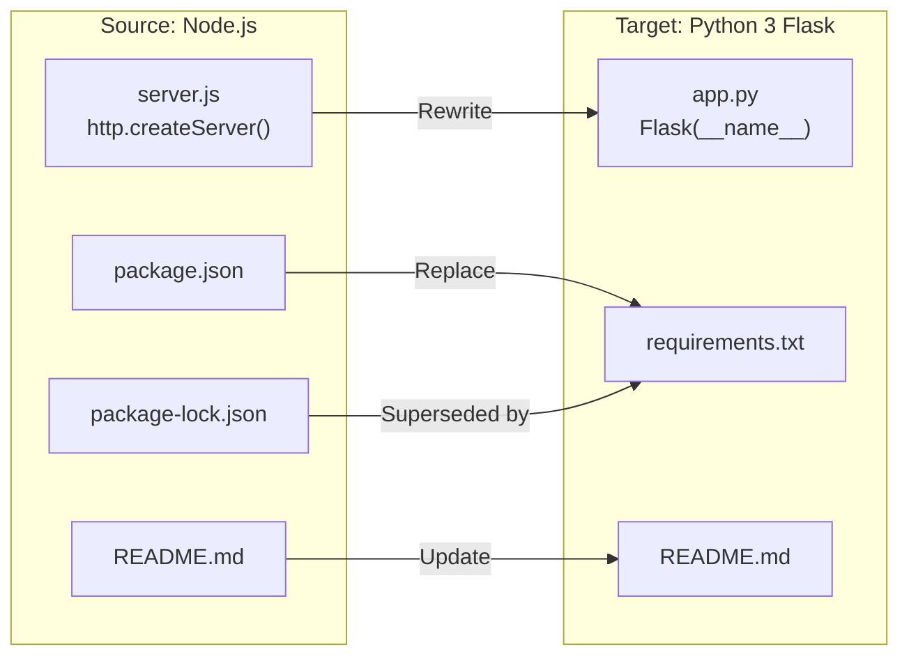

# Technical Specification

# 0. Agent Action Plan

## 0.1 Intent Clarification


### 0.1.1 Core Refactoring Objective

Based on the prompt, the Blitzy platform understands that the refactoring objective is to perform a **complete technology stack migration** of the existing Node.js HTTP server application into a functionally equivalent Python 3 Flask application. The user's directive is explicit and unambiguous: *"Rewrite this Node.js server into a Python 3 Flask application, keeping every feature and functionality exactly as in the original Node.js project. Ensure the rewritten version fully matches the behavior and logic of the current implementation."*

- **Refactoring type:** Tech stack migration (Node.js → Python 3 / Flask)
- **Target repository:** Same repository — the Node.js source files will be replaced with Python equivalents
- **Behavioral preservation mandate:** Every feature, response format, status code, header, and runtime behavior observed in the original Node.js server must be faithfully replicated in the Flask application
- **Scope of rewrite:** The entire application — there is exactly one runtime file (`server.js`, 14 lines) and three supporting metadata/configuration files (`package.json`, `package-lock.json`, `README.md`)

The refactoring goals, restated with enhanced clarity, are:

- **G-1: Replace Node.js runtime with Python 3 runtime** — Migrate from JavaScript executed on Node.js v20.x to Python 3.12 executed via the Flask WSGI framework
- **G-2: Replace built-in `http` module with Flask** — Swap the Node.js `http.createServer()` server instantiation pattern with Flask's application factory and route-based request handling
- **G-3: Preserve HTTP response contract** — The rewritten server must return HTTP 200 with `Content-Type: text/plain` and body `Hello, World!\n` for every inbound request, regardless of HTTP method, path, or headers
- **G-4: Preserve server binding configuration** — The Flask server must bind to `127.0.0.1` on port `3000`, identical to the original Node.js server
- **G-5: Preserve startup logging behavior** — The Flask server must emit a startup confirmation message to stdout upon successful binding, including the hostname and port
- **G-6: Replace NPM dependency management with Python dependency management** — Replace `package.json` and `package-lock.json` with `requirements.txt` for Python package management
- **G-7: Update project documentation** — Update `README.md` to reflect the Python 3 Flask technology stack, installation instructions, and execution commands

**Implicit requirements surfaced:**

- The original Node.js server responds identically to ALL HTTP methods (GET, POST, PUT, DELETE, PATCH, OPTIONS, HEAD) on ALL paths — the Flask rewrite must implement a catch-all route handler that replicates this request-agnostic behavior
- The response body must be exactly the string `Hello, World!\n` (14 bytes including the trailing newline) — this byte-level fidelity must be preserved
- The `Content-Type` header must be explicitly set to `text/plain`, not Flask's default `text/html; charset=utf-8`
- The original server uses no middleware, no sessions, no error handling, no authentication, and no database connectivity — the Flask rewrite must remain equally minimal

### 0.1.2 Technical Interpretation

This refactoring translates to the following technical transformation strategy:

**Current Architecture (Node.js):**
- Single-file monolith (`server.js`) using CommonJS `require('http')`
- Zero external dependencies — only Node.js built-in modules
- Hardcoded configuration constants (`hostname = '127.0.0.1'`, `port = 3000`)
- Event-driven, asynchronous HTTP server via `http.createServer()`
- Request handler callback that ignores the request object entirely

**Target Architecture (Python 3 / Flask):**
- Single-file application (`app.py`) using Flask's decorator-based routing
- One external dependency: Flask (which brings Werkzeug, Jinja2, Click, ItsDangerous, Blinker, and MarkupSafe as transitive dependencies)
- Hardcoded configuration matching the original: host `127.0.0.1`, port `3000`
- WSGI-based synchronous HTTP server via Flask's built-in development server
- Catch-all route handler that returns the identical static response for every request

**Transformation rules:**

| Node.js Concept | Python / Flask Equivalent |
|---|---|
| `require('http')` | `from flask import Flask` |
| `http.createServer(callback)` | `app = Flask(__name__)` + `@app.route()` decorator |
| `res.statusCode = 200` | `return ('Hello, World!\n', 200, ...)` or Flask `make_response` |
| `res.setHeader('Content-Type', 'text/plain')` | Response headers dict: `{'Content-Type': 'text/plain'}` |
| `res.end('Hello, World!\n')` | Return tuple `('Hello, World!\n', 200, {'Content-Type': 'text/plain'})` |
| `server.listen(port, hostname, callback)` | `app.run(host='127.0.0.1', port=3000)` |
| `console.log(...)` | Flask's built-in startup banner (prints the serving URL) |
| `package.json` | `requirements.txt` |
| `package-lock.json` | Not directly needed; `requirements.txt` with pinned versions serves the purpose |




## 0.2 Source Analysis


### 0.2.1 Comprehensive Source File Discovery

The repository is a flat, single-directory structure containing exactly four files with zero subdirectories. Every file in the repository is subject to the migration. The complete source inventory is:

```
Current:
./
├── server.js          (342 bytes, 14 lines — application entry point, to be rewritten)
├── package.json       (251 bytes, 11 lines — NPM metadata, to be replaced)
├── package-lock.json  (247 bytes, 13 lines — dependency lock, to be removed)
└── README.md          (73 bytes, 2 lines — documentation, to be updated)
```

### 0.2.2 Source File Detail

**server.js** — The sole runtime source file. Contains the complete application logic:

- Line 1: Imports the Node.js built-in `http` module via CommonJS `require('http')`
- Lines 3–4: Declares hardcoded configuration constants — `hostname = '127.0.0.1'` and `port = 3000`
- Lines 6–10: Creates an HTTP server with `http.createServer()` passing an inline request handler callback that sets status code 200, sets the `Content-Type: text/plain` header, and writes the response body `Hello, World!\n`
- Lines 12–14: Starts the server listening on the configured host and port, with a callback that logs the server URL to stdout via `console.log`

The request handler callback accepts `(req, res)` parameters but never reads or inspects the `req` object — all requests receive the identical response. This is the defining behavioral characteristic that must be preserved.

**package.json** — The NPM package manifest declaring:

- Package name: `hello_world`
- Version: `1.0.0`
- Description: `Hello world in Node.js`
- Main entry point: `index.js` (anomaly — actual entry point is `server.js`)
- Scripts: `test` placeholder that exits with error
- Author: `hxu`
- License: `MIT`
- Dependencies: none declared
- Dev dependencies: none declared

**package-lock.json** — The NPM dependency lockfile (lockfileVersion 3) containing only the root package entry with zero external packages. Confirms the zero-dependency state.

**README.md** — Two-line documentation identifying the project as `hao-backprop-test` with the note: "test project for backprop integration. Do not touch!"

### 0.2.3 Source Behavioral Baseline

Verified runtime behavior of the original Node.js server (confirmed via live test execution):

| Aspect | Observed Behavior |
|---|---|
| Binding address | `127.0.0.1:3000` (localhost only) |
| HTTP status code | `200 OK` for all requests |
| Content-Type header | `text/plain` |
| Response body | `Hello, World!\n` (14 bytes, trailing newline) |
| Request discrimination | None — all methods, paths, and headers return identical response |
| Startup log message | `Server running at http://127.0.0.1:3000/` (to stdout) |
| External dependencies | Zero |
| Statefulness | Stateless — no data persistence or mutable state |


## 0.3 Scope Boundaries


### 0.3.1 Exhaustively In Scope

**Source transformations:**

- `server.js` — Full rewrite to Python 3 Flask application (`app.py`)
- `package.json` — Replace with Python dependency manifest (`requirements.txt`)
- `package-lock.json` — Remove entirely; superseded by `requirements.txt` with pinned versions

**Configuration and dependency management updates:**

- `requirements.txt` — New file declaring Flask and its version pin
- `app.py` — New file containing the complete Flask application

**Documentation updates:**

- `README.md` — Update to reflect the Python 3 Flask technology stack, including new installation instructions (`pip install`), execution commands (`python app.py` or `flask run`), and project description

**Behavioral fidelity requirements (all must be preserved exactly):**

- HTTP response status code: `200 OK`
- Response `Content-Type` header: `text/plain`
- Response body: `Hello, World!\n` (exact string with trailing newline)
- Server binding: `127.0.0.1:3000`
- Request-agnostic handling: all HTTP methods and all URL paths return the same response
- Startup logging: server URL printed to stdout on successful startup

### 0.3.2 Explicitly Out of Scope

The following items are explicitly out of scope, consistent with the user's instruction to maintain exact feature parity without additions:

- **URL routing and path-based dispatch** — The original server has no routing; the rewrite must not introduce path-specific behavior
- **Middleware or request processing pipelines** — No middleware exists in the source; none should be added
- **Error handling and graceful shutdown** — The original server has no `try/catch`, no `server.on('error')` handler, and no signal handlers; the rewrite should match this minimalism
- **Authentication, authorization, or security mechanisms** — None exist in the source
- **Database connectivity or data persistence** — None exist in the source
- **Frontend or UI components** — No HTML, CSS, or client-side assets exist
- **Testing infrastructure** — The original has only a placeholder test script; no test migration is required
- **Containerization or CI/CD** — No Docker or pipeline configuration exists in the source
- **Environment variable support** — The original uses hardcoded constants; no `.env` or configuration file support should be added
- **Production WSGI server deployment** — The rewrite uses Flask's built-in development server, matching the simplicity of the original Node.js `http` server
- **Any features, endpoints, or behaviors not present in the original Node.js application**


## 0.4 Target Design


### 0.4.1 Refactored Structure Planning

The target structure replaces all Node.js artifacts with their Python 3 Flask equivalents while preserving the flat, minimal project layout of the original:

```
Target:
./
├── app.py             (new — Flask application, replaces server.js)
├── requirements.txt   (new — Python dependency manifest, replaces package.json + package-lock.json)
└── README.md          (updated — reflects Python 3 Flask stack)
```

**File-by-file rationale:**

- **`app.py`** — The direct replacement for `server.js`. Contains the complete Flask application in a single file: Flask app instantiation, a catch-all route handler returning the static `Hello, World!\n` response with `Content-Type: text/plain` and HTTP 200, and the `app.run()` call binding to `127.0.0.1:3000`. Named `app.py` following Flask's standard convention (recognized by the `flask` CLI command).

- **`requirements.txt`** — The direct replacement for both `package.json` (dependency declaration) and `package-lock.json` (dependency locking). Contains a single pinned dependency: `Flask==3.1.3`. This file serves as the sole dependency manifest for the Python project, equivalent in purpose to the NPM manifest declaring zero external dependencies (since Flask is the only required package for the rewrite).

- **`README.md`** — Updated to reflect the new technology stack. The project identity and purpose are preserved, but installation and execution instructions are rewritten for Python 3 and Flask.

**Files removed (Node.js artifacts no longer needed):**

- `server.js` — Replaced by `app.py`
- `package.json` — Replaced by `requirements.txt`
- `package-lock.json` — Superseded by pinned versions in `requirements.txt`

### 0.4.2 Web Search Research Conducted

- **Flask latest stable version:** Flask 3.1.3 (released February 19, 2026) — confirmed as the latest production-stable release via PyPI
- **Flask Python version support:** Requires Python >= 3.9; Python 3.12.3 (installed on the build system) is fully supported
- **Flask catch-all route pattern:** Flask supports catch-all routes via `@app.route('/', defaults={'path': ''})` combined with `@app.route('/<path:path>')` to handle all URL paths, and the `methods` parameter to accept all HTTP methods
- **Flask response tuple convention:** Flask supports returning `(body, status_code, headers_dict)` tuples directly from route handlers, enabling concise response construction without `make_response()`
- **Node.js to Flask migration best practice:** Maintain the same host and port binding, replicate exact response headers and body, use Flask's built-in development server for equivalent simplicity

### 0.4.3 Design Pattern Applications

Given the extreme simplicity of the source application (14 lines, zero dependencies, single behavior), the target design intentionally avoids introducing architectural patterns not present in the original:

- **No repository pattern** — No data access exists
- **No service layer** — No business logic beyond returning a static string
- **No dependency injection** — Only one dependency (Flask) with direct instantiation
- **No factory pattern** — The Flask app is instantiated directly in the module

The design principle is **1:1 behavioral equivalence with minimal structural transformation** — the simplest Flask application that exactly reproduces the original Node.js server's behavior.

### 0.4.4 Key Technical Decisions

| Decision | Rationale |
|---|---|
| Use `app.py` as the single application file | Matches Flask convention; mirrors the single-file `server.js` approach |
| Use Flask's response tuple `(body, status, headers)` | Most concise way to set status code, body, and custom Content-Type header |
| Use catch-all route with all methods | Replicates the Node.js server's request-agnostic behavior |
| Pin Flask to `3.1.3` in `requirements.txt` | Ensures reproducibility; matches the verified working version |
| Use `app.run(host='127.0.0.1', port=3000)` | Exact binding match to original Node.js `server.listen(3000, '127.0.0.1')` |
| Keep Flask's built-in development server | Equivalent simplicity to Node.js built-in `http` module — no production WSGI server needed |


## 0.5 Transformation Mapping


### 0.5.1 File-by-File Transformation Plan

| Target File | Transformation | Source File | Key Changes |
|---|---|---|---|
| `app.py` | CREATE | `server.js` | Rewrite Node.js HTTP server as Flask application: replace `require('http')` with `from flask import Flask`, replace `http.createServer()` with Flask app instantiation and catch-all route, replace `server.listen()` with `app.run(host='127.0.0.1', port=3000)`, preserve exact response (200, text/plain, `Hello, World!\n`) |
| `requirements.txt` | CREATE | `package.json` | Replace NPM manifest with Python dependency file containing `Flask==3.1.3` |
| `README.md` | UPDATE | `README.md` | Update project description, installation instructions (pip install), and execution commands (python app.py) to reflect Python 3 Flask stack; preserve project identity |

**Files to be removed (Node.js artifacts):**

| File to Remove | Reason |
|---|---|
| `server.js` | Replaced by `app.py` — the Flask equivalent |
| `package.json` | Replaced by `requirements.txt` — NPM manifest no longer needed |
| `package-lock.json` | Replaced by `requirements.txt` — NPM lockfile no longer needed |

### 0.5.2 Detailed Transformation Logic

**`server.js` → `app.py` transformation:**

The core behavioral transformation maps each Node.js construct to its Flask equivalent:

| Line(s) in server.js | Node.js Code | Flask Equivalent in app.py |
|---|---|---|
| Line 1 | `const http = require('http');` | `from flask import Flask` |
| Line 3 | `const hostname = '127.0.0.1';` | Parameter in `app.run(host='127.0.0.1')` |
| Line 4 | `const port = 3000;` | Parameter in `app.run(port=3000)` |
| Lines 6–10 | `http.createServer((req, res) => { ... })` | `@app.route('/', defaults={'path': ''}, methods=[...])` + `@app.route('/<path:path>', methods=[...])` with handler function |
| Line 7 | `res.statusCode = 200;` | Status code `200` in response tuple |
| Line 8 | `res.setHeader('Content-Type', 'text/plain');` | Headers dict `{'Content-Type': 'text/plain'}` in response tuple |
| Line 9 | `res.end('Hello, World!\n');` | Return string `'Hello, World!\n'` as response body |
| Lines 12–14 | `server.listen(port, hostname, () => { console.log(...) });` | `app.run(host='127.0.0.1', port=3000)` — Flask auto-prints startup URL |

**`package.json` → `requirements.txt` transformation:**

| package.json Field | Disposition |
|---|---|
| `name: "hello_world"` | Not carried forward — Python projects identify via directory name or `setup.py`/`pyproject.toml` |
| `version: "1.0.0"` | Not carried forward — no Python packaging metadata needed for this minimal app |
| `description` | Moved to updated `README.md` |
| `main: "index.js"` | Replaced by Flask's convention of `app.py` as the default application module |
| `scripts.test` | Not carried forward — placeholder with no actual tests |
| `author: "hxu"` | Preserved in `README.md` |
| `license: "MIT"` | Preserved in `README.md` |
| `dependencies` (none) | Replaced by `Flask==3.1.3` in `requirements.txt` |

### 0.5.3 Cross-File Dependencies

Since the source repository is a single-file application with no internal imports or cross-file references, there are no import statement corrections required. The transformation is entirely file-level replacement:

- **No internal import updates needed** — The source has no module-to-module imports
- **No configuration file cross-references** — The source has no config files that reference other files
- **No test file updates** — No test files exist

The only cross-file relationship in the target is:

- `requirements.txt` declares `Flask==3.1.3`, which is imported in `app.py` via `from flask import Flask`

### 0.5.4 One-Phase Execution

The entire refactoring is executed in a single phase. All three target files (`app.py`, `requirements.txt`, `README.md`) are created or updated simultaneously, and all three source-only files (`server.js`, `package.json`, `package-lock.json`) are removed in the same phase. There is no phased migration, no parallel runtime period, and no incremental rollout.


## 0.6 Dependency Inventory


### 0.6.1 Key Packages

The target Flask application introduces one direct dependency (Flask) which brings five transitive dependencies. The source Node.js application has zero external dependencies.

**Direct dependency:**

| Registry | Package Name | Version | Purpose |
|---|---|---|---|
| PyPI | Flask | 3.1.3 | WSGI web application framework — replaces Node.js built-in `http` module as the HTTP server and request handling layer |

**Transitive dependencies (installed automatically with Flask 3.1.3):**

| Registry | Package Name | Version | Purpose |
|---|---|---|---|
| PyPI | Werkzeug | 3.1.7 | WSGI utility library — provides the underlying HTTP server, request/response objects, and development server |
| PyPI | Jinja2 | 3.1.6 | Templating engine — required by Flask but not actively used in this application (no templates) |
| PyPI | Click | 8.3.1 | CLI toolkit — powers the `flask` command-line interface |
| PyPI | ItsDangerous | 2.2.0 | Cryptographic signing — required by Flask for session security (not actively used here) |
| PyPI | Blinker | 1.9.0 | Signal support — required by Flask for its signalling system |
| PyPI | MarkupSafe | 3.0.3 | String escaping — required by Jinja2 for safe HTML rendering |

**Runtime:**

| Component | Version | Purpose |
|---|---|---|
| Python | 3.12.3 | Target runtime — replaces Node.js v20.x |

### 0.6.2 Dependency Updates

**Import Refactoring:**

Since this is a complete tech stack migration (Node.js → Python), traditional import refactoring does not apply. Instead, the entire import paradigm changes:

- **Removed:** `const http = require('http');` (Node.js CommonJS import)
- **Added:** `from flask import Flask` (Python import)

No other files in the repository contain imports that need updating, as the source is a single-file application.

**External Reference Updates:**

| File | Update Required |
|---|---|
| `requirements.txt` (new) | Add `Flask==3.1.3` as the sole dependency declaration |
| `README.md` | Update to reference `pip install -r requirements.txt` instead of `npm install`; update run command from `node server.js` to `python app.py` |

**Build and configuration files removed:**

| File Removed | Reason |
|---|---|
| `package.json` | NPM manifest — replaced by `requirements.txt` |
| `package-lock.json` | NPM lockfile — no longer applicable to Python project |


## 0.7 Refactoring Rules


### 0.7.1 Behavioral Preservation Rules

The user's directive is absolute: the rewritten Flask application must "fully match the behavior and logic of the current implementation." The following rules govern the migration:

- **Exact response fidelity** — The Flask application must return HTTP status `200`, header `Content-Type: text/plain`, and body `Hello, World!\n` (including the trailing newline character) for every request. No variation is permitted.
- **Request-agnostic handling** — All HTTP methods (GET, POST, PUT, DELETE, PATCH, OPTIONS, HEAD) and all URL paths must receive the identical response. No method-specific or path-specific logic may be introduced.
- **Server binding preservation** — The server must bind to host `127.0.0.1` and port `3000`, exactly matching the original Node.js configuration.
- **Startup logging equivalence** — The server must print a startup message to stdout indicating the URL at which it is listening. Flask's built-in development server startup banner satisfies this requirement by printing `* Running on http://127.0.0.1:3000`.
- **Zero additional features** — No middleware, no authentication, no error pages, no database connections, no sessions, no environment variable support, and no additional endpoints may be introduced. The Flask application must be as minimal as the original Node.js server.
- **Statelessness** — The application must remain fully stateless with no mutable variables, no data persistence, and no side effects beyond the HTTP response.

### 0.7.2 Special Instructions and Constraints

- **Single-file architecture** — The application must remain a single-file implementation (`app.py`), mirroring the original `server.js` single-file design.
- **No production WSGI server** — The rewrite uses Flask's built-in development server via `app.run()`. This matches the simplicity of the original Node.js `http` module server. No Gunicorn, uWSGI, or other production server should be configured.
- **Flat project structure** — No subdirectories (no `src/`, `tests/`, `config/`, or `static/` folders) should be created. The target maintains the same flat directory layout as the source.
- **Dependency minimalism** — Only Flask is declared as a dependency. No additional Python packages should be introduced.
- **License and authorship** — The MIT license and author attribution (`hxu`) from the original `package.json` should be preserved in the updated `README.md`.


## 0.8 References


### 0.8.1 Codebase Files and Folders Searched

All files in the repository were retrieved and analyzed in full. The complete list of files inspected:

| File Path | Type | Lines | Summary |
|---|---|---|---|
| `server.js` | Source code | 14 | Node.js HTTP server using built-in `http` module; creates server on `127.0.0.1:3000`, returns `Hello, World!\n` with `Content-Type: text/plain` and HTTP 200 for all requests |
| `package.json` | Configuration | 11 | NPM package manifest declaring package name `hello_world`, version `1.0.0`, author `hxu`, license `MIT`, zero dependencies |
| `package-lock.json` | Configuration | 13 | NPM lockfile (lockfileVersion 3) confirming zero external dependencies |
| `README.md` | Documentation | 2 | Project identity (`hao-backprop-test`) and description ("test project for backprop integration") |

| Folder Path | Summary |
|---|---|
| `/` (repository root) | Flat directory containing 4 files, zero subdirectories — a minimal Node.js project with no frameworks, no build tools, and no external dependencies |

### 0.8.2 Technical Specification Sections Referenced

The following sections of the existing Technical Specification were retrieved and used to inform this Agent Action Plan:

| Section | Key Information Extracted |
|---|---|
| 1.1 Executive Summary | Project identity, purpose as backprop test fixture, stakeholder information |
| 1.2 System Overview | Architecture style (single-file monolith), system boundaries, component descriptions |
| 1.3 Scope | In-scope features (HTTP server, response handler, logging, NPM metadata, lockfile) and out-of-scope items |
| 2.1 Feature Catalog | Complete feature inventory (F-001 through F-005) with descriptions and dependencies |
| 2.2 Functional Requirements | Detailed requirements for each feature including acceptance criteria and validation rules |
| 3.1 Programming Languages | JavaScript (ES6+) on Node.js v20.x, CommonJS module system, no TypeScript |
| 3.2 Frameworks & Libraries | No external frameworks; only Node.js built-in `http` module |
| 5.1 High-Level Architecture | Single-file event-driven monolithic architecture, zero-dependency isolation, stateless request handling |

### 0.8.3 External Research Conducted

| Search Query | Key Findings |
|---|---|
| Flask latest stable version 2025–2026 | Flask 3.1.3 released February 19, 2026; latest stable version on PyPI |
| Flask 3.1 Python version support requirements | Flask 3.1.x requires Python >= 3.9; Python 3.12.3 is fully supported |

### 0.8.4 Attachments

No attachments were provided for this project. No Figma URLs, design files, or supplementary documents were referenced.


